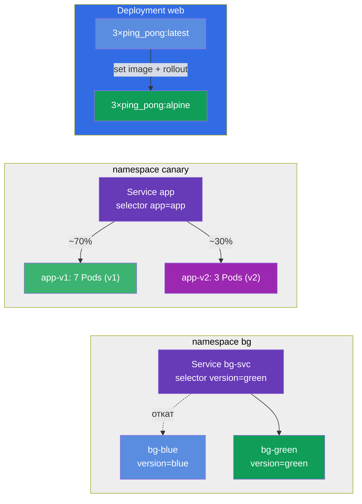

# Lab 102 — Обновления и стратегии деплоя: rolling update, rollback, canary, blue/green

## Описание

Практическая работа по обновлению приложений без простоя. Здесь вы отрабатываете то,
что происходит с приложением в проде каждый день: плавный выкат новой версии (rolling
update), запись причины изменения (change-cause), быстрый откат на предыдущую версию
(rollback) и более тонкие стратегии выкатки — canary (новая версия получает только часть
трафика) и blue/green (мгновенное переключение между двумя средами).

Все задания оформлены в экзаменационном стиле (как реальные вопросы CKA/CKAD) с
автоматической проверкой командой `check_result`. Решать рекомендуется императивными
командами (`kubectl create/set image/rollout/patch`) — на экзамене это самый быстрый путь.

## Цель

Закрепить материал глав курса:

- [Глава 8. Deployment: rolling update и rollback](../../course/08/ru.md) — плавный выкат, история ревизий, change-cause, откат
- [Глава 9. Стратегии развёртывания: blue/green и canary](../../course/09/ru.md) — распределение трафика по версиям и переключение сред

## Что мы создаём и зачем

В этой лабе мы отрабатываем полный жизненный цикл обновления приложения — от плавного
выката до отката и продвинутых стратегий раскладки. Каждый объект решает свою задачу:

| Объект | Что это | Зачем в этой лабе |
|--------|---------|-------------------|
| **Deployment `web`** | деплой приложения с версией образа | на нём отрабатываем rolling update, запись change-cause и безопасную стратегию раскатки `maxSurge`/`maxUnavailable` (глава 8) |
| **Deployment `roll`** | отдельный деплой под откат | делаем обновление и откатываемся на предыдущую версию через `rollout undo` (глава 8) |
| **namespace `canary` + Service `app` + Deployments `app-v1`/`app-v2`** | canary-раскладка | один Service распределяет трафик по двум версиям пропорционально числу Pods (v1=7, v2=3 → v2 ≈ 30%) (глава 9) |
| **namespace `bg` + Service `bg-svc` + Deployments `bg-blue`/`bg-green`** | blue/green | мгновенное переключение версии сменой selector у Service, откат так же мгновенен (глава 9) |

Итоговая картина того, что будет развёрнуто:



## Инфраструктура

Окружение разворачивается в AWS (`eu-central-1`) через Terragrunt и состоит из:

| Компонент  | Описание                                                    |
|------------|-------------------------------------------------------------|
| `vpc`      | VPC `10.10.0.0/16` с публичными подсетями                    |
| `ssh-keys` | SSH-ключи для доступа к нодам                                |
| `k8s-1`    | Kubernetes `1.35.2` (kubeadm), CNI Calico, установлен metrics-server |
| `worker`   | Рабочая машина с `kubectl`, доступом к кластеру и `check_result` |

Инстансы: `t3.medium` (master) Ubuntu `22.04`. Кластер одноузловой — master
«разтейнчен» (снят taint `control-plane`), поэтому поды планируются прямо на него.

## Развёртывание

```bash
TASK=102 make run_cka_task
```

После создания подключитесь к рабочей машине (worker) по SSH и выполняйте задания
оттуда. `kubectl` уже настроен на контекст `cluster1-admin@cluster1`.

Полезные команды на рабочей машине:

```bash
time_left       # сколько осталось времени
check_result    # проверить решение
```

## Задания

---
|        **1**        | **Развернуть базовую версию приложения**                       |
| :-----------------: | :------------------------------------------------------------- |
| Что делаем          | Создайте Deployment с именем `web`, образ контейнера `viktoruj/ping_pong:latest` (учебный HTTP-сервер на порту `8080`), `3` реплики. Дождитесь, пока все реплики станут готовыми (Ready). Именно этот Deployment мы дальше будем обновлять и настраивать. |
| Критерии приёмки    | - Deployment `web` существует;<br/>- образ контейнера — `viktoruj/ping_pong:latest`;<br/>- `3` готовые (ready) реплики. |
---
|        **2**        | **Плавно обновить версию и записать причину**                  |
| :-----------------: | :------------------------------------------------------------- |
| Что делаем          | Плавно (rolling update) обновите образ Deployment `web` на `viktoruj/ping_pong:alpine` и зафиксируйте причину изменения в аннотации `kubernetes.io/change-cause`, чтобы она была видна в истории раскаток (`rollout history`). Дождитесь завершения выката — в истории должно накопиться не менее 2 ревизий. |
| Критерии приёмки    | - образ Deployment `web` обновлён на `viktoruj/ping_pong:alpine`;<br/>- в истории раскаток ≥ 2 ревизий. |
---
|        **3**        | **Откатить деплой на предыдущую версию**                       |
| :-----------------: | :------------------------------------------------------------- |
| Что делаем          | Создайте отдельный Deployment с именем `roll` (образ `viktoruj/ping_pong:latest`), обновите его образ на другую версию (например, `:alpine`), а затем откатитесь на предыдущую версию командой `rollout undo`. После отката образ снова должен стать `viktoruj/ping_pong:latest`, а `generation` деплоя — не меньше `3` (создание + обновление + откат). |
| Критерии приёмки    | - Deployment `roll` существует;<br/>- после отката образ = `viktoruj/ping_pong:latest`;<br/>- было несколько ревизий (`generation` ≥ 3). |
---
|        **4**        | **Настроить canary-раскладку (~30% на новую версию)**          |
| :-----------------: | :------------------------------------------------------------- |
| Что делаем          | Создайте namespace `canary`. В нём разверните два Deployment одного приложения: `app-v1` (`7` реплик, label `version=v1`) и `app-v2` (`3` реплики, label `version=v2`), оба с образом `viktoruj/ping_pong`. Создайте один Service `app` (порт `8080`, `targetPort 8080`), который по общему label `app=app` выбирает Pods **обеих** версий. Так доля трафика на новую версию задаётся числом реплик: v1=7, v2=3 → v2 получает ~30%. Убедитесь, что Service нашёл Pods (Endpoints не пусты). |
| Критерии приёмки    | - namespace `canary` существует;<br/>- Service `app`, selector `app=app`, порт `8080`, Endpoints не пусты;<br/>- Deployment `app-v1`: `7` реплик, label `version=v1`;<br/>- Deployment `app-v2`: `3` реплики, label `version=v2` (образ `viktoruj/ping_pong`). |
---
|        **5**        | **Настроить безопасную стратегию раскатки (surge)**            |
| :-----------------: | :------------------------------------------------------------- |
| Что делаем          | Задайте Deployment `web` безопасную стратегию раскатки: тип `RollingUpdate` с `maxSurge: 2` и `maxUnavailable: 0`. При таких настройках новые Pods поднимаются раньше, чем гасятся старые, и мощность приложения не проседает во время выката. |
| Критерии приёмки    | - у Deployment `web` strategy `RollingUpdate`;<br/>- `maxSurge: 2`;<br/>- `maxUnavailable: 0`. |
---
|        **6**        | **Blue/Green: мгновенное переключение версии**                 |
| :-----------------: | :------------------------------------------------------------- |
| Что делаем          | Создайте namespace `bg`. Разверните в нём две среды одного приложения: Deployment `bg-blue` (label `version=blue`) и `bg-green` (label `version=green`), образ `viktoruj/ping_pong`. Создайте Service `bg-svc` и переключите его selector на `version=green`, чтобы трафик мгновенно перешёл на green (Endpoints ведут на Pods green). Откат делается так же — сменой selector обратно на blue. |
| Критерии приёмки    | - namespace `bg` существует;<br/>- Deployment `bg-blue` (label `version=blue`) и `bg-green` (label `version=green`), образ `viktoruj/ping_pong`;<br/>- Service `bg-svc` переключён на `version=green` (Endpoints ведут на green). |
---

## Проверка результата

На рабочей машине запустите автоматическую проверку:

```bash
check_result
```

Скрипт прогонит тесты и покажет, сколько заданий выполнено.

## Решение

Эталонное решение: [worker/files/solutions/1.MD](worker/files/solutions/1.MD)

## Покрытие мок-экзаменов

Лаба закрывает задания моков по обновлениям и стратегиям деплоя: CKA mock 01 (№16 —
rolling update + record), CKAD mock 02 (№3 — rollback + scale, №9 — canary 30%) —
rolling update, change-cause, rollback, canary и blue/green.

## Удаление кластера и ресурсов

```bash
TASK=102 make delete_cka_task
```
