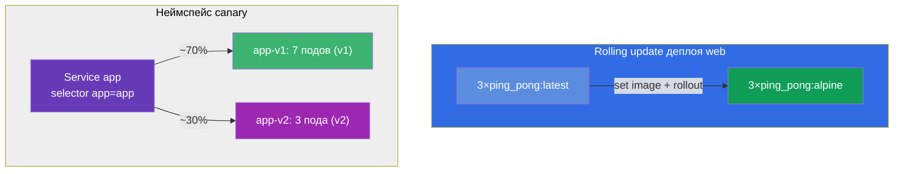

# Lab 102 — Обновления и стратегии деплоя: rolling update, rollback, canary

## Описание

Практическая работа по обновлению приложений без простоя. Здесь вы отрабатываете то, что
происходит с приложением в проде каждый день: плавный выкат новой версии (rolling
update), запись причины изменения, быстрый откат на предыдущую версию (rollback) и более
тонкую стратегию — canary, когда новая версия получает только часть трафика.

Все задания в экзаменационном стиле с автопроверкой `check_result`.

## Цель

Закрепить главы курса:

- [Глава 8. Deployment: rolling update и rollback](../../course/08/ru.md)
- [Глава 9. Стратегии развёртывания: blue/green и canary](../../course/09/ru.md)

## Что мы создаём и зачем

| Объект | Что это | Зачем в этой лабе |
|--------|---------|-------------------|
| **Deployment `web`** | деплой с версией образа | учимся выкатывать новую версию плавно (rolling update) и фиксировать причину (change-cause) |
| **Deployment `roll`** | деплой для отработки отката | делаем два обновления и откатываемся на предыдущую версию (`rollout undo`) |
| **Неймспейс `canary` + сервис `app` + деплои `app-v1`/`app-v2`** | canary-раскладка | один сервис распределяет трафик по двум версиям пропорционально числу подов (v1=7, v2=3 → v2 ≈ 30%) |



## Инфраструктура

Окружение разворачивается в AWS (`eu-central-1`) через Terragrunt:

| Компонент  | Описание                                                    |
|------------|-------------------------------------------------------------|
| `vpc`      | VPC `10.10.0.0/16`                                          |
| `ssh-keys` | SSH-ключи                                                   |
| `k8s-1`    | Kubernetes `1.35.2` (kubeadm), Calico, metrics-server, одноузловой |
| `worker`   | Рабочая машина с `kubectl` и `check_result`                 |

## Развёртывание

```bash
TASK=102 make run_cka_task
```

## Задания

---
|        **1**        | **Развернуть базовую версию приложения**                       |
| :-----------------: | :------------------------------------------------------------- |
| Что делаем          | Создаём деплой, который потом будем обновлять                  |
| Критерии приёмки    | - Deployment: `web`<br/>- Image: `viktoruj/ping_pong:latest`<br/>- Реплик: `3` (Ready) |
---
|        **2**        | **Плавно обновить версию и записать причину**                  |
| :-----------------: | :------------------------------------------------------------- |
| Что делаем          | Выкатываем новую версию образа rolling update'ом, фиксируем change-cause |
| Критерии приёмки    | - Deployment `web` образ обновлён на `viktoruj/ping_pong:alpine`<br/>- В истории ≥ 2 ревизий |
---
|        **3**        | **Откатить деплой на предыдущую версию**                       |
| :-----------------: | :------------------------------------------------------------- |
| Что делаем          | Создаём деплой `roll`, обновляем, затем откатываемся (`rollout undo`) |
| Критерии приёмки    | - Deployment: `roll`<br/>- После отката образ = `viktoruj/ping_pong:latest`<br/>- Было несколько ревизий (generation ≥ 3) |
---
|        **4**        | **Настроить canary-раскладку (30% на новую версию)**           |
| :-----------------: | :------------------------------------------------------------- |
| Что делаем          | Один сервис на две версии; долю трафика задаём числом реплик   |
| Критерии приёмки    | - Неймспейс: `canary`<br/>- Service `app`, selector `app=app`, порт `8080`, Endpoints не пусты<br/>- Deployment `app-v1`: `7` реплик, метка `version=v1`<br/>- Deployment `app-v2`: `3` реплики, метка `version=v2` (образ `viktoruj/ping_pong`) |
---
|        **5**        | **Настроить стратегию раскатки (surge)**                       |
| :-----------------: | :------------------------------------------------------------- |
| Что делаем          | Задаём деплою `web` безопасную стратегию: поднимать новый под до гашения старого |
| Критерии приёмки    | - Deployment `web`: strategy `RollingUpdate`<br/>- `maxSurge: 2`, `maxUnavailable: 0` |
---
|        **6**        | **Blue/Green: мгновенное переключение версии**                 |
| :-----------------: | :------------------------------------------------------------- |
| Что делаем          | Держим две среды и переключаем сервис с blue на green сменой селектора |
| Критерии приёмки    | - Неймспейс: `bg`<br/>- Deployment `bg-blue` (метка `version=blue`) и `bg-green` (`version=green`), образ `viktoruj/ping_pong`<br/>- Service `bg-svc` переключён на `version=green` (Endpoints ведут на green) |
---

## Проверка результата

```bash
check_result
```

## Решение

[worker/files/solutions/1.MD](worker/files/solutions/1.MD)

## Покрытие мок-экзаменов

CKA mock 01 (№16 — rolling update + record), CKAD mock 02 (№3 — rollback+scale, №9 —
canary 30%).

## Удаление

```bash
TASK=102 make delete_cka_task
```
