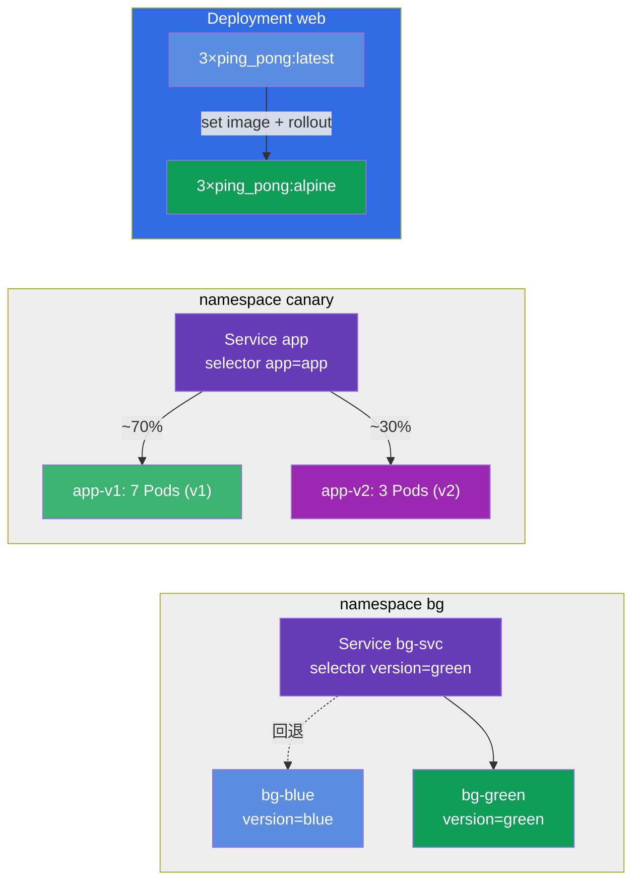

[Русская версия](README_RU.MD) · [Eng version](README.MD) · [Versión en español](README_ES.MD) · [Version française](README_FR.MD) · [Deutsche Version](README_DE.MD) · [ქართული ვერსია](README_GE.MD) · [日本語版](README_JP.MD)

# Lab 102 — 更新與部署策略：rolling update、rollback、canary、blue/green

## 說明

這是一份關於不停機更新應用程式的實作練習。你在這裡演練的正是生產環境
每天都會發生的事：平順地推出新版本（rolling update）、記錄變更原因
（change-cause）、快速回退到前一個版本（rollback），以及更細緻的發布策略 —
canary（新版本只承接一部分流量）與 blue/green
（在兩套環境之間瞬間切換）。

所有題目都以考試風格撰寫（就像真實的 CKA/CKAD 題目），並可用 `check_result` 命令
自動驗證。建議使用命令式指令（`kubectl create/set image/rollout/patch`）來解題 —
在考場上這是最快的途徑。

## 目標

鞏固以下課程章節的內容：

- [第 8 章。Deployment：rolling update 與 rollback](../../course/08/README.md) — 平順推出、修訂歷史、change-cause、回退
- [第 9 章。部署策略：blue/green 與 canary](../../course/09/README.md) — 在版本之間分配流量與切換環境

## 我們要建立什麼，以及為什麼

在這個實驗中，我們會走過應用程式更新的完整生命週期 — 從平順推出到回退，再到進階的發布
策略。每個物件都有各自的用途：

| 物件 | 這是什麼 | 為什麼出現在本實驗 |
|--------|---------|-------------------|
| **Deployment `web`** | 帶有版本化映像的應用程式 Deployment | 我們在它上面演練 rolling update、記錄 change-cause 以及安全的推出策略 `maxSurge`/`maxUnavailable`（第 8 章） |
| **Deployment `roll`** | 專門用於回退的獨立 Deployment | 我們更新它，然後用 `rollout undo` 回退到前一個版本（第 8 章） |
| **namespace `canary` + Service `app` + Deployments `app-v1`/`app-v2`** | canary 發布 | 一個 Service 依照 Pods 數量的比例把流量分配到兩個版本（v1=7、v2=3 → v2 ≈ 30%）（第 9 章） |
| **namespace `bg` + Service `bg-svc` + Deployments `bg-blue`/`bg-green`** | blue/green | 透過變更 Service 的 selector 瞬間切換版本，回退同樣是瞬間完成（第 9 章） |

最終部署出來的全貌：



## 基礎架構

環境透過 Terragrunt 部署在 AWS（`eu-central-1`），由以下部分組成：

| 元件       | 說明                                                        |
|------------|-------------------------------------------------------------|
| `vpc`      | VPC `10.10.0.0/16`，含公有子網路                              |
| `ssh-keys` | 用於存取節點的 SSH 金鑰                                       |
| `k8s-1`    | Kubernetes `1.35.2`（kubeadm），CNI Calico，已安裝 metrics-server |
| `worker`   | 工作機，具備 `kubectl`、叢集存取權與 `check_result`            |

實例：`t3.medium`（master），Ubuntu `22.04`。叢集是單節點的 — master 已解除污點
（移除了 `control-plane` taint），因此 Pod 會直接被排程到它上面。

## 部署

```bash
TASK=102 make run_cka_task
```

建立完成後，用 SSH 連上工作機（worker），並從那裡開始做題。`kubectl` 已設定為使用
`cluster1-admin@cluster1` context。

工作機上的實用命令：

```bash
time_left       # 還剩多少時間
check_result    # 檢查解答
```

## 題目

---
|        **1**        | **部署應用程式的基準版本**                                     |
| :-----------------: | :------------------------------------------------------------- |
| 要做什麼            | 建立名為 `web` 的 Deployment，容器映像為 `viktoruj/ping_pong:latest`（一個在 `8080` 埠上執行的教學用 HTTP 伺服器），`3` 個副本。等到所有副本都變為就緒（Ready）。接下來我們就是要更新與調整這個 Deployment。 |
| 驗收標準            | - Deployment `web` 存在；<br/>- 容器映像為 `viktoruj/ping_pong:latest`；<br/>- `3` 個就緒（ready）副本。 |
---
|        **2**        | **平順地更新版本並記錄原因**                                   |
| :-----------------: | :------------------------------------------------------------- |
| 要做什麼            | 平順地（rolling update）把 Deployment `web` 的映像更新為 `viktoruj/ping_pong:alpine`，並把變更原因記錄在 `kubernetes.io/change-cause` 註解中，讓它出現在推出歷史（`rollout history`）裡。等待推出完成 — 歷史中至少要累積 2 個修訂版本。 |
| 驗收標準            | - Deployment `web` 的映像已更新為 `viktoruj/ping_pong:alpine`；<br/>- 推出歷史中有 ≥ 2 個修訂版本。 |
---
|        **3**        | **把 Deployment 回退到前一個版本**                             |
| :-----------------: | :------------------------------------------------------------- |
| 要做什麼            | 建立一個獨立的 Deployment，名為 `roll`（映像 `viktoruj/ping_pong:latest`），把它的映像更新為另一個版本（例如 `:alpine`），然後用 `rollout undo` 回退到前一個版本。回退之後映像必須再次變成 `viktoruj/ping_pong:latest`，而 Deployment 的 `generation` 不小於 `3`（建立 + 更新 + 回退）。 |
| 驗收標準            | - Deployment `roll` 存在；<br/>- 回退後映像 = `viktoruj/ping_pong:latest`；<br/>- 曾有多個修訂版本（`generation` ≥ 3）。 |
---
|        **4**        | **設定 canary 發布（新版本約 30%）**                           |
| :-----------------: | :------------------------------------------------------------- |
| 要做什麼            | 建立 namespace `canary`。在其中部署同一個應用程式的兩個 Deployment：`app-v1`（`7` 個副本，label `version=v1`）與 `app-v2`（`3` 個副本，label `version=v2`），兩者都使用映像 `viktoruj/ping_pong`。建立一個 Service `app`（port `8080`、`targetPort 8080`），透過共用的 label `app=app` 選出**兩個**版本的 Pods。這樣一來，流向新版本的流量比例就由副本數決定：v1=7、v2=3 → v2 取得約 30%。確認 Service 找到了 Pods（Endpoints 不為空）。 |
| 驗收標準            | - namespace `canary` 存在；<br/>- Service `app`，selector `app=app`，port `8080`，Endpoints 不為空；<br/>- Deployment `app-v1`：`7` 個副本，label `version=v1`；<br/>- Deployment `app-v2`：`3` 個副本，label `version=v2`（映像 `viktoruj/ping_pong`）。 |
---
|        **5**        | **設定安全的推出策略（surge）**                                |
| :-----------------: | :------------------------------------------------------------- |
| 要做什麼            | 給 Deployment `web` 設定安全的推出策略：類型 `RollingUpdate`，搭配 `maxSurge: 2` 與 `maxUnavailable: 0`。在這樣的設定下，新的 Pods 會先起來，舊的才被關掉，因此推出過程中應用程式的容量不會下降。 |
| 驗收標準            | - Deployment `web` 的 strategy 為 `RollingUpdate`；<br/>- `maxSurge: 2`；<br/>- `maxUnavailable: 0`。 |
---
|        **6**        | **Blue/Green：瞬間切換版本**                                   |
| :-----------------: | :------------------------------------------------------------- |
| 要做什麼            | 建立 namespace `bg`。在其中部署同一個應用程式的兩套環境：Deployment `bg-blue`（label `version=blue`）與 `bg-green`（label `version=green`），映像 `viktoruj/ping_pong`。建立 Service `bg-svc` 並把它的 selector 切換到 `version=green`，讓流量瞬間轉到 green（Endpoints 指向 green 的 Pods）。回退方式相同 — 把 selector 切回 blue。 |
| 驗收標準            | - namespace `bg` 存在；<br/>- Deployment `bg-blue`（label `version=blue`）與 `bg-green`（label `version=green`），映像 `viktoruj/ping_pong`；<br/>- Service `bg-svc` 已切換到 `version=green`（Endpoints 指向 green）。 |
---

## 檢查結果

在工作機上執行自動驗證：

```bash
check_result
```

腳本會跑完測試，並顯示已完成多少題目。

## 解答

參考解答：[worker/files/solutions/1_TW.MD](worker/files/solutions/1_TW.MD)

## 模擬考涵蓋範圍

本實驗涵蓋模擬考中關於更新與部署策略的題目：CKA mock 01（第 16 題 —
rolling update + record）、CKAD mock 02（第 3 題 — rollback + scale，第 9 題 — canary 30%）—
rolling update、change-cause、rollback、canary 與 blue/green。

## 刪除叢集與資源

```bash
TASK=102 make delete_cka_task
```
