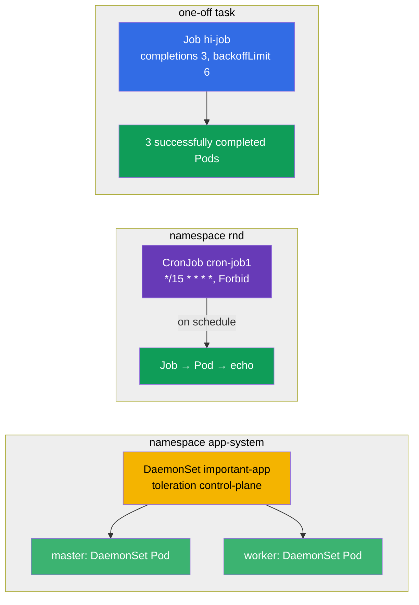

[Русская версия](README_RU.MD) · [Versión en español](README_ES.MD) · [Version française](README_FR.MD) · [Deutsche Version](README_DE.MD) · [ქართული ვერსია](README_GE.MD)

# Lab 103 — One-off and Scheduled Tasks: Job, CronJob, DaemonSet

## Description

A hands-on lab on three specialized workload controllers: **Job** (a task that must run and
finish), **CronJob** (a task on a schedule) and **DaemonSet** (one Pod on every node). The
cluster in this lab has **two nodes** (master + one worker) so you can clearly verify that
the DaemonSet rolls out to all nodes, including the control-plane.

All tasks are written in exam style (like real CKA/CKAD questions) with automatic validation
via the `check_result` command. They are easier to solve with manifests (using
`kubectl create ... --dry-run=client -o yaml` as a starting point) — on the exam that is the
fastest path for objects with many fields.

## Goal

Reinforce the material from the course chapters:

- [Chapter 10. Jobs and CronJobs](../../course/10/ru.md) — one-off and scheduled tasks, `completions`, `backoffLimit`, `restartPolicy`, schedule, `concurrencyPolicy`
- [Chapter 11. DaemonSet and StatefulSet](../../course/11/ru.md) — running a Pod on every node, toleration for the control-plane

## What We Build and Why

In this lab we practice three controllers that run workloads differently from a Deployment:
some run to completion, others run on a schedule, and others place a Pod on every node.
Every object serves its own purpose:

| Object | What it is | Why it is in this lab |
|--------|------------|-----------------------|
| **Job `hi-job`** | a one-off task | learn to run a task with several successful completions (`completions`), a retry limit (`backoffLimit`) and the correct `restartPolicy` (chapter 10) |
| **CronJob `cron-job1`** (namespace `rnd`) | a scheduled task | practice cron schedules, `concurrencyPolicy`, Job history limits — a typical real-world task (chapter 10) |
| **DaemonSet `important-app`** (namespace `app-system`) | one Pod per node | learn to roll out an agent to all nodes, including the control-plane, via a toleration (chapter 11) |

The final picture of what will be deployed:



## Infrastructure

The environment is deployed in AWS (`eu-central-1`) via Terragrunt and consists of:

| Component  | Description                                                          |
|------------|----------------------------------------------------------------------|
| `vpc`      | VPC `10.10.0.0/16` with public subnets                                |
| `ssh-keys` | SSH keys for node access                                             |
| `k8s-1`    | Kubernetes `1.35.2` (kubeadm), Calico CNI, metrics-server, **master + 1 worker** |
| `worker`   | Work machine with `kubectl`, cluster access and `check_result`        |

Instances: `t3.medium`, Ubuntu `22.04`. The cluster has **two nodes** — the master
(control-plane) and one worker. The `control-plane` taint is kept on the master, so ordinary
Pods go to the worker and only those with a matching toleration land on the master (like the
DaemonSet in task 3).

## Deployment

```bash
TASK=103 make run_cka_task
```

Once it is created, connect to the work machine (worker) over SSH and do the tasks from
there. `kubectl` is already pointed at the `cluster1-admin@cluster1` context.

Handy commands on the work machine:

```bash
time_left       # how much time is left
check_result    # check your solution
```

## Tasks

---
|        **1**        | **Create a one-off task (Job)**                               |
| :-----------------: | :------------------------------------------------------------ |
| What to do          | Create a Job named `hi-job` with container image `busybox` and the command `echo hello world`. The task must complete successfully `3` times (`completions: 3`), with a retry limit on failure of `backoffLimit: 6` and `restartPolicy: Never`. |
| Acceptance criteria | - Job `hi-job` exists;<br/>- container image is `busybox`;<br/>- command is `echo hello world`;<br/>- `completions: 3`;<br/>- `backoffLimit: 6`;<br/>- `restartPolicy: Never`. |
---
|        **2**        | **Create a scheduled task (CronJob)**                         |
| :-----------------: | :------------------------------------------------------------ |
| What to do          | Create the namespace `rnd`. In it, create a CronJob named `cron-job1` with container image `viktoruj/ping_pong:alpine`. The schedule is `*/15 * * * *` (every 15 minutes), the concurrency policy is `concurrencyPolicy: Forbid` (do not start a new Job while the previous one is still running), and the history limits are `successfulJobsHistoryLimit: 5` and `failedJobsHistoryLimit: 7`. On the Job template set `completions: 3`, `backoffLimit: 4` and `activeDeadlineSeconds: 10`. |
| Acceptance criteria | - namespace `rnd` exists;<br/>- CronJob `cron-job1`, image `viktoruj/ping_pong:alpine`;<br/>- `schedule: */15 * * * *`;<br/>- `concurrencyPolicy: Forbid`;<br/>- `successfulJobsHistoryLimit: 5`, `failedJobsHistoryLimit: 7`;<br/>- `completions: 3`, `backoffLimit: 4`, `activeDeadlineSeconds: 10`. |
---
|        **3**        | **Roll out a DaemonSet on all nodes (including the control-plane)** |
| :-----------------: | :------------------------------------------------------------ |
| What to do          | Create the namespace `app-system`. In it, roll out a DaemonSet named `important-app` with container image `viktoruj/ping_pong:latest`. By default a DaemonSet does not place a Pod on the control-plane (there is a taint there), so add a toleration for the taint `node-role.kubernetes.io/control-plane` so that a Pod runs on **all** cluster nodes, including the master. |
| Acceptance criteria | - namespace `app-system` exists;<br/>- DaemonSet `important-app`, image `viktoruj/ping_pong:latest`;<br/>- a Pod runs on **all** nodes (`desiredNumberScheduled` = `numberReady` = the number of nodes). |
---

## Checking the Result

On the work machine run the automatic validation:

```bash
check_result
```

The script runs the tests and shows how many tasks are complete.

## Solution

Reference solution: [worker/files/solutions/1.MD](worker/files/solutions/1.MD)

## Mock Exam Coverage

The lab covers the mock-exam tasks on workload controllers: CKA mock 01 (#24 — DaemonSet on
all nodes), CKA mock 02 (#14 — DaemonSet on all nodes), CKAD mock 01 (#13 — Job
`completions`/`backoffLimit`), CKAD mock 02 (#2 — CronJob with a full set of parameters).

## Deleting the Cluster and Resources

```bash
TASK=103 make delete_cka_task
```
