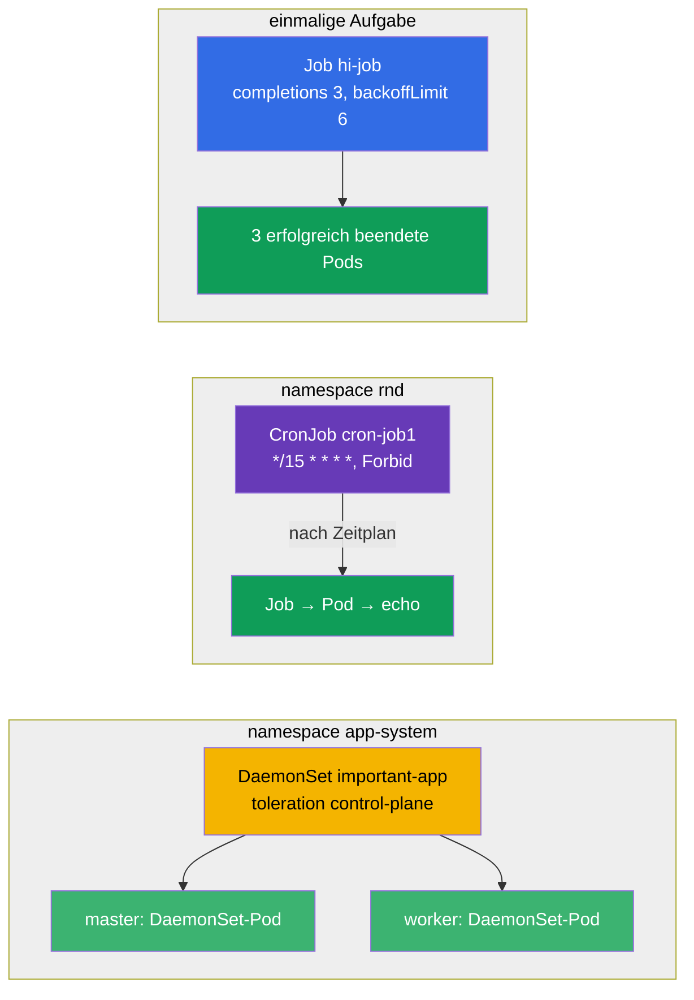

[Русская версия](README_RU.MD) · [Eng version](README.MD) · [Versión en español](README_ES.MD) · [Version française](README_FR.MD) · [ქართული ვერსია](README_GE.MD)

# Lab 103 — Einmalige und periodische Aufgaben: Job, CronJob, DaemonSet

## Beschreibung

Praxisübung zu drei spezialisierten Workload-Controllern: **Job** (eine Aufgabe, die laufen
und beendet werden muss), **CronJob** (eine Aufgabe nach Zeitplan) und **DaemonSet** (ein Pod
auf jedem Node). Der Cluster in diesem Lab hat **zwei Nodes** (Master + ein Worker), damit
anschaulich geprüft werden kann, dass das DaemonSet auf allen Nodes ausgerollt wird,
einschließlich Control-Plane.

Alle Aufgaben sind im Prüfungsstil formuliert (wie echte CKA/CKAD-Fragen) mit automatischer
Prüfung über den Befehl `check_result`. Bequemer ist die Lösung über Manifeste (mit
`kubectl create ... --dry-run=client -o yaml` als Vorlage) — in der Prüfung ist das der
schnellste Weg für Objekte mit vielen Feldern.

## Ziel

Den Stoff der Kurskapitel festigen:

- [Kapitel 10. Jobs und CronJobs](../../course/10/ru.md) — einmalige und periodische Aufgaben, `completions`, `backoffLimit`, `restartPolicy`, Zeitplan, `concurrencyPolicy`
- [Kapitel 11. DaemonSet und StatefulSet](../../course/11/ru.md) — einen Pod auf jedem Node starten, Toleration für die Control-Plane

## Was wir erstellen und warum

In diesem Lab üben wir drei Controller, die Workloads anders starten als ein Deployment: die
einen laufen und beenden sich, die anderen folgen einem Zeitplan, die dritten setzen einen Pod
auf jeden Node. Jedes Objekt erfüllt seine eigene Aufgabe:

| Objekt | Was das ist | Warum in diesem Lab |
|--------|-------------|---------------------|
| **Job `hi-job`** | einmalige Aufgabe | lernen, eine Aufgabe mit mehreren erfolgreichen Abschlüssen (`completions`), einem Wiederholungslimit (`backoffLimit`) und der richtigen `restartPolicy` zu starten (Kapitel 10) |
| **CronJob `cron-job1`** (Namespace `rnd`) | Aufgabe nach Zeitplan | Cron-Zeitplan, `concurrencyPolicy` und Historienlimits für Jobs üben — typische Aufgabe aus dem Betrieb (Kapitel 10) |
| **DaemonSet `important-app`** (Namespace `app-system`) | ein Pod pro Node | lernen, einen Agenten auf alle Nodes auszurollen, einschließlich Control-Plane, über eine Toleration (Kapitel 11) |

Das Gesamtbild dessen, was ausgerollt wird:



## Infrastruktur

Die Umgebung wird in AWS (`eu-central-1`) über Terragrunt ausgerollt und besteht aus:

| Komponente | Beschreibung                                                         |
|------------|----------------------------------------------------------------------|
| `vpc`      | VPC `10.10.0.0/16` mit öffentlichen Subnetzen                         |
| `ssh-keys` | SSH-Schlüssel für den Zugriff auf die Nodes                            |
| `k8s-1`    | Kubernetes `1.35.2` (kubeadm), CNI Calico, metrics-server, **Master + 1 Worker** |
| `worker`   | Arbeitsmaschine mit `kubectl`, Cluster-Zugriff und `check_result`      |

Instanzen: `t3.medium`, Ubuntu `22.04`. Der Cluster hat **zwei Nodes** — den Master
(Control-Plane) und einen Worker. Auf dem Master bleibt der Taint `control-plane` erhalten,
daher gehen normale Pods auf den Worker und auf dem Master landen nur solche mit passender
Toleration (wie das DaemonSet in Aufgabe 3).

## Bereitstellung

```bash
TASK=103 make run_cka_task
```

Verbinde dich nach dem Erstellen per SSH mit der Arbeitsmaschine (Worker) und erledige die
Aufgaben von dort. `kubectl` ist bereits auf den Kontext `cluster1-admin@cluster1`
eingestellt.

Nützliche Befehle auf der Arbeitsmaschine:

```bash
time_left       # wie viel Zeit noch bleibt
check_result    # Lösung prüfen
```

## Aufgaben

---
|        **1**        | **Eine einmalige Aufgabe (Job) erstellen**                    |
| :-----------------: | :------------------------------------------------------------ |
| Was wir tun         | Erstelle einen Job mit dem Namen `hi-job`, Container-Image `busybox`, Befehl `echo hello world`. Die Aufgabe muss `3` Mal erfolgreich abgeschlossen werden (`completions: 3`), mit einem Wiederholungslimit bei Fehlern von `backoffLimit: 6` und `restartPolicy: Never`. |
| Abnahmekriterien    | - Job `hi-job` existiert;<br/>- Container-Image ist `busybox`;<br/>- Befehl ist `echo hello world`;<br/>- `completions: 3`;<br/>- `backoffLimit: 6`;<br/>- `restartPolicy: Never`. |
---
|        **2**        | **Eine Aufgabe nach Zeitplan (CronJob) erstellen**            |
| :-----------------: | :------------------------------------------------------------ |
| Was wir tun         | Erstelle den Namespace `rnd`. Erstelle darin einen CronJob mit dem Namen `cron-job1`, Container-Image `viktoruj/ping_pong:alpine`. Der Zeitplan ist `*/15 * * * *` (alle 15 Minuten), die Parallelitätsrichtlinie ist `concurrencyPolicy: Forbid` (keinen neuen Job starten, solange der vorherige nicht beendet ist), die Historienlimits sind `successfulJobsHistoryLimit: 5` und `failedJobsHistoryLimit: 7`. Setze im Job-Template `completions: 3`, `backoffLimit: 4` und `activeDeadlineSeconds: 10`. |
| Abnahmekriterien    | - Namespace `rnd` existiert;<br/>- CronJob `cron-job1`, Image `viktoruj/ping_pong:alpine`;<br/>- `schedule: */15 * * * *`;<br/>- `concurrencyPolicy: Forbid`;<br/>- `successfulJobsHistoryLimit: 5`, `failedJobsHistoryLimit: 7`;<br/>- `completions: 3`, `backoffLimit: 4`, `activeDeadlineSeconds: 10`. |
---
|        **3**        | **Ein DaemonSet auf allen Nodes ausrollen (inklusive Control-Plane)** |
| :-----------------: | :------------------------------------------------------------ |
| Was wir tun         | Erstelle den Namespace `app-system`. Rolle darin ein DaemonSet mit dem Namen `important-app` aus, Container-Image `viktoruj/ping_pong:latest`. Ein DaemonSet setzt standardmäßig keinen Pod auf die Control-Plane (dort liegt ein Taint), füge daher eine Toleration für den Taint `node-role.kubernetes.io/control-plane` hinzu, damit ein Pod auf **allen** Nodes des Clusters läuft, auch auf dem Master. |
| Abnahmekriterien    | - Namespace `app-system` existiert;<br/>- DaemonSet `important-app`, Image `viktoruj/ping_pong:latest`;<br/>- ein Pod läuft auf **allen** Nodes (`desiredNumberScheduled` = `numberReady` = Anzahl der Nodes). |
---

## Ergebnisprüfung

Starte auf der Arbeitsmaschine die automatische Prüfung:

```bash
check_result
```

Das Skript führt die Tests aus und zeigt, wie viele Aufgaben erledigt sind.

## Lösung

Referenzlösung: [worker/files/solutions/1_DE.MD](worker/files/solutions/1_DE.MD)

## Abdeckung der Mock-Prüfungen

Das Lab deckt die Mock-Aufgaben zu Workload-Controllern ab: CKA mock 01 (Nr. 24 — DaemonSet
auf allen Nodes), CKA mock 02 (Nr. 14 — DaemonSet auf allen Nodes), CKAD mock 01 (Nr. 13 — Job
`completions`/`backoffLimit`), CKAD mock 02 (Nr. 2 — CronJob mit vollem Parametersatz).

## Löschen von Cluster und Ressourcen

```bash
TASK=103 make delete_cka_task
```
