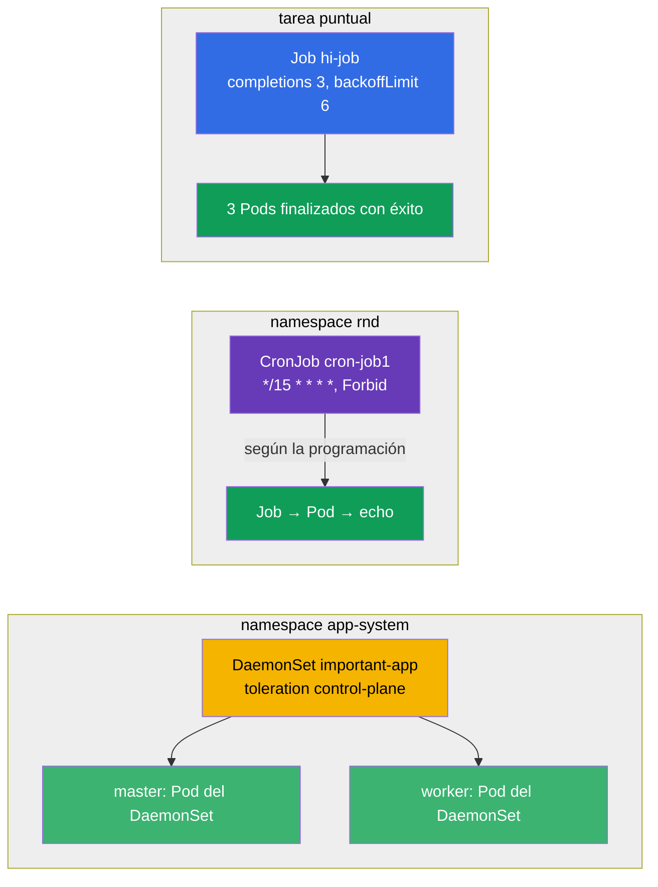

[Русская версия](README_RU.MD) · [Eng version](README.MD) · [Version française](README_FR.MD) · [Deutsche Version](README_DE.MD) · [ქართული ვერსია](README_GE.MD) · [繁體中文版](README_TW.MD) · [日本語版](README_JP.MD)

# Lab 103 — Tareas puntuales y periódicas: Job, CronJob, DaemonSet

## Descripción

Práctica sobre tres controladores de cargas de trabajo especializados: **Job** (una tarea que
debe ejecutarse y terminar), **CronJob** (una tarea programada) y **DaemonSet** (un Pod en
cada nodo). El clúster de este laboratorio tiene **dos nodos** (master + un worker), para
comprobar de forma clara que el DaemonSet se despliega en todos los nodos, incluido el
control-plane.

Todas las tareas están redactadas en estilo de examen (como las preguntas reales de
CKA/CKAD) con verificación automática mediante el comando `check_result`. Resulta más cómodo
resolverlas con manifiestos (usando `kubectl create ... --dry-run=client -o yaml` como
plantilla): en el examen es el camino más rápido para objetos con muchos campos.

## Objetivo

Consolidar el material de los capítulos del curso:

- [Capítulo 10. Jobs y CronJobs](../../course/10/es.md) — tareas puntuales y periódicas, `completions`, `backoffLimit`, `restartPolicy`, programación, `concurrencyPolicy`
- [Capítulo 11. DaemonSet y StatefulSet](../../course/11/es.md) — ejecutar un Pod en cada nodo, toleration para el control-plane

## Qué creamos y para qué

En este laboratorio trabajamos tres controladores que ejecutan cargas de forma distinta a un
Deployment: unos se ejecutan y terminan, otros van según una programación y otros colocan un
Pod en cada nodo. Cada objeto resuelve su propia tarea:

| Objeto | Qué es | Para qué está en este laboratorio |
|--------|--------|-----------------------------------|
| **Job `hi-job`** | tarea puntual | aprender a lanzar una tarea con varias finalizaciones correctas (`completions`), con límite de reintentos (`backoffLimit`) y el `restartPolicy` adecuado (capítulo 10) |
| **CronJob `cron-job1`** (namespace `rnd`) | tarea programada | practicar la programación cron, `concurrencyPolicy` y los límites de historial de Jobs — tarea típica del día a día (capítulo 10) |
| **DaemonSet `important-app`** (namespace `app-system`) | un Pod en cada nodo | aprender a desplegar un agente en todos los nodos, incluido el control-plane, mediante un toleration (capítulo 11) |

Panorama final de lo que quedará despliegado:



## Infraestructura

El entorno se despliega en AWS (`eu-central-1`) mediante Terragrunt y consta de:

| Componente | Descripción                                                          |
|------------|----------------------------------------------------------------------|
| `vpc`      | VPC `10.10.0.0/16` con subredes públicas                              |
| `ssh-keys` | Claves SSH para el acceso a los nodos                                 |
| `k8s-1`    | Kubernetes `1.35.2` (kubeadm), CNI Calico, metrics-server, **master + 1 worker** |
| `worker`   | Máquina de trabajo con `kubectl`, acceso al clúster y `check_result`   |

Instancias: `t4g.medium`, Ubuntu `22.04`. El clúster tiene **dos nodos**: el master
(control-plane) y un worker. En el master se conserva el taint `control-plane`, por lo que
los Pods normales van al worker y en el master solo aterrizan aquellos que tienen un
toleration adecuado (como el DaemonSet de la tarea 3).

## Despliegue

```bash
TASK=103 make run_cka_task
```

Tras la creación, conéctate por SSH a la máquina de trabajo (worker) y realiza las tareas
desde allí. `kubectl` ya está configurado con el contexto `cluster1-admin@cluster1`.

Comandos útiles en la máquina de trabajo:

```bash
time_left       # cuánto tiempo queda
check_result    # comprobar la solución
```

## Tareas

---
|        **1**        | **Crear una tarea puntual (Job)**                             |
| :-----------------: | :------------------------------------------------------------ |
| Qué hacemos         | Crea un Job con el nombre `hi-job`, imagen de contenedor `busybox` y comando `echo hello world`. La tarea debe finalizar correctamente `3` veces (`completions: 3`), con un límite de reintentos ante fallo `backoffLimit: 6` y `restartPolicy: Never`. |
| Criterios de aceptación | - el Job `hi-job` existe;<br/>- la imagen del contenedor es `busybox`;<br/>- el comando es `echo hello world`;<br/>- `completions: 3`;<br/>- `backoffLimit: 6`;<br/>- `restartPolicy: Never`. |
---
|        **2**        | **Crear una tarea programada (CronJob)**                      |
| :-----------------: | :------------------------------------------------------------ |
| Qué hacemos         | Crea el namespace `rnd`. En él crea un CronJob con el nombre `cron-job1`, imagen de contenedor `viktoruj/ping_pong:alpine`. La programación es `*/15 * * * *` (cada 15 minutos), la política de concurrencia es `concurrencyPolicy: Forbid` (no lanzar un nuevo Job mientras no haya terminado el anterior) y los límites de historial son `successfulJobsHistoryLimit: 5` y `failedJobsHistoryLimit: 7`. En la plantilla del Job indica `completions: 3`, `backoffLimit: 4` y `activeDeadlineSeconds: 10`. |
| Criterios de aceptación | - el namespace `rnd` existe;<br/>- CronJob `cron-job1`, imagen `viktoruj/ping_pong:alpine`;<br/>- `schedule: */15 * * * *`;<br/>- `concurrencyPolicy: Forbid`;<br/>- `successfulJobsHistoryLimit: 5`, `failedJobsHistoryLimit: 7`;<br/>- `completions: 3`, `backoffLimit: 4`, `activeDeadlineSeconds: 10`. |
---
|        **3**        | **Desplegar un DaemonSet en todos los nodos (incluido el control-plane)** |
| :-----------------: | :------------------------------------------------------------ |
| Qué hacemos         | Crea el namespace `app-system`. En él despliega un DaemonSet con el nombre `important-app`, imagen de contenedor `viktoruj/ping_pong:latest`. Por defecto un DaemonSet no coloca un Pod en el control-plane (allí hay un taint), así que añade un toleration para el taint `node-role.kubernetes.io/control-plane`, para que el Pod se ejecute en **todos** los nodos del clúster, incluido el master. |
| Criterios de aceptación | - el namespace `app-system` existe;<br/>- DaemonSet `important-app`, imagen `viktoruj/ping_pong:latest`;<br/>- el Pod se ejecuta en **todos** los nodos (`desiredNumberScheduled` = `numberReady` = número de nodos). |
---

## Comprobación del resultado

En la máquina de trabajo lanza la verificación automática:

```bash
check_result
```

El script ejecuta los tests y muestra cuántas tareas están completadas.

## Solución

Solución de referencia: [worker/files/solutions/1_ES.MD](worker/files/solutions/1_ES.MD)

## Cobertura de exámenes simulados

El laboratorio cubre las tareas de los simulados sobre controladores de cargas: CKA mock 01
(n.º 24 — DaemonSet en todos los nodos), CKA mock 02 (n.º 14 — DaemonSet en todos los nodos),
CKAD mock 01 (n.º 13 — Job `completions`/`backoffLimit`), CKAD mock 02 (n.º 2 — CronJob con
el conjunto completo de parámetros).

## Eliminación del clúster y los recursos

```bash
TASK=103 make delete_cka_task
```
