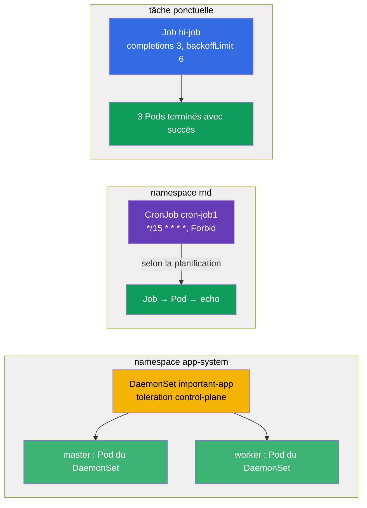

[Русская версия](README_RU.MD) · [Eng version](README.MD) · [Versión en español](README_ES.MD) · [Deutsche Version](README_DE.MD) · [ქართული ვერსია](README_GE.MD) · [繁體中文版](README_TW.MD) · [日本語版](README_JP.MD)

# Lab 103 — Tâches ponctuelles et périodiques : Job, CronJob, DaemonSet

## Description

Travail pratique sur trois contrôleurs de charges de travail spécialisés : **Job** (une tâche
qui doit s'exécuter et se terminer), **CronJob** (une tâche planifiée) et **DaemonSet** (un
Pod sur chaque nœud). Le cluster de ce lab comporte **deux nœuds** (master + un worker), afin
de vérifier concrètement que le DaemonSet se déploie sur tous les nœuds, y compris le
control-plane.

Toutes les tâches sont rédigées dans le style de l'examen (comme les vraies questions
CKA/CKAD) avec une vérification automatique via la commande `check_result`. Il est plus
pratique de les résoudre avec des manifestes (en utilisant
`kubectl create ... --dry-run=client -o yaml` comme base) : à l'examen, c'est la voie la plus
rapide pour les objets comportant beaucoup de champs.

## Objectif

Consolider le contenu des chapitres du cours :

- [Chapitre 10. Jobs et CronJobs](../../course/10/fr.md) — tâches ponctuelles et périodiques, `completions`, `backoffLimit`, `restartPolicy`, planification, `concurrencyPolicy`
- [Chapitre 11. DaemonSet et StatefulSet](../../course/11/fr.md) — lancer un Pod sur chaque nœud, toleration pour le control-plane

## Ce que nous créons et pourquoi

Dans ce lab, nous travaillons trois contrôleurs qui lancent la charge autrement qu'un
Deployment : les uns s'exécutent puis se terminent, les autres suivent une planification, les
derniers placent un Pod sur chaque nœud. Chaque objet a son propre rôle :

| Objet | Ce que c'est | Pourquoi dans ce lab |
|-------|--------------|----------------------|
| **Job `hi-job`** | tâche ponctuelle | apprendre à lancer une tâche avec plusieurs fins réussies (`completions`), une limite de reprises (`backoffLimit`) et le bon `restartPolicy` (chapitre 10) |
| **CronJob `cron-job1`** (namespace `rnd`) | tâche planifiée | travailler la planification cron, `concurrencyPolicy` et les limites d'historique des Jobs — tâche courante en production (chapitre 10) |
| **DaemonSet `important-app`** (namespace `app-system`) | un Pod par nœud | apprendre à déployer un agent sur tous les nœuds, y compris le control-plane, via un toleration (chapitre 11) |

Vue d'ensemble de ce qui sera déployé :



## Infrastructure

L'environnement est déployé dans AWS (`eu-central-1`) via Terragrunt et se compose de :

| Composant  | Description                                                          |
|------------|----------------------------------------------------------------------|
| `vpc`      | VPC `10.10.0.0/16` avec des sous-réseaux publics                       |
| `ssh-keys` | Clés SSH pour l'accès aux nœuds                                       |
| `k8s-1`    | Kubernetes `1.35.2` (kubeadm), CNI Calico, metrics-server, **master + 1 worker** |
| `worker`   | Machine de travail avec `kubectl`, accès au cluster et `check_result`  |

Instances : `t3.medium`, Ubuntu `22.04`. Le cluster comporte **deux nœuds** — le master
(control-plane) et un worker. Le taint `control-plane` est conservé sur le master, les Pods
ordinaires vont donc sur le worker et seuls ceux qui disposent d'un toleration adapté
atterrissent sur le master (comme le DaemonSet de la tâche 3).

## Déploiement

```bash
TASK=103 make run_cka_task
```

Après la création, connectez-vous en SSH à la machine de travail (worker) et effectuez les
tâches depuis celle-ci. `kubectl` est déjà configuré sur le contexte
`cluster1-admin@cluster1`.

Commandes utiles sur la machine de travail :

```bash
time_left       # combien de temps il reste
check_result    # vérifier la solution
```

## Tâches

---
|        **1**        | **Créer une tâche ponctuelle (Job)**                          |
| :-----------------: | :------------------------------------------------------------ |
| Ce qu'on fait       | Créez un Job nommé `hi-job`, image du conteneur `busybox`, commande `echo hello world`. La tâche doit se terminer avec succès `3` fois (`completions: 3`), avec une limite de reprises en cas d'échec `backoffLimit: 6` et `restartPolicy: Never`. |
| Critères d'acceptation | - le Job `hi-job` existe ;<br/>- l'image du conteneur est `busybox` ;<br/>- la commande est `echo hello world` ;<br/>- `completions: 3` ;<br/>- `backoffLimit: 6` ;<br/>- `restartPolicy: Never`. |
---
|        **2**        | **Créer une tâche planifiée (CronJob)**                       |
| :-----------------: | :------------------------------------------------------------ |
| Ce qu'on fait       | Créez le namespace `rnd`. Dedans, créez un CronJob nommé `cron-job1`, image du conteneur `viktoruj/ping_pong:alpine`. La planification est `*/15 * * * *` (toutes les 15 minutes), la politique de parallélisme est `concurrencyPolicy: Forbid` (ne pas démarrer un nouveau Job tant que le précédent n'est pas terminé), les limites d'historique sont `successfulJobsHistoryLimit: 5` et `failedJobsHistoryLimit: 7`. Sur le modèle de Job, indiquez `completions: 3`, `backoffLimit: 4` et `activeDeadlineSeconds: 10`. |
| Critères d'acceptation | - le namespace `rnd` existe ;<br/>- CronJob `cron-job1`, image `viktoruj/ping_pong:alpine` ;<br/>- `schedule: */15 * * * *` ;<br/>- `concurrencyPolicy: Forbid` ;<br/>- `successfulJobsHistoryLimit: 5`, `failedJobsHistoryLimit: 7` ;<br/>- `completions: 3`, `backoffLimit: 4`, `activeDeadlineSeconds: 10`. |
---
|        **3**        | **Déployer un DaemonSet sur tous les nœuds (y compris le control-plane)** |
| :-----------------: | :------------------------------------------------------------ |
| Ce qu'on fait       | Créez le namespace `app-system`. Dedans, déployez un DaemonSet nommé `important-app`, image du conteneur `viktoruj/ping_pong:latest`. Par défaut, un DaemonSet ne place pas de Pod sur le control-plane (il y a un taint), ajoutez donc un toleration pour le taint `node-role.kubernetes.io/control-plane` afin que le Pod démarre sur **tous** les nœuds du cluster, master inclus. |
| Critères d'acceptation | - le namespace `app-system` existe ;<br/>- DaemonSet `important-app`, image `viktoruj/ping_pong:latest` ;<br/>- le Pod tourne sur **tous** les nœuds (`desiredNumberScheduled` = `numberReady` = nombre de nœuds). |
---

## Vérification du résultat

Sur la machine de travail, lancez la vérification automatique :

```bash
check_result
```

Le script exécute les tests et affiche le nombre de tâches réussies.

## Solution

Solution de référence : [worker/files/solutions/1_FR.MD](worker/files/solutions/1_FR.MD)

## Couverture des examens blancs

Le lab couvre les tâches des examens blancs portant sur les contrôleurs de charges : CKA mock
01 (n° 24 — DaemonSet sur tous les nœuds), CKA mock 02 (n° 14 — DaemonSet sur tous les
nœuds), CKAD mock 01 (n° 13 — Job `completions`/`backoffLimit`), CKAD mock 02 (n° 2 — CronJob
avec le jeu complet de paramètres).

## Suppression du cluster et des ressources

```bash
TASK=103 make delete_cka_task
```
