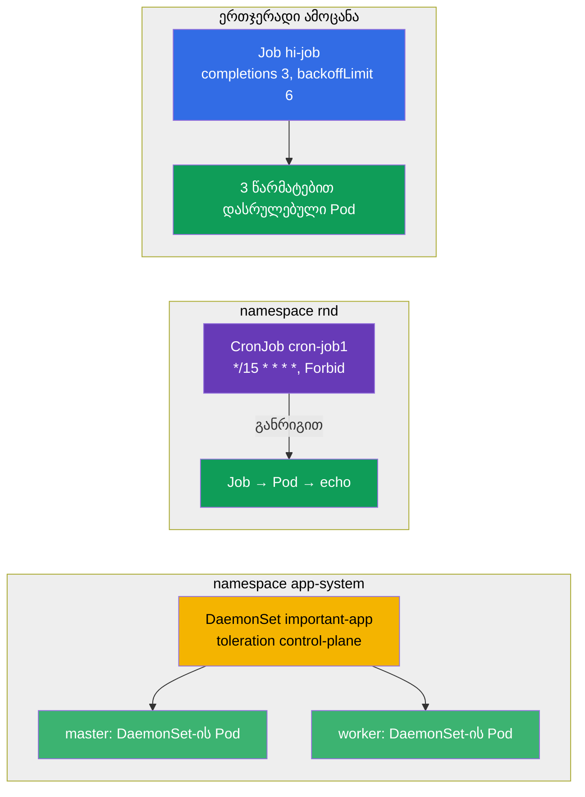

[Русская версия](README_RU.MD) · [Eng version](README.MD) · [Versión en español](README_ES.MD) · [Version française](README_FR.MD) · [Deutsche Version](README_DE.MD) · [繁體中文版](README_TW.MD) · [日本語版](README_JP.MD)

# Lab 103 — ერთჯერადი და პერიოდული ამოცანები: Job, CronJob, DaemonSet

## აღწერა

პრაქტიკული სამუშაო სამ სპეციალიზებულ სამუშაო დატვირთვის კონტროლერზე: **Job** (ამოცანა,
რომელიც უნდა შესრულდეს და დასრულდეს), **CronJob** (ამოცანა განრიგით) და **DaemonSet**
(თითო Pod ყოველ node-ზე). ამ ლაბორატორიაში კლასტერი **ორკვანძიანია** (master + ერთი
worker), რომ თვალსაჩინოდ შევამოწმოთ, რომ DaemonSet ყველა node-ზე ეშლება, control-plane-ის
ჩათვლით.

ყველა დავალება გამოცდის სტილშია გაფორმებული (როგორც რეალური CKA/CKAD კითხვები) და მათი
შემოწმება ავტომატურად ხდება ბრძანებით `check_result`. უფრო მოსახერხებელია ამოხსნა
მანიფესტებით (`kubectl create ... --dry-run=client -o yaml` როგორც შაბლონი) — გამოცდაზე ეს
ყველაზე სწრაფი გზაა ბევრი ველის მქონე ობიექტებისთვის.

## მიზანი

განამტკიცოთ კურსის თავების მასალა:

- [თავი 10. Jobs და CronJobs](../../course/10/ge.md) — ერთჯერადი და პერიოდული ამოცანები, `completions`, `backoffLimit`, `restartPolicy`, განრიგი, `concurrencyPolicy`
- [თავი 11. DaemonSet და StatefulSet](../../course/11/ge.md) — Pod-ის გაშვება ყოველ node-ზე, toleration control-plane-ისთვის

## რას ვქმნით და რისთვის

ამ ლაბორატორიაში ვამუშავებთ სამ კონტროლერს, რომლებიც დატვირთვას Deployment-ისგან
განსხვავებულად უშვებენ: ერთნი სრულდებიან და მთავრდებიან, სხვები განრიგით მიდიან, დანარჩენები
თითო Pod-ს ყოველ node-ზე სვამენ. თითოეული ობიექტი თავის ამოცანას ასრულებს:

| ობიექტი | რა არის ეს | რისთვის არის ამ ლაბორატორიაში |
|---------|------------|-------------------------------|
| **Job `hi-job`** | ერთჯერადი ამოცანა | ვსწავლობთ ამოცანის გაშვებას რამდენიმე წარმატებული დასრულებით (`completions`), ხელახალი ცდების ლიმიტით (`backoffLimit`) და სწორი `restartPolicy`-ით (თავი 10) |
| **CronJob `cron-job1`** (namespace `rnd`) | ამოცანა განრიგით | ვამუშავებთ cron-განრიგს, `concurrencyPolicy`-ს, Jobs-ის ისტორიის ლიმიტებს — ტიპური საბრძოლო დავალება (თავი 10) |
| **DaemonSet `important-app`** (namespace `app-system`) | თითო Pod ყოველ node-ზე | ვსწავლობთ აგენტის განთავსებას ყველა node-ზე, control-plane-ის ჩათვლით, toleration-ის მეშვეობით (თავი 11) |

საბოლოო სურათი იმისა, რაც განთავსდება:



## ინფრასტრუქტურა

გარემო იშლება AWS-ში (`eu-central-1`) Terragrunt-ის მეშვეობით და შედგება:

| კომპონენტი | აღწერა                                                            |
|------------|-------------------------------------------------------------------|
| `vpc`      | VPC `10.10.0.0/16` საჯარო ქვექსელებით                              |
| `ssh-keys` | SSH-გასაღებები node-ებზე წვდომისთვის                                |
| `k8s-1`    | Kubernetes `1.35.2` (kubeadm), CNI Calico, metrics-server, **master + 1 worker** |
| `worker`   | სამუშაო მანქანა `kubectl`-ით, კლასტერზე წვდომით და `check_result`-ით |

ინსტანსები: `t3.medium`, Ubuntu `22.04`. კლასტერი **ორკვანძიანია** — master (control-plane)
და ერთი worker. master-ზე შენარჩუნებულია taint `control-plane`, ამიტომ ჩვეულებრივი Pod-ები
worker-ზე მიდიან, master-ზე კი მხოლოდ ისინი ხვდებიან, რომლებსაც შესაბამისი toleration აქვთ
(როგორც DaemonSet-ს დავალება 3-ში).

## განთავსება

```bash
TASK=103 make run_cka_task
```

შექმნის შემდეგ დაუკავშირდით სამუშაო მანქანას (worker) SSH-ით და დავალებები შეასრულეთ
იქიდან. `kubectl` უკვე კონფიგურირებულია კონტექსტზე `cluster1-admin@cluster1`.

სასარგებლო ბრძანებები სამუშაო მანქანაზე:

```bash
time_left       # რამდენი დრო დარჩა
check_result    # ამოხსნის შემოწმება
```

## დავალებები

---
|        **1**        | **ერთჯერადი ამოცანის (Job) შექმნა**                           |
| :-----------------: | :------------------------------------------------------------ |
| რას ვაკეთებთ        | შექმენით Job სახელით `hi-job`, კონტეინერის image `busybox`, ბრძანება — `echo hello world`. ამოცანა წარმატებით უნდა დასრულდეს `3`-ჯერ (`completions: 3`), ხარვეზის შემთხვევაში ხელახალი ცდების ლიმიტით `backoffLimit: 6` და `restartPolicy: Never`. |
| მიღების კრიტერიუმები | - Job `hi-job` არსებობს;<br/>- კონტეინერის image — `busybox`;<br/>- ბრძანება — `echo hello world`;<br/>- `completions: 3`;<br/>- `backoffLimit: 6`;<br/>- `restartPolicy: Never`. |
---
|        **2**        | **განრიგით ამოცანის (CronJob) შექმნა**                        |
| :-----------------: | :------------------------------------------------------------ |
| რას ვაკეთებთ        | შექმენით namespace `rnd`. მასში შექმენით CronJob სახელით `cron-job1`, კონტეინერის image `viktoruj/ping_pong:alpine`. განრიგი — `*/15 * * * *` (ყოველ 15 წუთში), პარალელიზმის პოლიტიკა `concurrencyPolicy: Forbid` (არ გაუშვათ ახალი Job, სანამ წინა არ დასრულდება), ისტორიის ლიმიტები `successfulJobsHistoryLimit: 5` და `failedJobsHistoryLimit: 7`. Job-ის შაბლონს მიუთითეთ `completions: 3`, `backoffLimit: 4` და `activeDeadlineSeconds: 10`. |
| მიღების კრიტერიუმები | - namespace `rnd` არსებობს;<br/>- CronJob `cron-job1`, image `viktoruj/ping_pong:alpine`;<br/>- `schedule: */15 * * * *`;<br/>- `concurrencyPolicy: Forbid`;<br/>- `successfulJobsHistoryLimit: 5`, `failedJobsHistoryLimit: 7`;<br/>- `completions: 3`, `backoffLimit: 4`, `activeDeadlineSeconds: 10`. |
---
|        **3**        | **DaemonSet-ის განთავსება ყველა node-ზე (control-plane-ის ჩათვლით)** |
| :-----------------: | :------------------------------------------------------------ |
| რას ვაკეთებთ        | შექმენით namespace `app-system`. მასში განათავსეთ DaemonSet სახელით `important-app`, კონტეინერის image `viktoruj/ping_pong:latest`. DaemonSet ნაგულისხმევად control-plane-ზე Pod-ს არ სვამს (მასზე taint არის), ამიტომ დაამატეთ toleration taint-ზე `node-role.kubernetes.io/control-plane`, რომ Pod გაეშვას კლასტერის **ყველა** node-ზე, master-ის ჩათვლით. |
| მიღების კრიტერიუმები | - namespace `app-system` არსებობს;<br/>- DaemonSet `important-app`, image `viktoruj/ping_pong:latest`;<br/>- Pod მუშაობს **ყველა** node-ზე (`desiredNumberScheduled` = `numberReady` = node-ების რაოდენობა). |
---

## შედეგის შემოწმება

სამუშაო მანქანაზე გაუშვით ავტომატური შემოწმება:

```bash
check_result
```

სკრიპტი გაატარებს ტესტებს და აჩვენებს, რამდენი დავალებაა შესრულებული.

## ამოხსნა

ეტალონური ამოხსნა: [worker/files/solutions/1_GE.MD](worker/files/solutions/1_GE.MD)

## Mock-გამოცდების დაფარვა

ლაბორატორია ფარავს mock-ების დავალებებს დატვირთვის კონტროლერებზე: CKA mock 01 (№24 —
DaemonSet ყველა node-ზე), CKA mock 02 (№14 — DaemonSet ყველა node-ზე), CKAD mock 01 (№13 —
Job `completions`/`backoffLimit`), CKAD mock 02 (№2 — CronJob პარამეტრების სრული ნაკრებით).

## კლასტერისა და რესურსების წაშლა

```bash
TASK=103 make delete_cka_task
```
