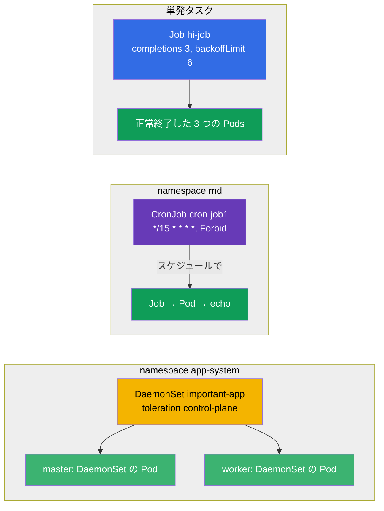

[Русская версия](README_RU.MD) · [Eng version](README.MD) · [Versión en español](README_ES.MD) · [Version française](README_FR.MD) · [Deutsche Version](README_DE.MD) · [ქართული ვერსია](README_GE.MD) · [繁體中文版](README_TW.MD)

# Lab 103 — 単発タスクと定期タスク: Job、CronJob、DaemonSet

## 概要

3 つの専用ワークロードコントローラーを扱う実習です: **Job**
(実行して完了しなければならないタスク)、**CronJob** (スケジュールで動くタスク)、
**DaemonSet** (各ノードに 1 つの Pod)。このラボのクラスターは **2 ノード構成**
(master + worker 1 台) で、DaemonSet が control-plane を含むすべてのノードへ
展開されることを分かりやすく確認できます。

すべての課題は試験形式 (実際の CKA/CKAD の問題と同じスタイル) で書かれ、
`check_result` コマンドで自動採点されます。解くときはマニフェストが便利です
(`kubectl create ... --dry-run=client -o yaml` をひな形にする) — 試験では、フィールドが
多いオブジェクトに対してこれが最速の方法です。

## 目的

コースの各章の内容を定着させます:

- [第 10 章。Jobs と CronJobs](../../course/10/README.md) — 単発タスクと定期タスク、`completions`、`backoffLimit`、`restartPolicy`、スケジュール、`concurrencyPolicy`
- [第 11 章。DaemonSet と StatefulSet](../../course/11/README.md) — 各ノードでの Pod 実行、control-plane 向けの toleration

## 何を作り、なぜ作るのか

このラボでは、Deployment とは違う形でワークロードを起動する 3 つのコントローラーを
練習します: 実行して終了するもの、スケジュールで動くもの、各ノードに 1 つずつ
Pod を配置するもの。それぞれのオブジェクトに役割があります:

| オブジェクト | 何なのか | このラボでの役割 |
|--------|---------|-------------------|
| **Job `hi-job`** | 単発タスク | 複数回の成功完了 (`completions`)、再試行の上限 (`backoffLimit`)、正しい `restartPolicy` を持つタスクの起動を学ぶ (第 10 章) |
| **CronJob `cron-job1`** (namespace `rnd`) | スケジュールで動くタスク | cron スケジュール、`concurrencyPolicy`、Jobs の履歴上限を練習する — 実務で典型的な課題 (第 10 章) |
| **DaemonSet `important-app`** (namespace `app-system`) | 各ノードに 1 つの Pod | toleration を使って control-plane を含むすべてのノードへエージェントを展開する方法を学ぶ (第 11 章) |

展開されるものの全体像:



## インフラ

環境は Terragrunt を使って AWS (`eu-central-1`) に構築され、次の要素で構成されます:

| コンポーネント  | 説明                                                             |
|------------|----------------------------------------------------------------------|
| `vpc`      | パブリックサブネットを持つ VPC `10.10.0.0/16`                             |
| `ssh-keys` | ノードへアクセスするための SSH 鍵                                        |
| `k8s-1`    | Kubernetes `1.35.2` (kubeadm)、CNI Calico、metrics-server、**master + 1 worker** |
| `worker`   | `kubectl`、クラスターへのアクセス、`check_result` を備えた作業マシン     |

インスタンス: `t4g.medium` Ubuntu `22.04`。クラスターは **2 ノード構成** — master (control-plane) と
worker 1 台です。master には taint `control-plane` が残っているため、通常の Pods は
worker に配置され、master には適切な toleration を持つものだけが載ります (課題 3 の
DaemonSet のように)。

## 構築

```bash
TASK=103 make run_cka_task
```

作成後は作業マシン (worker) に SSH で接続し、そこから課題を進めてください。
`kubectl` は context `cluster1-admin@cluster1` に設定済みです。

作業マシンで役立つコマンド:

```bash
time_left       # 残り時間
check_result    # 解答をチェックする
```

## 課題

---
|        **1**        | **単発タスク (Job) を作成する**                              |
| :-----------------: | :------------------------------------------------------------ |
| やること          | 名前が `hi-job` の Job を作成してください。コンテナイメージは `busybox`、コマンドは `echo hello world` です。タスクは `3` 回正常に完了する必要があり (`completions: 3`)、失敗時の再試行上限は `backoffLimit: 6`、`restartPolicy: Never` とします。 |
| 受入基準    | - Job `hi-job` が存在する。<br/>- コンテナイメージが `busybox` である。<br/>- コマンドが `echo hello world` である。<br/>- `completions: 3`。<br/>- `backoffLimit: 6`。<br/>- `restartPolicy: Never`。 |
---
|        **2**        | **スケジュールで動くタスク (CronJob) を作成する**                    |
| :-----------------: | :------------------------------------------------------------ |
| やること          | namespace `rnd` を作成してください。その中に名前が `cron-job1` の CronJob を作成します。コンテナイメージは `viktoruj/ping_pong:alpine` です。スケジュールは `*/15 * * * *` (15 分ごと)、並列実行ポリシーは `concurrencyPolicy: Forbid` (前の Job が終わるまで新しい Job を起動しない)、履歴上限は `successfulJobsHistoryLimit: 5` と `failedJobsHistoryLimit: 7` です。Job のテンプレートには `completions: 3`、`backoffLimit: 4`、`activeDeadlineSeconds: 10` を設定してください。 |
| 受入基準    | - namespace `rnd` が存在する。<br/>- CronJob `cron-job1`、イメージ `viktoruj/ping_pong:alpine`。<br/>- `schedule: */15 * * * *`。<br/>- `concurrencyPolicy: Forbid`。<br/>- `successfulJobsHistoryLimit: 5`、`failedJobsHistoryLimit: 7`。<br/>- `completions: 3`、`backoffLimit: 4`、`activeDeadlineSeconds: 10`。 |
---
|        **3**        | **すべてのノード (control-plane を含む) に DaemonSet を展開する** |
| :-----------------: | :------------------------------------------------------------ |
| やること          | namespace `app-system` を作成してください。その中に名前が `important-app` の DaemonSet を展開します。コンテナイメージは `viktoruj/ping_pong:latest` です。DaemonSet は既定では control-plane に Pod を配置しません (taint があるため)。そこで taint `node-role.kubernetes.io/control-plane` への toleration を追加し、master を含むクラスターの**すべての**ノードで Pod が起動するようにしてください。 |
| 受入基準    | - namespace `app-system` が存在する。<br/>- DaemonSet `important-app`、イメージ `viktoruj/ping_pong:latest`。<br/>- Pod が**すべての**ノードで動作している (`desiredNumberScheduled` = `numberReady` = ノード数)。 |
---

## 結果のチェック

作業マシンで自動チェックを実行します:

```bash
check_result
```

スクリプトがテストを実行し、いくつの課題が完了したかを表示します。

## 解答

リファレンス解答: [worker/files/solutions/1_JP.MD](worker/files/solutions/1_JP.MD)

## 模擬試験のカバー範囲

このラボはワークロードコントローラーに関する模擬試験の課題をカバーします: CKA mock 01 (No.24 — すべての
ノードでの DaemonSet)、CKA mock 02 (No.14 — すべてのノードでの DaemonSet)、CKAD mock 01 (No.13 — Job の
`completions`/`backoffLimit`)、CKAD mock 02 (No.2 — 全パラメーターを揃えた CronJob)。

## クラスターとリソースの削除

```bash
TASK=103 make delete_cka_task
```
