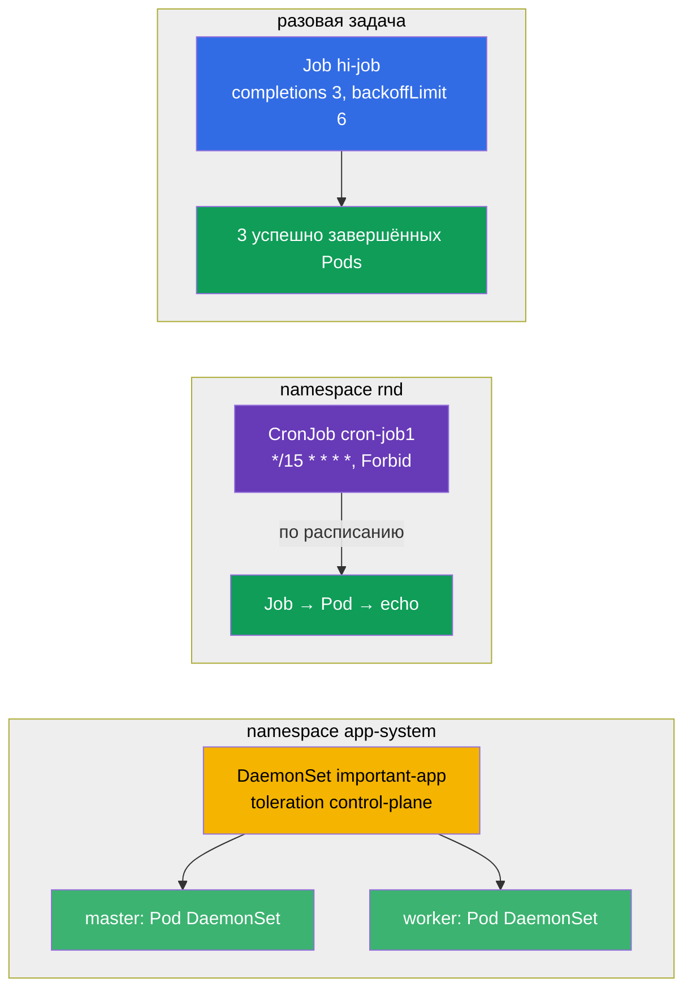

# Lab 103 — Разовые и периодические задачи: Job, CronJob, DaemonSet

## Описание

Практическая работа по трём специализированным контроллерам рабочих нагрузок: **Job**
(задача, которая должна выполниться и завершиться), **CronJob** (задача по расписанию) и
**DaemonSet** (по одному Pod на каждой ноде). Кластер в этой лабе **двухнодовый**
(master + один worker), чтобы наглядно проверить, что DaemonSet раскатывается на все
ноды, включая control-plane.

Все задания оформлены в экзаменационном стиле (как реальные вопросы CKA/CKAD) с
автоматической проверкой командой `check_result`. Решать удобнее через манифесты
(`kubectl create ... --dry-run=client -o yaml` как заготовка) — на экзамене это самый
быстрый путь для объектов с большим числом полей.

## Цель

Закрепить материал глав курса:

- [Глава 10. Jobs и CronJobs](../../course/10/ru.md) — разовые и периодические задачи, `completions`, `backoffLimit`, `restartPolicy`, расписание, `concurrencyPolicy`
- [Глава 11. DaemonSet и StatefulSet](../../course/11/ru.md) — запуск Pod на каждой ноде, toleration для control-plane

## Что мы создаём и зачем

В этой лабе мы отрабатываем три контроллера, которые запускают нагрузку иначе, чем
Deployment: одни выполняются и завершаются, другие идут по расписанию, третьи ставят по
Pod на каждую ноду. Каждый объект решает свою задачу:

| Объект | Что это | Зачем в этой лабе |
|--------|---------|-------------------|
| **Job `hi-job`** | разовая задача | учимся запускать задачу с несколькими успешными завершениями (`completions`), лимитом повторов (`backoffLimit`) и правильным `restartPolicy` (глава 10) |
| **CronJob `cron-job1`** (namespace `rnd`) | задача по расписанию | отрабатываем расписание cron, `concurrencyPolicy`, лимиты истории Jobs — типовое боевое задание (глава 10) |
| **DaemonSet `important-app`** (namespace `app-system`) | по Pod на каждой ноде | учимся раскатывать агент на все ноды, включая control-plane, через toleration (глава 11) |

Итоговая картина того, что будет развёрнуто:



## Инфраструктура

Окружение разворачивается в AWS (`eu-central-1`) через Terragrunt и состоит из:

| Компонент  | Описание                                                             |
|------------|----------------------------------------------------------------------|
| `vpc`      | VPC `10.10.0.0/16` с публичными подсетями                             |
| `ssh-keys` | SSH-ключи для доступа к нодам                                        |
| `k8s-1`    | Kubernetes `1.35.2` (kubeadm), CNI Calico, metrics-server, **master + 1 worker** |
| `worker`   | Рабочая машина с `kubectl`, доступом к кластеру и `check_result`     |

Инстансы: `t3.medium` Ubuntu `22.04`. Кластер **двухнодовый** — master (control-plane) и
один worker. На master сохранён taint `control-plane`, поэтому обычные Pods идут на
worker, а на master попадают только те, у кого есть подходящий toleration (как у
DaemonSet в задании 3).

## Развёртывание

```bash
TASK=103 make run_cka_task
```

После создания подключитесь к рабочей машине (worker) по SSH и выполняйте задания
оттуда. `kubectl` уже настроен на контекст `cluster1-admin@cluster1`.

Полезные команды на рабочей машине:

```bash
time_left       # сколько осталось времени
check_result    # проверить решение
```

## Задания

---
|        **1**        | **Создать разовую задачу (Job)**                              |
| :-----------------: | :------------------------------------------------------------ |
| Что делаем          | Создайте Job с именем `hi-job`, образ контейнера `busybox`, команда — `echo hello world`. Задача должна успешно завершиться `3` раза (`completions: 3`), с лимитом повторов при сбое `backoffLimit: 6` и `restartPolicy: Never`. |
| Критерии приёмки    | - Job `hi-job` существует;<br/>- образ контейнера — `busybox`;<br/>- команда — `echo hello world`;<br/>- `completions: 3`;<br/>- `backoffLimit: 6`;<br/>- `restartPolicy: Never`. |
---
|        **2**        | **Создать задачу по расписанию (CronJob)**                    |
| :-----------------: | :------------------------------------------------------------ |
| Что делаем          | Создайте namespace `rnd`. В нём создайте CronJob с именем `cron-job1`, образ контейнера `viktoruj/ping_pong:alpine`. Расписание — `*/15 * * * *` (каждые 15 минут), политика параллелизма `concurrencyPolicy: Forbid` (не запускать новый Job, пока не завершился предыдущий), лимиты истории `successfulJobsHistoryLimit: 5` и `failedJobsHistoryLimit: 7`. У шаблона Job задайте `completions: 3`, `backoffLimit: 4` и `activeDeadlineSeconds: 10`. |
| Критерии приёмки    | - namespace `rnd` существует;<br/>- CronJob `cron-job1`, образ `viktoruj/ping_pong:alpine`;<br/>- `schedule: */15 * * * *`;<br/>- `concurrencyPolicy: Forbid`;<br/>- `successfulJobsHistoryLimit: 5`, `failedJobsHistoryLimit: 7`;<br/>- `completions: 3`, `backoffLimit: 4`, `activeDeadlineSeconds: 10`. |
---
|        **3**        | **Развернуть DaemonSet на всех нодах (включая control-plane)** |
| :-----------------: | :------------------------------------------------------------ |
| Что делаем          | Создайте namespace `app-system`. В нём разверните DaemonSet с именем `important-app`, образ контейнера `viktoruj/ping_pong:latest`. DaemonSet по умолчанию не ставит Pod на control-plane (там taint), поэтому добавьте toleration на taint `node-role.kubernetes.io/control-plane`, чтобы Pod запустился на **всех** нодах кластера, включая master. |
| Критерии приёмки    | - namespace `app-system` существует;<br/>- DaemonSet `important-app`, образ `viktoruj/ping_pong:latest`;<br/>- Pod работает на **всех** нодах (`desiredNumberScheduled` = `numberReady` = числу нод). |
---

## Проверка результата

На рабочей машине запустите автоматическую проверку:

```bash
check_result
```

Скрипт прогонит тесты и покажет, сколько заданий выполнено.

## Решение

Эталонное решение: [worker/files/solutions/1.MD](worker/files/solutions/1.MD)

## Покрытие мок-экзаменов

Лаба закрывает задания моков по контроллерам нагрузок: CKA mock 01 (№24 — DaemonSet на
всех нодах), CKA mock 02 (№14 — DaemonSet на всех нодах), CKAD mock 01 (№13 — Job
`completions`/`backoffLimit`), CKAD mock 02 (№2 — CronJob с полным набором параметров).

## Удаление кластера и ресурсов

```bash
TASK=103 make delete_cka_task
```
