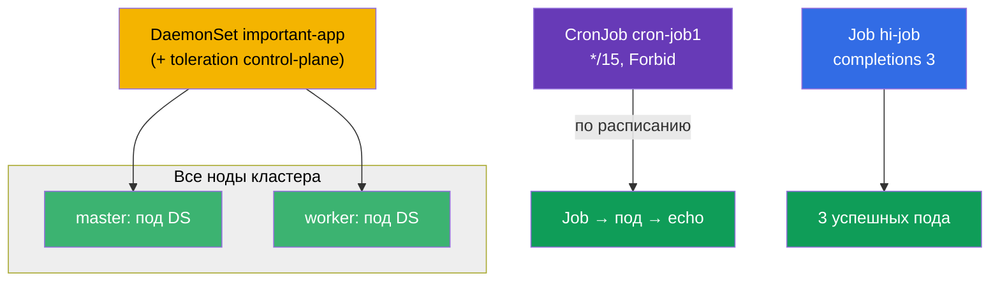

# Lab 103 — Разовые и периодические задачи: Job, CronJob, DaemonSet

## Описание

Практическая работа по трём специализированным контроллерам рабочих нагрузок: **Job**
(задача, которая должна выполниться и завершиться), **CronJob** (задача по расписанию) и
**DaemonSet** (по одному поду на каждой ноде). Кластер в этой лабе **двухнодовый**
(master + один worker), чтобы наглядно проверить, что DaemonSet раскатывается на все
ноды, включая control-plane.

Все задания в экзаменационном стиле с автопроверкой `check_result`.

## Цель

Закрепить главы курса:

- [Глава 10. Jobs и CronJobs](../../course/10/ru.md)
- [Глава 11. DaemonSet и StatefulSet](../../course/11/ru.md)

## Что мы создаём и зачем

| Объект | Что это | Зачем в этой лабе |
|--------|---------|-------------------|
| **Job `hi-job`** | разовая задача | учимся запускать задачу с несколькими успешными завершениями (`completions`) и лимитом повторов (`backoffLimit`), правильным `restartPolicy` |
| **CronJob `cron-job1`** (неймспейс `rnd`) | задача по расписанию | отрабатываем расписание cron, `concurrencyPolicy`, лимиты истории — типовое боевое задание |
| **DaemonSet `important-app`** (неймспейс `app-system`) | по поду на каждой ноде | учимся раскатывать агент на все ноды, включая control-plane (через toleration) |



## Инфраструктура

Окружение разворачивается в AWS (`eu-central-1`) через Terragrunt:

| Компонент  | Описание                                                             |
|------------|----------------------------------------------------------------------|
| `vpc`      | VPC `10.10.0.0/16`                                                    |
| `ssh-keys` | SSH-ключи                                                            |
| `k8s-1`    | Kubernetes `1.35.2` (kubeadm), Calico, metrics-server, **master + 1 worker** |
| `worker`   | Рабочая машина с `kubectl` и `check_result`                          |

## Развёртывание

```bash
TASK=103 make run_cka_task
```

## Задания

---
|        **1**        | **Создать разовую задачу (Job)**                              |
| :-----------------: | :------------------------------------------------------------ |
| Что делаем          | Запускаем Job, который должен успешно завершиться нужное число раз |
| Критерии приёмки    | - Job: `hi-job`<br/>- Image: `busybox`<br/>- Command: `echo hello world`<br/>- completions: `3`<br/>- backoffLimit: `6`<br/>- restartPolicy: `Never` |
---
|        **2**        | **Создать задачу по расписанию (CronJob)**                    |
| :-----------------: | :------------------------------------------------------------ |
| Что делаем          | Настраиваем периодический запуск с политикой параллелизма и лимитами истории |
| Критерии приёмки    | - Неймспейс: `rnd`<br/>- CronJob: `cron-job1`, image `viktoruj/ping_pong:alpine`<br/>- schedule: `*/15 * * * *`<br/>- concurrencyPolicy: `Forbid`<br/>- successfulJobsHistoryLimit: `5`, failedJobsHistoryLimit: `7`<br/>- completions: `3`, backoffLimit: `4`, activeDeadlineSeconds: `10` |
---
|        **3**        | **Развернуть DaemonSet на всех нодах (включая control-plane)** |
| :-----------------: | :------------------------------------------------------------ |
| Что делаем          | Запускаем агент по поду на каждой ноде; на control-plane попадаем через toleration |
| Критерии приёмки    | - Неймспейс: `app-system`<br/>- DaemonSet: `important-app`, image `nginx`<br/>- Под работает на **всех** нодах (desired = numberReady = число нод) |
---

## Проверка результата

```bash
check_result
```

## Решение

[worker/files/solutions/1.MD](worker/files/solutions/1.MD)

## Покрытие мок-экзаменов

CKA mock 01 (№24 — DaemonSet на всех нодах), CKA mock 02 (№14 — DaemonSet на всех нодах),
CKAD mock 01 (№13 — Job completions/backoffLimit), CKAD mock 02 (№2 — CronJob с полным
набором параметров).

## Удаление

```bash
TASK=103 make delete_cka_task
```
