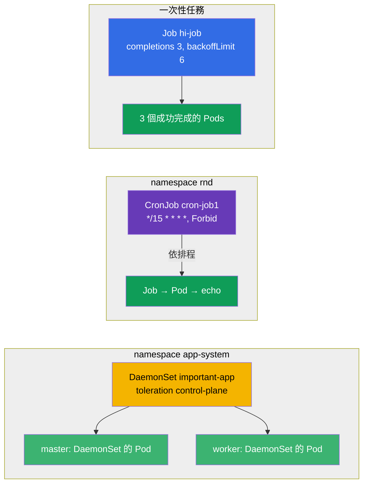

[Русская версия](README_RU.MD) · [Eng version](README.MD) · [Versión en español](README_ES.MD) · [Version française](README_FR.MD) · [Deutsche Version](README_DE.MD) · [ქართული ვერსია](README_GE.MD) · [日本語版](README_JP.MD)

# Lab 103 — 一次性與週期性任務: Job、CronJob、DaemonSet

## 說明

針對三種專用工作負載控制器的實作練習: **Job** (必須執行完成並結束的任務)、
**CronJob** (依排程執行的任務) 以及 **DaemonSet** (在每個節點上各執行一個 Pod)。本實驗的叢集是
**雙節點** (master + 一個 worker), 以便清楚驗證 DaemonSet 會部署到所有節點,
包括 control-plane。

所有題目都以考試風格撰寫 (就像真實的 CKA/CKAD 題目), 並透過 `check_result` 指令
自動驗證。使用 manifest 來解題比較方便
(以 `kubectl create ... --dry-run=client -o yaml` 作為起始樣板) — 在考試中, 對於欄位很多的物件,
這是最快的途徑。

## 目標

鞏固課程章節的內容:

- [第 10 章。Jobs 與 CronJobs](../../course/10/README.md) — 一次性與週期性任務、`completions`、`backoffLimit`、`restartPolicy`、排程、`concurrencyPolicy`
- [第 11 章。DaemonSet 與 StatefulSet](../../course/11/README.md) — 在每個節點上執行 Pod、針對 control-plane 的 toleration

## 我們要建立什麼以及為什麼

在本實驗中, 我們練習三種與 Deployment 執行方式不同的控制器: 有的執行完成後結束,
有的依排程執行, 有的在每個節點上放置一個 Pod。
每個物件都有自己的用途:

| 物件 | 這是什麼 | 為什麼出現在本實驗 |
|--------|---------|-------------------|
| **Job `hi-job`** | 一次性任務 | 學習執行帶有多次成功完成 (`completions`)、重試上限 (`backoffLimit`) 以及正確 `restartPolicy` 的任務 (第 10 章) |
| **CronJob `cron-job1`** (namespace `rnd`) | 依排程執行的任務 | 練習 cron 排程、`concurrencyPolicy`、Jobs 歷史紀錄上限 — 典型的實戰題目 (第 10 章) |
| **DaemonSet `important-app`** (namespace `app-system`) | 每個節點一個 Pod | 學習透過 toleration 把代理程式部署到所有節點, 包括 control-plane (第 11 章) |

最終部署完成的整體樣貌:



## 基礎架構

環境透過 Terragrunt 部署在 AWS (`eu-central-1`), 由以下組成:

| 元件  | 說明                                                             |
|------------|----------------------------------------------------------------------|
| `vpc`      | VPC `10.10.0.0/16`, 含公有子網路                             |
| `ssh-keys` | 用於存取節點的 SSH 金鑰                                        |
| `k8s-1`    | Kubernetes `1.35.2` (kubeadm)、CNI Calico、metrics-server、**master + 1 worker** |
| `worker`   | 工作機, 具備 `kubectl`、叢集存取權與 `check_result`     |

實例: `t3.medium`, Ubuntu `22.04`。叢集為**雙節點** — master (control-plane) 與
一個 worker。master 上保留了 `control-plane` taint, 因此一般的 Pods 會落在
worker 上, 只有具備相符 toleration 的 Pod 才會落到 master 上 (就像
題目 3 中的 DaemonSet)。

## 部署

```bash
TASK=103 make run_cka_task
```

建立完成後, 透過 SSH 連線到工作機 (worker), 並在那裡完成題目。
`kubectl` 已設定好指向
`cluster1-admin@cluster1` context。

工作機上的實用指令:

```bash
time_left       # 還剩多少時間
check_result    # 檢查解答
```

## 題目

---
|        **1**        | **建立一次性任務 (Job)**                              |
| :-----------------: | :------------------------------------------------------------ |
| 要做什麼          | 建立名為 `hi-job` 的 Job, 容器映像為 `busybox`, 指令為 `echo hello world`。任務必須成功完成 `3` 次 (`completions: 3`), 失敗時的重試上限為 `backoffLimit: 6`, 並設定 `restartPolicy: Never`。 |
| 驗收標準    | - Job `hi-job` 存在;<br/>- 容器映像為 `busybox`;<br/>- 指令為 `echo hello world`;<br/>- `completions: 3`;<br/>- `backoffLimit: 6`;<br/>- `restartPolicy: Never`。 |
---
|        **2**        | **建立依排程執行的任務 (CronJob)**                    |
| :-----------------: | :------------------------------------------------------------ |
| 要做什麼          | 建立 namespace `rnd`。在其中建立名為 `cron-job1` 的 CronJob, 容器映像為 `viktoruj/ping_pong:alpine`。排程為 `*/15 * * * *` (每 15 分鐘), 併發策略為 `concurrencyPolicy: Forbid` (在前一個 Job 尚未結束前不啟動新的 Job), 歷史紀錄上限為 `successfulJobsHistoryLimit: 5` 與 `failedJobsHistoryLimit: 7`。在 Job 樣板上設定 `completions: 3`、`backoffLimit: 4` 與 `activeDeadlineSeconds: 10`。 |
| 驗收標準    | - namespace `rnd` 存在;<br/>- CronJob `cron-job1`, 映像為 `viktoruj/ping_pong:alpine`;<br/>- `schedule: */15 * * * *`;<br/>- `concurrencyPolicy: Forbid`;<br/>- `successfulJobsHistoryLimit: 5`、`failedJobsHistoryLimit: 7`;<br/>- `completions: 3`、`backoffLimit: 4`、`activeDeadlineSeconds: 10`。 |
---
|        **3**        | **在所有節點上部署 DaemonSet (包括 control-plane)** |
| :-----------------: | :------------------------------------------------------------ |
| 要做什麼          | 建立 namespace `app-system`。在其中部署名為 `important-app` 的 DaemonSet, 容器映像為 `viktoruj/ping_pong:latest`。DaemonSet 預設不會在 control-plane 上放置 Pod (那裡有 taint), 因此請為 taint `node-role.kubernetes.io/control-plane` 加上 toleration, 讓 Pod 在叢集的**所有**節點上執行, 包括 master。 |
| 驗收標準    | - namespace `app-system` 存在;<br/>- DaemonSet `important-app`, 映像為 `viktoruj/ping_pong:latest`;<br/>- Pod 在**所有**節點上執行 (`desiredNumberScheduled` = `numberReady` = 節點數量)。 |
---

## 檢查結果

在工作機上執行自動驗證:

```bash
check_result
```

腳本會跑完測試, 並顯示已完成多少題目。

## 解答

參考解答: [worker/files/solutions/1_TW.MD](worker/files/solutions/1_TW.MD)

## 模擬考涵蓋範圍

本實驗涵蓋了模擬考中關於工作負載控制器的題目: CKA mock 01 (第 24 題 — 在所有節點上的
DaemonSet)、CKA mock 02 (第 14 題 — 在所有節點上的 DaemonSet)、CKAD mock 01 (第 13 題 — Job
的 `completions`/`backoffLimit`)、CKAD mock 02 (第 2 題 — 具備完整參數組合的 CronJob)。

## 刪除叢集與資源

```bash
TASK=103 make delete_cka_task
```
