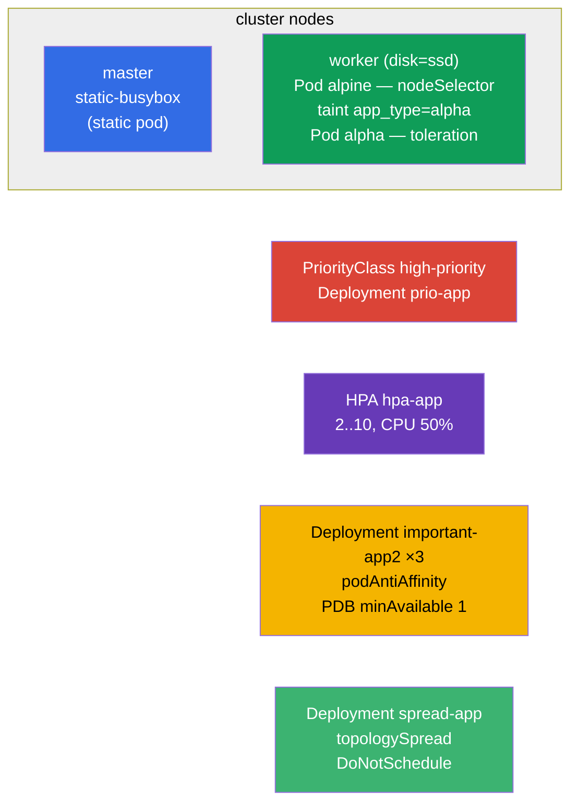

[Русская версия](README_RU.MD) · [Versión en español](README_ES.MD) · [Version française](README_FR.MD) · [Deutsche Version](README_DE.MD) · [ქართული ვერსია](README_GE.MD) · [繁體中文版](README_TW.MD) · [日本語版](README_JP.MD)

# Lab 104 — Scheduling: nodeSelector, taints, resources, static pod, PriorityClass, HPA

## Description

A hands-on lab on controlling Pod placement and resources — a large block of the Workloads &
Scheduling domain. You will learn how to pull a Pod onto a specific node (`nodeSelector`),
work with taints/tolerations, create a static pod on the control-plane, set priorities
(PriorityClass), configure autoscaling (HPA) and spread replicas across nodes with
PodDisruptionBudget protection. The cluster has **two nodes**: master + worker with the
label `disk=ssd`.

All tasks are written in exam style (like real CKA/CKAD questions) with automatic
validation via the `check_result` command. Some objects are easier to build from a manifest
(scaffolded with `kubectl ... --dry-run=client -o yaml`), others imperatively
(`kubectl taint/autoscale/create priorityclass`).

## Goal

Reinforce the material from the course chapters:

- [Chapter 12. Pod scheduling: affinity](../../course/12/README.md) — `nodeSelector`, podAntiAffinity, topologySpread, hard/soft mode
- [Chapter 13. Taints and tolerations](../../course/13/README.md) — repelling Pods from a node and letting them through with a toleration
- [Chapter 14. Resources: requests, limits, quotas](../../course/14/README.md) — CPU `requests` as the basis for HPA
- [Chapter 15. Static Pods, PriorityClass](../../course/15/README.md) — a Pod managed by kubelet, preemption priorities
- [Chapter 16. Autoscaling: HPA](../../course/16/README.md) — scaling by CPU load

## What We Build and Why

In this lab we work through the whole toolkit that controls **where** and **how** Pods are
started. Every object serves its own purpose:

| Object | What it is | Why it is in this lab |
|--------|------------|-----------------------|
| **Pod `alpine`** with `nodeSelector` | a Pod pinned to a node by label | learn to place a Pod on the required node (`disk=ssd`) (chapter 12) |
| **taint on the node + Pod `alpha`** with a toleration | repelling + letting through | practice the taints/tolerations mechanism (chapter 13) |
| **Static pod `static-busybox`** | a Pod managed by kubelet | create a static pod directly on the control-plane (chapter 15) |
| **PriorityClass `high-priority` + Deployment `prio-app`** | Pod priority | define and apply a priority (chapter 15) |
| **Deployment `hpa-app` + HPA** | autoscaling | configure HPA by CPU (chapters 14, 16) |
| **Deployment `important-app2` + PDB** (namespace `app2-system`) | spreading replicas + protection | podAntiAffinity + PodDisruptionBudget (chapter 12) |
| **Deployment `spread-app`** | hard distribution | topologySpreadConstraints in `DoNotSchedule` mode (chapter 12) |

The final picture of what will be deployed:



## Infrastructure

The environment is deployed in AWS (`eu-central-1`) via Terragrunt and consists of:

| Component  | Description                                                          |
|------------|----------------------------------------------------------------------|
| `vpc`      | VPC `10.10.0.0/16` with public subnets                               |
| `ssh-keys` | SSH keys for node access                                             |
| `k8s-1`    | Kubernetes `1.35.2` (kubeadm), Calico CNI, metrics-server, **master + worker(`disk=ssd`)** |
| `worker`   | Work machine with `kubectl`, cluster access and `check_result`       |

Instances: `t3.medium`, Ubuntu `22.04`. The cluster has **two nodes** — master
(control-plane) and one worker with the label `disk=ssd`. metrics-server is installed
(needed for HPA). The `control-plane` taint is kept on the master — placing anything on it
requires a toleration.

## Deployment

```bash
TASK=104 make run_cka_task
```

Once it is created, connect to the work machine (worker) over SSH and do the tasks from
there. `kubectl` is already pointed at the `cluster1-admin@cluster1` context. The static pod
(task 3) is created directly on the control-plane — you need to SSH there separately.

Handy commands on the work machine:

```bash
time_left       # how much time is left
check_result    # check your solution
```

## Tasks

---
|        **1**        | **Place a Pod on a node by label**                           |
| :-----------------: | :------------------------------------------------------------ |
| What to do          | Create a Pod named `alpine` with container image `alpine:3.15` and command `sleep 6000`. Use `nodeSelector` to pin it to the node with the label `disk=ssd` so that it is guaranteed to start exactly there. |
| Acceptance criteria | - Pod `alpine`, image `alpine:3.15`, command `sleep 6000`;<br/>- the Pod runs on the node with the label `disk=ssd`. |
---
|        **2**        | **Taint the node and a Pod with a toleration**               |
| :-----------------: | :------------------------------------------------------------ |
| What to do          | Put the taint `app_type=alpha:NoSchedule` on the worker node (it repels Pods without a matching toleration). Create a Pod named `alpha` with container image `redis` and add a toleration for that taint to it (key `app_type`, value `alpha`, effect `NoSchedule`). |
| Acceptance criteria | - Pod `alpha`, image `redis`;<br/>- toleration: key `app_type`, value `alpha`, effect `NoSchedule`. |
---
|        **3**        | **Create a static pod on the control-plane**                 |
| :-----------------: | :------------------------------------------------------------ |
| What to do          | SSH into the control-plane and put a Pod manifest into the directory `/etc/kubernetes/manifests/` — kubelet will bring it up on its own (this is a static pod). The Pod name is `static-busybox`, container image `viktoruj/ping_pong:alpine`, label `pod-type=static-pod`. |
| Acceptance criteria | - static pod `static-busybox`, image `viktoruj/ping_pong:alpine`;<br/>- label `pod-type=static-pod`. |
---
|        **4**        | **Define and apply a priority**                              |
| :-----------------: | :------------------------------------------------------------ |
| What to do          | Create a PriorityClass named `high-priority` with the value `1000000`. Create a Deployment `prio-app` (image `viktoruj/ping_pong:latest`) and assign that priority class to its Pods (`priorityClassName: high-priority`). |
| Acceptance criteria | - PriorityClass `high-priority`, value `1000000`;<br/>- Deployment `prio-app` uses `priorityClassName: high-priority`. |
---
|        **5**        | **Configure autoscaling (HPA)**                              |
| :-----------------: | :------------------------------------------------------------ |
| What to do          | Create a Deployment `hpa-app` (image `viktoruj/ping_pong:latest`) and be sure to set CPU `requests` on the container (without them HPA cannot compute the load). Configure an HPA for that Deployment: minimum `2` replicas, maximum `10`, target CPU utilization `50%`. |
| Acceptance criteria | - Deployment `hpa-app` exists;<br/>- HPA `hpa-app`: min `2`, max `10`, target CPU `50%`. |
---
|        **6**        | **Spread replicas across nodes and protect them with a PDB** |
| :-----------------: | :------------------------------------------------------------ |
| What to do          | Create the namespace `app2-system`. Deploy into it a Deployment `important-app2` (image `viktoruj/ping_pong:latest`, `3` replicas) with podAntiAffinity by `kubernetes.io/hostname` so that the replicas spread across different nodes. Create a PodDisruptionBudget `important-app2` with `minAvailable: 1` so that during voluntary evictions (drain) at least one replica always stays alive. |
| Acceptance criteria | - namespace `app2-system` exists;<br/>- Deployment `important-app2`: image `viktoruj/ping_pong:latest`, `3` replicas, podAntiAffinity by `hostname`;<br/>- PDB `important-app2`: `minAvailable: 1`. |
---
|        **7**        | **Hard distribution across nodes (topologySpread)**          |
| :-----------------: | :------------------------------------------------------------ |
| What to do          | Create a Deployment `spread-app` (image `viktoruj/ping_pong:latest`) and set `topologySpreadConstraints` that spread the replicas evenly across nodes with a hard rule: `maxSkew: 1`, `topologyKey: kubernetes.io/hostname`, `whenUnsatisfiable: DoNotSchedule`. |
| Acceptance criteria | - Deployment `spread-app`, image `viktoruj/ping_pong:latest`;<br/>- topologySpreadConstraints: `maxSkew: 1`, `topologyKey: kubernetes.io/hostname`, `whenUnsatisfiable: DoNotSchedule`. |
---

> **Hard vs soft (chapter 12).** Task 7 uses the **hard** mode `DoNotSchedule`: a Pod that
> breaks the balance stays `Pending`. The soft variant `ScheduleAnyway` (and `preferred` in
> podAntiAffinity) would place the Pod anyway, merely trying to minimize the skew. Both
> modes are covered in the solution.

## Checking the Result

On the work machine run the automatic validation:

```bash
check_result
```

The script runs the tests and shows how many tasks are complete.

## Solution

Reference solution: [worker/files/solutions/1.MD](worker/files/solutions/1.MD)

## Mock Exam Coverage

The lab covers the mock-exam tasks on scheduling and resources: CKA mock 01 (#7 static pod,
#25 antiAffinity + PDB), CKA mock 02 (#4 nodeSelector `disk=ssd`, #19 static pod), CKAD mock
01 (#9 taint + toleration, #10 placement via label/affinity).

## Deleting the Cluster and Resources

```bash
TASK=104 make delete_cka_task
```
