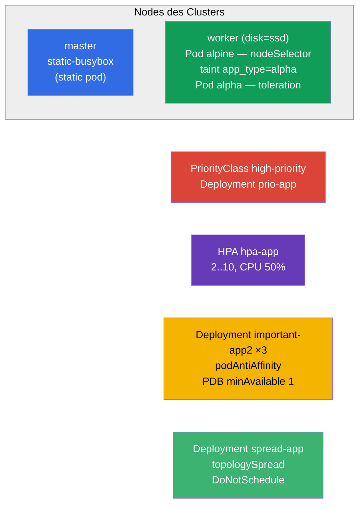

[Русская версия](README_RU.MD) · [Eng version](README.MD) · [Versión en español](README_ES.MD) · [Version française](README_FR.MD) · [ქართული ვერსია](README_GE.MD) · [繁體中文版](README_TW.MD) · [日本語版](README_JP.MD)

# Lab 104 — Scheduling: nodeSelector, Taints, Ressourcen, Static Pod, PriorityClass, HPA

## Beschreibung

Praxisübung zur Steuerung der Pod-Platzierung und der Ressourcen — ein großer Block der
Domäne Workloads & Scheduling. Du lernst, einen Pod auf einen bestimmten Node zu ziehen
(`nodeSelector`), mit Taints/Tolerations zu arbeiten, einen Static Pod auf der
Control-Plane zu erstellen, Prioritäten zu setzen (PriorityClass), Autoscaling zu
konfigurieren (HPA) und Replicas mit dem Schutz eines PodDisruptionBudget über die Nodes zu
verteilen. Der Cluster hat **zwei Nodes**: Master + Worker mit dem Label `disk=ssd`.

Alle Aufgaben sind im Prüfungsstil formuliert (wie echte CKA/CKAD-Fragen) mit automatischer
Prüfung über den Befehl `check_result`. Ein Teil der Objekte lässt sich bequemer per
Manifest erstellen (Vorlage über `kubectl ... --dry-run=client -o yaml`), ein Teil
imperativ (`kubectl taint/autoscale/create priorityclass`).

## Ziel

Den Stoff der Kurskapitel festigen:

- [Kapitel 12. Pod-Scheduling: Affinity](../../course/12/de.md) — `nodeSelector`, podAntiAffinity, topologySpread, harter/weicher Modus
- [Kapitel 13. Taints und Tolerations](../../course/13/de.md) — Pods von einem Node abstoßen und per Toleration durchlassen
- [Kapitel 14. Ressourcen: requests, limits, Quotas](../../course/14/de.md) — CPU-`requests` als Grundlage für HPA
- [Kapitel 15. Static Pods, PriorityClass](../../course/15/de.md) — Pod unter Verwaltung von kubelet, Verdrängungsprioritäten
- [Kapitel 16. Autoscaling: HPA](../../course/16/de.md) — Skalierung nach CPU-Last

## Was wir erstellen und warum

In diesem Lab üben wir das gesamte Arsenal der Steuerung darüber, **wo** und **wie** Pods
gestartet werden. Jedes Objekt erfüllt seine eigene Aufgabe:

| Objekt | Was das ist | Warum in diesem Lab |
|--------|-------------|---------------------|
| **Pod `alpine`** mit `nodeSelector` | Pod, per Label an einen Node gebunden | lernen, einen Pod auf den gewünschten Node zu setzen (`disk=ssd`) (Kapitel 12) |
| **Taint auf dem Node + Pod `alpha`** mit Toleration | Abstoßen + Durchlassen | den Mechanismus Taints/Tolerations üben (Kapitel 13) |
| **Static Pod `static-busybox`** | Pod unter Verwaltung von kubelet | einen Static Pod direkt auf der Control-Plane erstellen (Kapitel 15) |
| **PriorityClass `high-priority` + Deployment `prio-app`** | Priorität der Pods | eine Priorität definieren und anwenden (Kapitel 15) |
| **Deployment `hpa-app` + HPA** | Autoscaling | HPA nach CPU konfigurieren (Kapitel 14, 16) |
| **Deployment `important-app2` + PDB** (Namespace `app2-system`) | Verteilung der Replicas + Schutz | podAntiAffinity + PodDisruptionBudget (Kapitel 12) |
| **Deployment `spread-app`** | harte Verteilung | topologySpreadConstraints im Modus `DoNotSchedule` (Kapitel 12) |

Das Gesamtbild dessen, was ausgerollt wird:



## Infrastruktur

Die Umgebung wird in AWS (`eu-central-1`) über Terragrunt ausgerollt und besteht aus:

| Komponente | Beschreibung                                                         |
|------------|----------------------------------------------------------------------|
| `vpc`      | VPC `10.10.0.0/16` mit öffentlichen Subnetzen                        |
| `ssh-keys` | SSH-Schlüssel für den Zugriff auf die Nodes                          |
| `k8s-1`    | Kubernetes `1.35.2` (kubeadm), CNI Calico, metrics-server, **Master + Worker(`disk=ssd`)** |
| `worker`   | Arbeitsmaschine mit `kubectl`, Cluster-Zugriff und `check_result`    |

Instanzen: `t4g.medium`, Ubuntu `22.04`. Der Cluster hat **zwei Nodes** — Master
(Control-Plane) und einen Worker mit dem Label `disk=ssd`. metrics-server ist installiert
(für HPA erforderlich). Auf dem Master bleibt der Taint `control-plane` erhalten — für eine
Platzierung dort ist ein Toleration nötig.

## Bereitstellung

```bash
TASK=104 make run_cka_task
```

Verbinde dich nach dem Erstellen per SSH mit der Arbeitsmaschine (Worker) und erledige die
Aufgaben von dort. `kubectl` ist bereits auf den Kontext `cluster1-admin@cluster1`
eingestellt. Der Static Pod (Aufgabe 3) wird direkt auf der Control-Plane erstellt — dort
musst du dich separat per SSH einloggen.

Nützliche Befehle auf der Arbeitsmaschine:

```bash
time_left       # wie viel Zeit noch bleibt
check_result    # Lösung prüfen
```

## Aufgaben

---
|        **1**        | **Einen Pod per Label auf einen Node setzen**                |
| :-----------------: | :------------------------------------------------------------ |
| Was wir tun         | Erstelle einen Pod mit dem Namen `alpine`, Container-Image `alpine:3.15`, Befehl `sleep 6000`. Binde ihn über `nodeSelector` an den Node mit dem Label `disk=ssd`, damit er garantiert genau dort startet. |
| Abnahmekriterien    | - Pod `alpine`, Image `alpine:3.15`, Befehl `sleep 6000`;<br/>- der Pod läuft auf dem Node mit dem Label `disk=ssd`. |
---
|        **2**        | **Taint auf dem Node und Pod mit Toleration**                |
| :-----------------: | :------------------------------------------------------------ |
| Was wir tun         | Setze auf den Worker-Node den Taint `app_type=alpha:NoSchedule` (er stößt Pods ohne passendes Toleration ab). Erstelle einen Pod mit dem Namen `alpha`, Container-Image `redis`, und füge ihm ein Toleration für diesen Taint hinzu (key `app_type`, value `alpha`, effect `NoSchedule`). |
| Abnahmekriterien    | - Pod `alpha`, Image `redis`;<br/>- Toleration: key `app_type`, value `alpha`, effect `NoSchedule`. |
---
|        **3**        | **Einen Static Pod auf der Control-Plane erstellen**         |
| :-----------------: | :------------------------------------------------------------ |
| Was wir tun         | Melde dich per SSH auf der Control-Plane an und lege ein Pod-Manifest in das Verzeichnis `/etc/kubernetes/manifests/` — kubelet startet es von selbst (das ist ein Static Pod). Der Pod-Name ist `static-busybox`, Container-Image `viktoruj/ping_pong:alpine`, Label `pod-type=static-pod`. |
| Abnahmekriterien    | - Static Pod `static-busybox`, Image `viktoruj/ping_pong:alpine`;<br/>- Label `pod-type=static-pod`. |
---
|        **4**        | **Priorität definieren und anwenden**                        |
| :-----------------: | :------------------------------------------------------------ |
| Was wir tun         | Erstelle eine PriorityClass mit dem Namen `high-priority` und dem Wert `1000000`. Erstelle ein Deployment `prio-app` (Image `viktoruj/ping_pong:latest`) und weise seinen Pods diese Prioritätsklasse zu (`priorityClassName: high-priority`). |
| Abnahmekriterien    | - PriorityClass `high-priority`, value `1000000`;<br/>- Deployment `prio-app` verwendet `priorityClassName: high-priority`. |
---
|        **5**        | **Autoscaling konfigurieren (HPA)**                          |
| :-----------------: | :------------------------------------------------------------ |
| Was wir tun         | Erstelle ein Deployment `hpa-app` (Image `viktoruj/ping_pong:latest`) und setze zwingend CPU-`requests` für den Container (ohne sie kann HPA die Last nicht berechnen). Konfiguriere für dieses Deployment ein HPA: mindestens `2` Replicas, maximal `10`, Ziel-CPU-Last `50%`. |
| Abnahmekriterien    | - Deployment `hpa-app` existiert;<br/>- HPA `hpa-app`: min `2`, max `10`, target CPU `50%`. |
---
|        **6**        | **Replicas über die Nodes verteilen und per PDB schützen**   |
| :-----------------: | :------------------------------------------------------------ |
| Was wir tun         | Erstelle den Namespace `app2-system`. Rolle darin ein Deployment `important-app2` aus (Image `viktoruj/ping_pong:latest`, `3` Replicas) mit podAntiAffinity über `kubernetes.io/hostname`, damit sich die Replicas auf verschiedene Nodes verteilen. Erstelle ein PodDisruptionBudget `important-app2` mit `minAvailable: 1`, damit bei freiwilligen Evictions (drain) immer mindestens eine Replica am Leben bleibt. |
| Abnahmekriterien    | - Namespace `app2-system` existiert;<br/>- Deployment `important-app2`: Image `viktoruj/ping_pong:latest`, `3` Replicas, podAntiAffinity über `hostname`;<br/>- PDB `important-app2`: `minAvailable: 1`. |
---
|        **7**        | **Harte Verteilung über die Nodes (topologySpread)**         |
| :-----------------: | :------------------------------------------------------------ |
| Was wir tun         | Erstelle ein Deployment `spread-app` (Image `viktoruj/ping_pong:latest`) und setze `topologySpreadConstraints`, die die Replicas mit einer harten Regel gleichmäßig über die Nodes verteilen: `maxSkew: 1`, `topologyKey: kubernetes.io/hostname`, `whenUnsatisfiable: DoNotSchedule`. |
| Abnahmekriterien    | - Deployment `spread-app`, Image `viktoruj/ping_pong:latest`;<br/>- topologySpreadConstraints: `maxSkew: 1`, `topologyKey: kubernetes.io/hostname`, `whenUnsatisfiable: DoNotSchedule`. |
---

> **Hart vs weich (Kapitel 12).** In Aufgabe 7 wird der **harte** Modus `DoNotSchedule`
> verwendet: ein Pod, der die Gleichmäßigkeit verletzt, bleibt `Pending`. Die weiche
> Variante `ScheduleAnyway` (und `preferred` bei podAntiAffinity) würde den Pod dennoch
> platzieren und lediglich versuchen, den Schiefstand zu minimieren. Beide Modi werden in
> der Lösung besprochen.

## Ergebnisprüfung

Starte auf der Arbeitsmaschine die automatische Prüfung:

```bash
check_result
```

Das Skript führt die Tests aus und zeigt, wie viele Aufgaben erledigt sind.

## Lösung

Referenzlösung: [worker/files/solutions/1_DE.MD](worker/files/solutions/1_DE.MD)

## Abdeckung der Mock-Prüfungen

Das Lab deckt die Mock-Aufgaben zu Scheduling und Ressourcen ab: CKA mock 01 (Nr. 7 Static
Pod, Nr. 25 antiAffinity + PDB), CKA mock 02 (Nr. 4 nodeSelector `disk=ssd`, Nr. 19 Static
Pod), CKAD mock 01 (Nr. 9 Taint + Toleration, Nr. 10 Platzierung über Label/Affinity).

## Löschen von Cluster und Ressourcen

```bash
TASK=104 make delete_cka_task
```
