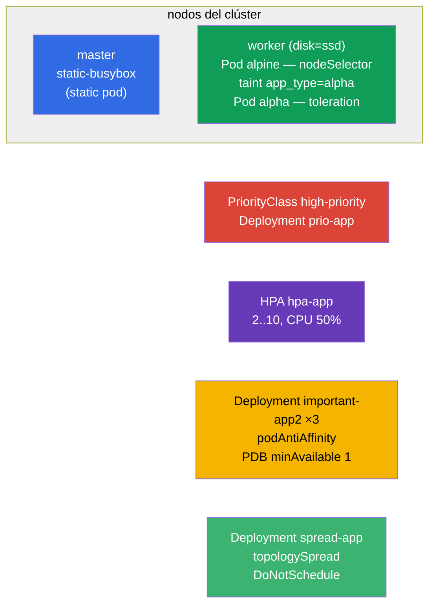

[Русская версия](README_RU.MD) · [Eng version](README.MD) · [Version française](README_FR.MD) · [Deutsche Version](README_DE.MD) · [ქართული ვერსია](README_GE.MD) · [繁體中文版](README_TW.MD) · [日本語版](README_JP.MD)

# Lab 104 — Planificación: nodeSelector, taints, recursos, static pod, PriorityClass, HPA

## Descripción

Práctica sobre la gestión de la ubicación de los Pods y de los recursos: un bloque grande del
dominio Workloads & Scheduling. Aprenderás a atraer un Pod hacia el nodo deseado
(`nodeSelector`), a trabajar con taints/tolerations, a crear un static pod en el
control-plane, a asignar prioridades (PriorityClass), a configurar el autoescalado (HPA) y a
repartir réplicas entre nodos con la protección de un PodDisruptionBudget. El clúster tiene
**dos nodos**: master + worker con la etiqueta `disk=ssd`.

Todas las tareas están redactadas en estilo de examen (como las preguntas reales de
CKA/CKAD) con verificación automática mediante el comando `check_result`. Algunos objetos
son más cómodos de montar con un manifiesto (plantilla mediante
`kubectl ... --dry-run=client -o yaml`) y otros de forma imperativa
(`kubectl taint/autoscale/create priorityclass`).

## Objetivo

Consolidar el material de los capítulos del curso:

- [Capítulo 12. Planificación de pods: affinity](../../course/12/es.md) — `nodeSelector`, podAntiAffinity, topologySpread, modo estricto/flexible
- [Capítulo 13. Taints y tolerations](../../course/13/es.md) — repeler Pods de un nodo y dejarlos pasar con un toleration
- [Capítulo 14. Recursos: requests, limits, cuotas](../../course/14/es.md) — `requests` de CPU como base para el HPA
- [Capítulo 15. Static Pods, PriorityClass](../../course/15/es.md) — Pod gestionado por kubelet, prioridades de desalojo
- [Capítulo 16. Autoescalado: HPA](../../course/16/es.md) — escalado según la carga de CPU

## Qué creamos y para qué

En este laboratorio practicamos todo el arsenal de control sobre **dónde** y **cómo** se
ejecutan los Pods. Cada objeto resuelve su propia tarea:

| Objeto | Qué es | Para qué está en este laboratorio |
|--------|--------|-----------------------------------|
| **Pod `alpine`** con `nodeSelector` | Pod ligado a un nodo por etiqueta | aprender a colocar un Pod en el nodo deseado (`disk=ssd`) (capítulo 12) |
| **taint en el nodo + Pod `alpha`** con toleration | repulsión + paso permitido | practicar el mecanismo de taints/tolerations (capítulo 13) |
| **Static pod `static-busybox`** | Pod gestionado por kubelet | crear un static pod directamente en el control-plane (capítulo 15) |
| **PriorityClass `high-priority` + Deployment `prio-app`** | prioridad de los Pods | definir y aplicar una prioridad (capítulo 15) |
| **Deployment `hpa-app` + HPA** | autoescalado | configurar el HPA por CPU (capítulos 14, 16) |
| **Deployment `important-app2` + PDB** (namespace `app2-system`) | reparto de réplicas + protección | podAntiAffinity + PodDisruptionBudget (capítulo 12) |
| **Deployment `spread-app`** | distribución estricta | topologySpreadConstraints en modo `DoNotSchedule` (capítulo 12) |

Panorama final de lo que quedará despliegado:



## Infraestructura

El entorno se despliega en AWS (`eu-central-1`) mediante Terragrunt y consta de:

| Componente | Descripción                                                          |
|------------|----------------------------------------------------------------------|
| `vpc`      | VPC `10.10.0.0/16` con subredes públicas                             |
| `ssh-keys` | Claves SSH para el acceso a los nodos                                |
| `k8s-1`    | Kubernetes `1.35.2` (kubeadm), CNI Calico, metrics-server, **master + worker(`disk=ssd`)** |
| `worker`   | Máquina de trabajo con `kubectl`, acceso al clúster y `check_result` |

Instancias: `t4g.medium`, Ubuntu `22.04`. El clúster tiene **dos nodos**: master
(control-plane) y un worker con la etiqueta `disk=ssd`. metrics-server está instalado (hace
falta para el HPA). En el master se conserva el taint `control-plane`: para colocar algo en
él se necesita un toleration.

## Despliegue

```bash
TASK=104 make run_cka_task
```

Tras la creación, conéctate por SSH a la máquina de trabajo (worker) y realiza las tareas
desde allí. `kubectl` ya está configurado con el contexto `cluster1-admin@cluster1`. El
static pod (tarea 3) se crea directamente en el control-plane: hay que entrar allí por SSH
por separado.

Comandos útiles en la máquina de trabajo:

```bash
time_left       # cuánto tiempo queda
check_result    # comprobar la solución
```

## Tareas

---
|        **1**        | **Colocar un Pod en un nodo por etiqueta**                   |
| :-----------------: | :------------------------------------------------------------ |
| Qué hacemos         | Crea un Pod llamado `alpine`, con la imagen de contenedor `alpine:3.15` y el comando `sleep 6000`. Mediante `nodeSelector` lígalo al nodo con la etiqueta `disk=ssd`, para que arranque garantizadamente en él. |
| Criterios de aceptación | - Pod `alpine`, imagen `alpine:3.15`, comando `sleep 6000`;<br/>- el Pod se ejecuta en el nodo con la etiqueta `disk=ssd`. |
---
|        **2**        | **Taint del nodo y Pod con toleration**                      |
| :-----------------: | :------------------------------------------------------------ |
| Qué hacemos         | Pon en el nodo worker el taint `app_type=alpha:NoSchedule` (repele los Pods sin un toleration adecuado). Crea un Pod llamado `alpha`, con la imagen de contenedor `redis`, y añádele un toleration para ese taint (key `app_type`, value `alpha`, effect `NoSchedule`). |
| Criterios de aceptación | - Pod `alpha`, imagen `redis`;<br/>- toleration: key `app_type`, value `alpha`, effect `NoSchedule`. |
---
|        **3**        | **Crear un static pod en el control-plane**                  |
| :-----------------: | :------------------------------------------------------------ |
| Qué hacemos         | Entra por SSH en el control-plane y coloca un manifiesto de Pod en el directorio `/etc/kubernetes/manifests/`: kubelet lo levantará por sí mismo (es un static pod). El nombre del Pod es `static-busybox`, la imagen de contenedor `viktoruj/ping_pong:alpine`, la etiqueta `pod-type=static-pod`. |
| Criterios de aceptación | - static pod `static-busybox`, imagen `viktoruj/ping_pong:alpine`;<br/>- etiqueta `pod-type=static-pod`. |
---
|        **4**        | **Definir y aplicar una prioridad**                          |
| :-----------------: | :------------------------------------------------------------ |
| Qué hacemos         | Crea un PriorityClass llamado `high-priority` con el valor `1000000`. Crea un Deployment `prio-app` (imagen `viktoruj/ping_pong:latest`) y asigna a sus Pods esa clase de prioridad (`priorityClassName: high-priority`). |
| Criterios de aceptación | - PriorityClass `high-priority`, value `1000000`;<br/>- el Deployment `prio-app` usa `priorityClassName: high-priority`. |
---
|        **5**        | **Configurar el autoescalado (HPA)**                         |
| :-----------------: | :------------------------------------------------------------ |
| Qué hacemos         | Crea un Deployment `hpa-app` (imagen `viktoruj/ping_pong:latest`) y define obligatoriamente los `requests` de CPU del contenedor (sin ellos el HPA no puede calcular la carga). Configura un HPA para ese Deployment: mínimo `2` réplicas, máximo `10`, carga de CPU objetivo `50%`. |
| Criterios de aceptación | - el Deployment `hpa-app` existe;<br/>- HPA `hpa-app`: min `2`, max `10`, target CPU `50%`. |
---
|        **6**        | **Repartir réplicas entre nodos y protegerlas con un PDB**   |
| :-----------------: | :------------------------------------------------------------ |
| Qué hacemos         | Crea el namespace `app2-system`. Despliega en él un Deployment `important-app2` (imagen `viktoruj/ping_pong:latest`, `3` réplicas) con podAntiAffinity por `kubernetes.io/hostname`, para que las réplicas se separen en nodos distintos. Crea un PodDisruptionBudget `important-app2` con `minAvailable: 1`, para que en los desalojos voluntarios (drain) siempre quede al menos una réplica viva. |
| Criterios de aceptación | - el namespace `app2-system` existe;<br/>- Deployment `important-app2`: imagen `viktoruj/ping_pong:latest`, `3` réplicas, podAntiAffinity por `hostname`;<br/>- PDB `important-app2`: `minAvailable: 1`. |
---
|        **7**        | **Distribución estricta entre nodos (topologySpread)**       |
| :-----------------: | :------------------------------------------------------------ |
| Qué hacemos         | Crea un Deployment `spread-app` (imagen `viktoruj/ping_pong:latest`) y define unos `topologySpreadConstraints` que reparten las réplicas de forma uniforme entre los nodos con una regla estricta: `maxSkew: 1`, `topologyKey: kubernetes.io/hostname`, `whenUnsatisfiable: DoNotSchedule`. |
| Criterios de aceptación | - Deployment `spread-app`, imagen `viktoruj/ping_pong:latest`;<br/>- topologySpreadConstraints: `maxSkew: 1`, `topologyKey: kubernetes.io/hostname`, `whenUnsatisfiable: DoNotSchedule`. |
---

> **Estricto vs flexible (capítulo 12).** En la tarea 7 se usa el modo **estricto**
> `DoNotSchedule`: el Pod que rompe la uniformidad se queda en `Pending`. La variante
> flexible `ScheduleAnyway` (y `preferred` en podAntiAffinity) colocaría el Pod de todos
> modos, limitándose a intentar minimizar el desequilibrio. El análisis de ambos modos está
> en la solución.

## Comprobación del resultado

En la máquina de trabajo lanza la verificación automática:

```bash
check_result
```

El script ejecuta los tests y muestra cuántas tareas están completadas.

## Solución

Solución de referencia: [worker/files/solutions/1_ES.MD](worker/files/solutions/1_ES.MD)

## Cobertura de exámenes simulados

El laboratorio cubre las tareas de los simulados sobre planificación y recursos: CKA mock 01
(n.º 7 static pod, n.º 25 antiAffinity + PDB), CKA mock 02 (n.º 4 nodeSelector `disk=ssd`,
n.º 19 static pod), CKAD mock 01 (n.º 9 taint + toleration, n.º 10 ubicación mediante
label/affinity).

## Eliminación del clúster y los recursos

```bash
TASK=104 make delete_cka_task
```
