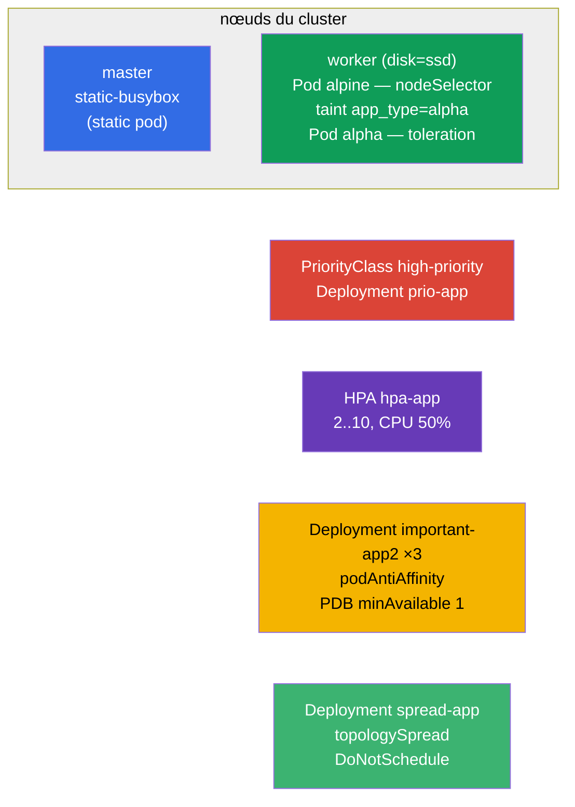

[Русская версия](README_RU.MD) · [Eng version](README.MD) · [Versión en español](README_ES.MD) · [Deutsche Version](README_DE.MD) · [ქართული ვერსია](README_GE.MD)

# Lab 104 — Planification : nodeSelector, taints, ressources, static pod, PriorityClass, HPA

## Description

Travail pratique sur la gestion du placement des Pods et des ressources — un gros bloc du
domaine Workloads & Scheduling. Vous apprendrez à attirer un Pod vers le nœud voulu
(`nodeSelector`), à travailler avec les taints/tolerations, à créer un static pod sur le
control-plane, à définir des priorités (PriorityClass), à configurer l'autoscaling (HPA) et à
répartir les réplicas entre les nœuds avec la protection d'un PodDisruptionBudget. Le cluster
compte **deux nœuds** : master + worker avec le label `disk=ssd`.

Toutes les tâches sont rédigées dans le style de l'examen (comme les vraies questions
CKA/CKAD) avec une vérification automatique via la commande `check_result`. Certains objets
sont plus commodes à écrire dans un manifeste (canevas via
`kubectl ... --dry-run=client -o yaml`), d'autres en impératif
(`kubectl taint/autoscale/create priorityclass`).

## Objectif

Consolider le contenu des chapitres du cours :

- [Chapitre 12. Planification des pods : affinity](../../course/12/ru.md) — `nodeSelector`, podAntiAffinity, topologySpread, mode strict/souple
- [Chapitre 13. Taints et tolerations](../../course/13/ru.md) — repousser les Pods d'un nœud et les laisser passer via un toleration
- [Chapitre 14. Ressources : requests, limits, quotas](../../course/14/ru.md) — les `requests` CPU comme base du HPA
- [Chapitre 15. Static Pods, PriorityClass](../../course/15/ru.md) — Pod géré par kubelet, priorités d'éviction
- [Chapitre 16. Autoscaling : HPA](../../course/16/ru.md) — mise à l'échelle selon la charge CPU

## Ce que nous créons et pourquoi

Dans ce lab, nous travaillons tout l'arsenal du contrôle sur **où** et **comment** les Pods
sont lancés. Chaque objet a son propre rôle :

| Objet | Ce que c'est | Pourquoi dans ce lab |
|-------|--------------|----------------------|
| **Pod `alpine`** avec `nodeSelector` | Pod rattaché à un nœud par label | apprendre à poser un Pod sur le nœud voulu (`disk=ssd`) (chapitre 12) |
| **taint sur le nœud + Pod `alpha`** avec toleration | répulsion + passage autorisé | travailler le mécanisme taints/tolerations (chapitre 13) |
| **Static pod `static-busybox`** | Pod géré par kubelet | créer un static pod directement sur le control-plane (chapitre 15) |
| **PriorityClass `high-priority` + Deployment `prio-app`** | priorité des Pods | définir et appliquer une priorité (chapitre 15) |
| **Deployment `hpa-app` + HPA** | autoscaling | configurer le HPA sur le CPU (chapitres 14, 16) |
| **Deployment `important-app2` + PDB** (namespace `app2-system`) | répartition des réplicas + protection | podAntiAffinity + PodDisruptionBudget (chapitre 12) |
| **Deployment `spread-app`** | distribution stricte | topologySpreadConstraints en mode `DoNotSchedule` (chapitre 12) |

Vue d'ensemble de ce qui sera déployé :



## Infrastructure

L'environnement est déployé dans AWS (`eu-central-1`) via Terragrunt et se compose de :

| Composant  | Description                                                          |
|------------|----------------------------------------------------------------------|
| `vpc`      | VPC `10.10.0.0/16` avec des sous-réseaux publics                     |
| `ssh-keys` | Clés SSH pour l'accès aux nœuds                                      |
| `k8s-1`    | Kubernetes `1.35.2` (kubeadm), CNI Calico, metrics-server, **master + worker(`disk=ssd`)** |
| `worker`   | Machine de travail avec `kubectl`, accès au cluster et `check_result` |

Instances : `t3.medium`, Ubuntu `22.04`. Le cluster compte **deux nœuds** — le master
(control-plane) et un worker avec le label `disk=ssd`. metrics-server est installé
(nécessaire pour le HPA). Le taint `control-plane` est conservé sur le master — pour y
placer quelque chose, il faut un toleration.

## Déploiement

```bash
TASK=104 make run_cka_task
```

Après la création, connectez-vous en SSH à la machine de travail (worker) et effectuez les
tâches depuis celle-ci. `kubectl` est déjà configuré sur le contexte
`cluster1-admin@cluster1`. Le static pod (tâche 3) est créé directement sur le
control-plane — il faut s'y connecter en SSH séparément.

Commandes utiles sur la machine de travail :

```bash
time_left       # combien de temps il reste
check_result    # vérifier la solution
```

## Tâches

---
|        **1**        | **Poser un Pod sur un nœud par label**                       |
| :-----------------: | :------------------------------------------------------------ |
| Ce qu'on fait       | Créez un Pod nommé `alpine`, image du conteneur `alpine:3.15`, commande `sleep 6000`. Via `nodeSelector`, rattachez-le au nœud portant le label `disk=ssd`, afin qu'il démarre à coup sûr dessus. |
| Critères d'acceptation | - Pod `alpine`, image `alpine:3.15`, commande `sleep 6000` ;<br/>- le Pod tourne sur le nœud portant le label `disk=ssd`. |
---
|        **2**        | **Taint du nœud et Pod avec toleration**                     |
| :-----------------: | :------------------------------------------------------------ |
| Ce qu'on fait       | Posez sur le nœud worker le taint `app_type=alpha:NoSchedule` (il repousse les Pods sans toleration adéquat). Créez un Pod nommé `alpha`, image du conteneur `redis`, et ajoutez-lui un toleration pour ce taint (key `app_type`, value `alpha`, effect `NoSchedule`). |
| Critères d'acceptation | - Pod `alpha`, image `redis` ;<br/>- toleration : key `app_type`, value `alpha`, effect `NoSchedule`. |
---
|        **3**        | **Créer un static pod sur le control-plane**                 |
| :-----------------: | :------------------------------------------------------------ |
| Ce qu'on fait       | Connectez-vous en SSH au control-plane et déposez un manifeste de Pod dans le répertoire `/etc/kubernetes/manifests/` — kubelet le démarrera de lui-même (c'est un static pod). Le nom du Pod est `static-busybox`, l'image du conteneur `viktoruj/ping_pong:alpine`, le label `pod-type=static-pod`. |
| Critères d'acceptation | - static pod `static-busybox`, image `viktoruj/ping_pong:alpine` ;<br/>- label `pod-type=static-pod`. |
---
|        **4**        | **Définir et appliquer une priorité**                        |
| :-----------------: | :------------------------------------------------------------ |
| Ce qu'on fait       | Créez un PriorityClass nommé `high-priority` avec la valeur `1000000`. Créez un Deployment `prio-app` (image `viktoruj/ping_pong:latest`) et affectez cette classe de priorité à ses Pods (`priorityClassName: high-priority`). |
| Critères d'acceptation | - PriorityClass `high-priority`, value `1000000` ;<br/>- le Deployment `prio-app` utilise `priorityClassName: high-priority`. |
---
|        **5**        | **Configurer l'autoscaling (HPA)**                           |
| :-----------------: | :------------------------------------------------------------ |
| Ce qu'on fait       | Créez un Deployment `hpa-app` (image `viktoruj/ping_pong:latest`) et définissez impérativement les `requests` CPU du conteneur (sans elles, le HPA ne peut pas calculer la charge). Configurez un HPA pour ce Deployment : minimum `2` réplicas, maximum `10`, charge CPU cible `50%`. |
| Critères d'acceptation | - le Deployment `hpa-app` existe ;<br/>- HPA `hpa-app` : min `2`, max `10`, target CPU `50%`. |
---
|        **6**        | **Répartir les réplicas entre les nœuds et les protéger par un PDB** |
| :-----------------: | :------------------------------------------------------------ |
| Ce qu'on fait       | Créez le namespace `app2-system`. Déployez-y un Deployment `important-app2` (image `viktoruj/ping_pong:latest`, `3` réplicas) avec un podAntiAffinity sur `kubernetes.io/hostname`, afin que les réplicas se répartissent sur des nœuds différents. Créez un PodDisruptionBudget `important-app2` avec `minAvailable: 1`, pour qu'au moins une réplique reste toujours vivante lors des évictions volontaires (drain). |
| Critères d'acceptation | - le namespace `app2-system` existe ;<br/>- Deployment `important-app2` : image `viktoruj/ping_pong:latest`, `3` réplicas, podAntiAffinity sur `hostname` ;<br/>- PDB `important-app2` : `minAvailable: 1`. |
---
|        **7**        | **Distribution stricte entre les nœuds (topologySpread)**    |
| :-----------------: | :------------------------------------------------------------ |
| Ce qu'on fait       | Créez un Deployment `spread-app` (image `viktoruj/ping_pong:latest`) et définissez des `topologySpreadConstraints` qui répartissent les réplicas de façon égale entre les nœuds avec une règle stricte : `maxSkew: 1`, `topologyKey: kubernetes.io/hostname`, `whenUnsatisfiable: DoNotSchedule`. |
| Critères d'acceptation | - Deployment `spread-app`, image `viktoruj/ping_pong:latest` ;<br/>- topologySpreadConstraints : `maxSkew: 1`, `topologyKey: kubernetes.io/hostname`, `whenUnsatisfiable: DoNotSchedule`. |
---

> **Strict vs souple (chapitre 12).** La tâche 7 utilise le mode **strict**
> `DoNotSchedule` : un Pod qui rompt l'équilibre restera `Pending`. La variante souple
> `ScheduleAnyway` (et `preferred` pour podAntiAffinity) placerait le Pod quand même, en se
> contentant de minimiser l'écart. L'analyse des deux modes est dans la solution.

## Vérification du résultat

Sur la machine de travail, lancez la vérification automatique :

```bash
check_result
```

Le script exécute les tests et affiche le nombre de tâches réussies.

## Solution

Solution de référence : [worker/files/solutions/1_FR.MD](worker/files/solutions/1_FR.MD)

## Couverture des examens blancs

Le lab couvre les tâches des examens blancs sur la planification et les ressources : CKA
mock 01 (n° 7 static pod, n° 25 antiAffinity + PDB), CKA mock 02 (n° 4 nodeSelector
`disk=ssd`, n° 19 static pod), CKAD mock 01 (n° 9 taint + toleration, n° 10 placement via
label/affinity).

## Suppression du cluster et des ressources

```bash
TASK=104 make delete_cka_task
```
