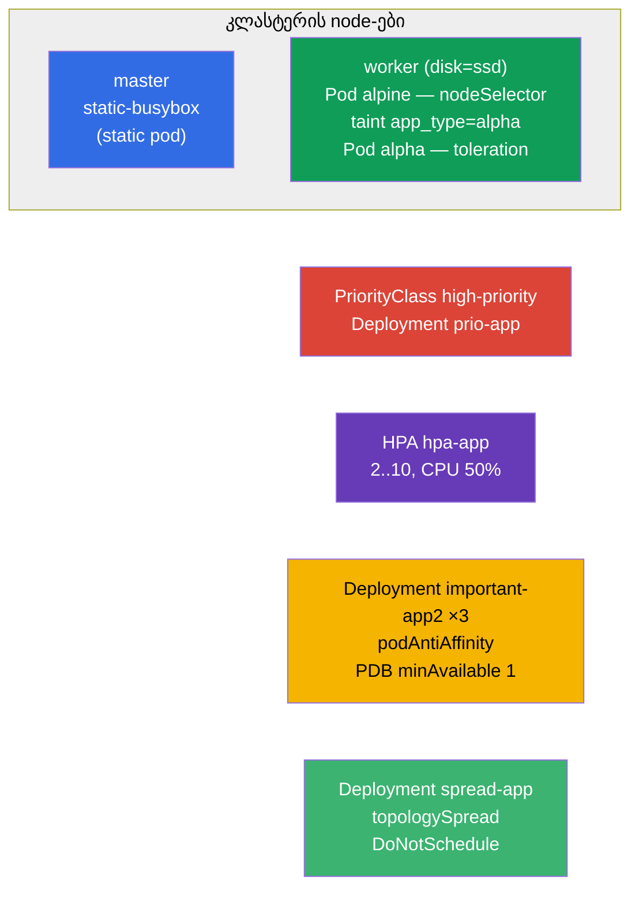

[Русская версия](README_RU.MD) · [Eng version](README.MD) · [Versión en español](README_ES.MD) · [Version française](README_FR.MD) · [Deutsche Version](README_DE.MD) · [繁體中文版](README_TW.MD) · [日本語版](README_JP.MD)

# Lab 104 — დაგეგმვა: nodeSelector, taint-ები, რესურსები, static pod, PriorityClass, HPA

## აღწერა

პრაქტიკული სამუშაო Pod-ების განთავსებისა და რესურსების მართვაზე — Workloads & Scheduling
დომენის დიდი ბლოკი. თქვენ ისწავლით Pod-ის საჭირო node-ზე მიბმას (`nodeSelector`),
taint-ებთან/toleration-ებთან მუშაობას, static pod-ის შექმნას control-plane-ზე,
პრიორიტეტების მითითებას (PriorityClass), ავტომასშტაბირების კონფიგურაციას (HPA) და
რეპლიკების node-ებზე გადანაწილებას PodDisruptionBudget-ის დაცვით. კლასტერი
**ორკვანძიანია**: master + worker ლეიბლით `disk=ssd`.

ყველა დავალება გამოცდის სტილშია გაფორმებული (როგორც რეალური CKA/CKAD კითხვები) და მათი
შემოწმება ავტომატურად ხდება ბრძანებით `check_result`. ობიექტების ნაწილი უფრო მოსახერხებელია
მანიფესტით ავაწყოთ (ნიმუში `kubectl ... --dry-run=client -o yaml`-ით), ნაწილი კი —
იმპერატიულად (`kubectl taint/autoscale/create priorityclass`).

## მიზანი

განამტკიცოთ კურსის თავების მასალა:

- [თავი 12. Pod-ების დაგეგმვა: affinity](../../course/12/ge.md) — `nodeSelector`, podAntiAffinity, topologySpread, მკაცრი/რბილი რეჟიმი
- [თავი 13. Taint-ები და toleration-ები](../../course/13/ge.md) — Pod-ების node-იდან მოგერიება და გატარება toleration-ით
- [თავი 14. რესურსები: requests, limits, კვოტები](../../course/14/ge.md) — CPU-ს `requests` როგორც HPA-ს საფუძველი
- [თავი 15. Static Pod-ები, PriorityClass](../../course/15/ge.md) — kubelet-ის მართვის ქვეშ მყოფი Pod, ჩანაცვლების პრიორიტეტები
- [თავი 16. ავტომასშტაბირება: HPA](../../course/16/ge.md) — მასშტაბირება CPU-ს დატვირთვის მიხედვით

## რას ვქმნით და რისთვის

ამ ლაბორატორიაში ვამუშავებთ მართვის სრულ არსენალს იმისთვის, **სად** და **როგორ** ეშვება
Pod-ები. თითოეული ობიექტი თავის ამოცანას ასრულებს:

| ობიექტი | რა არის ეს | რისთვის არის ამ ლაბორატორიაში |
|---------|------------|-------------------------------|
| **Pod `alpine`** `nodeSelector`-ით | Pod, ლეიბლით node-ზე მიბმული | ვსწავლობთ Pod-ის საჭირო node-ზე დასმას (`disk=ssd`) (თავი 12) |
| **taint node-ზე + Pod `alpha`** toleration-ით | მოგერიება + გატარება | ვამუშავებთ taint-ების/toleration-ების მექანიზმს (თავი 13) |
| **Static pod `static-busybox`** | kubelet-ის მართვის ქვეშ მყოფი Pod | ვქმნით static pod-ს პირდაპირ control-plane-ზე (თავი 15) |
| **PriorityClass `high-priority` + Deployment `prio-app`** | Pod-ების პრიორიტეტი | განვსაზღვრავთ და გამოვიყენებთ პრიორიტეტს (თავი 15) |
| **Deployment `hpa-app` + HPA** | ავტომასშტაბირება | ვაკონფიგურირებთ HPA-ს CPU-ს მიხედვით (თავები 14, 16) |
| **Deployment `important-app2` + PDB** (namespace `app2-system`) | რეპლიკების გადანაწილება + დაცვა | podAntiAffinity + PodDisruptionBudget (თავი 12) |
| **Deployment `spread-app`** | მკაცრი განაწილება | topologySpreadConstraints რეჟიმში `DoNotSchedule` (თავი 12) |

საბოლოო სურათი იმისა, რაც განთავსდება:



## ინფრასტრუქტურა

გარემო იშლება AWS-ში (`eu-central-1`) Terragrunt-ის მეშვეობით და შედგება:

| კომპონენტი | აღწერა                                                            |
|------------|-------------------------------------------------------------------|
| `vpc`      | VPC `10.10.0.0/16` საჯარო ქვექსელებით                             |
| `ssh-keys` | SSH-გასაღებები node-ებზე წვდომისთვის                              |
| `k8s-1`    | Kubernetes `1.35.2` (kubeadm), CNI Calico, metrics-server, **master + worker(`disk=ssd`)** |
| `worker`   | სამუშაო მანქანა `kubectl`-ით, კლასტერზე წვდომით და `check_result`-ით |

ინსტანსები: `t4g.medium`, Ubuntu `22.04`. კლასტერი **ორკვანძიანია** — master (control-plane)
და ერთი worker ლეიბლით `disk=ssd`. metrics-server დაყენებულია (საჭიროა HPA-სთვის). master-ზე
შენარჩუნებულია taint `control-plane` — მასზე განთავსებისთვის საჭიროა toleration.

## განთავსება

```bash
TASK=104 make run_cka_task
```

შექმნის შემდეგ დაუკავშირდით სამუშაო მანქანას (worker) SSH-ით და დავალებები შეასრულეთ
იქიდან. `kubectl` უკვე კონფიგურირებულია კონტექსტზე `cluster1-admin@cluster1`. Static pod
(დავალება 3) იქმნება პირდაპირ control-plane-ზე — იქ ცალკე უნდა შეხვიდეთ SSH-ით.

სასარგებლო ბრძანებები სამუშაო მანქანაზე:

```bash
time_left       # რამდენი დრო დარჩა
check_result    # ამოხსნის შემოწმება
```

## დავალებები

---
|        **1**        | **Pod-ის დასმა node-ზე ლეიბლის მიხედვით**                     |
| :-----------------: | :------------------------------------------------------------ |
| რას ვაკეთებთ        | შექმენით Pod სახელით `alpine`, კონტეინერის image `alpine:3.15`, ბრძანება `sleep 6000`. `nodeSelector`-ით მიაბით ის node-ს ლეიბლით `disk=ssd`, რომ გარანტირებულად სწორედ მასზე გაეშვას. |
| მიღების კრიტერიუმები | - Pod `alpine`, image `alpine:3.15`, ბრძანება `sleep 6000`;<br/>- Pod მუშაობს node-ზე ლეიბლით `disk=ssd`. |
---
|        **2**        | **node-ის taint და Pod toleration-ით**                        |
| :-----------------: | :------------------------------------------------------------ |
| რას ვაკეთებთ        | დაადეთ worker-node-ს taint `app_type=alpha:NoSchedule` (ის აგერიებს Pod-ებს შესაბამისი toleration-ის გარეშე). შექმენით Pod სახელით `alpha`, კონტეინერის image `redis`, და დაამატეთ მას toleration ამ taint-ზე (key `app_type`, value `alpha`, effect `NoSchedule`). |
| მიღების კრიტერიუმები | - Pod `alpha`, image `redis`;<br/>- toleration: key `app_type`, value `alpha`, effect `NoSchedule`. |
---
|        **3**        | **static pod-ის შექმნა control-plane-ზე**                     |
| :-----------------: | :------------------------------------------------------------ |
| რას ვაკეთებთ        | შედით SSH-ით control-plane-ზე და მოათავსეთ Pod-ის მანიფესტი კატალოგში `/etc/kubernetes/manifests/` — kubelet თავად აწევს მას (ეს static pod-ია). Pod-ის სახელი — `static-busybox`, კონტეინერის image `viktoruj/ping_pong:alpine`, ლეიბლი `pod-type=static-pod`. |
| მიღების კრიტერიუმები | - static pod `static-busybox`, image `viktoruj/ping_pong:alpine`;<br/>- ლეიბლი `pod-type=static-pod`. |
---
|        **4**        | **პრიორიტეტის განსაზღვრა და გამოყენება**                      |
| :-----------------: | :------------------------------------------------------------ |
| რას ვაკეთებთ        | შექმენით PriorityClass სახელით `high-priority` და მნიშვნელობით `1000000`. შექმენით Deployment `prio-app` (image `viktoruj/ping_pong:latest`) და მიანიჭეთ მის Pod-ებს ეს პრიორიტეტის კლასი (`priorityClassName: high-priority`). |
| მიღების კრიტერიუმები | - PriorityClass `high-priority`, value `1000000`;<br/>- Deployment `prio-app` იყენებს `priorityClassName: high-priority`. |
---
|        **5**        | **ავტომასშტაბირების კონფიგურაცია (HPA)**                      |
| :-----------------: | :------------------------------------------------------------ |
| რას ვაკეთებთ        | შექმენით Deployment `hpa-app` (image `viktoruj/ping_pong:latest`) და აუცილებლად მიუთითეთ კონტეინერს CPU-ს `requests` (მათ გარეშე HPA ვერ დაითვლის დატვირთვას). დააკონფიგურირეთ HPA ამ Deployment-ისთვის: მინიმუმ `2` რეპლიკა, მაქსიმუმ `10`, CPU-ს სამიზნე დატვირთვა `50%`. |
| მიღების კრიტერიუმები | - Deployment `hpa-app` არსებობს;<br/>- HPA `hpa-app`: min `2`, max `10`, target CPU `50%`. |
---
|        **6**        | **რეპლიკების გადანაწილება node-ებზე და დაცვა PDB-ით**          |
| :-----------------: | :------------------------------------------------------------ |
| რას ვაკეთებთ        | შექმენით namespace `app2-system`. განათავსეთ მასში Deployment `important-app2` (image `viktoruj/ping_pong:latest`, `3` რეპლიკა) podAntiAffinity-ით `kubernetes.io/hostname`-ის მიხედვით, რომ რეპლიკები სხვადასხვა node-ზე გადანაწილდნენ. შექმენით PodDisruptionBudget `important-app2` `minAvailable: 1`-ით, რომ ნებაყოფლობითი გამოსახლების (drain) დროს სულ მცირე ერთი რეპლიკა ყოველთვის ცოცხალი დარჩეს. |
| მიღების კრიტერიუმები | - namespace `app2-system` არსებობს;<br/>- Deployment `important-app2`: image `viktoruj/ping_pong:latest`, `3` რეპლიკა, podAntiAffinity `hostname`-ის მიხედვით;<br/>- PDB `important-app2`: `minAvailable: 1`. |
---
|        **7**        | **მკაცრი განაწილება node-ებზე (topologySpread)**              |
| :-----------------: | :------------------------------------------------------------ |
| რას ვაკეთებთ        | შექმენით Deployment `spread-app` (image `viktoruj/ping_pong:latest`) და მიუთითეთ `topologySpreadConstraints`, რომელიც რეპლიკებს თანაბრად ანაწილებს node-ებზე მკაცრი წესით: `maxSkew: 1`, `topologyKey: kubernetes.io/hostname`, `whenUnsatisfiable: DoNotSchedule`. |
| მიღების კრიტერიუმები | - Deployment `spread-app`, image `viktoruj/ping_pong:latest`;<br/>- topologySpreadConstraints: `maxSkew: 1`, `topologyKey: kubernetes.io/hostname`, `whenUnsatisfiable: DoNotSchedule`. |
---

> **მკაცრი vs რბილი (თავი 12).** დავალება 7-ში გამოიყენება **მკაცრი** რეჟიმი
> `DoNotSchedule`: Pod, რომელიც თანაბრობას არღვევს, დარჩება `Pending` მდგომარეობაში. რბილი
> ვარიანტი `ScheduleAnyway` (და `preferred` podAntiAffinity-სთან) მაინც განათავსებდა Pod-ს,
> უბრალოდ შეეცდებოდა გადახრის მინიმიზაციას. ორივე რეჟიმის განხილვა — ამოხსნაშია.

## შედეგის შემოწმება

სამუშაო მანქანაზე გაუშვით ავტომატური შემოწმება:

```bash
check_result
```

სკრიპტი გაატარებს ტესტებს და აჩვენებს, რამდენი დავალებაა შესრულებული.

## ამოხსნა

ეტალონური ამოხსნა: [worker/files/solutions/1_GE.MD](worker/files/solutions/1_GE.MD)

## Mock-გამოცდების დაფარვა

ლაბორატორია ფარავს mock-ების დავალებებს დაგეგმვასა და რესურსებზე: CKA mock 01 (№7 static
pod, №25 antiAffinity + PDB), CKA mock 02 (№4 nodeSelector `disk=ssd`, №19 static pod),
CKAD mock 01 (№9 taint + toleration, №10 განთავსება label/affinity-ით).

## კლასტერისა და რესურსების წაშლა

```bash
TASK=104 make delete_cka_task
```
