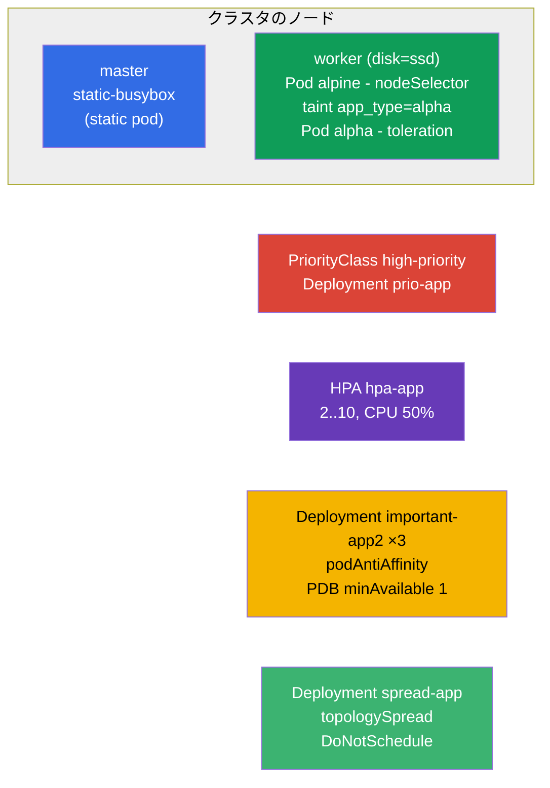

[Русская версия](README_RU.MD) · [Eng version](README.MD) · [Versión en español](README_ES.MD) · [Version française](README_FR.MD) · [Deutsche Version](README_DE.MD) · [ქართული ვერსია](README_GE.MD) · [繁體中文版](README_TW.MD)

# Lab 104 - スケジューリング: nodeSelector、taints、リソース、static pod、PriorityClass、HPA

## 概要

Pods の配置とリソースの管理に関する実習で、Workloads & Scheduling ドメインの
大きなブロックです。Pod を目的のノードに引き寄せる方法（`nodeSelector`）、
taints/tolerations の扱い、control-plane 上での static pod の作成、優先度の設定
（PriorityClass）、オートスケーリングの設定（HPA）、そしてレプリカをノードに分散させて
PodDisruptionBudget で保護する方法を学びます。クラスタは **2 ノード構成**: master + label `disk=ssd` を持つ worker。

すべての課題は試験形式（実際の CKA/CKAD の問題のように）で書かれており、
`check_result` コマンドで自動的に検証されます。一部のオブジェクトはマニフェストで
組み立てるほうが楽です（`kubectl ... --dry-run=client -o yaml` でひな形を生成）。
別の一部は命令的に作ります（`kubectl taint/autoscale/create priorityclass`）。

## 目的

以下の講座の章の内容を定着させます:

- [第 12 章. Pod のスケジューリング: affinity](../../course/12/README.md) - `nodeSelector`、podAntiAffinity、topologySpread、厳格/緩やかなモード
- [第 13 章. Taints と tolerations](../../course/13/README.md) - Pods をノードから押しのけ、toleration で通す
- [第 14 章. リソース: requests、limits、クォータ](../../course/14/README.md) - CPU の `requests` は HPA の土台
- [第 15 章. Static Pods、PriorityClass](../../course/15/README.md) - kubelet が管理する Pod、退避の優先度
- [第 16 章. オートスケーリング: HPA](../../course/16/README.md) - CPU 負荷に応じたスケーリング

## 何を作り、なぜ作るのか

このラボでは、Pods が **どこで** そして **どのように** 起動するかを制御する道具立てを
すべて練習します。各オブジェクトにはそれぞれの役割があります:

| オブジェクト | これは何か | このラボで扱う理由 |
|--------|---------|-------------------|
| `nodeSelector` 付きの **Pod `alpine`** | label でノードに束縛された Pod | Pod を目的のノードに置くことを学ぶ（`disk=ssd`）（第 12 章） |
| **ノードの taint + toleration 付きの Pod `alpha`** | 押しのけ + 通過 | taints/tolerations の仕組みを練習する（第 13 章） |
| **Static pod `static-busybox`** | kubelet が管理する Pod | control-plane 上で直接 static pod を作る（第 15 章） |
| **PriorityClass `high-priority` + Deployment `prio-app`** | Pods の優先度 | 優先度を定義して適用する（第 15 章） |
| **Deployment `hpa-app` + HPA** | オートスケーリング | CPU に基づいて HPA を設定する（第 14、16 章） |
| **Deployment `important-app2` + PDB**（namespace `app2-system`） | レプリカの分散 + 保護 | podAntiAffinity + PodDisruptionBudget（第 12 章） |
| **Deployment `spread-app`** | 厳格な分布 | `DoNotSchedule` モードでの topologySpreadConstraints（第 12 章） |

最終的にデプロイされる全体像:



## インフラ

環境は Terragrunt を使って AWS（`eu-central-1`）にデプロイされ、次の要素で構成されます:

| コンポーネント | 説明                                                            |
|------------|----------------------------------------------------------------------|
| `vpc`      | パブリックサブネットを持つ VPC `10.10.0.0/16`                          |
| `ssh-keys` | ノードへアクセスするための SSH キー                                    |
| `k8s-1`    | Kubernetes `1.35.2`（kubeadm）、CNI Calico、metrics-server、**master + worker(`disk=ssd`)** |
| `worker`   | `kubectl`、クラスタへのアクセス、`check_result` を備えた作業マシン        |

インスタンス: `t4g.medium` Ubuntu `22.04`。クラスタは **2 ノード構成** - master（control-plane）と
label `disk=ssd` を持つ worker が 1 台です。metrics-server はインストール済み（HPA に必要）。master には
`control-plane` taint が残されています - そこに配置するには toleration が必要です。

## デプロイ

```bash
TASK=104 make run_cka_task
```

作成後は作業マシン（worker）に SSH で接続し、そこから課題を進めてください。
`kubectl` は `cluster1-admin@cluster1` context を指すように設定済みです。Static pod
（課題 3）は control-plane 上で直接作成します - そこへは別に SSH で入る必要があります。

作業マシンで使える便利なコマンド:

```bash
time_left       # 残り時間
check_result    # 解答をチェックする
```

## 課題

---
|        **1**        | **label に基づいて Pod をノードに置く**                        |
| :-----------------: | :------------------------------------------------------------ |
| やること            | `alpine` という名前の Pod を作成してください。コンテナイメージは `alpine:3.15`、コマンドは `sleep 6000`。`nodeSelector` で label `disk=ssd` を持つノードに束縛し、確実にそのノード上で起動するようにします。 |
| 受け入れ基準        | - Pod `alpine`、イメージ `alpine:3.15`、コマンド `sleep 6000`;<br/>- Pod は label `disk=ssd` を持つノード上で動作している。 |
---
|        **2**        | **ノードの taint と toleration 付きの Pod**                     |
| :-----------------: | :------------------------------------------------------------ |
| やること            | worker ノードに taint `app_type=alpha:NoSchedule` を設定してください（これは対応する toleration を持たない Pods を押しのけます）。`alpha` という名前の Pod をコンテナイメージ `redis` で作成し、この taint に対する toleration を追加します（key `app_type`、value `alpha`、effect `NoSchedule`）。 |
| 受け入れ基準        | - Pod `alpha`、イメージ `redis`;<br/>- toleration: key `app_type`、value `alpha`、effect `NoSchedule`。 |
---
|        **3**        | **control-plane 上に static pod を作成する**                   |
| :-----------------: | :------------------------------------------------------------ |
| やること            | SSH で control-plane に接続し、Pod のマニフェストを `/etc/kubernetes/manifests/` ディレクトリに置いてください - kubelet が自分で起動します（これが static pod です）。Pod の名前は `static-busybox`、コンテナイメージは `viktoruj/ping_pong:alpine`、label は `pod-type=static-pod`。 |
| 受け入れ基準        | - static pod `static-busybox`、イメージ `viktoruj/ping_pong:alpine`;<br/>- label `pod-type=static-pod`。 |
---
|        **4**        | **優先度を定義して適用する**                                   |
| :-----------------: | :------------------------------------------------------------ |
| やること            | `high-priority` という名前で値が `1000000` の PriorityClass を作成してください。Deployment `prio-app`（イメージ `viktoruj/ping_pong:latest`）を作成し、その Pods にこの優先度クラスを割り当てます（`priorityClassName: high-priority`）。 |
| 受け入れ基準        | - PriorityClass `high-priority`、value `1000000`;<br/>- Deployment `prio-app` が `priorityClassName: high-priority` を使用している。 |
---
|        **5**        | **オートスケーリング（HPA）を設定する**                         |
| :-----------------: | :------------------------------------------------------------ |
| やること            | Deployment `hpa-app`（イメージ `viktoruj/ping_pong:latest`）を作成し、コンテナに CPU の `requests` を必ず設定してください（それがないと HPA は負荷を計算できません）。この Deployment に HPA を設定します: 最小 `2` レプリカ、最大 `10`、目標 CPU 負荷 `50%`。 |
| 受け入れ基準        | - Deployment `hpa-app` が存在する;<br/>- HPA `hpa-app`: min `2`、max `10`、target CPU `50%`。 |
---
|        **6**        | **レプリカをノードに分散し PDB で保護する**                      |
| :-----------------: | :------------------------------------------------------------ |
| やること            | namespace `app2-system` を作成してください。そこに Deployment `important-app2`（イメージ `viktoruj/ping_pong:latest`、`3` レプリカ）を `kubernetes.io/hostname` による podAntiAffinity 付きでデプロイし、レプリカが別々のノードに分かれるようにします。PodDisruptionBudget `important-app2` を `minAvailable: 1` で作成し、自発的な退避（drain）のときに少なくとも 1 つのレプリカが常に生き残るようにします。 |
| 受け入れ基準        | - namespace `app2-system` が存在する;<br/>- Deployment `important-app2`: イメージ `viktoruj/ping_pong:latest`、`3` レプリカ、`hostname` による podAntiAffinity;<br/>- PDB `important-app2`: `minAvailable: 1`。 |
---
|        **7**        | **ノード間の厳格な分布（topologySpread）**                      |
| :-----------------: | :------------------------------------------------------------ |
| やること            | Deployment `spread-app`（イメージ `viktoruj/ping_pong:latest`）を作成し、厳格なルールでレプリカをノードに均等に配る `topologySpreadConstraints` を設定してください: `maxSkew: 1`、`topologyKey: kubernetes.io/hostname`、`whenUnsatisfiable: DoNotSchedule`。 |
| 受け入れ基準        | - Deployment `spread-app`、イメージ `viktoruj/ping_pong:latest`;<br/>- topologySpreadConstraints: `maxSkew: 1`、`topologyKey: kubernetes.io/hostname`、`whenUnsatisfiable: DoNotSchedule`。 |
---

> **厳格 vs 緩やか（第 12 章）。** 課題 7 では **厳格** モードの
> `DoNotSchedule` を使います: 均等性を崩す Pod は `Pending` のまま残ります。緩やかな方の
> `ScheduleAnyway`（および podAntiAffinity の `preferred`）なら、偏りを最小化しようと
> しつつも Pod は配置されます。両モードの解説は解答にあります。

## 結果のチェック

作業マシンで自動チェックを実行します:

```bash
check_result
```

スクリプトがテストを実行し、いくつの課題が完了したかを表示します。

## 解答

参考解答: [worker/files/solutions/1_JP.MD](worker/files/solutions/1_JP.MD)

## モック試験のカバー範囲

このラボはモック試験のスケジューリングとリソースに関する課題をカバーします: CKA mock 01（第 7 問 static pod、第 25
問 antiAffinity + PDB）、CKA mock 02（第 4 問 nodeSelector `disk=ssd`、第 19 問 static pod）、CKAD mock
01（第 9 問 taint + toleration、第 10 問 label/affinity による配置）。

## クラスタとリソースの削除

```bash
TASK=104 make delete_cka_task
```
