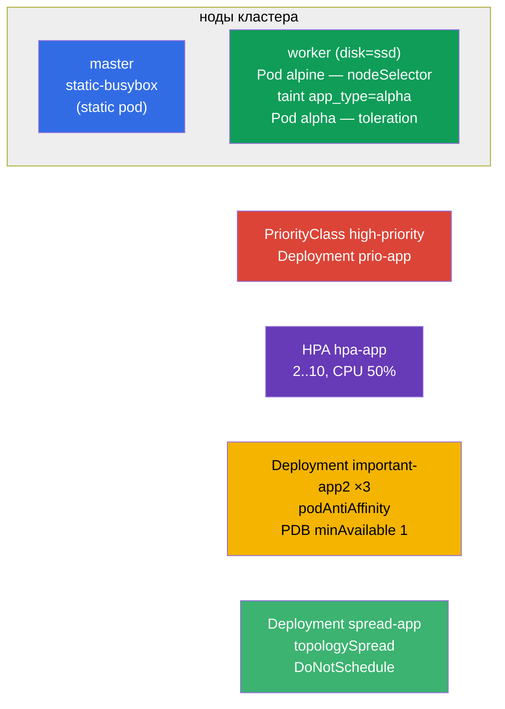

# Lab 104 — Планирование: nodeSelector, taints, ресурсы, static pod, PriorityClass, HPA

## Описание

Практическая работа по управлению размещением Pods и ресурсами — большой блок домена
Workloads & Scheduling. Вы научитесь притягивать Pod к нужной ноде (`nodeSelector`),
работать с taints/tolerations, создавать static pod на control-plane, задавать приоритеты
(PriorityClass), настраивать автомасштабирование (HPA) и разносить реплики по нодам с
защитой PodDisruptionBudget. Кластер **двухнодовый**: master + worker с label `disk=ssd`.

Все задания оформлены в экзаменационном стиле (как реальные вопросы CKA/CKAD) с
автоматической проверкой командой `check_result`. Часть объектов удобнее собирать
манифестом (заготовка через `kubectl ... --dry-run=client -o yaml`), часть — императивно
(`kubectl taint/autoscale/create priorityclass`).

## Цель

Закрепить материал глав курса:

- [Глава 12. Планирование подов: affinity](../../course/12/ru.md) — `nodeSelector`, podAntiAffinity, topologySpread, строгий/мягкий режим
- [Глава 13. Taints и tolerations](../../course/13/ru.md) — отталкивание Pods от ноды и пропуск через toleration
- [Глава 14. Ресурсы: requests, limits, квоты](../../course/14/ru.md) — `requests` CPU как основа для HPA
- [Глава 15. Static Pods, PriorityClass](../../course/15/ru.md) — Pod под управлением kubelet, приоритеты вытеснения
- [Глава 16. Автомасштабирование: HPA](../../course/16/ru.md) — масштабирование по загрузке CPU

## Что мы создаём и зачем

В этой лабе мы отрабатываем весь арсенал управления тем, **где** и **как** запускаются
Pods. Каждый объект решает свою задачу:

| Объект | Что это | Зачем в этой лабе |
|--------|---------|-------------------|
| **Pod `alpine`** с `nodeSelector` | Pod, привязанный к ноде по label | учимся сажать Pod на нужную ноду (`disk=ssd`) (глава 12) |
| **taint на ноде + Pod `alpha`** с toleration | отталкивание + пропуск | отрабатываем механизм taints/tolerations (глава 13) |
| **Static pod `static-busybox`** | Pod под управлением kubelet | создаём static pod прямо на control-plane (глава 15) |
| **PriorityClass `high-priority` + Deployment `prio-app`** | приоритет Pods | задаём и применяем приоритет (глава 15) |
| **Deployment `hpa-app` + HPA** | автомасштабирование | настраиваем HPA по CPU (главы 14, 16) |
| **Deployment `important-app2` + PDB** (namespace `app2-system`) | разнос реплик + защита | podAntiAffinity + PodDisruptionBudget (глава 12) |
| **Deployment `spread-app`** | строгое распределение | topologySpreadConstraints в режиме `DoNotSchedule` (глава 12) |

Итоговая картина того, что будет развёрнуто:



## Инфраструктура

Окружение разворачивается в AWS (`eu-central-1`) через Terragrunt и состоит из:

| Компонент  | Описание                                                             |
|------------|----------------------------------------------------------------------|
| `vpc`      | VPC `10.10.0.0/16` с публичными подсетями                            |
| `ssh-keys` | SSH-ключи для доступа к нодам                                        |
| `k8s-1`    | Kubernetes `1.35.2` (kubeadm), CNI Calico, metrics-server, **master + worker(`disk=ssd`)** |
| `worker`   | Рабочая машина с `kubectl`, доступом к кластеру и `check_result`     |

Инстансы: `t3.medium` Ubuntu `22.04`. Кластер **двухнодовый** — master (control-plane) и
один worker с label `disk=ssd`. metrics-server установлен (нужен для HPA). На master
сохранён taint `control-plane` — для размещения на нём нужен toleration.

## Развёртывание

```bash
TASK=104 make run_cka_task
```

После создания подключитесь к рабочей машине (worker) по SSH и выполняйте задания
оттуда. `kubectl` уже настроен на контекст `cluster1-admin@cluster1`. Static pod
(задание 3) создаётся прямо на control-plane — туда нужно зайти по SSH отдельно.

Полезные команды на рабочей машине:

```bash
time_left       # сколько осталось времени
check_result    # проверить решение
```

## Задания

---
|        **1**        | **Посадить Pod на ноду по label**                            |
| :-----------------: | :------------------------------------------------------------ |
| Что делаем          | Создайте Pod с именем `alpine`, образ контейнера `alpine:3.15`, команда `sleep 6000`. Через `nodeSelector` привяжите его к ноде с label `disk=ssd`, чтобы он гарантированно запустился именно на ней. |
| Критерии приёмки    | - Pod `alpine`, образ `alpine:3.15`, команда `sleep 6000`;<br/>- Pod работает на ноде с label `disk=ssd`. |
---
|        **2**        | **Taint ноды и Pod с toleration**                            |
| :-----------------: | :------------------------------------------------------------ |
| Что делаем          | Поставьте на worker-ноду taint `app_type=alpha:NoSchedule` (он отталкивает Pods без подходящего toleration). Создайте Pod с именем `alpha`, образ контейнера `redis`, и добавьте ему toleration на этот taint (key `app_type`, value `alpha`, effect `NoSchedule`). |
| Критерии приёмки    | - Pod `alpha`, образ `redis`;<br/>- toleration: key `app_type`, value `alpha`, effect `NoSchedule`. |
---
|        **3**        | **Создать static pod на control-plane**                      |
| :-----------------: | :------------------------------------------------------------ |
| Что делаем          | Зайдите по SSH на control-plane и положите манифест Pod в каталог `/etc/kubernetes/manifests/` — kubelet сам его поднимет (это static pod). Имя Pod — `static-busybox`, образ контейнера `viktoruj/ping_pong:alpine`, label `pod-type=static-pod`. |
| Критерии приёмки    | - static pod `static-busybox`, образ `viktoruj/ping_pong:alpine`;<br/>- label `pod-type=static-pod`. |
---
|        **4**        | **Задать и применить приоритет**                             |
| :-----------------: | :------------------------------------------------------------ |
| Что делаем          | Создайте PriorityClass с именем `high-priority` и значением `1000000`. Создайте Deployment `prio-app` (образ `viktoruj/ping_pong:latest`) и назначьте его Pods этот класс приоритета (`priorityClassName: high-priority`). |
| Критерии приёмки    | - PriorityClass `high-priority`, value `1000000`;<br/>- Deployment `prio-app` использует `priorityClassName: high-priority`. |
---
|        **5**        | **Настроить автомасштабирование (HPA)**                      |
| :-----------------: | :------------------------------------------------------------ |
| Что делаем          | Создайте Deployment `hpa-app` (образ `viktoruj/ping_pong:latest`) и обязательно задайте контейнеру `requests` по CPU (без них HPA не сможет считать загрузку). Настройте HPA для этого Deployment: минимум `2` реплики, максимум `10`, целевая загрузка CPU `50%`. |
| Критерии приёмки    | - Deployment `hpa-app` существует;<br/>- HPA `hpa-app`: min `2`, max `10`, target CPU `50%`. |
---
|        **6**        | **Разнести реплики по нодам и защитить PDB**                 |
| :-----------------: | :------------------------------------------------------------ |
| Что делаем          | Создайте namespace `app2-system`. Разверните в нём Deployment `important-app2` (образ `viktoruj/ping_pong:latest`, `3` реплики) с podAntiAffinity по `kubernetes.io/hostname`, чтобы реплики расходились по разным нодам. Создайте PodDisruptionBudget `important-app2` с `minAvailable: 1`, чтобы при добровольных выселениях (drain) хотя бы одна реплика всегда оставалась живой. |
| Критерии приёмки    | - namespace `app2-system` существует;<br/>- Deployment `important-app2`: образ `viktoruj/ping_pong:latest`, `3` реплики, podAntiAffinity по `hostname`;<br/>- PDB `important-app2`: `minAvailable: 1`. |
---
|        **7**        | **Строгое распределение по нодам (topologySpread)**          |
| :-----------------: | :------------------------------------------------------------ |
| Что делаем          | Создайте Deployment `spread-app` (образ `viktoruj/ping_pong:latest`) и задайте `topologySpreadConstraints`, которые ровно раскидывают реплики по нодам строгим правилом: `maxSkew: 1`, `topologyKey: kubernetes.io/hostname`, `whenUnsatisfiable: DoNotSchedule`. |
| Критерии приёмки    | - Deployment `spread-app`, образ `viktoruj/ping_pong:latest`;<br/>- topologySpreadConstraints: `maxSkew: 1`, `topologyKey: kubernetes.io/hostname`, `whenUnsatisfiable: DoNotSchedule`. |
---

> **Строгое vs мягкое (глава 12).** В задании 7 используется **строгий** режим
> `DoNotSchedule`: Pod, нарушающий равномерность, останется `Pending`. Мягкий вариант
> `ScheduleAnyway` (и `preferred` у podAntiAffinity) разместил бы Pod всё равно, лишь
> стараясь минимизировать перекос. Разбор обоих режимов — в решении.

## Проверка результата

На рабочей машине запустите автоматическую проверку:

```bash
check_result
```

Скрипт прогонит тесты и покажет, сколько заданий выполнено.

## Решение

Эталонное решение: [worker/files/solutions/1.MD](worker/files/solutions/1.MD)

## Покрытие мок-экзаменов

Лаба закрывает задания моков по планированию и ресурсам: CKA mock 01 (№7 static pod, №25
antiAffinity + PDB), CKA mock 02 (№4 nodeSelector `disk=ssd`, №19 static pod), CKAD mock
01 (№9 taint + toleration, №10 размещение через label/affinity).

## Удаление кластера и ресурсов

```bash
TASK=104 make delete_cka_task
```
