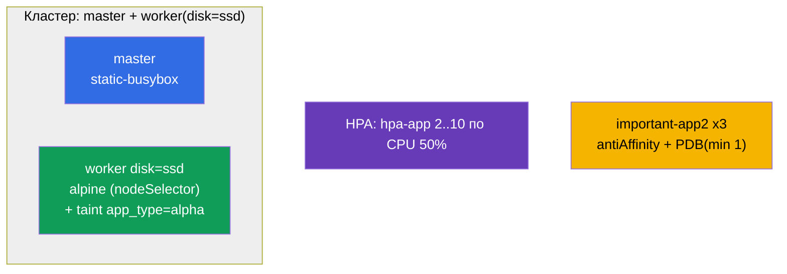

# Lab 104 — Планирование: nodeSelector, taints, ресурсы, static pod, PriorityClass, HPA

## Описание

Практическая работа по управлению размещением подов и ресурсами — большой блок домена
Workloads & Scheduling. Вы научитесь притягивать под к нужной ноде (`nodeSelector`),
работать с taints/tolerations, создавать static pod на control-plane, задавать
приоритеты (PriorityClass), настраивать автомасштабирование (HPA) и разносить реплики по
нодам с защитой PodDisruptionBudget. Кластер **двухнодовый**: master + worker с меткой
`disk=ssd`.

Все задания в экзаменационном стиле с автопроверкой `check_result`.

## Цель

Закрепить главы курса:

- [Глава 12. Планирование подов: affinity](../../course/12/ru.md)
- [Глава 13. Taints и tolerations](../../course/13/ru.md)
- [Глава 14. Ресурсы: requests, limits, квоты](../../course/14/ru.md)
- [Глава 15. Static Pods, PriorityClass](../../course/15/ru.md)
- [Глава 16. Автомасштабирование: HPA](../../course/16/ru.md)

## Что мы создаём и зачем

| Объект | Что это | Зачем в этой лабе |
|--------|---------|-------------------|
| **Под `alpine`** с `nodeSelector` | под, привязанный к ноде по метке | учимся сажать под на нужную ноду (`disk=ssd`) |
| **Taint на ноде + под `alpha`** с toleration | отталкивание + пропуск | отрабатываем механизм taints/tolerations |
| **Static pod `static-busybox`** | под под управлением kubelet | создаём static pod прямо на control-plane |
| **PriorityClass `high-priority` + деплой `prio-app`** | приоритет подов | задаём и применяем приоритет |
| **Деплой `hpa-app` + HPA** | автомасштабирование | настраиваем HPA по CPU |
| **Деплой `important-app2` + PDB** (неймспейс `app2-system`) | разнос реплик + защита | podAntiAffinity + PodDisruptionBudget |



## Инфраструктура

| Компонент  | Описание                                                             |
|------------|----------------------------------------------------------------------|
| `k8s-1`    | Kubernetes `1.35.2` (kubeadm), Calico, metrics-server, **master + worker(`disk=ssd`)** |
| `worker`   | Рабочая машина с `kubectl` и `check_result`                          |

## Развёртывание

```bash
TASK=104 make run_cka_task
```

## Задания

---
|        **1**        | **Посадить под на ноду по метке**                             |
| :-----------------: | :------------------------------------------------------------ |
| Что делаем          | Через `nodeSelector` сажаем под на ноду с `disk=ssd`          |
| Критерии приёмки    | - Pod: `alpine`, image `alpine:3.15`, command `sleep 6000`<br/>- Работает на ноде с меткой `disk=ssd` |
---
|        **2**        | **Taint ноды и под с toleration**                             |
| :-----------------: | :------------------------------------------------------------ |
| Что делаем          | Ставим taint `app_type=alpha:NoSchedule` на ноду; под `alpha` его терпит |
| Критерии приёмки    | - Pod: `alpha`, image `redis`<br/>- Toleration: key `app_type`, value `alpha`, effect `NoSchedule` |
---
|        **3**        | **Создать static pod на control-plane**                       |
| :-----------------: | :------------------------------------------------------------ |
| Что делаем          | Кладём манифест в `/etc/kubernetes/manifests/` на master      |
| Критерии приёмки    | - Static pod: `static-busybox`, image `viktoruj/ping_pong:alpine`<br/>- Label: `pod-type=static-pod` |
---
|        **4**        | **Задать и применить приоритет**                              |
| :-----------------: | :------------------------------------------------------------ |
| Что делаем          | Создаём PriorityClass и назначаем его деплою                  |
| Критерии приёмки    | - PriorityClass: `high-priority`, value `1000000`<br/>- Deployment `prio-app` использует `priorityClassName: high-priority` |
---
|        **5**        | **Настроить автомасштабирование**                             |
| :-----------------: | :------------------------------------------------------------ |
| Что делаем          | Создаём деплой с requests CPU и HPA по загрузке               |
| Критерии приёмки    | - Deployment: `hpa-app`<br/>- HPA `hpa-app`: min `2`, max `10`, target CPU `50%` |
---
|        **6**        | **Разнести реплики по нодам и защитить PDB**                  |
| :-----------------: | :------------------------------------------------------------ |
| Что делаем          | podAntiAffinity + PodDisruptionBudget                         |
| Критерии приёмки    | - Неймспейс: `app2-system`<br/>- Deployment `important-app2`: image `viktoruj/ping_pong:latest`, `3` реплики, podAntiAffinity по `hostname`<br/>- PDB `important-app2`: minAvailable `1` |
---
|        **7**        | **Строгое распределение по нодам (topologySpread)**           |
| :-----------------: | :------------------------------------------------------------ |
| Что делаем          | Ровно раскидываем реплики по нодам строгим правилом (`DoNotSchedule`) |
| Критерии приёмки    | - Deployment `spread-app` (image `viktoruj/ping_pong:latest`)<br/>- topologySpreadConstraints: `maxSkew: 1`, topologyKey `kubernetes.io/hostname`, `whenUnsatisfiable: DoNotSchedule` |
---

> **Строгое vs мягкое (глава 12).** В задании 7 используется **строгий** режим
> `DoNotSchedule`: под, нарушающий равномерность, останется `Pending`. Мягкий вариант
> `ScheduleAnyway` (и `preferred` у podAntiAffinity) разместил бы под всё равно, лишь
> стараясь минимизировать перекос. Разбор обоих режимов — в решении.

## Проверка результата

```bash
check_result
```

## Решение

[worker/files/solutions/1.MD](worker/files/solutions/1.MD)

## Покрытие мок-экзаменов

CKA mock 01 (№7 static pod, №25 antiAffinity+PDB), CKA mock 02 (№4 nodeSelector disk=ssd,
№19 static pod), CKAD mock 01 (№9 taint+toleration, №10 размещение через label/affinity).

## Удаление

```bash
TASK=104 make delete_cka_task
```
