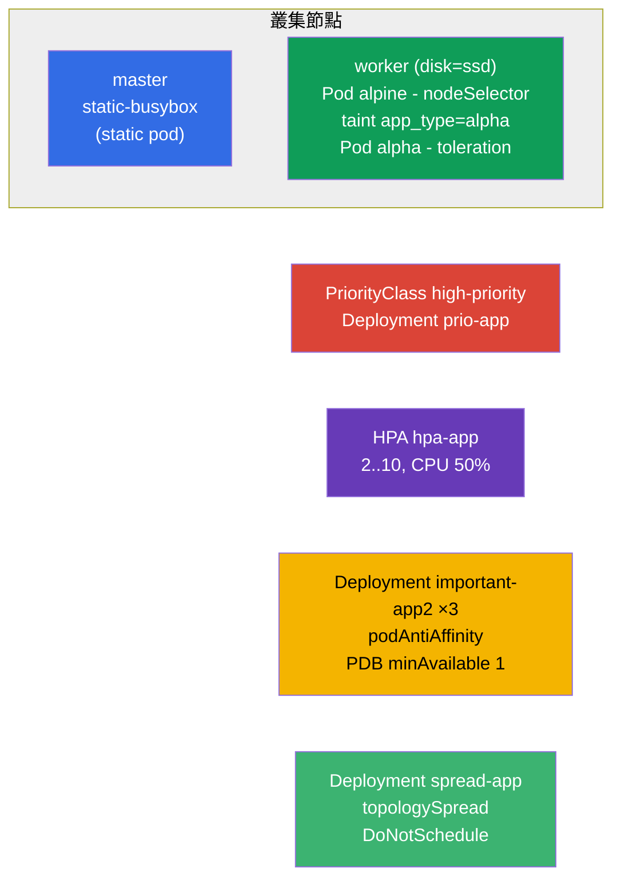

[Русская версия](README_RU.MD) · [Eng version](README.MD) · [Versión en español](README_ES.MD) · [Version française](README_FR.MD) · [Deutsche Version](README_DE.MD) · [ქართული ვერსია](README_GE.MD) · [日本語版](README_JP.MD)

# Lab 104 - 排程：nodeSelector、taints、資源、static pod、PriorityClass、HPA

## 說明

關於管理 Pods 放置位置與資源的實作練習 - 這是 Workloads & Scheduling 領域中
很大的一塊。你將學會把 Pod 吸引到指定的節點上（`nodeSelector`）、
使用 taints/tolerations、在 control-plane 上建立 static pod、設定優先權
（PriorityClass）、設定自動擴縮（HPA），以及把副本分散到各節點並用
PodDisruptionBudget 加以保護。叢集是 **兩個節點**：master + 帶 label `disk=ssd` 的 worker。

所有題目都以考試風格撰寫（就像真正的 CKA/CKAD 考題），並由
`check_result` 指令自動驗證。有一部分物件用清單檔來組裝比較方便
（用 `kubectl ... --dry-run=client -o yaml` 產生骨架），另一部分則用指令式做法
（`kubectl taint/autoscale/create priorityclass`）。

## 目標

鞏固以下課程章節的內容：

- [第 12 章. Pod 排程：affinity](../../course/12/README.md) - `nodeSelector`、podAntiAffinity、topologySpread、嚴格/寬鬆模式
- [第 13 章. Taints 與 tolerations](../../course/13/README.md) - 把 Pods 從節點推開，並用 toleration 放行
- [第 14 章. 資源：requests、limits、配額](../../course/14/README.md) - CPU `requests` 是 HPA 的基礎
- [第 15 章. Static Pods、PriorityClass](../../course/15/README.md) - 由 kubelet 管理的 Pod、搶佔優先權
- [第 16 章. 自動擴縮：HPA](../../course/16/README.md) - 依 CPU 負載進行擴縮

## 我們要建立什麼，以及為什麼

在這個實驗中，我們會演練控制 Pods **在哪裡** 以及 **如何** 啟動的整套工具。
每個物件都有自己的用途：

| 物件 | 這是什麼 | 為什麼出現在這個實驗 |
|--------|---------|-------------------|
| 帶 `nodeSelector` 的 **Pod `alpine`** | 依 label 綁定到節點的 Pod | 學習把 Pod 放到需要的節點上（`disk=ssd`）（第 12 章） |
| **節點上的 taint + 帶 toleration 的 Pod `alpha`** | 推開 + 放行 | 演練 taints/tolerations 機制（第 13 章） |
| **Static pod `static-busybox`** | 由 kubelet 管理的 Pod | 直接在 control-plane 上建立 static pod（第 15 章） |
| **PriorityClass `high-priority` + Deployment `prio-app`** | Pods 的優先權 | 定義並套用優先權（第 15 章） |
| **Deployment `hpa-app` + HPA** | 自動擴縮 | 依 CPU 設定 HPA（第 14、16 章） |
| **Deployment `important-app2` + PDB**（namespace `app2-system`） | 分散副本 + 保護 | podAntiAffinity + PodDisruptionBudget（第 12 章） |
| **Deployment `spread-app`** | 嚴格分佈 | `DoNotSchedule` 模式下的 topologySpreadConstraints（第 12 章） |

最終會部署出來的整體樣貌：



## 基礎架構

環境透過 Terragrunt 部署在 AWS（`eu-central-1`），由以下部分組成：

| 元件       | 說明                                                                 |
|------------|----------------------------------------------------------------------|
| `vpc`      | 帶公有子網路的 VPC `10.10.0.0/16`                                     |
| `ssh-keys` | 用於存取節點的 SSH 金鑰                                               |
| `k8s-1`    | Kubernetes `1.35.2`（kubeadm）、CNI Calico、metrics-server、**master + worker(`disk=ssd`)** |
| `worker`   | 帶 `kubectl`、叢集存取權與 `check_result` 的工作機器                   |

實例：`t4g.medium` Ubuntu `22.04`。叢集是 **兩個節點** - master（control-plane）與
一個帶 label `disk=ssd` 的 worker。metrics-server 已安裝（HPA 需要它）。master 上
保留了 `control-plane` taint - 要在它上面放置東西就需要 toleration。

## 部署

```bash
TASK=104 make run_cka_task
```

建立完成後，請用 SSH 連到工作機器（worker），並在那裡完成題目。
`kubectl` 已經設定好指向 `cluster1-admin@cluster1` context。Static pod
（題目 3）要直接在 control-plane 上建立 - 需要另外用 SSH 連進去。

工作機器上的實用指令：

```bash
time_left       # 還剩多少時間
check_result    # 檢查解答
```

## 題目

---
|        **1**        | **依 label 把 Pod 放到節點上**                                |
| :-----------------: | :------------------------------------------------------------ |
| 要做什麼            | 建立一個名為 `alpine` 的 Pod，容器映像為 `alpine:3.15`，指令為 `sleep 6000`。透過 `nodeSelector` 把它綁定到帶 label `disk=ssd` 的節點，讓它一定會在該節點上啟動。 |
| 驗收標準            | - Pod `alpine`，映像 `alpine:3.15`，指令 `sleep 6000`；<br/>- Pod 執行在帶 label `disk=ssd` 的節點上。 |
---
|        **2**        | **節點的 taint 與帶 toleration 的 Pod**                       |
| :-----------------: | :------------------------------------------------------------ |
| 要做什麼            | 在 worker 節點上加上 taint `app_type=alpha:NoSchedule`（它會推開沒有對應 toleration 的 Pods）。建立一個名為 `alpha` 的 Pod，容器映像為 `redis`，並為它加上針對這個 taint 的 toleration（key `app_type`、value `alpha`、effect `NoSchedule`）。 |
| 驗收標準            | - Pod `alpha`，映像 `redis`；<br/>- toleration：key `app_type`、value `alpha`、effect `NoSchedule`。 |
---
|        **3**        | **在 control-plane 上建立 static pod**                        |
| :-----------------: | :------------------------------------------------------------ |
| 要做什麼            | 用 SSH 連到 control-plane，並把 Pod 清單檔放到 `/etc/kubernetes/manifests/` 目錄 - kubelet 會自己把它啟動（這就是 static pod）。Pod 名稱為 `static-busybox`，容器映像為 `viktoruj/ping_pong:alpine`，label 為 `pod-type=static-pod`。 |
| 驗收標準            | - static pod `static-busybox`，映像 `viktoruj/ping_pong:alpine`；<br/>- label `pod-type=static-pod`。 |
---
|        **4**        | **定義並套用優先權**                                          |
| :-----------------: | :------------------------------------------------------------ |
| 要做什麼            | 建立一個名為 `high-priority` 的 PriorityClass，值為 `1000000`。建立 Deployment `prio-app`（映像 `viktoruj/ping_pong:latest`），並把這個優先權類別指派給它的 Pods（`priorityClassName: high-priority`）。 |
| 驗收標準            | - PriorityClass `high-priority`，value `1000000`；<br/>- Deployment `prio-app` 使用 `priorityClassName: high-priority`。 |
---
|        **5**        | **設定自動擴縮（HPA）**                                       |
| :-----------------: | :------------------------------------------------------------ |
| 要做什麼            | 建立 Deployment `hpa-app`（映像 `viktoruj/ping_pong:latest`），並且務必為容器設定 CPU 的 `requests`（沒有它們 HPA 就無法計算負載）。為這個 Deployment 設定 HPA：最少 `2` 個副本、最多 `10` 個，目標 CPU 負載 `50%`。 |
| 驗收標準            | - Deployment `hpa-app` 存在；<br/>- HPA `hpa-app`：min `2`、max `10`、target CPU `50%`。 |
---
|        **6**        | **把副本分散到各節點並用 PDB 保護**                            |
| :-----------------: | :------------------------------------------------------------ |
| 要做什麼            | 建立 namespace `app2-system`。在其中部署 Deployment `important-app2`（映像 `viktoruj/ping_pong:latest`，`3` 個副本），並用依 `kubernetes.io/hostname` 的 podAntiAffinity，讓副本分散到不同節點上。建立 PodDisruptionBudget `important-app2`，設定 `minAvailable: 1`，這樣在自願驅逐（drain）時至少會有一個副本一直存活。 |
| 驗收標準            | - namespace `app2-system` 存在；<br/>- Deployment `important-app2`：映像 `viktoruj/ping_pong:latest`、`3` 個副本、依 `hostname` 的 podAntiAffinity；<br/>- PDB `important-app2`：`minAvailable: 1`。 |
---
|        **7**        | **在各節點上嚴格分佈（topologySpread）**                      |
| :-----------------: | :------------------------------------------------------------ |
| 要做什麼            | 建立 Deployment `spread-app`（映像 `viktoruj/ping_pong:latest`），並設定 `topologySpreadConstraints`，用嚴格規則把副本平均分散到各節點：`maxSkew: 1`、`topologyKey: kubernetes.io/hostname`、`whenUnsatisfiable: DoNotSchedule`。 |
| 驗收標準            | - Deployment `spread-app`，映像 `viktoruj/ping_pong:latest`；<br/>- topologySpreadConstraints：`maxSkew: 1`、`topologyKey: kubernetes.io/hostname`、`whenUnsatisfiable: DoNotSchedule`。 |
---

> **嚴格 vs 寬鬆（第 12 章）。** 題目 7 使用的是 **嚴格** 模式
> `DoNotSchedule`：破壞均勻性的 Pod 會停在 `Pending`。寬鬆的變體
> `ScheduleAnyway`（以及 podAntiAffinity 的 `preferred`）還是會把 Pod 放上去，只是
> 盡量把偏斜降到最小。兩種模式的說明 - 在解答裡。

## 驗證結果

在工作機器上執行自動檢查：

```bash
check_result
```

腳本會跑完測試，並顯示完成了多少題目。

## 解答

參考解答：[worker/files/solutions/1_TW.MD](worker/files/solutions/1_TW.MD)

## 模擬考涵蓋範圍

本實驗涵蓋模擬考中關於排程與資源的題目：CKA mock 01（第 7 題 static pod、第 25
題 antiAffinity + PDB）、CKA mock 02（第 4 題 nodeSelector `disk=ssd`、第 19 題 static pod）、CKAD mock
01（第 9 題 taint + toleration、第 10 題透過 label/affinity 放置）。

## 刪除叢集與資源

```bash
TASK=104 make delete_cka_task
```
