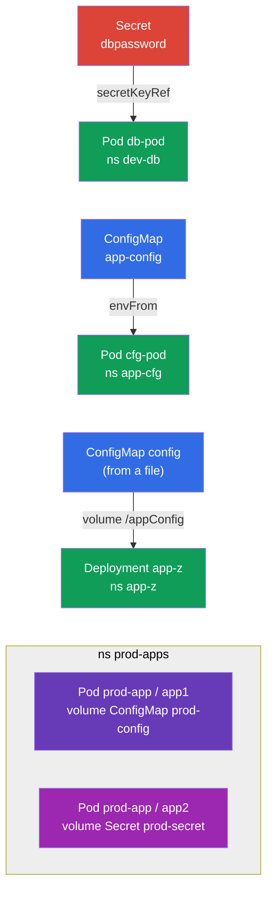

[Русская версия](README_RU.MD) · [Versión en español](README_ES.MD) · [Version française](README_FR.MD) · [Deutsche Version](README_DE.MD) · [ქართული ვერსია](README_GE.MD)

# Lab 105 — Configuration: ConfigMap, Secret, Environment Variables

## Description

A hands-on lab about passing configuration into applications — the core of the
Environment/Config/Security domain. You will practice two key objects: **Secret** (for
sensitive data) and **ConfigMap** (for regular configuration), plus every way of wiring them
into Pods: through environment variables (`env`, `envFrom`) and through a volume mount.

All tasks are written in exam style (like real CKA/CKAD questions) with automatic validation
via the `check_result` command. The objects themselves are fastest to create imperatively
(`kubectl create secret/configmap`), while attaching them to a Pod is done with a manifest.

## Goal

Reinforce the material from the course chapters:

- [Chapter 17. Commands, Arguments and Environment Variables](../../course/17/ru.md) — `env`, `envFrom`, `secretKeyRef`, `configMapKeyRef`
- [Chapter 18. ConfigMap](../../course/18/ru.md) — configuration as variables and as files in a volume
- [Chapter 19. Secret](../../course/19/ru.md) — storing sensitive data and passing it into a container

## What We Build and Why

In this lab we walk through every typical way of delivering configuration into a container —
from a single environment variable to mounted files. Every object serves its own purpose:

| Object | What it is | Why it is in this lab |
|--------|---------|-------------------|
| **Secret `dbpassword` + Pod `db-pod`** | a Secret and a Pod with env from the Secret | learn to pass a password into an environment variable via `secretKeyRef` (chapter 19) |
| **ConfigMap `app-config` + Pod `cfg-pod`** | a ConfigMap and a Pod with env from the ConfigMap | attach configuration as variables (`envFrom`/`configMapKeyRef`) (chapter 18) |
| **ConfigMap `config` (from a file) + Deployment `app-z`** | a config file mounted as a volume | learn to mount a ConfigMap as files in `/appConfig` (chapter 18) |
| **Secret + ConfigMap in Pod `prod-app`** | a Pod with two containers | mount both a Secret and a ConfigMap as volumes at the same time (chapters 18, 19) |

The final picture of what will be deployed:



## Infrastructure

The environment is deployed in AWS (`eu-central-1`) via Terragrunt and consists of:

| Component  | Description                                                  |
|------------|--------------------------------------------------------------|
| `vpc`      | VPC `10.10.0.0/16` with public subnets                        |
| `ssh-keys` | SSH keys for node access                                      |
| `k8s-1`    | Kubernetes `1.35.2` (kubeadm), Calico CNI, metrics-server, single-node |
| `worker`   | Work machine with `kubectl` and `check_result`; on startup it creates the file `/var/work/105/config.yaml` for task 3 |

Instances: `t3.medium` (master), Ubuntu `22.04`. The cluster is single-node — the master is
untainted (the `control-plane` taint is removed), so Pods are scheduled directly on it.

## Deployment

```bash
TASK=105 make run_cka_task
```

Once it is created, connect to the work machine (worker) over SSH and do the tasks from
there. `kubectl` is already pointed at the `cluster1-admin@cluster1` context.

Handy commands on the work machine:

```bash
time_left       # how much time is left
check_result    # check your solution
```

## Tasks

---
|        **1**        | **A Secret and a Pod with an environment variable from it**  |
| :-----------------: | :----------------------------------------------------------- |
| What to do          | Create the namespace `dev-db`. Create a Secret named `dbpassword` in it with the key `pwd=my-secret-pwd`. Run a Pod `db-pod` (image `mysql:8.0`) in which the environment variable `MYSQL_ROOT_PASSWORD` is taken from that Secret (key `pwd`) via `secretKeyRef`. |
| Acceptance criteria | - namespace `dev-db` exists;<br/>- Secret `dbpassword`, key `pwd=my-secret-pwd`;<br/>- Pod `db-pod`, image `mysql:8.0`, env `MYSQL_ROOT_PASSWORD` from Secret `dbpassword`/`pwd`. |
---
|        **2**        | **A ConfigMap as environment variables**                     |
| :-----------------: | :----------------------------------------------------------- |
| What to do          | Create the namespace `app-cfg`. Create a ConfigMap `app-config` with the pair `COLOR=blue`. Run a Pod `cfg-pod` that receives the keys of this ConfigMap as environment variables (via `envFrom` or `configMapKeyRef`). |
| Acceptance criteria | - namespace `app-cfg` exists;<br/>- ConfigMap `app-config`, `COLOR=blue`;<br/>- Pod `cfg-pod` receives a variable from ConfigMap `app-config`. |
---
|        **3**        | **A ConfigMap from a file, mounted as a volume**             |
| :-----------------: | :----------------------------------------------------------- |
| What to do          | Create the namespace `app-z`. Create a ConfigMap `config` from the file `/var/work/105/config.yaml` (it is already on the work machine). Deploy a Deployment `app-z` that mounts this ConfigMap as a volume into the container directory `/appConfig`. |
| Acceptance criteria | - namespace `app-z` exists;<br/>- ConfigMap `config` created from `/var/work/105/config.yaml`;<br/>- Deployment `app-z` mounts `config` into `/appConfig`. |
---
|        **4**        | **A Secret and a ConfigMap mounted into a Pod**              |
| :-----------------: | :----------------------------------------------------------- |
| What to do          | Create the namespace `prod-apps`. Create a Secret `prod-secret` (keys `var1=aaa`, `var2=bbb`) and a ConfigMap `prod-config` (key `config.yaml`). Run a Pod `prod-app` with two containers: container `app1` mounts the ConfigMap `prod-config` as a volume, container `app2` mounts the Secret `prod-secret`. |
| Acceptance criteria | - namespace `prod-apps` exists;<br/>- Secret `prod-secret` (`var1=aaa`, `var2=bbb`), ConfigMap `prod-config` (`config.yaml`);<br/>- Pod `prod-app`: container `app1` mounts `prod-config`, `app2` mounts `prod-secret`. |
---

## Checking the Result

On the work machine run the automatic validation:

```bash
check_result
```

The script runs the tests and shows how many tasks are complete.

## Solution

Reference solution: [worker/files/solutions/1.MD](worker/files/solutions/1.MD)

## Mock Exam Coverage

The lab covers the configuration tasks of the mocks: CKA mock 01 (#20 — Secret + ConfigMap +
Pod with mounts), CKAD mock 01 (#3 — Secret → env), CKAD mock 02 (#1 — Secret → env, #11 —
Secret → env, #19 — ConfigMap from a file in a Deployment).

## Deleting the Cluster and Resources

```bash
TASK=105 make delete_cka_task
```
