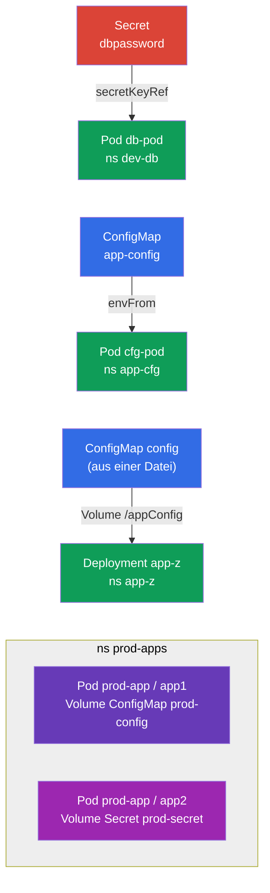

[Русская версия](README_RU.MD) · [Eng version](README.MD) · [Versión en español](README_ES.MD) · [Version française](README_FR.MD) · [ქართული ვერსია](README_GE.MD)

# Lab 105 — Konfiguration: ConfigMap, Secret, Umgebungsvariablen

## Beschreibung

Praxis-Lab zur Übergabe von Konfiguration an Anwendungen — der Kern der Domäne
Environment/Config/Security. Du übst zwei zentrale Objekte: **Secret** (für sensible Daten)
und **ConfigMap** (für gewöhnliche Konfiguration) sowie alle Wege, sie an Pods anzubinden:
über Umgebungsvariablen (`env`, `envFrom`) und über das Einbinden als Volume.

Alle Aufgaben sind im Prüfungsstil formuliert (wie echte CKA/CKAD-Fragen) mit automatischer
Prüfung durch den Befehl `check_result`. Die Objekte selbst erstellt man am schnellsten
imperativ (`kubectl create secret/configmap`), die Anbindung an den Pod dagegen per
Manifest.

## Ziel

Den Stoff der Kurskapitel festigen:

- [Kapitel 17. Befehle, Argumente und Umgebungsvariablen](../../course/17/ru.md) — `env`, `envFrom`, `secretKeyRef`, `configMapKeyRef`
- [Kapitel 18. ConfigMap](../../course/18/ru.md) — Konfiguration als Variablen und als Dateien in einem Volume
- [Kapitel 19. Secret](../../course/19/ru.md) — sensible Daten speichern und in den Container durchreichen

## Was wir erstellen und warum

In diesem Lab gehen wir alle typischen Wege durch, Konfiguration in einen Container zu
bringen — von einer einzelnen Umgebungsvariablen bis zu eingebundenen Dateien. Jedes Objekt
löst seine eigene Aufgabe:

| Objekt | Was das ist | Warum in diesem Lab |
|--------|---------|-------------------|
| **Secret `dbpassword` + Pod `db-pod`** | ein Secret und ein Pod mit env aus dem Secret | lernen, ein Passwort über `secretKeyRef` in eine Umgebungsvariable durchzureichen (Kapitel 19) |
| **ConfigMap `app-config` + Pod `cfg-pod`** | eine ConfigMap und ein Pod mit env aus der ConfigMap | Konfiguration als Variablen anbinden (`envFrom`/`configMapKeyRef`) (Kapitel 18) |
| **ConfigMap `config` (aus einer Datei) + Deployment `app-z`** | eine Konfigurationsdatei, als Volume eingebunden | lernen, eine ConfigMap als Dateien in `/appConfig` einzubinden (Kapitel 18) |
| **Secret + ConfigMap im Pod `prod-app`** | ein Pod mit zwei Containern | Secret und ConfigMap gleichzeitig als Volumes einbinden (Kapitel 18, 19) |

Das Gesamtbild dessen, was bereitgestellt wird:



## Infrastruktur

Die Umgebung wird in AWS (`eu-central-1`) per Terragrunt bereitgestellt und besteht aus:

| Komponente | Beschreibung                                                 |
|------------|--------------------------------------------------------------|
| `vpc`      | VPC `10.10.0.0/16` mit öffentlichen Subnetzen                 |
| `ssh-keys` | SSH-Schlüssel für den Zugriff auf die Nodes                    |
| `k8s-1`    | Kubernetes `1.35.2` (kubeadm), CNI Calico, metrics-server, ein Node |
| `worker`   | Arbeitsmaschine mit `kubectl` und `check_result`; beim Start erstellt sie die Datei `/var/work/105/config.yaml` für Aufgabe 3 |

Instanzen: `t3.medium` (Master), Ubuntu `22.04`. Der Cluster hat einen Node — beim Master
ist der Taint `control-plane` entfernt, daher werden Pods direkt auf ihm geplant.

## Bereitstellung

```bash
TASK=105 make run_cka_task
```

Verbinde dich nach dem Erstellen per SSH mit der Arbeitsmaschine (Worker) und erledige die
Aufgaben von dort. `kubectl` ist bereits auf den Kontext `cluster1-admin@cluster1`
eingestellt.

Nützliche Befehle auf der Arbeitsmaschine:

```bash
time_left       # wie viel Zeit noch bleibt
check_result    # Lösung prüfen
```

## Aufgaben

---
|        **1**        | **Secret und Pod mit einer Umgebungsvariablen daraus**       |
| :-----------------: | :----------------------------------------------------------- |
| Was wir tun         | Erstelle den Namespace `dev-db`. Erstelle darin ein Secret mit dem Namen `dbpassword` und dem Schlüssel `pwd=my-secret-pwd`. Starte einen Pod `db-pod` (Image `mysql:8.0`), in dem die Umgebungsvariable `MYSQL_ROOT_PASSWORD` über `secretKeyRef` aus diesem Secret (Schlüssel `pwd`) kommt. |
| Abnahmekriterien    | - Namespace `dev-db` existiert;<br/>- Secret `dbpassword`, Schlüssel `pwd=my-secret-pwd`;<br/>- Pod `db-pod`, Image `mysql:8.0`, env `MYSQL_ROOT_PASSWORD` aus dem Secret `dbpassword`/`pwd`. |
---
|        **2**        | **ConfigMap als Umgebungsvariablen**                         |
| :-----------------: | :----------------------------------------------------------- |
| Was wir tun         | Erstelle den Namespace `app-cfg`. Erstelle eine ConfigMap `app-config` mit dem Paar `COLOR=blue`. Starte einen Pod `cfg-pod`, der die Schlüssel dieser ConfigMap als Umgebungsvariablen erhält (über `envFrom` oder `configMapKeyRef`). |
| Abnahmekriterien    | - Namespace `app-cfg` existiert;<br/>- ConfigMap `app-config`, `COLOR=blue`;<br/>- der Pod `cfg-pod` erhält eine Variable aus der ConfigMap `app-config`. |
---
|        **3**        | **ConfigMap aus einer Datei, als Volume eingebunden**        |
| :-----------------: | :----------------------------------------------------------- |
| Was wir tun         | Erstelle den Namespace `app-z`. Erstelle eine ConfigMap `config` aus der Datei `/var/work/105/config.yaml` (sie liegt schon auf der Arbeitsmaschine). Rolle ein Deployment `app-z` aus, das diese ConfigMap als Volume in das Verzeichnis `/appConfig` des Containers einbindet. |
| Abnahmekriterien    | - Namespace `app-z` existiert;<br/>- ConfigMap `config` ist aus `/var/work/105/config.yaml` erstellt;<br/>- Deployment `app-z` bindet `config` in `/appConfig` ein. |
---
|        **4**        | **Secret und ConfigMap, in einen Pod eingebunden**           |
| :-----------------: | :----------------------------------------------------------- |
| Was wir tun         | Erstelle den Namespace `prod-apps`. Erstelle ein Secret `prod-secret` (Schlüssel `var1=aaa`, `var2=bbb`) und eine ConfigMap `prod-config` (Schlüssel `config.yaml`). Starte einen Pod `prod-app` aus zwei Containern: Container `app1` bindet die ConfigMap `prod-config` als Volume ein, Container `app2` das Secret `prod-secret`. |
| Abnahmekriterien    | - Namespace `prod-apps` existiert;<br/>- Secret `prod-secret` (`var1=aaa`, `var2=bbb`), ConfigMap `prod-config` (`config.yaml`);<br/>- Pod `prod-app`: Container `app1` bindet `prod-config` ein, `app2` das `prod-secret`. |
---

## Ergebnisprüfung

Starte auf der Arbeitsmaschine die automatische Prüfung:

```bash
check_result
```

Das Skript führt die Tests aus und zeigt, wie viele Aufgaben erledigt sind.

## Lösung

Referenzlösung: [worker/files/solutions/1_DE.MD](worker/files/solutions/1_DE.MD)

## Abdeckung der Mock-Prüfungen

Das Lab deckt die Konfigurationsaufgaben der Mocks ab: CKA mock 01 (Nr. 20 — Secret +
ConfigMap + Pod mit Einbindungen), CKAD mock 01 (Nr. 3 — Secret → env), CKAD mock 02 (Nr. 1 —
Secret → env, Nr. 11 — Secret → env, Nr. 19 — ConfigMap aus einer Datei im Deployment).

## Löschen von Cluster und Ressourcen

```bash
TASK=105 make delete_cka_task
```
