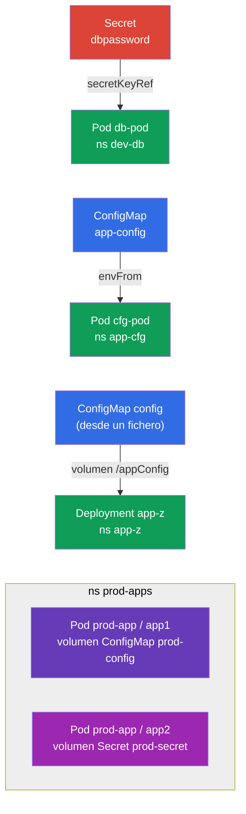

[Русская версия](README_RU.MD) · [Eng version](README.MD) · [Version française](README_FR.MD) · [Deutsche Version](README_DE.MD) · [ქართული ვერსია](README_GE.MD)

# Lab 105 — Configuración: ConfigMap, Secret, variables de entorno

## Descripción

Práctica sobre cómo pasar la configuración a las aplicaciones: el núcleo del dominio
Environment/Config/Security. Trabajarás dos objetos clave: **Secret** (para datos
sensibles) y **ConfigMap** (para la configuración normal), así como todas las formas de
conectarlos a los Pods: mediante variables de entorno (`env`, `envFrom`) y mediante el
montaje de un volumen.

Todas las tareas están redactadas en estilo de examen (como las preguntas reales de
CKA/CKAD) con verificación automática mediante el comando `check_result`. Los objetos en sí
se crean más rápido de forma imperativa (`kubectl create secret/configmap`), y su conexión
al Pod, con un manifiesto.

## Objetivo

Consolidar el material de los capítulos del curso:

- [Capítulo 17. Comandos, argumentos y variables de entorno](../../course/17/ru.md) — `env`, `envFrom`, `secretKeyRef`, `configMapKeyRef`
- [Capítulo 18. ConfigMap](../../course/18/ru.md) — la configuración como variables y como ficheros en un volumen
- [Capítulo 19. Secret](../../course/19/ru.md) — almacenamiento de datos sensibles y su paso al contenedor

## Qué creamos y para qué

En este laboratorio repasamos todas las formas habituales de llevar la configuración a un
contenedor: desde una sola variable de entorno hasta ficheros montados. Cada objeto
resuelve su propia tarea:

| Objeto | Qué es | Para qué está en este laboratorio |
|--------|---------|-------------------|
| **Secret `dbpassword` + Pod `db-pod`** | un secret y un Pod con env procedente del secret | aprender a pasar una contraseña a una variable de entorno mediante `secretKeyRef` (capítulo 19) |
| **ConfigMap `app-config` + Pod `cfg-pod`** | un configmap y un Pod con env procedente del configmap | conectar la configuración como variables (`envFrom`/`configMapKeyRef`) (capítulo 18) |
| **ConfigMap `config` (desde un fichero) + Deployment `app-z`** | un fichero de configuración montado como volumen | aprender a montar un ConfigMap como ficheros en `/appConfig` (capítulo 18) |
| **Secret + ConfigMap en el Pod `prod-app`** | un Pod con dos contenedores | montar a la vez un Secret y un ConfigMap como volúmenes (capítulos 18, 19) |

Imagen final de lo que se despliega:



## Infraestructura

El entorno se despliega en AWS (`eu-central-1`) con Terragrunt y consta de:

| Componente | Descripción                                                  |
|------------|--------------------------------------------------------------|
| `vpc`      | VPC `10.10.0.0/16` con subredes públicas                      |
| `ssh-keys` | Claves SSH para el acceso a los nodos                         |
| `k8s-1`    | Kubernetes `1.35.2` (kubeadm), CNI Calico, metrics-server, de un solo nodo |
| `worker`   | Máquina de trabajo con `kubectl` y `check_result`; al arrancar crea el fichero `/var/work/105/config.yaml` para la tarea 3 |

Instancias: `t3.medium` (master), Ubuntu `22.04`. El clúster es de un solo nodo: al master
se le ha quitado el taint `control-plane`, por lo que los pods se planifican directamente
en él.

## Despliegue

```bash
TASK=105 make run_cka_task
```

Tras la creación, conéctate por SSH a la máquina de trabajo (worker) y realiza las tareas
desde allí. `kubectl` ya está configurado con el contexto `cluster1-admin@cluster1`.

Comandos útiles en la máquina de trabajo:

```bash
time_left       # cuánto tiempo queda
check_result    # comprobar la solución
```

## Tareas

---
|        **1**        | **Secret y Pod con una variable de entorno tomada de él**     |
| :-----------------: | :----------------------------------------------------------- |
| Qué hacemos         | Crea el namespace `dev-db`. Crea en él un Secret con el nombre `dbpassword` con la clave `pwd=my-secret-pwd`. Ejecuta un Pod `db-pod` (imagen `mysql:8.0`) en el que la variable de entorno `MYSQL_ROOT_PASSWORD` se tome de ese Secret (clave `pwd`) mediante `secretKeyRef`. |
| Criterios de aceptación | - el namespace `dev-db` existe;<br/>- Secret `dbpassword`, clave `pwd=my-secret-pwd`;<br/>- Pod `db-pod`, imagen `mysql:8.0`, env `MYSQL_ROOT_PASSWORD` desde el secret `dbpassword`/`pwd`. |
---
|        **2**        | **ConfigMap como variables de entorno**                      |
| :-----------------: | :----------------------------------------------------------- |
| Qué hacemos         | Crea el namespace `app-cfg`. Crea un ConfigMap `app-config` con el par `COLOR=blue`. Ejecuta un Pod `cfg-pod` que reciba las claves de ese ConfigMap como variables de entorno (mediante `envFrom` o `configMapKeyRef`). |
| Criterios de aceptación | - el namespace `app-cfg` existe;<br/>- ConfigMap `app-config`, `COLOR=blue`;<br/>- el Pod `cfg-pod` recibe una variable del ConfigMap `app-config`. |
---
|        **3**        | **ConfigMap desde un fichero, montado como volumen**         |
| :-----------------: | :----------------------------------------------------------- |
| Qué hacemos         | Crea el namespace `app-z`. Crea un ConfigMap `config` a partir del fichero `/var/work/105/config.yaml` (ya está en la máquina de trabajo). Despliega un Deployment `app-z` que monte ese ConfigMap como volumen en el directorio `/appConfig` del contenedor. |
| Criterios de aceptación | - el namespace `app-z` existe;<br/>- el ConfigMap `config` está creado desde `/var/work/105/config.yaml`;<br/>- el Deployment `app-z` monta `config` en `/appConfig`. |
---
|        **4**        | **Secret y ConfigMap montados en un Pod**                    |
| :-----------------: | :----------------------------------------------------------- |
| Qué hacemos         | Crea el namespace `prod-apps`. Crea un Secret `prod-secret` (claves `var1=aaa`, `var2=bbb`) y un ConfigMap `prod-config` (clave `config.yaml`). Ejecuta un Pod `prod-app` con dos contenedores: el contenedor `app1` monta como volumen el ConfigMap `prod-config` y el contenedor `app2`, el Secret `prod-secret`. |
| Criterios de aceptación | - el namespace `prod-apps` existe;<br/>- Secret `prod-secret` (`var1=aaa`, `var2=bbb`), ConfigMap `prod-config` (`config.yaml`);<br/>- Pod `prod-app`: el contenedor `app1` monta `prod-config` y `app2`, `prod-secret`. |
---

## Comprobación del resultado

En la máquina de trabajo lanza la verificación automática:

```bash
check_result
```

El script ejecuta los tests y muestra cuántas tareas están completadas.

## Solución

Solución de referencia: [worker/files/solutions/1_ES.MD](worker/files/solutions/1_ES.MD)

## Cobertura de exámenes simulados

El laboratorio cubre las tareas de configuración de los simulados: CKA mock 01 (n.º 20 —
Secret + ConfigMap + Pod con montajes), CKAD mock 01 (n.º 3 — Secret → env), CKAD mock 02
(n.º 1 — Secret → env, n.º 11 — Secret → env, n.º 19 — ConfigMap desde un fichero en un
Deployment).

## Eliminación del clúster y los recursos

```bash
TASK=105 make delete_cka_task
```
