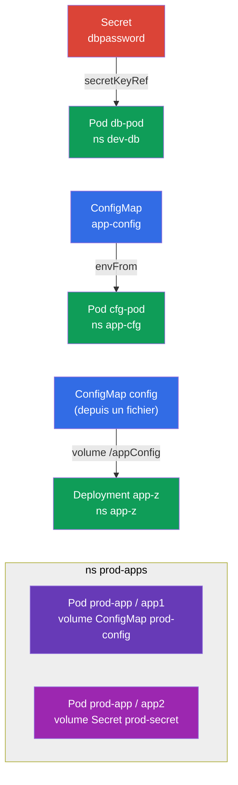

[Русская версия](README_RU.MD) · [Eng version](README.MD) · [Versión en español](README_ES.MD) · [Deutsche Version](README_DE.MD) · [ქართული ვერსია](README_GE.MD)

# Lab 105 — Configuration : ConfigMap, Secret, variables d'environnement

## Description

Lab pratique sur la transmission de la configuration aux applications — le cœur du domaine
Environment/Config/Security. Vous travaillerez deux objets clés : **Secret** (pour les
données sensibles) et **ConfigMap** (pour la configuration ordinaire), ainsi que toutes les
manières de les brancher sur les Pods : via des variables d'environnement (`env`,
`envFrom`) et via le montage d'un volume.

Toutes les tâches sont rédigées en style d'examen (comme les vraies questions CKA/CKAD)
avec une vérification automatique par la commande `check_result`. Les objets eux-mêmes se
créent plus vite en impératif (`kubectl create secret/configmap`), tandis que leur
raccordement au Pod se fait par manifeste.

## Objectif

Consolider le matériel des chapitres du cours :

- [Chapitre 17. Commandes, arguments et variables d'environnement](../../course/17/ru.md) — `env`, `envFrom`, `secretKeyRef`, `configMapKeyRef`
- [Chapitre 18. ConfigMap](../../course/18/ru.md) — la configuration comme variables et comme fichiers dans un volume
- [Chapitre 19. Secret](../../course/19/ru.md) — stockage des données sensibles et transmission dans le conteneur

## Ce que nous créons et pourquoi

Dans ce lab, nous passons en revue toutes les façons classiques d'apporter la configuration
dans un conteneur — d'une seule variable d'environnement jusqu'aux fichiers montés. Chaque
objet résout sa propre tâche :

| Objet | Ce que c'est | Pourquoi dans ce lab |
|--------|---------|-------------------|
| **Secret `dbpassword` + Pod `db-pod`** | un secret et un Pod avec env issu du secret | apprendre à transmettre un mot de passe dans une variable d'environnement via `secretKeyRef` (chapitre 19) |
| **ConfigMap `app-config` + Pod `cfg-pod`** | un configmap et un Pod avec env issu du configmap | brancher la configuration comme variables (`envFrom`/`configMapKeyRef`) (chapitre 18) |
| **ConfigMap `config` (depuis un fichier) + Deployment `app-z`** | un fichier de configuration monté en volume | apprendre à monter un ConfigMap comme fichiers dans `/appConfig` (chapitre 18) |
| **Secret + ConfigMap dans le Pod `prod-app`** | un Pod à deux conteneurs | monter simultanément un Secret et un ConfigMap en volumes (chapitres 18, 19) |

Image finale de ce qui sera déployé :



## Infrastructure

L'environnement est déployé dans AWS (`eu-central-1`) via Terragrunt et se compose de :

| Composant  | Description                                                  |
|------------|--------------------------------------------------------------|
| `vpc`      | VPC `10.10.0.0/16` avec des sous-réseaux publics               |
| `ssh-keys` | Clés SSH pour l'accès aux nœuds                                |
| `k8s-1`    | Kubernetes `1.35.2` (kubeadm), CNI Calico, metrics-server, mono-nœud |
| `worker`   | Machine de travail avec `kubectl` et `check_result` ; au démarrage, elle crée le fichier `/var/work/105/config.yaml` pour la tâche 3 |

Instances : `t3.medium` (master), Ubuntu `22.04`. Le cluster est mono-nœud — le taint
`control-plane` a été retiré du master, les pods sont donc planifiés directement dessus.

## Déploiement

```bash
TASK=105 make run_cka_task
```

Après la création, connectez-vous en SSH à la machine de travail (worker) et effectuez les
tâches depuis celle-ci. `kubectl` est déjà configuré sur le contexte
`cluster1-admin@cluster1`.

Commandes utiles sur la machine de travail :

```bash
time_left       # combien de temps il reste
check_result    # vérifier la solution
```

## Tâches

---
|        **1**        | **Secret et Pod avec une variable d'environnement issue de lui** |
| :-----------------: | :----------------------------------------------------------- |
| Ce qu'on fait       | Créez le namespace `dev-db`. Créez-y un Secret nommé `dbpassword` avec la clé `pwd=my-secret-pwd`. Lancez un Pod `db-pod` (image `mysql:8.0`) dans lequel la variable d'environnement `MYSQL_ROOT_PASSWORD` est prise dans ce Secret (clé `pwd`) via `secretKeyRef`. |
| Critères d'acceptation | - le namespace `dev-db` existe ;<br/>- Secret `dbpassword`, clé `pwd=my-secret-pwd` ;<br/>- Pod `db-pod`, image `mysql:8.0`, env `MYSQL_ROOT_PASSWORD` issu du secret `dbpassword`/`pwd`. |
---
|        **2**        | **ConfigMap comme variables d'environnement**                |
| :-----------------: | :----------------------------------------------------------- |
| Ce qu'on fait       | Créez le namespace `app-cfg`. Créez un ConfigMap `app-config` avec la paire `COLOR=blue`. Lancez un Pod `cfg-pod` qui reçoit les clés de ce ConfigMap comme variables d'environnement (via `envFrom` ou `configMapKeyRef`). |
| Critères d'acceptation | - le namespace `app-cfg` existe ;<br/>- ConfigMap `app-config`, `COLOR=blue` ;<br/>- le Pod `cfg-pod` reçoit une variable du ConfigMap `app-config`. |
---
|        **3**        | **ConfigMap depuis un fichier, monté en volume**             |
| :-----------------: | :----------------------------------------------------------- |
| Ce qu'on fait       | Créez le namespace `app-z`. Créez un ConfigMap `config` à partir du fichier `/var/work/105/config.yaml` (il est déjà présent sur la machine de travail). Déployez un Deployment `app-z` qui monte ce ConfigMap en volume dans le répertoire `/appConfig` du conteneur. |
| Critères d'acceptation | - le namespace `app-z` existe ;<br/>- le ConfigMap `config` est créé depuis `/var/work/105/config.yaml` ;<br/>- le Deployment `app-z` monte `config` dans `/appConfig`. |
---
|        **4**        | **Secret et ConfigMap montés dans un Pod**                   |
| :-----------------: | :----------------------------------------------------------- |
| Ce qu'on fait       | Créez le namespace `prod-apps`. Créez un Secret `prod-secret` (clés `var1=aaa`, `var2=bbb`) et un ConfigMap `prod-config` (clé `config.yaml`). Lancez un Pod `prod-app` composé de deux conteneurs : le conteneur `app1` monte en volume le ConfigMap `prod-config`, le conteneur `app2` — le Secret `prod-secret`. |
| Critères d'acceptation | - le namespace `prod-apps` existe ;<br/>- Secret `prod-secret` (`var1=aaa`, `var2=bbb`), ConfigMap `prod-config` (`config.yaml`) ;<br/>- Pod `prod-app` : le conteneur `app1` monte `prod-config`, `app2` — `prod-secret`. |
---

## Vérification du résultat

Sur la machine de travail, lancez la vérification automatique :

```bash
check_result
```

Le script exécute les tests et affiche le nombre de tâches réussies.

## Solution

Solution de référence : [worker/files/solutions/1_FR.MD](worker/files/solutions/1_FR.MD)

## Couverture des examens blancs

Le lab couvre les tâches de configuration des examens blancs : CKA mock 01 (n° 20 — Secret +
ConfigMap + Pod avec montages), CKAD mock 01 (n° 3 — Secret → env), CKAD mock 02 (n° 1 —
Secret → env, n° 11 — Secret → env, n° 19 — ConfigMap depuis un fichier dans un Deployment).

## Suppression du cluster et des ressources

```bash
TASK=105 make delete_cka_task
```
