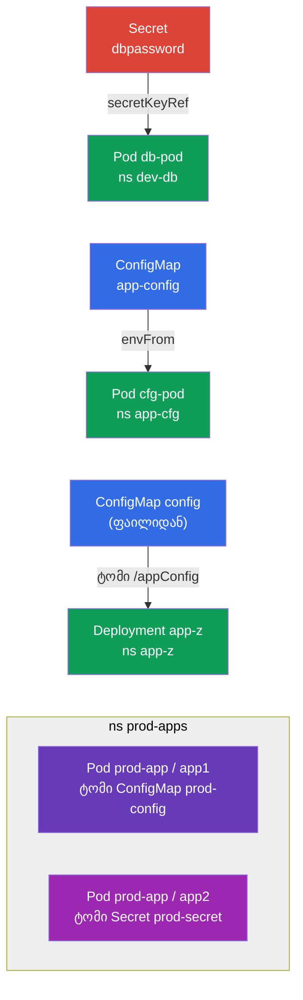

[Русская версия](README_RU.MD) · [Eng version](README.MD) · [Versión en español](README_ES.MD) · [Version française](README_FR.MD) · [Deutsche Version](README_DE.MD) · [繁體中文版](README_TW.MD) · [日本語版](README_JP.MD)

# Lab 105 — კონფიგურაცია: ConfigMap, Secret, გარემოს ცვლადები

## აღწერა

პრაქტიკული ლაბორატორია აპლიკაციებში კონფიგურაციის გადაცემაზე — დომენის
Environment/Config/Security ბირთვი. თქვენ დაამუშავებთ ორ საკვანძო ობიექტს: **Secret**
(მგრძნობიარე მონაცემებისთვის) და **ConfigMap** (ჩვეულებრივი კონფიგურაციისთვის), ასევე მათი
Pod-ებთან მიბმის ყველა გზას: გარემოს ცვლადებით (`env`, `envFrom`) და ტომად მიმაგრებით.

ყველა დავალება გაფორმებულია საგამოცდო სტილში (როგორც რეალური CKA/CKAD კითხვები)
ავტომატური შემოწმებით ბრძანება `check_result`-ით. თავად ობიექტების შექმნა ყველაზე სწრაფია
იმპერატიულად (`kubectl create secret/configmap`), Pod-თან მიბმა კი — მანიფესტით.

## მიზანი

კურსის თავების მასალის განმტკიცება:

- [თავი 17. ბრძანებები, არგუმენტები და გარემოს ცვლადები](../../course/17/ge.md) — `env`, `envFrom`, `secretKeyRef`, `configMapKeyRef`
- [თავი 18. ConfigMap](../../course/18/ge.md) — კონფიგი როგორც ცვლადები და როგორც ფაილები ტომში
- [თავი 19. Secret](../../course/19/ge.md) — მგრძნობიარე მონაცემების შენახვა და კონტეინერში გადაცემა

## რას ვქმნით და რისთვის

ამ ლაბორატორიაში განვიხილავთ კონტეინერში კონფიგურაციის მიწოდების ყველა ტიპურ გზას — ერთი
გარემოს ცვლადიდან მიმაგრებულ ფაილებამდე. ყოველი ობიექტი წყვეტს საკუთარ ამოცანას:

| ობიექტი | რა არის ეს | რისთვის არის ამ ლაბორატორიაში |
|--------|---------|-------------------|
| **Secret `dbpassword` + Pod `db-pod`** | სეკრეტი და Pod env-ით სეკრეტიდან | ვსწავლობთ პაროლის გადაცემას გარემოს ცვლადში `secretKeyRef`-ით (თავი 19) |
| **ConfigMap `app-config` + Pod `cfg-pod`** | კონფიგი და Pod env-ით კონფიგიდან | კონფიგს ვამაგრებთ როგორც ცვლადებს (`envFrom`/`configMapKeyRef`) (თავი 18) |
| **ConfigMap `config` (ფაილიდან) + Deployment `app-z`** | კონფიგ-ფაილი, ტომად მიმაგრებული | ვსწავლობთ ConfigMap-ის ფაილებად მიმაგრებას `/appConfig`-ში (თავი 18) |
| **Secret + ConfigMap Pod `prod-app`-ში** | Pod ორი კონტეინერით | ერთდროულად ვამაგრებთ ტომებად Secret-ს და ConfigMap-ს (თავები 18, 19) |

საბოლოო სურათი იმისა, რაც განთავსდება:



## ინფრასტრუქტურა

გარემო განთავსდება AWS-ში (`eu-central-1`) Terragrunt-ით და შედგება:

| კომპონენტი | აღწერა                                                    |
|------------|--------------------------------------------------------------|
| `vpc`      | VPC `10.10.0.0/16` საჯარო ქვექსელებით                      |
| `ssh-keys` | SSH-გასაღებები node-ებზე წვდომისთვის                        |
| `k8s-1`    | Kubernetes `1.35.2` (kubeadm), CNI Calico, metrics-server, ერთკვანძიანი |
| `worker`   | სამუშაო მანქანა `kubectl`-ით და `check_result`-ით; გაშვებისას ქმნის ფაილს `/var/work/105/config.yaml` მესამე დავალებისთვის |

ინსტანსები: `t4g.medium` (master), Ubuntu `22.04`. კლასტერი ერთკვანძიანია — master-ს
მოშორებულია taint `control-plane`, ამიტომ pod-ები პირდაპირ მასზე იგეგმება.

## განთავსება

```bash
TASK=105 make run_cka_task
```

შექმნის შემდეგ დაუკავშირდით სამუშაო მანქანას (worker) SSH-ით და დავალებები შეასრულეთ
იქიდან. `kubectl` უკვე კონფიგურირებულია კონტექსტზე `cluster1-admin@cluster1`.

სასარგებლო ბრძანებები სამუშაო მანქანაზე:

```bash
time_left       # რამდენი დრო დარჩა
check_result    # ამოხსნის შემოწმება
```

## დავალებები

---
|        **1**        | **Secret და Pod მისგან აღებული გარემოს ცვლადით**             |
| :-----------------: | :----------------------------------------------------------- |
| რას ვაკეთებთ        | შექმენით namespace `dev-db`. შექმენით მასში Secret სახელით `dbpassword` გასაღებით `pwd=my-secret-pwd`. გაუშვით Pod `db-pod` (image `mysql:8.0`), რომელშიც გარემოს ცვლადი `MYSQL_ROOT_PASSWORD` აიღება ამ Secret-იდან (გასაღები `pwd`) `secretKeyRef`-ით. |
| მიღების კრიტერიუმები | - namespace `dev-db` არსებობს;<br/>- Secret `dbpassword`, გასაღები `pwd=my-secret-pwd`;<br/>- Pod `db-pod`, image `mysql:8.0`, env `MYSQL_ROOT_PASSWORD` სეკრეტიდან `dbpassword`/`pwd`. |
---
|        **2**        | **ConfigMap როგორც გარემოს ცვლადები**                        |
| :-----------------: | :----------------------------------------------------------- |
| რას ვაკეთებთ        | შექმენით namespace `app-cfg`. შექმენით ConfigMap `app-config` წყვილით `COLOR=blue`. გაუშვით Pod `cfg-pod`, რომელიც ამ ConfigMap-ის გასაღებებს იღებს გარემოს ცვლადებად (`envFrom`-ით ან `configMapKeyRef`-ით). |
| მიღების კრიტერიუმები | - namespace `app-cfg` არსებობს;<br/>- ConfigMap `app-config`, `COLOR=blue`;<br/>- Pod `cfg-pod` იღებს ცვლადს ConfigMap `app-config`-იდან. |
---
|        **3**        | **ConfigMap ფაილიდან, ტომად მიმაგრებული**                    |
| :-----------------: | :----------------------------------------------------------- |
| რას ვაკეთებთ        | შექმენით namespace `app-z`. შექმენით ConfigMap `config` ფაილიდან `/var/work/105/config.yaml` (ის უკვე სამუშაო მანქანაზეა). განათავსეთ Deployment `app-z`, რომელიც ამ ConfigMap-ს ამაგრებს ტომად კონტეინერის კატალოგში `/appConfig`. |
| მიღების კრიტერიუმები | - namespace `app-z` არსებობს;<br/>- ConfigMap `config` შექმნილია `/var/work/105/config.yaml`-იდან;<br/>- Deployment `app-z` ამაგრებს `config`-ს `/appConfig`-ში. |
---
|        **4**        | **Secret და ConfigMap, Pod-ში მიმაგრებული**                  |
| :-----------------: | :----------------------------------------------------------- |
| რას ვაკეთებთ        | შექმენით namespace `prod-apps`. შექმენით Secret `prod-secret` (გასაღებები `var1=aaa`, `var2=bbb`) და ConfigMap `prod-config` (გასაღები `config.yaml`). გაუშვით Pod `prod-app` ორი კონტეინერისგან: კონტეინერი `app1` ტომად ამაგრებს ConfigMap `prod-config`-ს, კონტეინერი `app2` — Secret `prod-secret`-ს. |
| მიღების კრიტერიუმები | - namespace `prod-apps` არსებობს;<br/>- Secret `prod-secret` (`var1=aaa`, `var2=bbb`), ConfigMap `prod-config` (`config.yaml`);<br/>- Pod `prod-app`: კონტეინერი `app1` ამაგრებს `prod-config`-ს, `app2` — `prod-secret`-ს. |
---

## შედეგის შემოწმება

სამუშაო მანქანაზე გაუშვით ავტომატური შემოწმება:

```bash
check_result
```

სკრიპტი გაატარებს ტესტებს და აჩვენებს, რამდენი დავალებაა შესრულებული.

## ამოხსნა

ეტალონური ამოხსნა: [worker/files/solutions/1_GE.MD](worker/files/solutions/1_GE.MD)

## Mock-გამოცდების დაფარვა

ლაბორატორია ფარავს mock-ების კონფიგურაციის დავალებებს: CKA mock 01 (№20 — Secret +
ConfigMap + Pod მიმაგრებით), CKAD mock 01 (№3 — Secret → env), CKAD mock 02 (№1 — Secret →
env, №11 — Secret → env, №19 — ConfigMap ფაილიდან Deployment-ში).

## კლასტერისა და რესურსების წაშლა

```bash
TASK=105 make delete_cka_task
```
