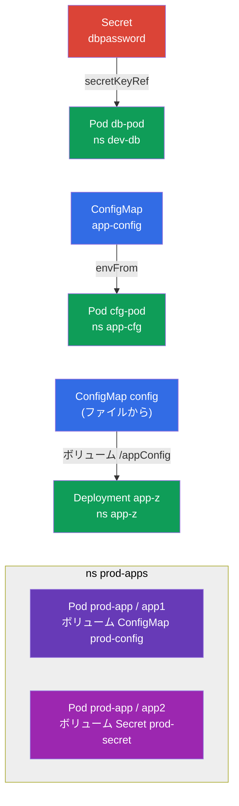

[Русская версия](README_RU.MD) · [Eng version](README.MD) · [Versión en español](README_ES.MD) · [Version française](README_FR.MD) · [Deutsche Version](README_DE.MD) · [ქართული ვერსია](README_GE.MD) · [繁體中文版](README_TW.MD)

# Lab 105 - 設定：ConfigMap、Secret、環境変数

## 概要

アプリケーションへ設定を渡すための実習です - Environment/Config/Security
ドメインの中核にあたります。ここでは 2 つの重要なオブジェクト、**Secret**（機微な
データ用）と **ConfigMap**（通常の設定用）を扱い、さらにそれらを Pods へ
接続するすべての方法、つまり環境変数（`env`、`envFrom`）経由と
ボリュームのマウント経由を練習します。

すべての課題は試験形式（実際の CKA/CKAD の問題と同じスタイル）で書かれており、
`check_result` コマンドで自動的に検証されます。オブジェクト自体は命令的に作るのが
最速です（`kubectl create secret/configmap`）。Pod への接続はマニフェストで行います。

## 目的

コースの章の内容を定着させます:

- [第 17 章。コマンド、引数、環境変数](../../course/17/README.md) - `env`、`envFrom`、`secretKeyRef`、`configMapKeyRef`
- [第 18 章。ConfigMap](../../course/18/README.md) - 設定を変数として、またボリューム内のファイルとして扱う
- [第 19 章。Secret](../../course/19/README.md) - 機微なデータの保存とコンテナへの受け渡し

## 何を作り、なぜ作るのか

このラボでは、設定をコンテナへ届ける典型的な方法をすべて見ていきます - 環境変数
1 つだけの場合から、ファイルとしてマウントする場合まで。各オブジェクトには役割があります:

| オブジェクト | 何なのか | このラボでの目的 |
|--------|---------|-------------------|
| **Secret `dbpassword` + Pod `db-pod`** | Secret と、その Secret から env を受け取る Pod | `secretKeyRef` でパスワードを環境変数へ渡す方法を学ぶ（第 19 章） |
| **ConfigMap `app-config` + Pod `cfg-pod`** | ConfigMap と、その ConfigMap から env を受け取る Pod | 設定を変数として接続する（`envFrom`/`configMapKeyRef`）（第 18 章） |
| **ConfigMap `config`（ファイルから）+ Deployment `app-z`** | ボリュームとしてマウントされる設定ファイル | ConfigMap をファイルとして `/appConfig` にマウントする方法を学ぶ（第 18 章） |
| **Pod `prod-app` 内の Secret + ConfigMap** | コンテナ 2 つの Pod | Secret と ConfigMap の両方を同時にボリュームでマウントする（第 18、19 章） |

最終的にデプロイされる全体像:



## インフラストラクチャ

環境は Terragrunt を使って AWS（`eu-central-1`）にデプロイされ、次の構成要素からなります:

| コンポーネント  | 説明                                                    |
|------------|-------------------------------------------------------------|
| `vpc`      | VPC `10.10.0.0/16`、パブリックサブネット付き                    |
| `ssh-keys` | ノードへアクセスするための SSH 鍵                                |
| `k8s-1`    | Kubernetes `1.35.2`（kubeadm）、CNI Calico、metrics-server、単一ノード |
| `worker`   | `kubectl` と `check_result` が入った作業マシン。起動時に課題 3 用のファイル `/var/work/105/config.yaml` を作成します |

インスタンス: `t4g.medium`（master）、Ubuntu `22.04`。クラスタは単一ノードで、master の
テイントは外されています（`control-plane` taint を削除済み）。そのため Pod は master に直接スケジュールされます。

## デプロイ

```bash
TASK=105 make run_cka_task
```

作成が終わったら、SSH で作業マシン（worker）に接続し、そこで課題を進めてください。
`kubectl` はすでにコンテキスト `cluster1-admin@cluster1` に設定されています。

作業マシンで使える便利なコマンド:

```bash
time_left       # 残り時間
check_result    # 解答をチェックする
```

## 課題

---
|        **1**        | **Secret と、そこから環境変数を受け取る Pod**              |
| :-----------------: | :----------------------------------------------------------- |
| やること          | namespace `dev-db` を作成します。その中に、キー `pwd=my-secret-pwd` を持つ `dbpassword` という名前の Secret を作成します。Pod `db-pod`（イメージ `mysql:8.0`）を起動し、その環境変数 `MYSQL_ROOT_PASSWORD` を `secretKeyRef` 経由でこの Secret（キー `pwd`）から取得するようにします。 |
| 受け入れ基準    | - namespace `dev-db` が存在する。<br/>- Secret `dbpassword`、キー `pwd=my-secret-pwd`。<br/>- Pod `db-pod`、イメージ `mysql:8.0`、env `MYSQL_ROOT_PASSWORD` が Secret `dbpassword`/`pwd` から取得されている。 |
---
|        **2**        | **環境変数としての ConfigMap**                       |
| :-----------------: | :----------------------------------------------------------- |
| やること          | namespace `app-cfg` を作成します。ペア `COLOR=blue` を含む ConfigMap `app-config` を作成します。この ConfigMap のキーを環境変数として受け取る Pod `cfg-pod` を起動します（`envFrom` または `configMapKeyRef` 経由）。 |
| 受け入れ基準    | - namespace `app-cfg` が存在する。<br/>- ConfigMap `app-config`、`COLOR=blue`。<br/>- Pod `cfg-pod` が ConfigMap `app-config` から変数を受け取っている。 |
---
|        **3**        | **ファイルから作り、ボリュームでマウントする ConfigMap**                 |
| :-----------------: | :----------------------------------------------------------- |
| やること          | namespace `app-z` を作成します。ファイル `/var/work/105/config.yaml`（すでに作業マシン上にあります）から ConfigMap `config` を作成します。この ConfigMap をコンテナの `/appConfig` ディレクトリへボリュームとしてマウントする Deployment `app-z` をデプロイします。 |
| 受け入れ基準    | - namespace `app-z` が存在する。<br/>- ConfigMap `config` が `/var/work/105/config.yaml` から作成されている。<br/>- Deployment `app-z` が `config` を `/appConfig` にマウントしている。 |
---
|        **4**        | **Pod にマウントする Secret と ConfigMap**                 |
| :-----------------: | :----------------------------------------------------------- |
| やること          | namespace `prod-apps` を作成します。Secret `prod-secret`（キー `var1=aaa`、`var2=bbb`）と ConfigMap `prod-config`（キー `config.yaml`）を作成します。コンテナ 2 つからなる Pod `prod-app` を起動します。コンテナ `app1` は ConfigMap `prod-config` をボリュームでマウントし、コンテナ `app2` は Secret `prod-secret` をマウントします。 |
| 受け入れ基準    | - namespace `prod-apps` が存在する。<br/>- Secret `prod-secret`（`var1=aaa`、`var2=bbb`）、ConfigMap `prod-config`（`config.yaml`）。<br/>- Pod `prod-app`: コンテナ `app1` が `prod-config` を、`app2` が `prod-secret` をマウントしている。 |
---

## 結果のチェック

作業マシンで自動チェックを実行します:

```bash
check_result
```

スクリプトがテストを実行し、いくつの課題が完了したかを表示します。

## 解答

リファレンス解答: [worker/files/solutions/1_JP.MD](worker/files/solutions/1_JP.MD)

## 模擬試験のカバー範囲

このラボは模擬試験の設定関連の課題をカバーします: CKA mock 01（第 20 問 - Secret + ConfigMap + マウント付きの
Pod）、CKAD mock 01（第 3 問 - Secret → env）、CKAD mock 02（第 1 問 - Secret → env、第 11 問 -
Secret → env、第 19 問 - Deployment 内のファイルからの ConfigMap）。

## クラスタとリソースの削除

```bash
TASK=105 make delete_cka_task
```
