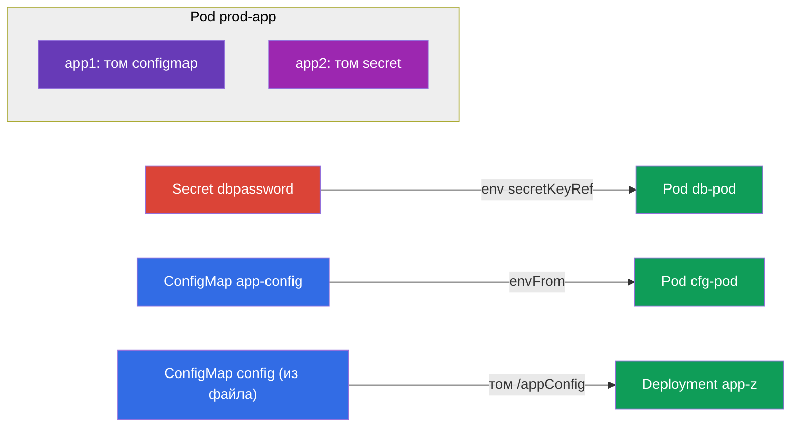

# Lab 105 — Конфигурация: ConfigMap, Secret, переменные окружения

## Описание

Практическая работа по передаче конфигурации в приложения — ядро домена
Environment/Config/Security. Вы отработаете два ключевых объекта: **Secret** (для
чувствительных данных) и **ConfigMap** (для обычной конфигурации), а также все способы
их подключения к подам: через переменные окружения (`env`, `envFrom`) и через
монтирование томом.

Все задания в экзаменационном стиле с автопроверкой `check_result`.

## Цель

Закрепить главы курса:

- [Глава 17. Команды, аргументы и переменные окружения](../../course/17/ru.md)
- [Глава 18. ConfigMap](../../course/18/ru.md)
- [Глава 19. Secret](../../course/19/ru.md)

## Что мы создаём и зачем

| Объект | Что это | Зачем в этой лабе |
|--------|---------|-------------------|
| **Secret `dbpassword` + под `db-pod`** | секрет и под с env из секрета | учимся пробрасывать пароль в переменную окружения через `secretKeyRef` |
| **ConfigMap `app-config` + под `cfg-pod`** | конфиг и под с env из конфига | подключаем конфиг как переменные (`envFrom`/`configMapKeyRef`) |
| **ConfigMap `config` (из файла) + деплой `app-z`** | конфиг-файл, смонтированный томом | учимся монтировать ConfigMap как файлы в `/appConfig` |
| **Секрет + ConfigMap в поде `prod-app`** | под с двумя контейнерами | монтируем и секрет, и конфиг томами одновременно |



## Инфраструктура

| Компонент  | Описание                                                    |
|------------|-------------------------------------------------------------|
| `k8s-1`    | Kubernetes `1.35.2` (kubeadm), Calico, metrics-server, одноузловой |
| `worker`   | Рабочая машина; при старте создаёт `/var/work/105/config.yaml` для задания 3 |

## Развёртывание

```bash
TASK=105 make run_cka_task
```

## Задания

---
|        **1**        | **Секрет и под с переменной окружения из него**              |
| :-----------------: | :----------------------------------------------------------- |
| Что делаем          | Кладём пароль в Secret и пробрасываем его в env контейнера    |
| Критерии приёмки    | - Неймспейс: `dev-db`<br/>- Secret: `dbpassword`, ключ `pwd=my-secret-pwd`<br/>- Pod: `db-pod`, image `mysql:8.0`, env `MYSQL_ROOT_PASSWORD` из секрета `dbpassword`/`pwd` |
---
|        **2**        | **ConfigMap как переменные окружения**                       |
| :-----------------: | :----------------------------------------------------------- |
| Что делаем          | Создаём конфиг и подключаем его ключи как env                 |
| Критерии приёмки    | - Неймспейс: `app-cfg`<br/>- ConfigMap: `app-config`, `COLOR=blue`<br/>- Pod: `cfg-pod` получает переменную из `app-config` |
---
|        **3**        | **ConfigMap из файла, смонтированный томом**                 |
| :-----------------: | :----------------------------------------------------------- |
| Что делаем          | Создаём конфиг из файла и монтируем его как том в деплой       |
| Критерии приёмки    | - Неймспейс: `app-z`<br/>- ConfigMap `config` из `/var/work/105/config.yaml`<br/>- Deployment `app-z` монтирует `config` в `/appConfig` |
---
|        **4**        | **Секрет и ConfigMap, смонтированные в под**                 |
| :-----------------: | :----------------------------------------------------------- |
| Что делаем          | Под с двумя контейнерами: один монтирует конфиг, другой — секрет |
| Критерии приёмки    | - Неймспейс: `prod-apps`<br/>- Secret `prod-secret` (var1=aaa, var2=bbb), ConfigMap `prod-config` (config.yaml)<br/>- Pod `prod-app`: контейнер `app1` монтирует `prod-config`, `app2` — `prod-secret` |
---

## Проверка результата

```bash
check_result
```

## Решение

[worker/files/solutions/1.MD](worker/files/solutions/1.MD)

## Покрытие мок-экзаменов

CKA mock 01 (№20 — secret+configmap+pod с монтированием), CKAD mock 01 (№3 — secret→env),
CKAD mock 02 (№1 — secret→env, №11 — secret→env, №19 — configmap из файла в деплой).

## Удаление

```bash
TASK=105 make delete_cka_task
```
