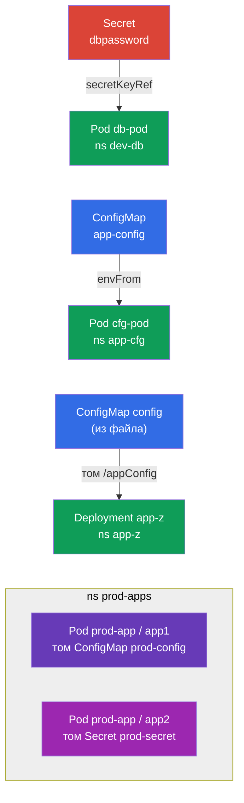

# Lab 105 — Конфигурация: ConfigMap, Secret, переменные окружения

## Описание

Практическая работа по передаче конфигурации в приложения — ядро домена
Environment/Config/Security. Вы отработаете два ключевых объекта: **Secret** (для
чувствительных данных) и **ConfigMap** (для обычной конфигурации), а также все способы их
подключения к Pods: через переменные окружения (`env`, `envFrom`) и через монтирование
томом.

Все задания оформлены в экзаменационном стиле (как реальные вопросы CKA/CKAD) с
автоматической проверкой командой `check_result`. Сами объекты быстрее всего создавать
императивно (`kubectl create secret/configmap`), а подключение к Pod — манифестом.

## Цель

Закрепить материал глав курса:

- [Глава 17. Команды, аргументы и переменные окружения](../../course/17/ru.md) — `env`, `envFrom`, `secretKeyRef`, `configMapKeyRef`
- [Глава 18. ConfigMap](../../course/18/ru.md) — конфиг как переменные и как файлы в томе
- [Глава 19. Secret](../../course/19/ru.md) — хранение чувствительных данных и их проброс в контейнер

## Что мы создаём и зачем

В этой лабе мы разбираем все типовые способы доставить конфигурацию в контейнер — от
одной переменной окружения до смонтированных файлов. Каждый объект решает свою задачу:

| Объект | Что это | Зачем в этой лабе |
|--------|---------|-------------------|
| **Secret `dbpassword` + Pod `db-pod`** | секрет и Pod с env из секрета | учимся пробрасывать пароль в переменную окружения через `secretKeyRef` (глава 19) |
| **ConfigMap `app-config` + Pod `cfg-pod`** | конфиг и Pod с env из конфига | подключаем конфиг как переменные (`envFrom`/`configMapKeyRef`) (глава 18) |
| **ConfigMap `config` (из файла) + Deployment `app-z`** | конфиг-файл, смонтированный томом | учимся монтировать ConfigMap как файлы в `/appConfig` (глава 18) |
| **Secret + ConfigMap в Pod `prod-app`** | Pod с двумя контейнерами | монтируем и Secret, и ConfigMap томами одновременно (главы 18, 19) |

Итоговая картина того, что будет развёрнуто:



## Инфраструктура

Окружение разворачивается в AWS (`eu-central-1`) через Terragrunt и состоит из:

| Компонент  | Описание                                                    |
|------------|-------------------------------------------------------------|
| `vpc`      | VPC `10.10.0.0/16` с публичными подсетями                    |
| `ssh-keys` | SSH-ключи для доступа к нодам                                |
| `k8s-1`    | Kubernetes `1.35.2` (kubeadm), CNI Calico, metrics-server, одноузловой |
| `worker`   | Рабочая машина с `kubectl` и `check_result`; при старте создаёт файл `/var/work/105/config.yaml` для задания 3 |

Инстансы: `t3.medium` (master) Ubuntu `22.04`. Кластер одноузловой — master
«разтейнчен» (снят taint `control-plane`), поэтому поды планируются прямо на него.

## Развёртывание

```bash
TASK=105 make run_cka_task
```

После создания подключитесь к рабочей машине (worker) по SSH и выполняйте задания
оттуда. `kubectl` уже настроен на контекст `cluster1-admin@cluster1`.

Полезные команды на рабочей машине:

```bash
time_left       # сколько осталось времени
check_result    # проверить решение
```

## Задания

---
|        **1**        | **Secret и Pod с переменной окружения из него**              |
| :-----------------: | :----------------------------------------------------------- |
| Что делаем          | Создайте namespace `dev-db`. Создайте в нём Secret с именем `dbpassword` с ключом `pwd=my-secret-pwd`. Запустите Pod `db-pod` (образ `mysql:8.0`), в котором переменная окружения `MYSQL_ROOT_PASSWORD` берётся из этого Secret (ключ `pwd`) через `secretKeyRef`. |
| Критерии приёмки    | - namespace `dev-db` существует;<br/>- Secret `dbpassword`, ключ `pwd=my-secret-pwd`;<br/>- Pod `db-pod`, образ `mysql:8.0`, env `MYSQL_ROOT_PASSWORD` из секрета `dbpassword`/`pwd`. |
---
|        **2**        | **ConfigMap как переменные окружения**                       |
| :-----------------: | :----------------------------------------------------------- |
| Что делаем          | Создайте namespace `app-cfg`. Создайте ConfigMap `app-config` с парой `COLOR=blue`. Запустите Pod `cfg-pod`, который получает ключи этого ConfigMap как переменные окружения (через `envFrom` или `configMapKeyRef`). |
| Критерии приёмки    | - namespace `app-cfg` существует;<br/>- ConfigMap `app-config`, `COLOR=blue`;<br/>- Pod `cfg-pod` получает переменную из ConfigMap `app-config`. |
---
|        **3**        | **ConfigMap из файла, смонтированный томом**                 |
| :-----------------: | :----------------------------------------------------------- |
| Что делаем          | Создайте namespace `app-z`. Создайте ConfigMap `config` из файла `/var/work/105/config.yaml` (он уже лежит на рабочей машине). Разверните Deployment `app-z`, который монтирует этот ConfigMap как том в каталог `/appConfig` контейнера. |
| Критерии приёмки    | - namespace `app-z` существует;<br/>- ConfigMap `config` создан из `/var/work/105/config.yaml`;<br/>- Deployment `app-z` монтирует `config` в `/appConfig`. |
---
|        **4**        | **Secret и ConfigMap, смонтированные в Pod**                 |
| :-----------------: | :----------------------------------------------------------- |
| Что делаем          | Создайте namespace `prod-apps`. Создайте Secret `prod-secret` (ключи `var1=aaa`, `var2=bbb`) и ConfigMap `prod-config` (ключ `config.yaml`). Запустите Pod `prod-app` из двух контейнеров: контейнер `app1` монтирует томом ConfigMap `prod-config`, контейнер `app2` — Secret `prod-secret`. |
| Критерии приёмки    | - namespace `prod-apps` существует;<br/>- Secret `prod-secret` (`var1=aaa`, `var2=bbb`), ConfigMap `prod-config` (`config.yaml`);<br/>- Pod `prod-app`: контейнер `app1` монтирует `prod-config`, `app2` — `prod-secret`. |
---

## Проверка результата

На рабочей машине запустите автоматическую проверку:

```bash
check_result
```

Скрипт прогонит тесты и покажет, сколько заданий выполнено.

## Решение

Эталонное решение: [worker/files/solutions/1.MD](worker/files/solutions/1.MD)

## Покрытие мок-экзаменов

Лаба закрывает задания моков по конфигурации: CKA mock 01 (№20 — Secret + ConfigMap + Pod
с монтированием), CKAD mock 01 (№3 — Secret → env), CKAD mock 02 (№1 — Secret → env, №11 —
Secret → env, №19 — ConfigMap из файла в Deployment).

## Удаление кластера и ресурсов

```bash
TASK=105 make delete_cka_task
```
