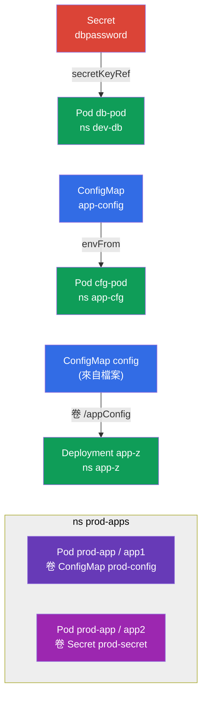

[Русская версия](README_RU.MD) · [Eng version](README.MD) · [Versión en español](README_ES.MD) · [Version française](README_FR.MD) · [Deutsche Version](README_DE.MD) · [ქართული ვერსია](README_GE.MD) · [日本語版](README_JP.MD)

# Lab 105 - 設定：ConfigMap、Secret、環境變數

## 說明

這是一個關於把設定傳入應用程式的實作練習 - 也就是
Environment/Config/Security 領域的核心。你會練習兩個關鍵物件：**Secret**（用於
敏感資料）與 **ConfigMap**（用於一般設定），
以及把它們接進 Pods 的所有方式：透過環境變數（`env`、`envFrom`）
以及透過掛載卷。

所有題目都以考試風格撰寫（就像真正的 CKA/CKAD 題目），並用 `check_result` 指令
自動驗證。這些物件本身用命令式方式建立最快（`kubectl create secret/configmap`），
而把它們接到 Pod 上則用 manifest 完成。

## 目標

複習並鞏固課程章節的內容：

- [第 17 章。指令、參數與環境變數](../../course/17/README.md) - `env`、`envFrom`、`secretKeyRef`、`configMapKeyRef`
- [第 18 章。ConfigMap](../../course/18/README.md) - 把設定當作變數以及當作卷中的檔案
- [第 19 章。Secret](../../course/19/README.md) - 儲存敏感資料並把它傳進容器

## 我們要建立什麼以及為什麼

在這個實驗中，我們會走過把設定送進容器的所有典型方式 - 從單一個環境變數
到掛載成檔案。每個物件都有自己的用途：

| 物件 | 這是什麼 | 為什麼出現在這個實驗中 |
|--------|---------|-------------------|
| **Secret `dbpassword` + Pod `db-pod`** | 一個 Secret 以及 env 來自該 Secret 的 Pod | 學習透過 `secretKeyRef` 把密碼傳進環境變數（第 19 章） |
| **ConfigMap `app-config` + Pod `cfg-pod`** | 一個 ConfigMap 以及 env 來自該 ConfigMap 的 Pod | 把設定當作變數接入（`envFrom`/`configMapKeyRef`）（第 18 章） |
| **ConfigMap `config`（來自檔案）+ Deployment `app-z`** | 以卷方式掛載的設定檔 | 學習把 ConfigMap 當作檔案掛載到 `/appConfig`（第 18 章） |
| **Pod `prod-app` 中的 Secret + ConfigMap** | 有兩個容器的 Pod | 同時把 Secret 與 ConfigMap 都以卷的方式掛載（第 18、19 章） |

最終部署出來的整體樣貌：



## 基礎架構

環境透過 Terragrunt 部署在 AWS（`eu-central-1`），由以下部分組成：

| 元件  | 說明                                                    |
|------------|-------------------------------------------------------------|
| `vpc`      | VPC `10.10.0.0/16`，含公有子網                    |
| `ssh-keys` | 用於存取節點的 SSH 金鑰                                |
| `k8s-1`    | Kubernetes `1.35.2`（kubeadm）、CNI Calico、metrics-server，單節點 |
| `worker`   | 帶有 `kubectl` 與 `check_result` 的工作機；啟動時會為題目 3 建立檔案 `/var/work/105/config.yaml` |

實例：`t4g.medium`（master），Ubuntu `22.04`。叢集是單節點的 - master
已移除污點（移除了 `control-plane` taint），因此 Pod 會直接排程到它上面。

## 部署

```bash
TASK=105 make run_cka_task
```

建立完成後，透過 SSH 連上工作機（worker），並在那裡完成題目。
`kubectl` 已經指向 `cluster1-admin@cluster1` 上下文。

工作機上的實用指令：

```bash
time_left       # 還剩多少時間
check_result    # 檢查你的解答
```

## 題目

---
|        **1**        | **Secret 以及使用其環境變數的 Pod**              |
| :-----------------: | :----------------------------------------------------------- |
| 要做什麼          | 建立 namespace `dev-db`。在其中建立名為 `dbpassword` 的 Secret，鍵為 `pwd=my-secret-pwd`。啟動 Pod `db-pod`（映像 `mysql:8.0`），其中環境變數 `MYSQL_ROOT_PASSWORD` 透過 `secretKeyRef` 取自該 Secret（鍵 `pwd`）。 |
| 驗收標準    | - namespace `dev-db` 存在；<br/>- Secret `dbpassword`，鍵 `pwd=my-secret-pwd`；<br/>- Pod `db-pod`，映像 `mysql:8.0`，env `MYSQL_ROOT_PASSWORD` 來自 Secret `dbpassword`/`pwd`。 |
---
|        **2**        | **ConfigMap 作為環境變數**                       |
| :-----------------: | :----------------------------------------------------------- |
| 要做什麼          | 建立 namespace `app-cfg`。建立 ConfigMap `app-config`，包含一組 `COLOR=blue`。啟動 Pod `cfg-pod`，讓它把這個 ConfigMap 的鍵當作環境變數取得（透過 `envFrom` 或 `configMapKeyRef`）。 |
| 驗收標準    | - namespace `app-cfg` 存在；<br/>- ConfigMap `app-config`，`COLOR=blue`；<br/>- Pod `cfg-pod` 從 ConfigMap `app-config` 取得變數。 |
---
|        **3**        | **從檔案建立並以卷掛載的 ConfigMap**                 |
| :-----------------: | :----------------------------------------------------------- |
| 要做什麼          | 建立 namespace `app-z`。從檔案 `/var/work/105/config.yaml` 建立 ConfigMap `config`（該檔案已經在工作機上）。部署 Deployment `app-z`，把這個 ConfigMap 以卷的方式掛載到容器的 `/appConfig` 目錄。 |
| 驗收標準    | - namespace `app-z` 存在；<br/>- ConfigMap `config` 由 `/var/work/105/config.yaml` 建立；<br/>- Deployment `app-z` 把 `config` 掛載到 `/appConfig`。 |
---
|        **4**        | **掛載進 Pod 的 Secret 與 ConfigMap**                 |
| :-----------------: | :----------------------------------------------------------- |
| 要做什麼          | 建立 namespace `prod-apps`。建立 Secret `prod-secret`（鍵 `var1=aaa`、`var2=bbb`）以及 ConfigMap `prod-config`（鍵 `config.yaml`）。啟動由兩個容器組成的 Pod `prod-app`：容器 `app1` 以卷方式掛載 ConfigMap `prod-config`，容器 `app2` 掛載 Secret `prod-secret`。 |
| 驗收標準    | - namespace `prod-apps` 存在；<br/>- Secret `prod-secret`（`var1=aaa`、`var2=bbb`）、ConfigMap `prod-config`（`config.yaml`）；<br/>- Pod `prod-app`：容器 `app1` 掛載 `prod-config`，`app2` 掛載 `prod-secret`。 |
---

## 檢查結果

在工作機上執行自動驗證：

```bash
check_result
```

腳本會跑完測試，並顯示已完成多少題。

## 解答

參考解答：[worker/files/solutions/1_TW.MD](worker/files/solutions/1_TW.MD)

## 模擬考涵蓋範圍

本實驗覆蓋了模擬考中的設定類題目：CKA mock 01（第 20 題 - Secret + ConfigMap + 帶掛載的
Pod）、CKAD mock 01（第 3 題 - Secret → env）、CKAD mock 02（第 1 題 - Secret → env、第 11 題 -
Secret → env、第 19 題 - Deployment 中來自檔案的 ConfigMap）。

## 刪除叢集與資源

```bash
TASK=105 make delete_cka_task
```
