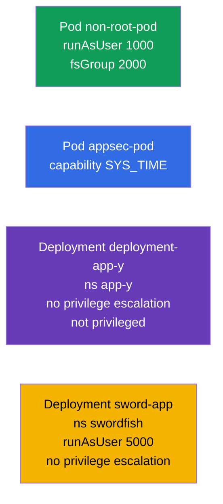

[Русская версия](README_RU.MD) · [Versión en español](README_ES.MD) · [Version française](README_FR.MD) · [Deutsche Version](README_DE.MD) · [ქართული ვერსია](README_GE.MD)

# Lab 106 — Application Security: SecurityContext and Capabilities

## Description

A hands-on lab on security settings at the Pod and container level. You will practice the
key **SecurityContext** fields: running as an unprivileged user (`runAsUser`, `fsGroup`),
granting individual Linux capabilities (`SYS_TIME`), forbidding privilege escalation
(`allowPrivilegeEscalation`) and forbidding privileged mode (`privileged`). This is the
principle of least privilege put into practice.

All tasks are written in exam style (like real CKA/CKAD questions) with automatic
validation via the `check_result` command. `securityContext` is set in the manifest, so it
is more convenient to prepare a skeleton with `--dry-run=client -o yaml` and then add the
required fields.

## Goal

Reinforce the material from the course chapters:

- [Chapter 20. SecurityContext and capabilities](../../course/20/ru.md) — `runAsUser`, `fsGroup`, capabilities, `allowPrivilegeEscalation`, `privileged`
- [Chapter 21. ServiceAccount; authn/authz/admission](../../course/21/ru.md) — the security context within the overall access model

## What We Build and Why

In this lab we tighten container permissions step by step — from running as non-root to
granting a single capability precisely. Every object serves its own purpose:

| Object | What it is | Why it is in this lab |
|--------|------------|-----------------------|
| **Pod `non-root-pod`** | Pod with `runAsUser`/`fsGroup` | learn to run a container as non-root and set the owning group for volumes (chapter 20) |
| **Pod `appsec-pod`** | Pod with a capability | grant the process only the privilege it needs (`SYS_TIME`) instead of full root (chapter 20) |
| **Deployment `deployment-app-y`** (namespace `app-y`) | Deployment with restrictions | forbid privilege escalation and privileged mode (chapter 20) |
| **Deployment `sword-app`** (namespace `swordfish`) | updating `securityContext` | set `runAsUser` and forbid escalation on an existing Deployment (chapter 20) |

The final picture of what will be deployed:



## Infrastructure

The environment is deployed in AWS (`eu-central-1`) via Terragrunt and consists of:

| Component  | Description                                                  |
|------------|--------------------------------------------------------------|
| `vpc`      | VPC `10.10.0.0/16` with public subnets                        |
| `ssh-keys` | SSH keys for node access                                      |
| `k8s-1`    | Kubernetes `1.35.2` (kubeadm), Calico CNI, metrics-server, single-node |
| `worker`   | Work machine with `kubectl` and `check_result`               |

Instances: `t3.medium` (master), Ubuntu `22.04`. The cluster is single-node — the master is
untainted (the `control-plane` taint is removed), so Pods are scheduled directly on it.

## Deployment

```bash
TASK=106 make run_cka_task
```

Once it is created, connect to the work machine (worker) over SSH and do the tasks from
there. `kubectl` is already pointed at the `cluster1-admin@cluster1` context.

Handy commands on the work machine:

```bash
time_left       # how much time is left
check_result    # check your solution
```

## Tasks

---
|        **1**        | **Run a Pod as an unprivileged user**                        |
| :-----------------: | :----------------------------------------------------------- |
| What to do          | Create a Pod `non-root-pod` (image `redis:alpine`) and in the Pod-level `securityContext` set `runAsUser: 1000` (the process runs as UID 1000, not root) and `fsGroup: 2000` (this group becomes the owner of the mounted volumes). |
| Acceptance criteria | - Pod `non-root-pod`, image `redis:alpine`;<br/>- `runAsUser: 1000`, `fsGroup: 2000`. |
---
|        **2**        | **Grant the container a single capability**                   |
| :-----------------: | :----------------------------------------------------------- |
| What to do          | Create a Pod `appsec-pod` (image `ubuntu:22.04`, command `sleep 4800`) and in the container `securityContext` add the Linux capability `SYS_TIME` (`capabilities.add`). This way the process can change the system time without getting full root. |
| Acceptance criteria | - Pod `appsec-pod`, image `ubuntu:22.04`, command `sleep 4800`;<br/>- capability `SYS_TIME` is added. |
---
|        **3**        | **Forbid privilege escalation in a Deployment**               |
| :-----------------: | :----------------------------------------------------------- |
| What to do          | Create the namespace `app-y`. Deploy in it a Deployment `deployment-app-y` (image `viktoruj/ping_pong:alpine`) and in the container `securityContext` set `allowPrivilegeEscalation: false` (the process cannot raise its privileges) and `privileged: false` (the container does not run in privileged mode). |
| Acceptance criteria | - namespace `app-y` exists;<br/>- Deployment `deployment-app-y`, image `viktoruj/ping_pong:alpine`;<br/>- `allowPrivilegeEscalation: false`, `privileged: false`. |
---
|        **4**        | **Set the UID and forbid escalation on an existing Deployment** |
| :-----------------: | :----------------------------------------------------------- |
| What to do          | Create the namespace `swordfish` and a Deployment `sword-app` (image `viktoruj/ping_pong:alpine`). Then tighten the `securityContext` of its container: `runAsUser: 5000` and `allowPrivilegeEscalation: false`. |
| Acceptance criteria | - namespace `swordfish` exists;<br/>- Deployment `sword-app`;<br/>- `runAsUser: 5000`, `allowPrivilegeEscalation: false`. |
---

## Checking the Result

On the work machine run the automatic validation:

```bash
check_result
```

The script runs the tests and shows how many tasks are complete.

## Solution

Reference solution: [worker/files/solutions/1.MD](worker/files/solutions/1.MD)

## Mock Exam Coverage

The lab covers the application-security tasks of the mocks: CKA mock 01 (#15 — `SYS_TIME`,
#19 — `runAsUser`/`fsGroup`), CKAD mock 01 (#7 — root + `SYS_TIME`), CKAD mock 02 (#6 —
`runAsUser 5000` + no escalation, #18 — no privilege escalation/privileged).

## Deleting the Cluster and Resources

```bash
TASK=106 make delete_cka_task
```
