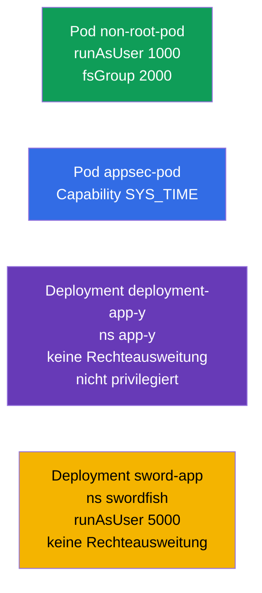

[Русская версия](README_RU.MD) · [Eng version](README.MD) · [Versión en español](README_ES.MD) · [Version française](README_FR.MD) · [ქართული ვერსია](README_GE.MD) · [繁體中文版](README_TW.MD) · [日本語版](README_JP.MD)

# Lab 106 — Anwendungssicherheit: SecurityContext und Capabilities

## Beschreibung

Praxisübung zu Sicherheitseinstellungen auf Pod- und Container-Ebene. Du übst die
wichtigsten Felder von **SecurityContext**: Start unter einem unprivilegierten Benutzer
(`runAsUser`, `fsGroup`), Vergabe einzelner Linux-Capabilities (`SYS_TIME`), Verbot der
Rechteausweitung (`allowPrivilegeEscalation`) und Verbot des privilegierten Modus
(`privileged`). Das ist die praktische Umsetzung des Prinzips der geringsten Rechte.

Alle Aufgaben sind im Prüfungsstil formuliert (wie echte CKA/CKAD-Fragen) mit automatischer
Prüfung über den Befehl `check_result`. Der `securityContext` wird im Manifest gesetzt,
daher ist es bequemer, mit `--dry-run=client -o yaml` ein Grundgerüst zu erzeugen und die
nötigen Felder zu ergänzen.

## Ziel

Den Stoff der Kurskapitel festigen:

- [Kapitel 20. SecurityContext und Capabilities](../../course/20/de.md) — `runAsUser`, `fsGroup`, Capabilities, `allowPrivilegeEscalation`, `privileged`
- [Kapitel 21. ServiceAccount; authn/authz/admission](../../course/21/de.md) — der Sicherheitskontext im gesamten Zugriffsmodell

## Was wir erstellen und warum

In diesem Lab verschärfen wir schrittweise die Rechte der Container — vom Start ohne root
bis zur punktuellen Vergabe einer einzelnen Capability. Jedes Objekt erfüllt seine eigene
Aufgabe:

| Objekt | Was das ist | Warum in diesem Lab |
|--------|-------------|---------------------|
| **Pod `non-root-pod`** | Pod mit `runAsUser`/`fsGroup` | lernen, einen Container ohne root zu starten und die Eigentümergruppe der Volumes zu setzen (Kapitel 20) |
| **Pod `appsec-pod`** | Pod mit einer Capability | dem Prozess nur das nötige Privileg geben (`SYS_TIME`) statt root komplett (Kapitel 20) |
| **Deployment `deployment-app-y`** (Namespace `app-y`) | Deployment mit Einschränkungen | Rechteausweitung und privilegierten Modus verbieten (Kapitel 20) |
| **Deployment `sword-app`** (Namespace `swordfish`) | Aktualisierung des `securityContext` | `runAsUser` setzen und Escalation an einem bestehenden Deployment verbieten (Kapitel 20) |

Das Gesamtbild dessen, was ausgerollt wird:



## Infrastruktur

Die Umgebung wird in AWS (`eu-central-1`) über Terragrunt ausgerollt und besteht aus:

| Komponente | Beschreibung                                                 |
|------------|--------------------------------------------------------------|
| `vpc`      | VPC `10.10.0.0/16` mit öffentlichen Subnetzen                 |
| `ssh-keys` | SSH-Schlüssel für den Zugriff auf die Nodes                    |
| `k8s-1`    | Kubernetes `1.35.2` (kubeadm), CNI Calico, metrics-server, ein Node |
| `worker`   | Arbeitsmaschine mit `kubectl` und `check_result`              |

Instanzen: `t4g.medium` (Master), Ubuntu `22.04`. Der Cluster hat einen Node — beim Master
ist der Taint `control-plane` entfernt, daher werden Pods direkt auf ihm geplant.

## Bereitstellung

```bash
TASK=106 make run_cka_task
```

Verbinde dich nach dem Erstellen per SSH mit der Arbeitsmaschine (Worker) und erledige die
Aufgaben von dort. `kubectl` ist bereits auf den Kontext `cluster1-admin@cluster1`
eingestellt.

Nützliche Befehle auf der Arbeitsmaschine:

```bash
time_left       # wie viel Zeit noch bleibt
check_result    # Lösung prüfen
```

## Aufgaben

---
|        **1**        | **Einen Pod unter einem unprivilegierten Benutzer starten**  |
| :-----------------: | :----------------------------------------------------------- |
| Was wir tun         | Erstelle einen Pod `non-root-pod` (Image `redis:alpine`) und setze im `securityContext` auf Pod-Ebene `runAsUser: 1000` (der Prozess läuft unter UID 1000, nicht als root) und `fsGroup: 2000` (diese Gruppe wird Eigentümer der gemounteten Volumes). |
| Abnahmekriterien    | - Pod `non-root-pod`, Image `redis:alpine`;<br/>- `runAsUser: 1000`, `fsGroup: 2000`. |
---
|        **2**        | **Dem Container eine einzelne Capability geben**             |
| :-----------------: | :----------------------------------------------------------- |
| Was wir tun         | Erstelle einen Pod `appsec-pod` (Image `ubuntu:22.04`, Befehl `sleep 4800`) und füge im `securityContext` des Containers die Linux-Capability `SYS_TIME` hinzu (`capabilities.add`). So kann der Prozess die Systemzeit ändern, ohne root komplett zu erhalten. |
| Abnahmekriterien    | - Pod `appsec-pod`, Image `ubuntu:22.04`, Befehl `sleep 4800`;<br/>- Capability `SYS_TIME` ist hinzugefügt. |
---
|        **3**        | **Rechteausweitung im Deployment verbieten**                |
| :-----------------: | :----------------------------------------------------------- |
| Was wir tun         | Erstelle den Namespace `app-y`. Rolle darin ein Deployment `deployment-app-y` (Image `viktoruj/ping_pong:alpine`) aus und setze im `securityContext` des Containers `allowPrivilegeEscalation: false` (der Prozess kann seine Rechte nicht ausweiten) und `privileged: false` (der Container läuft nicht im privilegierten Modus). |
| Abnahmekriterien    | - Namespace `app-y` existiert;<br/>- Deployment `deployment-app-y`, Image `viktoruj/ping_pong:alpine`;<br/>- `allowPrivilegeEscalation: false`, `privileged: false`. |
---
|        **4**        | **UID setzen und Escalation an einem bestehenden Deployment verbieten** |
| :-----------------: | :----------------------------------------------------------- |
| Was wir tun         | Erstelle den Namespace `swordfish` und ein Deployment `sword-app` (Image `viktoruj/ping_pong:alpine`). Verschärfe dann den `securityContext` seines Containers: `runAsUser: 5000` und `allowPrivilegeEscalation: false`. |
| Abnahmekriterien    | - Namespace `swordfish` existiert;<br/>- Deployment `sword-app`;<br/>- `runAsUser: 5000`, `allowPrivilegeEscalation: false`. |
---

## Ergebnisprüfung

Starte auf der Arbeitsmaschine die automatische Prüfung:

```bash
check_result
```

Das Skript führt die Tests aus und zeigt, wie viele Aufgaben erledigt sind.

## Lösung

Referenzlösung: [worker/files/solutions/1_DE.MD](worker/files/solutions/1_DE.MD)

## Abdeckung der Mock-Prüfungen

Das Lab deckt die Aufgaben der Mocks zur Anwendungssicherheit ab: CKA mock 01 (Nr. 15 —
`SYS_TIME`, Nr. 19 — `runAsUser`/`fsGroup`), CKAD mock 01 (Nr. 7 — root + `SYS_TIME`),
CKAD mock 02 (Nr. 6 — `runAsUser 5000` + keine Escalation, Nr. 18 — keine Privilege
Escalation/privileged).

## Löschen von Cluster und Ressourcen

```bash
TASK=106 make delete_cka_task
```
