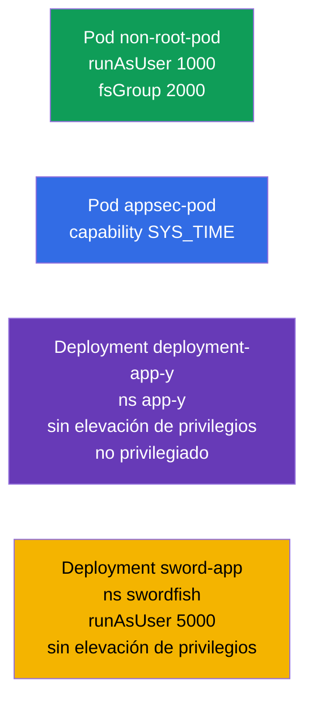

[Русская версия](README_RU.MD) · [Eng version](README.MD) · [Version française](README_FR.MD) · [Deutsche Version](README_DE.MD) · [ქართული ვერსია](README_GE.MD)

# Lab 106 — Seguridad de aplicaciones: SecurityContext y capabilities

## Descripción

Práctica sobre los ajustes de seguridad a nivel de Pod y de contenedor. Trabajarás los
campos clave de **SecurityContext**: ejecución con un usuario sin privilegios
(`runAsUser`, `fsGroup`), concesión de capabilities de Linux concretas (`SYS_TIME`),
prohibición de la elevación de privilegios (`allowPrivilegeEscalation`) y prohibición del
modo privilegiado (`privileged`). Es la puesta en práctica del principio de mínimo
privilegio.

Todas las tareas están redactadas en estilo de examen (como las preguntas reales de
CKA/CKAD) con verificación automática mediante el comando `check_result`. El
`securityContext` se define en el manifiesto, así que resulta más cómodo preparar una
plantilla con `--dry-run=client -o yaml` y añadir después los campos necesarios.

## Objetivo

Consolidar el material de los capítulos del curso:

- [Capítulo 20. SecurityContext y capabilities](../../course/20/ru.md) — `runAsUser`, `fsGroup`, capabilities, `allowPrivilegeEscalation`, `privileged`
- [Capítulo 21. ServiceAccount; authn/authz/admission](../../course/21/ru.md) — el contexto de seguridad dentro del modelo general de acceso

## Qué creamos y para qué

En este laboratorio endurecemos por etapas los permisos de los contenedores: desde no
ejecutar como root hasta conceder de forma puntual una sola capability. Cada objeto
resuelve su propia tarea:

| Objeto | Qué es | Para qué está en este laboratorio |
|--------|--------|-----------------------------------|
| **Pod `non-root-pod`** | Pod con `runAsUser`/`fsGroup` | aprender a ejecutar un contenedor sin ser root y a fijar el grupo propietario de los volúmenes (capítulo 20) |
| **Pod `appsec-pod`** | Pod con una capability | dar al proceso solo el privilegio que necesita (`SYS_TIME`) en lugar de root completo (capítulo 20) |
| **Deployment `deployment-app-y`** (namespace `app-y`) | Deployment con restricciones | prohibir la elevación de privilegios y el modo privilegiado (capítulo 20) |
| **Deployment `sword-app`** (namespace `swordfish`) | actualización del `securityContext` | fijar `runAsUser` y prohibir la escalada en un Deployment ya existente (capítulo 20) |

Panorama final de lo que quedará desplegado:



## Infraestructura

El entorno se despliega en AWS (`eu-central-1`) mediante Terragrunt y consta de:

| Componente | Descripción                                                  |
|------------|--------------------------------------------------------------|
| `vpc`      | VPC `10.10.0.0/16` con subredes públicas                      |
| `ssh-keys` | Claves SSH para el acceso a los nodos                         |
| `k8s-1`    | Kubernetes `1.35.2` (kubeadm), CNI Calico, metrics-server, de un solo nodo |
| `worker`   | Máquina de trabajo con `kubectl` y `check_result`             |

Instancias: `t3.medium` (master), Ubuntu `22.04`. El clúster es de un solo nodo: al master
se le ha quitado el taint `control-plane`, por lo que los pods se planifican directamente
en él.

## Despliegue

```bash
TASK=106 make run_cka_task
```

Tras la creación, conéctate por SSH a la máquina de trabajo (worker) y realiza las tareas
desde allí. `kubectl` ya está configurado con el contexto `cluster1-admin@cluster1`.

Comandos útiles en la máquina de trabajo:

```bash
time_left       # cuánto tiempo queda
check_result    # comprobar la solución
```

## Tareas

---
|        **1**        | **Ejecutar un Pod con un usuario sin privilegios**           |
| :-----------------: | :----------------------------------------------------------- |
| Qué hacemos         | Crea un Pod `non-root-pod` (imagen `redis:alpine`) y en el `securityContext` a nivel de Pod define `runAsUser: 1000` (el proceso corre con el UID 1000, no como root) y `fsGroup: 2000` (este grupo pasa a ser propietario de los volúmenes montados). |
| Criterios de aceptación | - Pod `non-root-pod`, imagen `redis:alpine`;<br/>- `runAsUser: 1000`, `fsGroup: 2000`. |
---
|        **2**        | **Conceder al contenedor una capability concreta**           |
| :-----------------: | :----------------------------------------------------------- |
| Qué hacemos         | Crea un Pod `appsec-pod` (imagen `ubuntu:22.04`, comando `sleep 4800`) y en el `securityContext` del contenedor añade la capability de Linux `SYS_TIME` (`capabilities.add`). Así el proceso podrá cambiar la hora del sistema sin obtener root completo. |
| Criterios de aceptación | - Pod `appsec-pod`, imagen `ubuntu:22.04`, comando `sleep 4800`;<br/>- la capability `SYS_TIME` está añadida. |
---
|        **3**        | **Prohibir la elevación de privilegios en un Deployment**    |
| :-----------------: | :----------------------------------------------------------- |
| Qué hacemos         | Crea el namespace `app-y`. Despliega en él un Deployment `deployment-app-y` (imagen `viktoruj/ping_pong:alpine`) y en el `securityContext` del contenedor define `allowPrivilegeEscalation: false` (el proceso no podrá elevar sus privilegios) y `privileged: false` (el contenedor no está en modo privilegiado). |
| Criterios de aceptación | - el namespace `app-y` existe;<br/>- Deployment `deployment-app-y`, imagen `viktoruj/ping_pong:alpine`;<br/>- `allowPrivilegeEscalation: false`, `privileged: false`. |
---
|        **4**        | **Fijar el UID y prohibir la escalada en un Deployment existente** |
| :-----------------: | :----------------------------------------------------------- |
| Qué hacemos         | Crea el namespace `swordfish` y un Deployment `sword-app` (imagen `viktoruj/ping_pong:alpine`). Después endurece el `securityContext` de su contenedor: `runAsUser: 5000` y `allowPrivilegeEscalation: false`. |
| Criterios de aceptación | - el namespace `swordfish` existe;<br/>- Deployment `sword-app`;<br/>- `runAsUser: 5000`, `allowPrivilegeEscalation: false`. |
---

## Comprobación del resultado

En la máquina de trabajo lanza la verificación automática:

```bash
check_result
```

El script ejecuta los tests y muestra cuántas tareas están completadas.

## Solución

Solución de referencia: [worker/files/solutions/1_ES.MD](worker/files/solutions/1_ES.MD)

## Cobertura de exámenes simulados

El laboratorio cubre las tareas de seguridad de aplicaciones de los simulados: CKA mock 01
(n.º 15 — `SYS_TIME`, n.º 19 — `runAsUser`/`fsGroup`), CKAD mock 01 (n.º 7 — root +
`SYS_TIME`), CKAD mock 02 (n.º 6 — `runAsUser 5000` + sin escalada, n.º 18 — sin privilege
escalation/privileged).

## Eliminación del clúster y los recursos

```bash
TASK=106 make delete_cka_task
```
