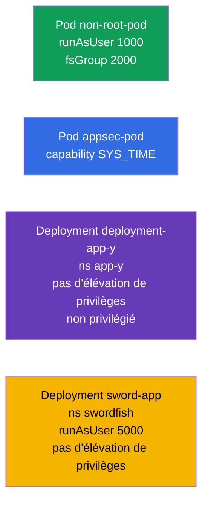

[Русская версия](README_RU.MD) · [Eng version](README.MD) · [Versión en español](README_ES.MD) · [Deutsche Version](README_DE.MD) · [ქართული ვერსია](README_GE.MD) · [繁體中文版](README_TW.MD) · [日本語版](README_JP.MD)

# Lab 106 — Sécurité des applications : SecurityContext et capabilities

## Description

Travail pratique sur les réglages de sécurité au niveau du Pod et du conteneur. Vous
travaillerez les champs clés de **SecurityContext** : exécution sous un utilisateur non
privilégié (`runAsUser`, `fsGroup`), attribution de capabilities Linux ciblées
(`SYS_TIME`), interdiction de l'élévation de privilèges (`allowPrivilegeEscalation`) et
interdiction du mode privilégié (`privileged`). C'est la mise en pratique du principe du
moindre privilège.

Toutes les tâches sont rédigées dans le style de l'examen (comme les vraies questions
CKA/CKAD) avec une vérification automatique via la commande `check_result`. Le
`securityContext` se définit dans le manifeste : il est donc plus pratique de préparer un
squelette avec `--dry-run=client -o yaml` puis d'y ajouter les champs nécessaires.

## Objectif

Consolider le contenu des chapitres du cours :

- [Chapitre 20. SecurityContext et capabilities](../../course/20/fr.md) — `runAsUser`, `fsGroup`, capabilities, `allowPrivilegeEscalation`, `privileged`
- [Chapitre 21. ServiceAccount ; authn/authz/admission](../../course/21/fr.md) — le contexte de sécurité dans le modèle d'accès global

## Ce que nous créons et pourquoi

Dans ce lab, nous durcissons progressivement les droits des conteneurs — depuis l'exécution
hors root jusqu'à l'attribution ciblée d'une seule capability. Chaque objet a son propre
rôle :

| Objet | Ce que c'est | Pourquoi dans ce lab |
|-------|--------------|----------------------|
| **Pod `non-root-pod`** | Pod avec `runAsUser`/`fsGroup` | apprendre à lancer un conteneur hors root et à définir le groupe propriétaire des volumes (chapitre 20) |
| **Pod `appsec-pod`** | Pod avec une capability | ne donner au processus que le privilège nécessaire (`SYS_TIME`) au lieu de root en entier (chapitre 20) |
| **Deployment `deployment-app-y`** (namespace `app-y`) | Deployment avec des restrictions | interdire l'élévation de privilèges et le mode privilégié (chapitre 20) |
| **Deployment `sword-app`** (namespace `swordfish`) | mise à jour du `securityContext` | définir `runAsUser` et interdire l'escalade sur un Deployment existant (chapitre 20) |

Vue d'ensemble de ce qui sera déployé :



## Infrastructure

L'environnement est déployé dans AWS (`eu-central-1`) via Terragrunt et se compose de :

| Composant  | Description                                                  |
|------------|--------------------------------------------------------------|
| `vpc`      | VPC `10.10.0.0/16` avec des sous-réseaux publics               |
| `ssh-keys` | Clés SSH pour l'accès aux nœuds                                |
| `k8s-1`    | Kubernetes `1.35.2` (kubeadm), CNI Calico, metrics-server, mono-nœud |
| `worker`   | Machine de travail avec `kubectl` et `check_result`           |

Instances : `t4g.medium` (master), Ubuntu `22.04`. Le cluster est mono-nœud — le taint
`control-plane` a été retiré du master, les pods sont donc planifiés directement dessus.

## Déploiement

```bash
TASK=106 make run_cka_task
```

Après la création, connectez-vous en SSH à la machine de travail (worker) et effectuez les
tâches depuis celle-ci. `kubectl` est déjà configuré sur le contexte
`cluster1-admin@cluster1`.

Commandes utiles sur la machine de travail :

```bash
time_left       # combien de temps il reste
check_result    # vérifier la solution
```

## Tâches

---
|        **1**        | **Lancer un Pod sous un utilisateur non privilégié**         |
| :-----------------: | :----------------------------------------------------------- |
| Ce qu'on fait       | Créez un Pod `non-root-pod` (image `redis:alpine`) et, dans le `securityContext` au niveau du Pod, définissez `runAsUser: 1000` (le processus tourne sous l'UID 1000 et non root) et `fsGroup: 2000` (ce groupe devient propriétaire des volumes montés). |
| Critères d'acceptation | - Pod `non-root-pod`, image `redis:alpine` ;<br/>- `runAsUser: 1000`, `fsGroup: 2000`. |
---
|        **2**        | **Attribuer au conteneur une capability ciblée**             |
| :-----------------: | :----------------------------------------------------------- |
| Ce qu'on fait       | Créez un Pod `appsec-pod` (image `ubuntu:22.04`, commande `sleep 4800`) et, dans le `securityContext` du conteneur, ajoutez la capability Linux `SYS_TIME` (`capabilities.add`). Ainsi le processus pourra changer l'heure système sans obtenir root en entier. |
| Critères d'acceptation | - Pod `appsec-pod`, image `ubuntu:22.04`, commande `sleep 4800` ;<br/>- la capability `SYS_TIME` est ajoutée. |
---
|        **3**        | **Interdire l'élévation de privilèges dans un Deployment**   |
| :-----------------: | :----------------------------------------------------------- |
| Ce qu'on fait       | Créez le namespace `app-y`. Déployez-y un Deployment `deployment-app-y` (image `viktoruj/ping_pong:alpine`) et, dans le `securityContext` du conteneur, définissez `allowPrivilegeEscalation: false` (le processus ne pourra pas élever ses privilèges) et `privileged: false` (le conteneur n'est pas en mode privilégié). |
| Critères d'acceptation | - le namespace `app-y` existe ;<br/>- Deployment `deployment-app-y`, image `viktoruj/ping_pong:alpine` ;<br/>- `allowPrivilegeEscalation: false`, `privileged: false`. |
---
|        **4**        | **Définir l'UID et interdire l'escalade sur un Deployment existant** |
| :-----------------: | :----------------------------------------------------------- |
| Ce qu'on fait       | Créez le namespace `swordfish` et un Deployment `sword-app` (image `viktoruj/ping_pong:alpine`). Durcissez ensuite le `securityContext` de son conteneur : `runAsUser: 5000` et `allowPrivilegeEscalation: false`. |
| Critères d'acceptation | - le namespace `swordfish` existe ;<br/>- Deployment `sword-app` ;<br/>- `runAsUser: 5000`, `allowPrivilegeEscalation: false`. |
---

## Vérification du résultat

Sur la machine de travail, lancez la vérification automatique :

```bash
check_result
```

Le script exécute les tests et affiche le nombre de tâches réussies.

## Solution

Solution de référence : [worker/files/solutions/1_FR.MD](worker/files/solutions/1_FR.MD)

## Couverture des examens blancs

Le lab couvre les tâches de sécurité applicative des examens blancs : CKA mock 01 (n° 15 —
`SYS_TIME`, n° 19 — `runAsUser`/`fsGroup`), CKAD mock 01 (n° 7 — root + `SYS_TIME`),
CKAD mock 02 (n° 6 — `runAsUser 5000` + pas d'escalade, n° 18 — pas de privilege
escalation/privileged).

## Suppression du cluster et des ressources

```bash
TASK=106 make delete_cka_task
```
