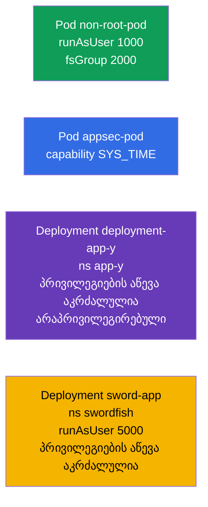

[Русская версия](README_RU.MD) · [Eng version](README.MD) · [Versión en español](README_ES.MD) · [Version française](README_FR.MD) · [Deutsche Version](README_DE.MD) · [繁體中文版](README_TW.MD) · [日本語版](README_JP.MD)

# Lab 106 — აპლიკაციების უსაფრთხოება: SecurityContext და capabilities

## აღწერა

პრაქტიკული სამუშაო უსაფრთხოების პარამეტრებზე Pod-ისა და კონტეინერის დონეზე. თქვენ
ამუშავებთ **SecurityContext**-ის ძირითად ველებს: გაშვება არაპრივილეგირებული
მომხმარებლისგან (`runAsUser`, `fsGroup`), ცალკეული Linux-capability-ის მიცემა
(`SYS_TIME`), პრივილეგიების აწევის აკრძალვა (`allowPrivilegeEscalation`) და
პრივილეგირებული რეჟიმის აკრძალვა (`privileged`). ეს არის უმცირესი პრივილეგიის პრინციპის
პრაქტიკული რეალიზაცია.

ყველა დავალება გამოცდის სტილშია გაფორმებული (როგორც რეალური CKA/CKAD კითხვები) და მათი
შემოწმება ავტომატურად ხდება ბრძანებით `check_result`. `securityContext` მანიფესტში
მიეთითება, ამიტომ უფრო მოსახერხებელია ნიმუშის მომზადება `--dry-run=client -o yaml`-ით და
შემდეგ საჭირო ველების დამატება.

## მიზანი

განამტკიცოთ კურსის თავების მასალა:

- [თავი 20. SecurityContext და capabilities](../../course/20/ge.md) — `runAsUser`, `fsGroup`, capabilities, `allowPrivilegeEscalation`, `privileged`
- [თავი 21. ServiceAccount; authn/authz/admission](../../course/21/ge.md) — უსაფრთხოების კონტექსტი წვდომის საერთო მოდელში

## რას ვქმნით და რისთვის

ამ ლაბორატორიაში ეტაპობრივად ვამკაცრებთ კონტეინერების უფლებებს — root-ის გარეშე გაშვებიდან
ერთი კონკრეტული capability-ის წვდომამდე. თითოეული ობიექტი თავის ამოცანას ასრულებს:

| ობიექტი | რა არის ეს | რისთვის არის ამ ლაბორატორიაში |
|---------|------------|-------------------------------|
| **Pod `non-root-pod`** | Pod `runAsUser`/`fsGroup`-ით | ვსწავლობთ კონტეინერის root-ის გარეშე გაშვებას და ტომების მფლობელი ჯგუფის მითითებას (თავი 20) |
| **Pod `appsec-pod`** | Pod capability-ით | პროცესს ვაძლევთ მხოლოდ საჭირო პრივილეგიას (`SYS_TIME`) და არა root-ს მთლიანად (თავი 20) |
| **Deployment `deployment-app-y`** (namespace `app-y`) | Deployment შეზღუდვებით | ვკრძალავთ პრივილეგიების აწევას და პრივილეგირებულ რეჟიმს (თავი 20) |
| **Deployment `sword-app`** (namespace `swordfish`) | `securityContext`-ის განახლება | არსებულ Deployment-ზე ვაყენებთ `runAsUser`-ს და escalation-ის აკრძალვას (თავი 20) |

საბოლოო სურათი იმისა, რაც განთავსდება:



## ინფრასტრუქტურა

გარემო იშლება AWS-ში (`eu-central-1`) Terragrunt-ის მეშვეობით და შედგება:

| კომპონენტი | აღწერა                                                    |
|------------|-----------------------------------------------------------|
| `vpc`      | VPC `10.10.0.0/16` საჯარო ქვექსელებით                      |
| `ssh-keys` | SSH-გასაღებები node-ებზე წვდომისთვის                        |
| `k8s-1`    | Kubernetes `1.35.2` (kubeadm), CNI Calico, metrics-server, ერთკვანძიანი |
| `worker`   | სამუშაო მანქანა `kubectl`-ით და `check_result`-ით           |

ინსტანსები: `t3.medium` (master), Ubuntu `22.04`. კლასტერი ერთკვანძიანია — master-ს
მოშორებულია taint `control-plane`, ამიტომ pod-ები პირდაპირ მასზე იგეგმება.

## განთავსება

```bash
TASK=106 make run_cka_task
```

შექმნის შემდეგ დაუკავშირდით სამუშაო მანქანას (worker) SSH-ით და დავალებები შეასრულეთ
იქიდან. `kubectl` უკვე კონფიგურირებულია კონტექსტზე `cluster1-admin@cluster1`.

სასარგებლო ბრძანებები სამუშაო მანქანაზე:

```bash
time_left       # რამდენი დრო დარჩა
check_result    # ამოხსნის შემოწმება
```

## დავალებები

---
|        **1**        | **Pod-ის გაშვება არაპრივილეგირებული მომხმარებლისგან**        |
| :-----------------: | :----------------------------------------------------------- |
| რას ვაკეთებთ        | შექმენით Pod `non-root-pod` (image `redis:alpine`) და Pod-ის დონის `securityContext`-ში მიუთითეთ `runAsUser: 1000` (პროცესი მიდის UID 1000-ისგან და არა root-ისგან) და `fsGroup: 2000` (ეს ჯგუფი ხდება მიმაგრებული ტომების მფლობელი). |
| მიღების კრიტერიუმები | - Pod `non-root-pod`, image `redis:alpine`;<br/>- `runAsUser: 1000`, `fsGroup: 2000`. |
---
|        **2**        | **კონტეინერისთვის ცალკეული capability-ის მიცემა**            |
| :-----------------: | :----------------------------------------------------------- |
| რას ვაკეთებთ        | შექმენით Pod `appsec-pod` (image `ubuntu:22.04`, ბრძანება `sleep 4800`) და კონტეინერის `securityContext`-ში დაამატეთ Linux-capability `SYS_TIME` (`capabilities.add`). ასე პროცესი შეძლებს სისტემური დროის შეცვლას root-ის მთლიანად მიღების გარეშე. |
| მიღების კრიტერიუმები | - Pod `appsec-pod`, image `ubuntu:22.04`, ბრძანება `sleep 4800`;<br/>- capability `SYS_TIME` დამატებულია. |
---
|        **3**        | **Deployment-ში პრივილეგიების აწევის აკრძალვა**              |
| :-----------------: | :----------------------------------------------------------- |
| რას ვაკეთებთ        | შექმენით namespace `app-y`. განათავსეთ მასში Deployment `deployment-app-y` (image `viktoruj/ping_pong:alpine`) და კონტეინერის `securityContext`-ში მიუთითეთ `allowPrivilegeEscalation: false` (პროცესი ვერ შეძლებს პრივილეგიების აწევას) და `privileged: false` (კონტეინერი არ არის პრივილეგირებულ რეჟიმში). |
| მიღების კრიტერიუმები | - namespace `app-y` არსებობს;<br/>- Deployment `deployment-app-y`, image `viktoruj/ping_pong:alpine`;<br/>- `allowPrivilegeEscalation: false`, `privileged: false`. |
---
|        **4**        | **UID-ის და escalation-ის აკრძალვის მითითება არსებულ Deployment-ზე** |
| :-----------------: | :----------------------------------------------------------- |
| რას ვაკეთებთ        | შექმენით namespace `swordfish` და Deployment `sword-app` (image `viktoruj/ping_pong:alpine`). შემდეგ გაამკაცრეთ მისი კონტეინერის `securityContext`: `runAsUser: 5000` და `allowPrivilegeEscalation: false`. |
| მიღების კრიტერიუმები | - namespace `swordfish` არსებობს;<br/>- Deployment `sword-app`;<br/>- `runAsUser: 5000`, `allowPrivilegeEscalation: false`. |
---

## შედეგის შემოწმება

სამუშაო მანქანაზე გაუშვით ავტომატური შემოწმება:

```bash
check_result
```

სკრიპტი გაატარებს ტესტებს და აჩვენებს, რამდენი დავალებაა შესრულებული.

## ამოხსნა

ეტალონური ამოხსნა: [worker/files/solutions/1_GE.MD](worker/files/solutions/1_GE.MD)

## Mock-გამოცდების დაფარვა

ლაბორატორია ფარავს mock-ების დავალებებს აპლიკაციების უსაფრთხოებაზე: CKA mock 01 (№15 —
`SYS_TIME`, №19 — `runAsUser`/`fsGroup`), CKAD mock 01 (№7 — root + `SYS_TIME`),
CKAD mock 02 (№6 — `runAsUser 5000` + escalation-ის გარეშე, №18 — privilege
escalation/privileged გარეშე).

## კლასტერისა და რესურსების წაშლა

```bash
TASK=106 make delete_cka_task
```
