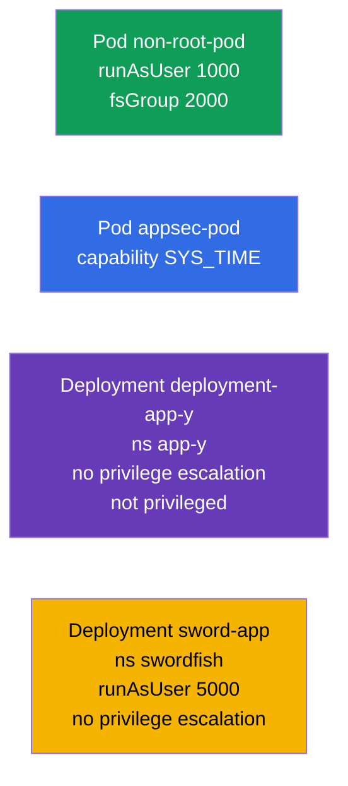

[Русская версия](README_RU.MD) · [Eng version](README.MD) · [Versión en español](README_ES.MD) · [Version française](README_FR.MD) · [Deutsche Version](README_DE.MD) · [ქართული ვერსია](README_GE.MD) · [繁體中文版](README_TW.MD)

# Lab 106 - アプリケーションのセキュリティ：SecurityContext と capabilities

## 概要

Pod およびコンテナのレベルでのセキュリティ設定に関する実習です。**SecurityContext** の
主要なフィールドを練習します：非特権ユーザーでの実行
（`runAsUser`、`fsGroup`）、個別の Linux capabilities の付与（`SYS_TIME`）、特権昇格の
禁止（`allowPrivilegeEscalation`）、そして特権モードの禁止
（`privileged`）。これは最小権限の原則を実際に適用したものです。

すべての課題は試験形式（実際の CKA/CKAD の問題と同じスタイル）で書かれており、
`check_result` コマンドで自動的に検証されます。`securityContext` はマニフェストで指定するため、
`--dry-run=client -o yaml` でひな形を作り、必要なフィールドを書き足すのが
便利です。

## 目的

次のコース章の内容を定着させます：

- [第 20 章。SecurityContext と capabilities](../../course/20/README.md) - `runAsUser`、`fsGroup`、capabilities、`allowPrivilegeEscalation`、`privileged`
- [第 21 章。ServiceAccount；authn/authz/admission](../../course/21/README.md) - アクセスモデル全体におけるセキュリティコンテキスト

## 何を作り、なぜ作るのか

この実習では、コンテナの権限を段階的に絞り込んでいきます - root 以外での実行から、
capability を一つだけ的確に付与するところまで。各オブジェクトにはそれぞれの役割があります：

| オブジェクト | これは何か | この実習での役割 |
|--------|---------|-------------------|
| **Pod `non-root-pod`** | `runAsUser`/`fsGroup` を持つ Pod | コンテナを root 以外で実行し、ボリュームの所有グループを指定する方法を学ぶ（第 20 章） |
| **Pod `appsec-pod`** | capability を持つ Pod | root をまるごと与えるのではなく、プロセスに必要な権限だけを付与する（`SYS_TIME`）（第 20 章） |
| **Deployment `deployment-app-y`**（namespace `app-y`） | 制限を掛けた Deployment | 特権昇格と特権モードを禁止する（第 20 章） |
| **Deployment `sword-app`**（namespace `swordfish`） | `securityContext` の更新 | 既存の Deployment に `runAsUser` と escalation の禁止を設定する（第 20 章） |

最終的にデプロイされる全体像：



## インフラ

環境は Terragrunt により AWS（`eu-central-1`）に展開され、次の要素で構成されます：

| コンポーネント | 説明                                                    |
|------------|-------------------------------------------------------------|
| `vpc`      | パブリックサブネットを持つ VPC `10.10.0.0/16`                    |
| `ssh-keys` | ノードへアクセスするための SSH キー                                |
| `k8s-1`    | Kubernetes `1.35.2`（kubeadm）、CNI Calico、metrics-server、単一ノード |
| `worker`   | `kubectl` と `check_result` を備えた作業マシン                 |

インスタンス：`t4g.medium`（master）、Ubuntu `22.04`。クラスタは単一ノード構成で、master の
taint は解除されています（`control-plane` taint を削除）。そのため Pod は master 上に直接スケジュールされます。

## デプロイ

```bash
TASK=106 make run_cka_task
```

作成が完了したら、SSH で作業マシン（worker）に接続し、そこから課題を進めて
ください。`kubectl` はすでに `cluster1-admin@cluster1` コンテキストに設定されています。

作業マシンで使える便利なコマンド：

```bash
time_left       # 残り時間
check_result    # 解答をチェックする
```

## 課題

---
|        **1**        | **非特権ユーザーで Pod を実行する**                          |
| :-----------------: | :----------------------------------------------------------- |
| やること            | Pod `non-root-pod`（イメージ `redis:alpine`）を作成し、Pod レベルの `securityContext` に `runAsUser: 1000`（プロセスは root ではなく UID 1000 で動く）と `fsGroup: 2000`（このグループがマウントされたボリュームの所有者になる）を指定してください。 |
| 受け入れ基準        | - Pod `non-root-pod`、イメージ `redis:alpine`；<br/>- `runAsUser: 1000`、`fsGroup: 2000`。 |
---
|        **2**        | **コンテナに個別の capability を付与する**                   |
| :-----------------: | :----------------------------------------------------------- |
| やること            | Pod `appsec-pod`（イメージ `ubuntu:22.04`、コマンド `sleep 4800`）を作成し、コンテナの `securityContext` に Linux capability `SYS_TIME` を追加してください（`capabilities.add`）。これでプロセスは root をまるごと得ることなくシステム時刻を変更できます。 |
| 受け入れ基準        | - Pod `appsec-pod`、イメージ `ubuntu:22.04`、コマンド `sleep 4800`；<br/>- capability `SYS_TIME` が追加されている。 |
---
|        **3**        | **Deployment で特権昇格を禁止する**                          |
| :-----------------: | :----------------------------------------------------------- |
| やること            | namespace `app-y` を作成してください。その中に Deployment `deployment-app-y`（イメージ `viktoruj/ping_pong:alpine`）をデプロイし、コンテナの `securityContext` に `allowPrivilegeEscalation: false`（プロセスは自分の権限を昇格できない）と `privileged: false`（コンテナは特権モードではない）を指定してください。 |
| 受け入れ基準        | - namespace `app-y` が存在する；<br/>- Deployment `deployment-app-y`、イメージ `viktoruj/ping_pong:alpine`；<br/>- `allowPrivilegeEscalation: false`、`privileged: false`。 |
---
|        **4**        | **既存の Deployment に UID と escalation 禁止を設定する**     |
| :-----------------: | :----------------------------------------------------------- |
| やること            | namespace `swordfish` と Deployment `sword-app`（イメージ `viktoruj/ping_pong:alpine`）を作成してください。次に、そのコンテナの `securityContext` を厳しくします：`runAsUser: 5000` と `allowPrivilegeEscalation: false`。 |
| 受け入れ基準        | - namespace `swordfish` が存在する；<br/>- Deployment `sword-app`；<br/>- `runAsUser: 5000`、`allowPrivilegeEscalation: false`。 |
---

## 結果のチェック

作業マシンで自動チェックを実行します：

```bash
check_result
```

スクリプトがテストを実行し、いくつの課題が完了したかを表示します。

## 解答

参考解答：[worker/files/solutions/1_JP.MD](worker/files/solutions/1_JP.MD)

## 模擬試験のカバー範囲

この実習は模擬試験のアプリケーションセキュリティの課題をカバーします：CKA mock 01（第 15 問 - `SYS_TIME`、
第 19 問 - `runAsUser`/`fsGroup`）、CKAD mock 01（第 7 問 - root + `SYS_TIME`）、CKAD mock 02（第 6 問 -
`runAsUser 5000` + no escalation、第 18 問 - no privilege escalation/privileged）。

## クラスタとリソースの削除

```bash
TASK=106 make delete_cka_task
```
