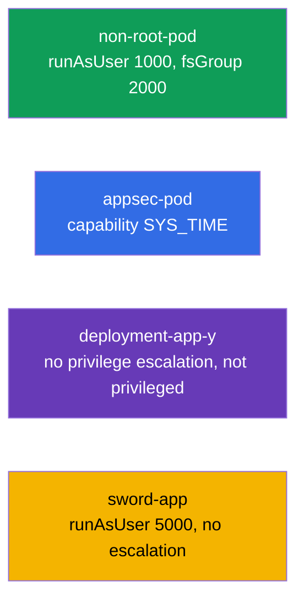

# Lab 106 — Безопасность приложений: SecurityContext и capabilities

## Описание

Практическая работа по настройкам безопасности на уровне пода и контейнера. Вы отработаете
ключевые поля **SecurityContext**: запуск от непривилегированного пользователя
(`runAsUser`, `fsGroup`), выдачу отдельных Linux-capabilities (`SYS_TIME`), запрет
повышения привилегий (`allowPrivilegeEscalation`) и запрет привилегированного режима
(`privileged`). Это реализация принципа наименьших привилегий.

Все задания в экзаменационном стиле с автопроверкой `check_result`.

## Цель

Закрепить главы курса:

- [Глава 20. SecurityContext и capabilities](../../course/20/ru.md)
- [Глава 21. ServiceAccount; authn/authz/admission](../../course/21/ru.md)

## Что мы создаём и зачем

| Объект | Что это | Зачем в этой лабе |
|--------|---------|-------------------|
| **Под `non-root-pod`** | под с runAsUser/fsGroup | учимся запускать контейнер не от root и задавать группу для томов |
| **Под `appsec-pod`** | под с capability | выдаём процессу только нужную привилегию (`SYS_TIME`) вместо root целиком |
| **Деплой `deployment-app-y`** | деплой с ограничениями | запрещаем повышение привилегий и привилегированный режим |
| **Деплой `sword-app`** | обновление securityContext | задаём `runAsUser` и запрет escalation на существующем деплое |



## Инфраструктура

| Компонент  | Описание                                                    |
|------------|-------------------------------------------------------------|
| `k8s-1`    | Kubernetes `1.35.2` (kubeadm), Calico, metrics-server, одноузловой |
| `worker`   | Рабочая машина с `kubectl` и `check_result`                 |

## Развёртывание

```bash
TASK=106 make run_cka_task
```

## Задания

---
|        **1**        | **Запустить под от непривилегированного пользователя**       |
| :-----------------: | :----------------------------------------------------------- |
| Что делаем          | Задаём UID процесса и группу-владельца томов                  |
| Критерии приёмки    | - Pod: `non-root-pod`, image `redis:alpine`<br/>- `runAsUser: 1000`, `fsGroup: 2000` |
---
|        **2**        | **Выдать контейнеру отдельную capability**                   |
| :-----------------: | :----------------------------------------------------------- |
| Что делаем          | Разрешаем контейнеру менять системное время без полного root  |
| Критерии приёмки    | - Pod: `appsec-pod`, image `ubuntu:22.04`, command `sleep 4800`<br/>- capability `SYS_TIME` добавлена |
---
|        **3**        | **Запретить повышение привилегий в деплое**                  |
| :-----------------: | :----------------------------------------------------------- |
| Что делаем          | Ужесточаем securityContext контейнера деплоя                  |
| Критерии приёмки    | - Неймспейс: `app-y`<br/>- Deployment `deployment-app-y` (image `viktoruj/ping_pong:alpine`)<br/>- `allowPrivilegeEscalation: false`, `privileged: false` |
---
|        **4**        | **Задать UID и запрет escalation на существующем деплое**    |
| :-----------------: | :----------------------------------------------------------- |
| Что делаем          | Создаём деплой и ужесточаем его securityContext              |
| Критерии приёмки    | - Неймспейс: `swordfish`<br/>- Deployment `sword-app`<br/>- `runAsUser: 5000`, `allowPrivilegeEscalation: false` |
---

## Проверка результата

```bash
check_result
```

## Решение

[worker/files/solutions/1.MD](worker/files/solutions/1.MD)

## Покрытие мок-экзаменов

CKA mock 01 (№15 — SYS_TIME, №19 — runAsUser/fsGroup), CKAD mock 01 (№7 — root+SYS_TIME),
CKAD mock 02 (№6 — runAsUser 5000 + no escalation, №18 — no privilege escalation/privileged).

## Удаление

```bash
TASK=106 make delete_cka_task
```
