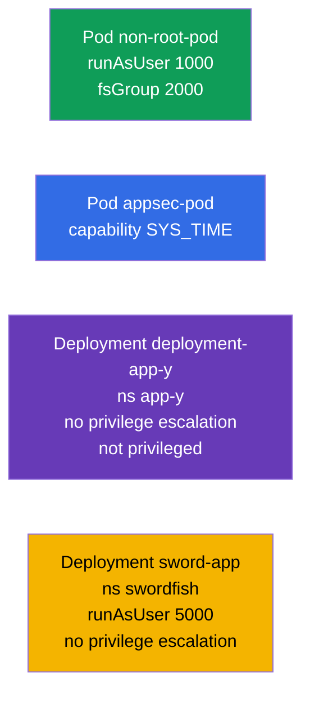

# Lab 106 — Безопасность приложений: SecurityContext и capabilities

## Описание

Практическая работа по настройкам безопасности на уровне Pod и контейнера. Вы отработаете
ключевые поля **SecurityContext**: запуск от непривилегированного пользователя
(`runAsUser`, `fsGroup`), выдачу отдельных Linux-capabilities (`SYS_TIME`), запрет
повышения привилегий (`allowPrivilegeEscalation`) и запрет привилегированного режима
(`privileged`). Это практическая реализация принципа наименьших привилегий.

Все задания оформлены в экзаменационном стиле (как реальные вопросы CKA/CKAD) с
автоматической проверкой командой `check_result`. `securityContext` задаётся в манифесте,
поэтому удобнее готовить заготовку через `--dry-run=client -o yaml` и дописывать нужные
поля.

## Цель

Закрепить материал глав курса:

- [Глава 20. SecurityContext и capabilities](../../course/20/ru.md) — `runAsUser`, `fsGroup`, capabilities, `allowPrivilegeEscalation`, `privileged`
- [Глава 21. ServiceAccount; authn/authz/admission](../../course/21/ru.md) — контекст безопасности в общей модели доступа

## Что мы создаём и зачем

В этой лабе мы поэтапно ужесточаем права контейнеров — от запуска не под root до точечной
выдачи одной capability. Каждый объект решает свою задачу:

| Объект | Что это | Зачем в этой лабе |
|--------|---------|-------------------|
| **Pod `non-root-pod`** | Pod с `runAsUser`/`fsGroup` | учимся запускать контейнер не от root и задавать группу-владельца томов (глава 20) |
| **Pod `appsec-pod`** | Pod с capability | выдаём процессу только нужную привилегию (`SYS_TIME`) вместо root целиком (глава 20) |
| **Deployment `deployment-app-y`** (namespace `app-y`) | Deployment с ограничениями | запрещаем повышение привилегий и привилегированный режим (глава 20) |
| **Deployment `sword-app`** (namespace `swordfish`) | обновление `securityContext` | задаём `runAsUser` и запрет escalation на существующем Deployment (глава 20) |

Итоговая картина того, что будет развёрнуто:



## Инфраструктура

Окружение разворачивается в AWS (`eu-central-1`) через Terragrunt и состоит из:

| Компонент  | Описание                                                    |
|------------|-------------------------------------------------------------|
| `vpc`      | VPC `10.10.0.0/16` с публичными подсетями                    |
| `ssh-keys` | SSH-ключи для доступа к нодам                                |
| `k8s-1`    | Kubernetes `1.35.2` (kubeadm), CNI Calico, metrics-server, одноузловой |
| `worker`   | Рабочая машина с `kubectl` и `check_result`                 |

Инстансы: `t3.medium` (master) Ubuntu `22.04`. Кластер одноузловой — master
«разтейнчен» (снят taint `control-plane`), поэтому поды планируются прямо на него.

## Развёртывание

```bash
TASK=106 make run_cka_task
```

После создания подключитесь к рабочей машине (worker) по SSH и выполняйте задания
оттуда. `kubectl` уже настроен на контекст `cluster1-admin@cluster1`.

Полезные команды на рабочей машине:

```bash
time_left       # сколько осталось времени
check_result    # проверить решение
```

## Задания

---
|        **1**        | **Запустить Pod от непривилегированного пользователя**       |
| :-----------------: | :----------------------------------------------------------- |
| Что делаем          | Создайте Pod `non-root-pod` (образ `redis:alpine`) и в `securityContext` на уровне Pod задайте `runAsUser: 1000` (процесс идёт от UID 1000, а не root) и `fsGroup: 2000` (эта группа становится владельцем смонтированных томов). |
| Критерии приёмки    | - Pod `non-root-pod`, образ `redis:alpine`;<br/>- `runAsUser: 1000`, `fsGroup: 2000`. |
---
|        **2**        | **Выдать контейнеру отдельную capability**                   |
| :-----------------: | :----------------------------------------------------------- |
| Что делаем          | Создайте Pod `appsec-pod` (образ `ubuntu:22.04`, команда `sleep 4800`) и в `securityContext` контейнера добавьте Linux-capability `SYS_TIME` (`capabilities.add`). Так процесс сможет менять системное время, не получая root целиком. |
| Критерии приёмки    | - Pod `appsec-pod`, образ `ubuntu:22.04`, команда `sleep 4800`;<br/>- capability `SYS_TIME` добавлена. |
---
|        **3**        | **Запретить повышение привилегий в Deployment**              |
| :-----------------: | :----------------------------------------------------------- |
| Что делаем          | Создайте namespace `app-y`. Разверните в нём Deployment `deployment-app-y` (образ `viktoruj/ping_pong:alpine`) и в `securityContext` контейнера задайте `allowPrivilegeEscalation: false` (процесс не сможет повысить свои привилегии) и `privileged: false` (контейнер не в привилегированном режиме). |
| Критерии приёмки    | - namespace `app-y` существует;<br/>- Deployment `deployment-app-y`, образ `viktoruj/ping_pong:alpine`;<br/>- `allowPrivilegeEscalation: false`, `privileged: false`. |
---
|        **4**        | **Задать UID и запрет escalation на существующем Deployment** |
| :-----------------: | :----------------------------------------------------------- |
| Что делаем          | Создайте namespace `swordfish` и Deployment `sword-app` (образ `viktoruj/ping_pong:alpine`). Затем ужесточите `securityContext` его контейнера: `runAsUser: 5000` и `allowPrivilegeEscalation: false`. |
| Критерии приёмки    | - namespace `swordfish` существует;<br/>- Deployment `sword-app`;<br/>- `runAsUser: 5000`, `allowPrivilegeEscalation: false`. |
---

## Проверка результата

На рабочей машине запустите автоматическую проверку:

```bash
check_result
```

Скрипт прогонит тесты и покажет, сколько заданий выполнено.

## Решение

Эталонное решение: [worker/files/solutions/1.MD](worker/files/solutions/1.MD)

## Покрытие мок-экзаменов

Лаба закрывает задания моков по безопасности приложений: CKA mock 01 (№15 — `SYS_TIME`,
№19 — `runAsUser`/`fsGroup`), CKAD mock 01 (№7 — root + `SYS_TIME`), CKAD mock 02 (№6 —
`runAsUser 5000` + no escalation, №18 — no privilege escalation/privileged).

## Удаление кластера и ресурсов

```bash
TASK=106 make delete_cka_task
```
