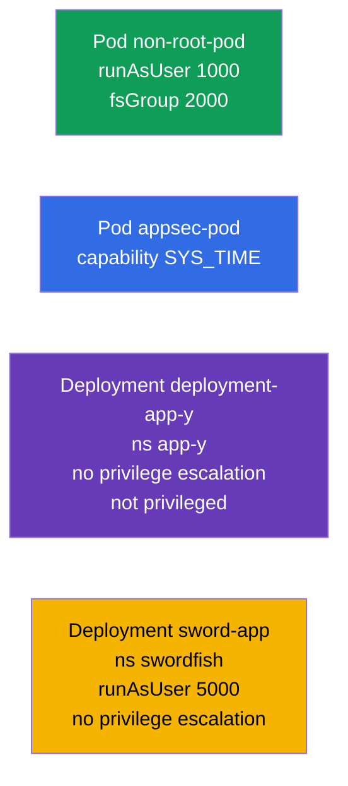

[Русская версия](README_RU.MD) · [Eng version](README.MD) · [Versión en español](README_ES.MD) · [Version française](README_FR.MD) · [Deutsche Version](README_DE.MD) · [ქართული ვერსია](README_GE.MD) · [日本語版](README_JP.MD)

# Lab 106 - 應用程式安全:SecurityContext 與 capabilities

## 說明

關於 Pod 與容器層級安全設定的實作練習。你會練習
**SecurityContext** 的關鍵欄位:以非特權使用者身分執行
(`runAsUser`、`fsGroup`)、授予個別的 Linux capabilities(`SYS_TIME`)、禁止
提升權限(`allowPrivilegeEscalation`),以及禁止特權模式
(`privileged`)。這就是最小權限原則的實務落地。

所有任務都以考試風格撰寫(就像真正的 CKA/CKAD 題目),並透過
`check_result` 指令自動驗證。`securityContext` 是在資源清單中設定的,
因此比較方便的做法是先用 `--dry-run=client -o yaml` 產生骨架,再補上需要的
欄位。

## 目標

鞏固以下課程章節的內容:

- [第 20 章。SecurityContext 與 capabilities](../../course/20/README.md) - `runAsUser`、`fsGroup`、capabilities、`allowPrivilegeEscalation`、`privileged`
- [第 21 章。ServiceAccount;authn/authz/admission](../../course/21/README.md) - 整體存取模型中的安全上下文

## 我們要建立什麼,以及為什麼

在這個實驗中,我們一步一步收緊容器的權限 - 從不以 root 執行,到精準地
只授予一項 capability。每個物件都有自己的用途:

| 物件 | 這是什麼 | 為什麼出現在這個實驗中 |
|--------|---------|-------------------|
| **Pod `non-root-pod`** | 帶 `runAsUser`/`fsGroup` 的 Pod | 學會不以 root 執行容器,並設定磁碟區的擁有群組(第 20 章) |
| **Pod `appsec-pod`** | 帶 capability 的 Pod | 只給行程需要的那項權限(`SYS_TIME`),而不是整個 root(第 20 章) |
| **Deployment `deployment-app-y`**(namespace `app-y`) | 帶限制的 Deployment | 禁止提升權限與特權模式(第 20 章) |
| **Deployment `sword-app`**(namespace `swordfish`) | 更新 `securityContext` | 在既有的 Deployment 上設定 `runAsUser` 並禁止 escalation(第 20 章) |

最終部署出來的整體樣貌:



## 基礎架構

環境透過 Terragrunt 部署在 AWS(`eu-central-1`),由以下部分組成:

| 元件       | 說明                                                        |
|------------|-------------------------------------------------------------|
| `vpc`      | VPC `10.10.0.0/16`,含公有子網路                              |
| `ssh-keys` | 用於存取節點的 SSH 金鑰                                       |
| `k8s-1`    | Kubernetes `1.35.2`(kubeadm),CNI Calico,metrics-server,單節點 |
| `worker`   | 具備 `kubectl` 與 `check_result` 的工作機                    |

執行個體:`t4g.medium`(master),Ubuntu `22.04`。叢集為單節點 - master
已解除污點(移除了 `control-plane` taint),因此 Pod 會直接排程到它上面。

## 部署

```bash
TASK=106 make run_cka_task
```

建立完成後,請透過 SSH 連線到工作機(worker),並在那裡完成任務。
`kubectl` 已經指向 `cluster1-admin@cluster1` context。

工作機上的實用指令:

```bash
time_left       # 還剩多少時間
check_result    # 檢查解答
```

## 任務

---
|        **1**        | **以非特權使用者身分執行 Pod**                                |
| :-----------------: | :----------------------------------------------------------- |
| 要做什麼            | 建立 Pod `non-root-pod`(映像 `redis:alpine`),並在 Pod 層級的 `securityContext` 中設定 `runAsUser: 1000`(行程以 UID 1000 執行,而不是 root)與 `fsGroup: 2000`(這個群組會成為已掛載磁碟區的擁有者)。 |
| 驗收標準            | - Pod `non-root-pod`,映像 `redis:alpine`;<br/>- `runAsUser: 1000`、`fsGroup: 2000`。 |
---
|        **2**        | **為容器授予單一 capability**                                 |
| :-----------------: | :----------------------------------------------------------- |
| 要做什麼            | 建立 Pod `appsec-pod`(映像 `ubuntu:22.04`,指令 `sleep 4800`),並在容器的 `securityContext` 中加入 Linux capability `SYS_TIME`(`capabilities.add`)。這樣行程就能修改系統時間,而不必取得整個 root。 |
| 驗收標準            | - Pod `appsec-pod`,映像 `ubuntu:22.04`,指令 `sleep 4800`;<br/>- 已加入 capability `SYS_TIME`。 |
---
|        **3**        | **在 Deployment 中禁止提升權限**                              |
| :-----------------: | :----------------------------------------------------------- |
| 要做什麼            | 建立 namespace `app-y`。在其中部署 Deployment `deployment-app-y`(映像 `viktoruj/ping_pong:alpine`),並在容器的 `securityContext` 中設定 `allowPrivilegeEscalation: false`(行程無法提升自己的權限)與 `privileged: false`(容器不以特權模式執行)。 |
| 驗收標準            | - namespace `app-y` 存在;<br/>- Deployment `deployment-app-y`,映像 `viktoruj/ping_pong:alpine`;<br/>- `allowPrivilegeEscalation: false`、`privileged: false`。 |
---
|        **4**        | **在既有的 Deployment 上設定 UID 並禁止 escalation**           |
| :-----------------: | :----------------------------------------------------------- |
| 要做什麼            | 建立 namespace `swordfish` 與 Deployment `sword-app`(映像 `viktoruj/ping_pong:alpine`)。接著收緊其容器的 `securityContext`:`runAsUser: 5000` 與 `allowPrivilegeEscalation: false`。 |
| 驗收標準            | - namespace `swordfish` 存在;<br/>- Deployment `sword-app`;<br/>- `runAsUser: 5000`、`allowPrivilegeEscalation: false`。 |
---

## 檢查結果

在工作機上執行自動檢查:

```bash
check_result
```

腳本會跑完測試,並顯示已完成多少任務。

## 解答

參考解答:[worker/files/solutions/1_TW.MD](worker/files/solutions/1_TW.MD)

## 模擬考涵蓋範圍

本實驗涵蓋模擬考中關於應用程式安全的題目:CKA mock 01(第 15 題 - `SYS_TIME`,
第 19 題 - `runAsUser`/`fsGroup`)、CKAD mock 01(第 7 題 - root + `SYS_TIME`)、CKAD mock 02(第 6 題 -
`runAsUser 5000` + no escalation,第 18 題 - no privilege escalation/privileged)。

## 刪除叢集與資源

```bash
TASK=106 make delete_cka_task
```
