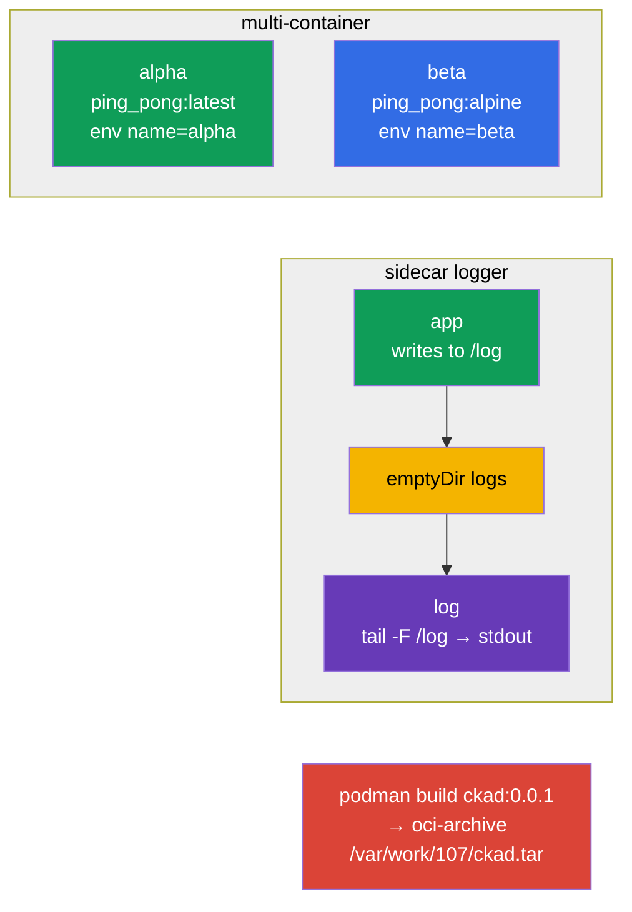

[Русская версия](README_RU.MD) · [Versión en español](README_ES.MD) · [Version française](README_FR.MD) · [Deutsche Version](README_DE.MD) · [ქართული ვერსია](README_GE.MD) · [繁體中文版](README_TW.MD) · [日本語版](README_JP.MD)

# Lab 107 — Application Design: multi-container Pods, images, volumes

## Description

A hands-on lab on application design (the CKAD Application Design and Build domain). You
will practice multi-container Pods (several containers sharing the network and a volume),
the classic log-collecting sidecar pattern, ephemeral `emptyDir` volumes and building a
container image with podman including export to an OCI archive.

All tasks are written in exam style (like real CKA/CKAD questions) with automatic
validation via the `check_result` command. Manifest objects are easier to prepare from a
skeleton produced with `--dry-run=client -o yaml`, while the image build is done
imperatively with `podman`.

## Goal

Reinforce the material from the course chapters:

- [Chapter 22. Multi-container Pods](../../course/22/README.md) — several containers in one Pod, a shared volume, the sidecar pattern
- [Chapter 23. Container images](../../course/23/README.md) — building an image from a Dockerfile, exporting to an OCI archive
- [Chapter 24. Volumes for applications](../../course/24/README.md) — ephemeral `emptyDir`, `sizeLimit`, mounting

## What We Build and Why

In this lab we assemble applications out of several containers and look at how they share
data and how images are built. Every object serves its own purpose:

| Object | What it is | Why it is in this lab |
|--------|---------|-------------------|
| **Pod `multi-pod`** | a Pod with two containers | learn to describe several containers with different images and env (chapter 22) |
| **Pod `logger`** | an application + a sidecar logger | practice the sidecar pattern: exchanging data through a shared `emptyDir` (chapter 22) |
| **Pod `redis-storage`** | a Pod with an ephemeral volume | mount an `emptyDir` with a `sizeLimit` (chapter 24) |
| **Image `ckad:0.0.1`** | an image built with podman | build an image from a Dockerfile and export it to an OCI archive (chapter 23) |

The final picture of what will be deployed:



## Infrastructure

The environment is deployed in AWS (`eu-central-1`) via Terragrunt and consists of:

| Component  | Description                                                  |
|------------|--------------------------------------------------------------|
| `vpc`      | VPC `10.10.0.0/16` with public subnets                         |
| `ssh-keys` | SSH keys for node access                                       |
| `k8s-1`    | Kubernetes `1.35.2` (kubeadm), Calico CNI, metrics-server, single-node |
| `worker`   | Work machine with `kubectl` and `check_result`; on start it installs `podman` and creates `/var/work/107/Dockerfile` for task 4 |

Instances: `t4g.medium` (master), Ubuntu `22.04`. The cluster is single-node — the master is
untainted (the `control-plane` taint is removed), so Pods are scheduled directly on it.

## Deployment

```bash
TASK=107 make run_cka_task
```

Once it is created, connect to the work machine (worker) over SSH and do the tasks from
there. `kubectl` is already pointed at the `cluster1-admin@cluster1` context.

Handy commands on the work machine:

```bash
time_left       # how much time is left
check_result    # check your solution
```

## Tasks

---
|        **1**        | **Create a Pod with two containers**                         |
| :-----------------: | :----------------------------------------------------------- |
| What to do          | Create the Pod `multi-pod` out of two containers: `alpha` (image `viktoruj/ping_pong:latest`, environment variable `name=alpha`) and `beta` (image `viktoruj/ping_pong:alpine`, environment variable `name=beta`). Both containers share the network and the Pod IP. |
| Acceptance criteria | - Pod `multi-pod`;<br/>- container `alpha`: image `viktoruj/ping_pong:latest`, env `name=alpha`;<br/>- container `beta`: image `viktoruj/ping_pong:alpine`, env `name=beta`. |
---
|        **2**        | **Collect logs with a sidecar container**                     |
| :-----------------: | :----------------------------------------------------------- |
| What to do          | Create the Pod `logger` out of two containers with a shared volume `logs` of type `emptyDir` mounted into both containers. The first container writes logs to a file on that volume, the second one (the sidecar) reads the same file and prints it to stdout (`tail -F`) — the classic log-collection pattern. |
| Acceptance criteria | - Pod `logger` (≥ 2 containers);<br/>- shared volume `logs` of type `emptyDir`, mounted into both containers. |
---
|        **3**        | **Mount an ephemeral volume**                                |
| :-----------------: | :----------------------------------------------------------- |
| What to do          | Create the Pod `redis-storage` (image `redis:alpine`) with a volume `data` of type `emptyDir` and the limit `sizeLimit: 500Mi`, mounted into the container at the path `/data/redis`. Such a volume lives exactly as long as the Pod does. |
| Acceptance criteria | - Pod `redis-storage`, image `redis:alpine`;<br/>- volume `data` of type `emptyDir`, `sizeLimit: 500Mi`, mountPath `/data/redis`. |
---
|        **4**        | **Build an image and export it to an OCI archive**            |
| :-----------------: | :----------------------------------------------------------- |
| What to do          | On the work machine, use `podman` to build the image `ckad:0.0.1` from the ready-made Dockerfile `/var/work/107/Dockerfile` and export it in the oci-archive format to the file `/var/work/107/ckad.tar` (`podman save --format oci-archive`). |
| Acceptance criteria | - image `ckad:0.0.1` is built from `/var/work/107/Dockerfile`;<br/>- exported to the oci-archive `/var/work/107/ckad.tar`. |
---

## Checking the Result

On the work machine run the automatic validation:

```bash
check_result
```

The script runs the tests and shows how many tasks are complete.

## Solution

Reference solution: [worker/files/solutions/1.MD](worker/files/solutions/1.MD)

## Mock Exam Coverage

The lab covers the application-design tasks of the mocks: CKA mock 01 (#10 — multi-container,
#14 — `emptyDir`), CKA mock 02 (#15 — sidecar logger), CKAD mock 01 (#14 — multi-container),
CKAD mock 02 (#5 — `podman build`, #16 — sidecar logger, #20 — init/ephemeral volume).

## Deleting the Cluster and Resources

```bash
TASK=107 make delete_cka_task
```
