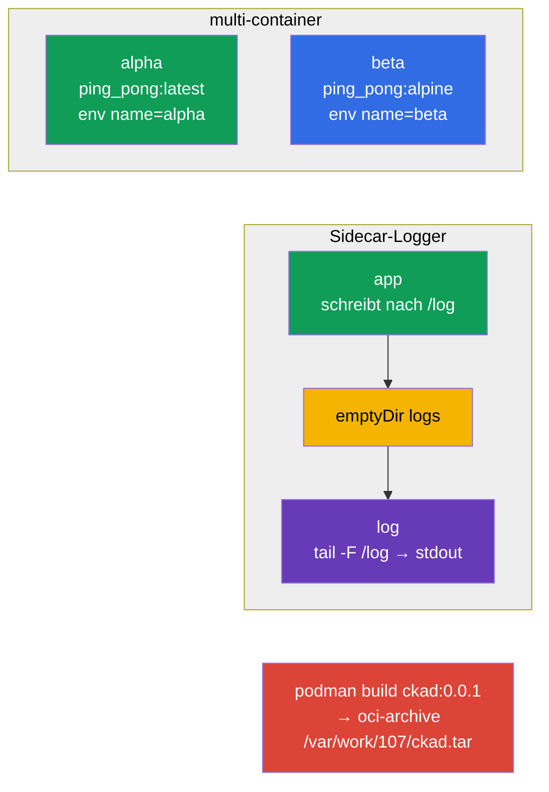

[Русская версия](README_RU.MD) · [Eng version](README.MD) · [Versión en español](README_ES.MD) · [Version française](README_FR.MD) · [ქართული ვერსია](README_GE.MD)

# Lab 107 — Anwendungsdesign: Multi-Container-Pods, Images, Volumes

## Beschreibung

Praxisübung zum Anwendungsdesign (Domäne CKAD Application Design and Build). Du übst
Multi-Container-Pods (mehrere Container mit gemeinsamem Netzwerk und Volume), das klassische
Sidecar-Pattern zum Sammeln von Logs, ephemere `emptyDir`-Volumes sowie den Bau eines
Container-Images mit podman inklusive Export in ein OCI-Archiv.

Alle Aufgaben sind im Prüfungsstil formuliert (wie echte CKA/CKAD-Fragen) mit automatischer
Prüfung über den Befehl `check_result`. Manifest-Objekte lassen sich bequemer aus einem
Gerüst über `--dry-run=client -o yaml` vorbereiten, den Image-Bau führst du imperativ mit
`podman` aus.

## Ziel

Den Stoff der Kurskapitel festigen:

- [Kapitel 22. Multi-Container-Pods](../../course/22/ru.md) — mehrere Container in einem Pod, gemeinsames Volume, Sidecar-Pattern
- [Kapitel 23. Container-Images](../../course/23/ru.md) — Image-Bau aus einem Dockerfile, Export in ein OCI-Archiv
- [Kapitel 24. Volumes für Anwendungen](../../course/24/ru.md) — ephemeres `emptyDir`, `sizeLimit`, Mounten

## Was wir erstellen und warum

In diesem Lab bauen wir Anwendungen aus mehreren Containern und schauen uns an, wie sie
Daten teilen und wie Images vorbereitet werden. Jedes Objekt erfüllt seine eigene Aufgabe:

| Objekt | Was das ist | Warum in diesem Lab |
|--------|---------|-------------------|
| **Pod `multi-pod`** | Pod mit zwei Containern | lernen, mehrere Container mit verschiedenen Images und env zu beschreiben (Kapitel 22) |
| **Pod `logger`** | Anwendung + Sidecar-Logger | das Sidecar-Pattern üben: Austausch über ein gemeinsames `emptyDir` (Kapitel 22) |
| **Pod `redis-storage`** | Pod mit einem ephemeren Volume | ein `emptyDir` mit `sizeLimit` mounten (Kapitel 24) |
| **Image `ckad:0.0.1`** | mit podman gebautes Image | ein Image aus einem Dockerfile bauen und in ein OCI-Archiv exportieren (Kapitel 23) |

Das Gesamtbild dessen, was ausgerollt wird:



## Infrastruktur

Die Umgebung wird in AWS (`eu-central-1`) über Terragrunt ausgerollt und besteht aus:

| Komponente | Beschreibung                                                 |
|------------|--------------------------------------------------------------|
| `vpc`      | VPC `10.10.0.0/16` mit öffentlichen Subnetzen                 |
| `ssh-keys` | SSH-Schlüssel für den Zugriff auf die Nodes                    |
| `k8s-1`    | Kubernetes `1.35.2` (kubeadm), CNI Calico, metrics-server, ein Node |
| `worker`   | Arbeitsmaschine mit `kubectl` und `check_result`; beim Start installiert sie `podman` und erstellt `/var/work/107/Dockerfile` für Aufgabe 4 |

Instanzen: `t3.medium` (Master), Ubuntu `22.04`. Der Cluster hat einen Node — beim Master
ist der Taint `control-plane` entfernt, daher werden Pods direkt auf ihm geplant.

## Bereitstellung

```bash
TASK=107 make run_cka_task
```

Verbinde dich nach dem Erstellen per SSH mit der Arbeitsmaschine (Worker) und erledige die
Aufgaben von dort. `kubectl` ist bereits auf den Kontext `cluster1-admin@cluster1`
eingestellt.

Nützliche Befehle auf der Arbeitsmaschine:

```bash
time_left       # wie viel Zeit noch bleibt
check_result    # Lösung prüfen
```

## Aufgaben

---
|        **1**        | **Einen Pod mit zwei Containern erstellen**                   |
| :-----------------: | :----------------------------------------------------------- |
| Was wir tun         | Erstelle den Pod `multi-pod` aus zwei Containern: `alpha` (Image `viktoruj/ping_pong:latest`, Umgebungsvariable `name=alpha`) und `beta` (Image `viktoruj/ping_pong:alpine`, Umgebungsvariable `name=beta`). Beide Container teilen sich Netzwerk und Pod-IP. |
| Abnahmekriterien    | - Pod `multi-pod`;<br/>- Container `alpha`: Image `viktoruj/ping_pong:latest`, env `name=alpha`;<br/>- Container `beta`: Image `viktoruj/ping_pong:alpine`, env `name=beta`. |
---
|        **2**        | **Logs mit einem Sidecar-Container sammeln**                  |
| :-----------------: | :----------------------------------------------------------- |
| Was wir tun         | Erstelle den Pod `logger` aus zwei Containern mit einem gemeinsamen Volume `logs` vom Typ `emptyDir`, das in beide Container gemountet ist. Der erste Container schreibt Logs in eine Datei auf diesem Volume, der zweite (der Sidecar) liest dieselbe Datei und gibt sie auf stdout aus (`tail -F`) — das klassische Pattern zum Sammeln von Logs. |
| Abnahmekriterien    | - Pod `logger` (≥ 2 Container);<br/>- gemeinsames Volume `logs` vom Typ `emptyDir`, in beide Container gemountet. |
---
|        **3**        | **Ein ephemeres Volume mounten**                              |
| :-----------------: | :----------------------------------------------------------- |
| Was wir tun         | Erstelle den Pod `redis-storage` (Image `redis:alpine`) mit einem Volume `data` vom Typ `emptyDir` und der Beschränkung `sizeLimit: 500Mi`, gemountet in den Container unter dem Pfad `/data/redis`. Ein solches Volume lebt genau so lange wie der Pod. |
| Abnahmekriterien    | - Pod `redis-storage`, Image `redis:alpine`;<br/>- Volume `data` vom Typ `emptyDir`, `sizeLimit: 500Mi`, mountPath `/data/redis`. |
---
|        **4**        | **Image bauen und in ein OCI-Archiv exportieren**             |
| :-----------------: | :----------------------------------------------------------- |
| Was wir tun         | Baue auf der Arbeitsmaschine mit `podman` das Image `ckad:0.0.1` aus dem fertigen Dockerfile `/var/work/107/Dockerfile` und exportiere es im Format oci-archive in die Datei `/var/work/107/ckad.tar` (`podman save --format oci-archive`). |
| Abnahmekriterien    | - Image `ckad:0.0.1` ist aus `/var/work/107/Dockerfile` gebaut;<br/>- in das oci-archive `/var/work/107/ckad.tar` exportiert. |
---

## Ergebnisprüfung

Starte auf der Arbeitsmaschine die automatische Prüfung:

```bash
check_result
```

Das Skript führt die Tests aus und zeigt, wie viele Aufgaben erledigt sind.

## Lösung

Referenzlösung: [worker/files/solutions/1_DE.MD](worker/files/solutions/1_DE.MD)

## Abdeckung der Mock-Prüfungen

Das Lab deckt die Aufgaben der Mocks zum Anwendungsdesign ab: CKA mock 01 (Nr. 10 —
Multi-Container, Nr. 14 — `emptyDir`), CKA mock 02 (Nr. 15 — Sidecar-Logger), CKAD mock 01
(Nr. 14 — Multi-Container), CKAD mock 02 (Nr. 5 — `podman build`, Nr. 16 — Sidecar-Logger,
Nr. 20 — init/ephemeres Volume).

## Löschen von Cluster und Ressourcen

```bash
TASK=107 make delete_cka_task
```
