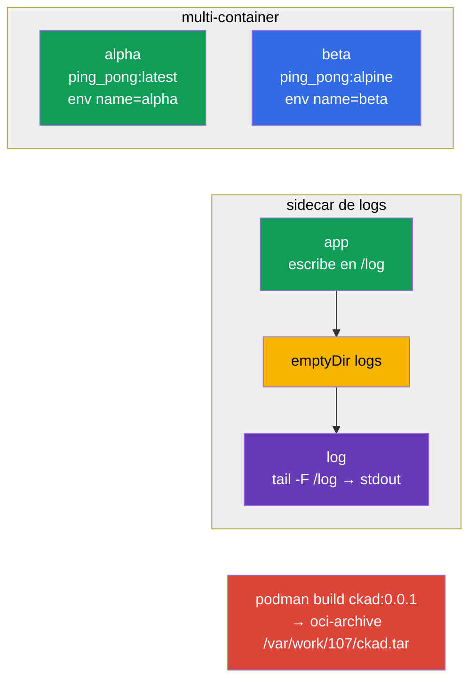

[Русская версия](README_RU.MD) · [Eng version](README.MD) · [Version française](README_FR.MD) · [Deutsche Version](README_DE.MD) · [ქართული ვერსია](README_GE.MD)

# Lab 107 — Diseño de aplicaciones: pods multi-container, imágenes, volúmenes

## Descripción

Práctica sobre el diseño de aplicaciones (dominio CKAD Application Design and Build).
Trabajarás con Pods multi-container (varios contenedores que comparten la red y un volumen),
el patrón clásico del sidecar recolector de logs, los volúmenes efímeros `emptyDir` y la
construcción de una imagen de contenedor con podman, incluida su exportación a un archivo
OCI.

Todas las tareas están redactadas en estilo de examen (como las preguntas reales de
CKA/CKAD) con verificación automática mediante el comando `check_result`. Los objetos de
manifiesto es más cómodo prepararlos a partir de una plantilla generada con
`--dry-run=client -o yaml`, mientras que la construcción de la imagen se hace de forma
imperativa con `podman`.

## Objetivo

Consolidar el material de los capítulos del curso:

- [Capítulo 22. Pods multi-container](../../course/22/ru.md) — varios contenedores en un mismo Pod, volumen compartido, patrón sidecar
- [Capítulo 23. Imágenes de contenedor](../../course/23/ru.md) — construcción de una imagen desde un Dockerfile, exportación a un archivo OCI
- [Capítulo 24. Volúmenes para aplicaciones](../../course/24/ru.md) — `emptyDir` efímero, `sizeLimit`, montaje

## Qué creamos y para qué

En este laboratorio montamos aplicaciones formadas por varios contenedores y analizamos cómo
comparten datos y cómo se preparan las imágenes. Cada objeto resuelve su propia tarea:

| Objeto | Qué es | Para qué está en este laboratorio |
|--------|---------|-------------------|
| **Pod `multi-pod`** | Pod con dos contenedores | aprender a describir varios contenedores con imágenes y env distintos (capítulo 22) |
| **Pod `logger`** | aplicación + sidecar de logs | practicar el patrón sidecar: intercambio a través de un `emptyDir` compartido (capítulo 22) |
| **Pod `redis-storage`** | Pod con un volumen efímero | montar un `emptyDir` con `sizeLimit` (capítulo 24) |
| **Imagen `ckad:0.0.1`** | imagen construida con podman | construir una imagen desde un Dockerfile y exportarla a un archivo OCI (capítulo 23) |

Panorama final de lo que quedará despliegado:



## Infraestructura

El entorno se despliega en AWS (`eu-central-1`) mediante Terragrunt y consta de:

| Componente | Descripción                                                  |
|------------|--------------------------------------------------------------|
| `vpc`      | VPC `10.10.0.0/16` con subredes públicas                      |
| `ssh-keys` | Claves SSH para el acceso a los nodos                         |
| `k8s-1`    | Kubernetes `1.35.2` (kubeadm), CNI Calico, metrics-server, de un solo nodo |
| `worker`   | Máquina de trabajo con `kubectl` y `check_result`; al arrancar instala `podman` y crea `/var/work/107/Dockerfile` para la tarea 4 |

Instancias: `t3.medium` (master), Ubuntu `22.04`. El clúster es de un solo nodo: al master
se le ha quitado el taint `control-plane`, por lo que los pods se planifican directamente
en él.

## Despliegue

```bash
TASK=107 make run_cka_task
```

Tras la creación, conéctate por SSH a la máquina de trabajo (worker) y realiza las tareas
desde allí. `kubectl` ya está configurado con el contexto `cluster1-admin@cluster1`.

Comandos útiles en la máquina de trabajo:

```bash
time_left       # cuánto tiempo queda
check_result    # comprobar la solución
```

## Tareas

---
|        **1**        | **Crear un Pod con dos contenedores**                        |
| :-----------------: | :----------------------------------------------------------- |
| Qué hacemos         | Crea el Pod `multi-pod` con dos contenedores: `alpha` (imagen `viktoruj/ping_pong:latest`, variable de entorno `name=alpha`) y `beta` (imagen `viktoruj/ping_pong:alpine`, variable de entorno `name=beta`). Ambos contenedores comparten la red y la IP del Pod. |
| Criterios de aceptación | - Pod `multi-pod`;<br/>- contenedor `alpha`: imagen `viktoruj/ping_pong:latest`, env `name=alpha`;<br/>- contenedor `beta`: imagen `viktoruj/ping_pong:alpine`, env `name=beta`. |
---
|        **2**        | **Recoger los logs con un contenedor sidecar**               |
| :-----------------: | :----------------------------------------------------------- |
| Qué hacemos         | Crea el Pod `logger` con dos contenedores y un volumen compartido `logs` de tipo `emptyDir` montado en ambos contenedores. El primer contenedor escribe logs en un fichero de ese volumen y el segundo (el sidecar) lee ese mismo fichero y lo muestra en stdout (`tail -F`): el patrón clásico de recolección de logs. |
| Criterios de aceptación | - Pod `logger` (≥ 2 contenedores);<br/>- volumen compartido `logs` de tipo `emptyDir`, montado en ambos contenedores. |
---
|        **3**        | **Montar un volumen efímero**                                |
| :-----------------: | :----------------------------------------------------------- |
| Qué hacemos         | Crea el Pod `redis-storage` (imagen `redis:alpine`) con un volumen `data` de tipo `emptyDir` y el límite `sizeLimit: 500Mi`, montado en el contenedor en la ruta `/data/redis`. Un volumen así vive exactamente lo mismo que el Pod. |
| Criterios de aceptación | - Pod `redis-storage`, imagen `redis:alpine`;<br/>- volumen `data` de tipo `emptyDir`, `sizeLimit: 500Mi`, mountPath `/data/redis`. |
---
|        **4**        | **Construir la imagen y exportarla a un archivo OCI**        |
| :-----------------: | :----------------------------------------------------------- |
| Qué hacemos         | En la máquina de trabajo, construye con `podman` la imagen `ckad:0.0.1` a partir del Dockerfile ya preparado `/var/work/107/Dockerfile` y expórtala en formato oci-archive al fichero `/var/work/107/ckad.tar` (`podman save --format oci-archive`). |
| Criterios de aceptación | - la imagen `ckad:0.0.1` está construida desde `/var/work/107/Dockerfile`;<br/>- exportada al oci-archive `/var/work/107/ckad.tar`. |
---

## Comprobación del resultado

En la máquina de trabajo lanza la verificación automática:

```bash
check_result
```

El script ejecuta los tests y muestra cuántas tareas están completadas.

## Solución

Solución de referencia: [worker/files/solutions/1_ES.MD](worker/files/solutions/1_ES.MD)

## Cobertura de exámenes simulados

El laboratorio cubre las tareas de diseño de aplicaciones de los simulados: CKA mock 01
(n.º 10 — multi-container, n.º 14 — `emptyDir`), CKA mock 02 (n.º 15 — sidecar de logs),
CKAD mock 01 (n.º 14 — multi-container), CKAD mock 02 (n.º 5 — `podman build`, n.º 16 —
sidecar de logs, n.º 20 — init/volumen efímero).

## Eliminación del clúster y los recursos

```bash
TASK=107 make delete_cka_task
```
