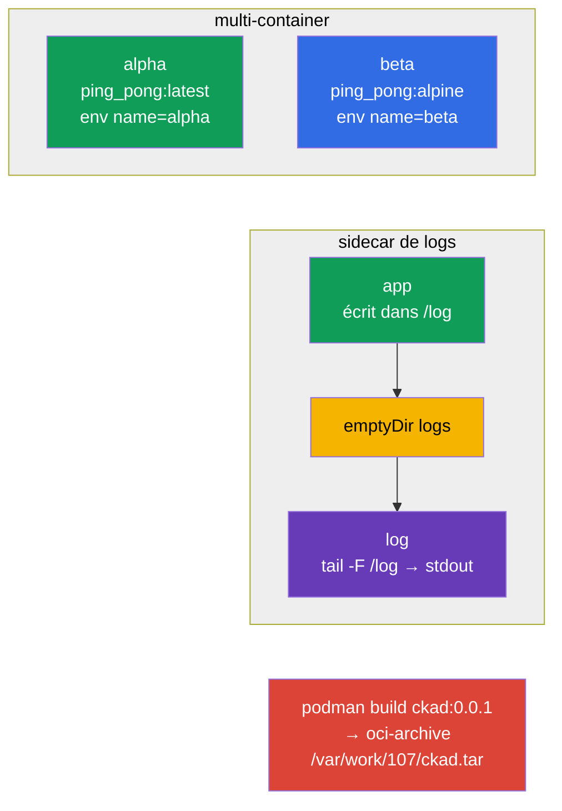

[Русская версия](README_RU.MD) · [Eng version](README.MD) · [Versión en español](README_ES.MD) · [Deutsche Version](README_DE.MD) · [ქართული ვერსია](README_GE.MD) · [繁體中文版](README_TW.MD) · [日本語版](README_JP.MD)

# Lab 107 — Conception d'applications : pods multi-container, images, volumes

## Description

Travail pratique sur la conception d'applications (domaine CKAD Application Design and
Build). Vous y travaillerez les Pods multi-container (plusieurs conteneurs partageant le
réseau et un volume), le pattern classique du sidecar collecteur de logs, les volumes
éphémères `emptyDir` et la construction d'une image de conteneur avec podman, avec export
vers une archive OCI.

Toutes les tâches sont rédigées dans le style de l'examen (comme les vraies questions
CKA/CKAD) avec une vérification automatique via la commande `check_result`. Les objets de
manifeste sont plus faciles à préparer à partir d'un squelette généré avec
`--dry-run=client -o yaml`, tandis que la construction de l'image se fait de façon
impérative avec `podman`.

## Objectif

Consolider le contenu des chapitres du cours :

- [Chapitre 22. Pods multi-container](../../course/22/fr.md) — plusieurs conteneurs dans un même Pod, volume partagé, pattern sidecar
- [Chapitre 23. Images de conteneurs](../../course/23/fr.md) — construction d'une image depuis un Dockerfile, export vers une archive OCI
- [Chapitre 24. Volumes pour les applications](../../course/24/fr.md) — `emptyDir` éphémère, `sizeLimit`, montage

## Ce que nous créons et pourquoi

Dans ce lab, nous assemblons des applications composées de plusieurs conteneurs et nous
examinons comment ils partagent leurs données et comment les images sont préparées. Chaque
objet a son propre rôle :

| Objet | Ce que c'est | Pourquoi dans ce lab |
|--------|---------|-------------------|
| **Pod `multi-pod`** | Pod avec deux conteneurs | apprendre à décrire plusieurs conteneurs avec des images et des env différents (chapitre 22) |
| **Pod `logger`** | application + sidecar de logs | travailler le pattern sidecar : échange via un `emptyDir` partagé (chapitre 22) |
| **Pod `redis-storage`** | Pod avec un volume éphémère | monter un `emptyDir` avec `sizeLimit` (chapitre 24) |
| **Image `ckad:0.0.1`** | image construite avec podman | construire une image depuis un Dockerfile et l'exporter vers une archive OCI (chapitre 23) |

Vue d'ensemble de ce qui sera déployé :



## Infrastructure

L'environnement est déployé dans AWS (`eu-central-1`) via Terragrunt et se compose de :

| Composant  | Description                                                  |
|------------|--------------------------------------------------------------|
| `vpc`      | VPC `10.10.0.0/16` avec des sous-réseaux publics               |
| `ssh-keys` | Clés SSH pour l'accès aux nœuds                                |
| `k8s-1`    | Kubernetes `1.35.2` (kubeadm), CNI Calico, metrics-server, mono-nœud |
| `worker`   | Machine de travail avec `kubectl` et `check_result` ; au démarrage, elle installe `podman` et crée `/var/work/107/Dockerfile` pour la tâche 4 |

Instances : `t4g.medium` (master), Ubuntu `22.04`. Le cluster est mono-nœud — le taint
`control-plane` a été retiré du master, les pods sont donc planifiés directement dessus.

## Déploiement

```bash
TASK=107 make run_cka_task
```

Après la création, connectez-vous en SSH à la machine de travail (worker) et effectuez les
tâches depuis celle-ci. `kubectl` est déjà configuré sur le contexte
`cluster1-admin@cluster1`.

Commandes utiles sur la machine de travail :

```bash
time_left       # combien de temps il reste
check_result    # vérifier la solution
```

## Tâches

---
|        **1**        | **Créer un Pod avec deux conteneurs**                        |
| :-----------------: | :----------------------------------------------------------- |
| Ce qu'on fait       | Créez le Pod `multi-pod` composé de deux conteneurs : `alpha` (image `viktoruj/ping_pong:latest`, variable d'environnement `name=alpha`) et `beta` (image `viktoruj/ping_pong:alpine`, variable d'environnement `name=beta`). Les deux conteneurs partagent le réseau et l'IP du Pod. |
| Critères d'acceptation | - Pod `multi-pod` ;<br/>- conteneur `alpha` : image `viktoruj/ping_pong:latest`, env `name=alpha` ;<br/>- conteneur `beta` : image `viktoruj/ping_pong:alpine`, env `name=beta`. |
---
|        **2**        | **Collecter les logs avec un conteneur sidecar**             |
| :-----------------: | :----------------------------------------------------------- |
| Ce qu'on fait       | Créez le Pod `logger` composé de deux conteneurs avec un volume partagé `logs` de type `emptyDir` monté dans les deux conteneurs. Le premier conteneur écrit les logs dans un fichier sur ce volume, le second (le sidecar) lit ce même fichier et l'affiche sur stdout (`tail -F`) — le pattern classique de collecte de logs. |
| Critères d'acceptation | - Pod `logger` (≥ 2 conteneurs) ;<br/>- volume partagé `logs` de type `emptyDir`, monté dans les deux conteneurs. |
---
|        **3**        | **Monter un volume éphémère**                                |
| :-----------------: | :----------------------------------------------------------- |
| Ce qu'on fait       | Créez le Pod `redis-storage` (image `redis:alpine`) avec un volume `data` de type `emptyDir` et la limite `sizeLimit: 500Mi`, monté dans le conteneur sur le chemin `/data/redis`. Un tel volume vit exactement aussi longtemps que le Pod. |
| Critères d'acceptation | - Pod `redis-storage`, image `redis:alpine` ;<br/>- volume `data` de type `emptyDir`, `sizeLimit: 500Mi`, mountPath `/data/redis`. |
---
|        **4**        | **Construire l'image et l'exporter vers une archive OCI**    |
| :-----------------: | :----------------------------------------------------------- |
| Ce qu'on fait       | Sur la machine de travail, construisez avec `podman` l'image `ckad:0.0.1` à partir du Dockerfile déjà prêt `/var/work/107/Dockerfile` et exportez-la au format oci-archive dans le fichier `/var/work/107/ckad.tar` (`podman save --format oci-archive`). |
| Critères d'acceptation | - l'image `ckad:0.0.1` est construite depuis `/var/work/107/Dockerfile` ;<br/>- exportée vers l'oci-archive `/var/work/107/ckad.tar`. |
---

## Vérification du résultat

Sur la machine de travail, lancez la vérification automatique :

```bash
check_result
```

Le script exécute les tests et affiche le nombre de tâches réussies.

## Solution

Solution de référence : [worker/files/solutions/1_FR.MD](worker/files/solutions/1_FR.MD)

## Couverture des examens blancs

Le lab couvre les tâches de conception d'applications des examens blancs : CKA mock 01
(n° 10 — multi-container, n° 14 — `emptyDir`), CKA mock 02 (n° 15 — sidecar de logs),
CKAD mock 01 (n° 14 — multi-container), CKAD mock 02 (n° 5 — `podman build`, n° 16 —
sidecar de logs, n° 20 — init/volume éphémère).

## Suppression du cluster et des ressources

```bash
TASK=107 make delete_cka_task
```
