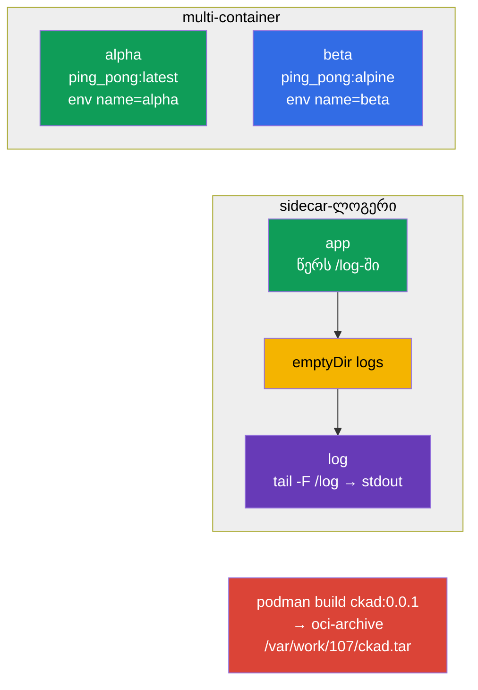

[Русская версия](README_RU.MD) · [Eng version](README.MD) · [Versión en español](README_ES.MD) · [Version française](README_FR.MD) · [Deutsche Version](README_DE.MD) · [繁體中文版](README_TW.MD) · [日本語版](README_JP.MD)

# Lab 107 — აპლიკაციების დიზაინი: multi-container pod-ები, image-ები, ტომები

## აღწერა

პრაქტიკული სამუშაო აპლიკაციების დიზაინზე (CKAD-ის დომენი Application Design and Build).
თქვენ ამუშავებთ multi-container Pod-ებს (რამდენიმე კონტეინერი საერთო ქსელითა და ტომით),
ლოგების შემგროვებელი sidecar-ის კლასიკურ პატერნს, ეფემერულ `emptyDir` ტომებს და
კონტეინერის image-ის აწყობას podman-ით, OCI-არქივში ექსპორტის ჩათვლით.

ყველა დავალება გამოცდის სტილშია გაფორმებული (როგორც რეალური CKA/CKAD კითხვები) და მათი
შემოწმება ავტომატურად ხდება ბრძანებით `check_result`. Manifest-ობიექტების მოსამზადებლად
მოსახერხებელია ჩანასახის გენერაცია `--dry-run=client -o yaml`-ით, ხოლო image-ის აწყობა
იმპერატიულად შესრულდეს `podman`-ით.

## მიზანი

განამტკიცოთ კურსის თავების მასალა:

- [თავი 22. Multi-container pod-ები](../../course/22/ge.md) — რამდენიმე კონტეინერი ერთ Pod-ში, საერთო ტომი, sidecar პატერნი
- [თავი 23. კონტეინერების image-ები](../../course/23/ge.md) — image-ის აწყობა Dockerfile-იდან, ექსპორტი OCI-არქივში
- [თავი 24. ტომები აპლიკაციებისთვის](../../course/24/ge.md) — ეფემერული `emptyDir`, `sizeLimit`, მონტირება

## რას ვქმნით და რისთვის

ამ ლაბორატორიაში ვაწყობთ აპლიკაციებს რამდენიმე კონტეინერისგან და განვიხილავთ, როგორ იზიარებენ
ისინი მონაცემებს და როგორ მზადდება image-ები. თითოეული ობიექტი თავის ამოცანას ასრულებს:

| ობიექტი | რა არის ეს | რისთვის არის ამ ლაბორატორიაში |
|--------|---------|-------------------|
| **Pod `multi-pod`** | Pod ორი კონტეინერით | ვსწავლობთ რამდენიმე კონტეინერის აღწერას სხვადასხვა image-ითა და env-ით (თავი 22) |
| **Pod `logger`** | აპლიკაცია + sidecar-ლოგერი | ვამუშავებთ sidecar პატერნს: გაცვლა საერთო `emptyDir`-ის გავლით (თავი 22) |
| **Pod `redis-storage`** | Pod ეფემერული ტომით | ვამონტირებთ `emptyDir`-ს `sizeLimit`-ით (თავი 24) |
| **Image `ckad:0.0.1`** | podman-ით აწყობილი image | ვაწყობთ image-ს Dockerfile-იდან და ვაექსპორტებთ OCI-არქივში (თავი 23) |

საბოლოო სურათი იმისა, რაც განთავსდება:



## ინფრასტრუქტურა

გარემო იშლება AWS-ში (`eu-central-1`) Terragrunt-ის მეშვეობით და შედგება:

| კომპონენტი | აღწერა                                                    |
|------------|-----------------------------------------------------------|
| `vpc`      | VPC `10.10.0.0/16` საჯარო ქვექსელებით                      |
| `ssh-keys` | SSH-გასაღებები node-ებზე წვდომისთვის                        |
| `k8s-1`    | Kubernetes `1.35.2` (kubeadm), CNI Calico, metrics-server, ერთკვანძიანი |
| `worker`   | სამუშაო მანქანა `kubectl`-ითა და `check_result`-ით; გაშვებისას აყენებს `podman`-ს და ქმნის `/var/work/107/Dockerfile`-ს 4-ე დავალებისთვის |

ინსტანსები: `t3.medium` (master), Ubuntu `22.04`. კლასტერი ერთკვანძიანია — master-ს
მოშორებულია taint `control-plane`, ამიტომ pod-ები პირდაპირ მასზე იგეგმება.

## განთავსება

```bash
TASK=107 make run_cka_task
```

შექმნის შემდეგ დაუკავშირდით სამუშაო მანქანას (worker) SSH-ით და დავალებები შეასრულეთ
იქიდან. `kubectl` უკვე კონფიგურირებულია კონტექსტზე `cluster1-admin@cluster1`.

სასარგებლო ბრძანებები სამუშაო მანქანაზე:

```bash
time_left       # რამდენი დრო დარჩა
check_result    # ამოხსნის შემოწმება
```

## დავალებები

---
|        **1**        | **შექმენით Pod ორი კონტეინერით**                             |
| :-----------------: | :----------------------------------------------------------- |
| რას ვაკეთებთ        | შექმენით Pod `multi-pod` ორი კონტეინერისგან: `alpha` (image `viktoruj/ping_pong:latest`, გარემოს ცვლადი `name=alpha`) და `beta` (image `viktoruj/ping_pong:alpine`, გარემოს ცვლადი `name=beta`). ორივე კონტეინერი იზიარებს ქსელს და Pod-ის IP-ს. |
| მიღების კრიტერიუმები | - Pod `multi-pod`;<br/>- კონტეინერი `alpha`: image `viktoruj/ping_pong:latest`, env `name=alpha`;<br/>- კონტეინერი `beta`: image `viktoruj/ping_pong:alpine`, env `name=beta`. |
---
|        **2**        | **შეაგროვეთ ლოგები sidecar-კონტეინერით**                     |
| :-----------------: | :----------------------------------------------------------- |
| რას ვაკეთებთ        | შექმენით Pod `logger` ორი კონტეინერისგან საერთო ტომით `logs` ტიპით `emptyDir`, რომელიც ორივე კონტეინერშია მონტირებული. პირველი კონტეინერი წერს ლოგებს ამ ტომზე არსებულ ფაილში, მეორე (sidecar) კითხულობს იმავე ფაილს და გამოაქვს stdout-ში (`tail -F`) — ლოგების შეგროვების კლასიკური პატერნი. |
| მიღების კრიტერიუმები | - Pod `logger` (≥ 2 კონტეინერი);<br/>- საერთო ტომი `logs` ტიპით `emptyDir`, მონტირებული ორივე კონტეინერში. |
---
|        **3**        | **დაამონტირეთ ეფემერული ტომი**                               |
| :-----------------: | :----------------------------------------------------------- |
| რას ვაკეთებთ        | შექმენით Pod `redis-storage` (image `redis:alpine`) ტომით `data` ტიპით `emptyDir` და შეზღუდვით `sizeLimit: 500Mi`, კონტეინერში მონტირებული ბილიკზე `/data/redis`. ასეთი ტომი ზუსტად იმდენ ხანს ცოცხლობს, რამდენსაც Pod. |
| მიღების კრიტერიუმები | - Pod `redis-storage`, image `redis:alpine`;<br/>- ტომი `data` ტიპით `emptyDir`, `sizeLimit: 500Mi`, mountPath `/data/redis`. |
---
|        **4**        | **ააწყვეთ image და დააექსპორტეთ OCI-არქივში**                |
| :-----------------: | :----------------------------------------------------------- |
| რას ვაკეთებთ        | სამუშაო მანქანაზე `podman`-ით ააწყვეთ image `ckad:0.0.1` მზა Dockerfile-იდან `/var/work/107/Dockerfile` და დააექსპორტეთ ის oci-archive ფორმატში ფაილში `/var/work/107/ckad.tar` (`podman save --format oci-archive`). |
| მიღების კრიტერიუმები | - image `ckad:0.0.1` აწყობილია `/var/work/107/Dockerfile`-იდან;<br/>- დაექსპორტებულია oci-archive-ში `/var/work/107/ckad.tar`. |
---

## შედეგის შემოწმება

სამუშაო მანქანაზე გაუშვით ავტომატური შემოწმება:

```bash
check_result
```

სკრიპტი გაატარებს ტესტებს და აჩვენებს, რამდენი დავალებაა შესრულებული.

## ამოხსნა

ეტალონური ამოხსნა: [worker/files/solutions/1_GE.MD](worker/files/solutions/1_GE.MD)

## Mock-გამოცდების დაფარვა

ლაბორატორია ფარავს mock-ების დავალებებს აპლიკაციების დიზაინზე: CKA mock 01 (№10 —
multi-container, №14 — `emptyDir`), CKA mock 02 (№15 — sidecar-ლოგერი), CKAD mock 01
(№14 — multi-container), CKAD mock 02 (№5 — `podman build`, №16 — sidecar-ლოგერი,
№20 — init/ეფემერული ტომი).

## კლასტერისა და რესურსების წაშლა

```bash
TASK=107 make delete_cka_task
```
