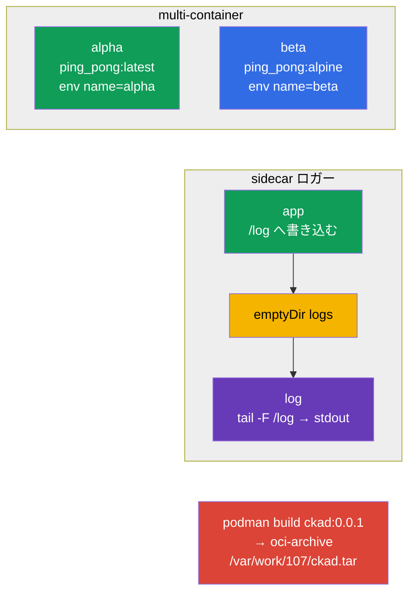

[Русская версия](README_RU.MD) · [Eng version](README.MD) · [Versión en español](README_ES.MD) · [Version française](README_FR.MD) · [Deutsche Version](README_DE.MD) · [ქართული ვერსია](README_GE.MD) · [繁體中文版](README_TW.MD)

# Lab 107 - アプリケーション設計：multi-container Pod、イメージ、ボリューム

## 概要

アプリケーション設計（CKAD の Application Design and Build ドメイン）の実習です。ここでは
multi-container Pods（ネットワークとボリュームを共有する複数のコンテナ）、
ログ収集の古典的な sidecar パターン、エフェメラルボリューム `emptyDir`、そして podman による
コンテナイメージのビルドと OCI アーカイブへのエクスポートを練習します。

すべての課題は試験形式（実際の CKA/CKAD の問題と同じスタイル）で書かれており、
`check_result` コマンドで自動的に検証されます。Manifest オブジェクトは
`--dry-run=client -o yaml` で雛形を作るのが楽で、イメージのビルドは `podman` を使って
命令型で実行します。

## 目的

次のコース章の内容を定着させます：

- [第 22 章。Multi-container Pod](../../course/22/README.md) - 1 つの Pod に複数のコンテナ、共有ボリューム、sidecar パターン
- [第 23 章。コンテナイメージ](../../course/23/README.md) - Dockerfile からのイメージのビルド、OCI アーカイブへのエクスポート
- [第 24 章。アプリケーション用のボリューム](../../course/24/README.md) - エフェメラルな `emptyDir`、`sizeLimit`、マウント

## 何を作り、なぜ作るのか

この実習では複数のコンテナからアプリケーションを組み立て、それらがどのようにデータを
共有し、イメージがどのように準備されるのかを見ていきます。各オブジェクトにはそれぞれの役割があります：

| オブジェクト | これは何か | この実習での役割 |
|--------|---------|-------------------|
| **Pod `multi-pod`** | 2 つのコンテナを持つ Pod | 異なるイメージと env を持つ複数のコンテナの書き方を学ぶ（第 22 章） |
| **Pod `logger`** | アプリケーション + sidecar ロガー | sidecar パターンを練習する：共有の `emptyDir` を通じたデータの受け渡し（第 22 章） |
| **Pod `redis-storage`** | エフェメラルボリュームを持つ Pod | `sizeLimit` 付きの `emptyDir` をマウントする（第 24 章） |
| **イメージ `ckad:0.0.1`** | podman でビルドしたイメージ | Dockerfile からイメージをビルドし、OCI アーカイブへエクスポートする（第 23 章） |

最終的にデプロイされる全体像：



## インフラ

環境は Terragrunt により AWS（`eu-central-1`）に展開され、次の要素で構成されます：

| コンポーネント | 説明                                                    |
|------------|-------------------------------------------------------------|
| `vpc`      | パブリックサブネットを持つ VPC `10.10.0.0/16`                    |
| `ssh-keys` | ノードへアクセスするための SSH キー                                |
| `k8s-1`    | Kubernetes `1.35.2`（kubeadm）、CNI Calico、metrics-server、単一ノード |
| `worker`   | `kubectl` と `check_result` を備えた作業マシン。起動時に `podman` をインストールし、課題 4 用に `/var/work/107/Dockerfile` を作成する |

インスタンス：`t4g.medium`（master）、Ubuntu `22.04`。クラスタは単一ノード構成で、master の
taint は解除されています（`control-plane` taint を削除）。そのため Pod は master 上に直接スケジュールされます。

## デプロイ

```bash
TASK=107 make run_cka_task
```

作成が完了したら、SSH で作業マシン（worker）に接続し、そこから課題を進めてください。
`kubectl` はすでに `cluster1-admin@cluster1` コンテキストに設定されています。

作業マシンで使える便利なコマンド：

```bash
time_left       # 残り時間
check_result    # 解答をチェックする
```

## 課題

---
|        **1**        | **2 つのコンテナを持つ Pod を作成する**                       |
| :-----------------: | :----------------------------------------------------------- |
| やること            | 2 つのコンテナからなる Pod `multi-pod` を作成してください：`alpha`（イメージ `viktoruj/ping_pong:latest`、環境変数 `name=alpha`）と `beta`（イメージ `viktoruj/ping_pong:alpine`、環境変数 `name=beta`）。両方のコンテナはネットワークと Pod IP を共有します。 |
| 受け入れ基準        | - Pod `multi-pod`；<br/>- コンテナ `alpha`：イメージ `viktoruj/ping_pong:latest`、env `name=alpha`；<br/>- コンテナ `beta`：イメージ `viktoruj/ping_pong:alpine`、env `name=beta`。 |
---
|        **2**        | **sidecar コンテナでログを収集する**                          |
| :-----------------: | :----------------------------------------------------------- |
| やること            | `emptyDir` タイプの共有ボリューム `logs` を両方のコンテナにマウントした、2 つのコンテナからなる Pod `logger` を作成してください。1 つ目のコンテナはそのボリューム上のファイルにログを書き込み、2 つ目（sidecar）は同じファイルを読み取って stdout に出力します（`tail -F`）- 古典的なログ収集パターンです。 |
| 受け入れ基準        | - Pod `logger`（コンテナ ≥ 2）；<br/>- `emptyDir` タイプの共有ボリューム `logs` が両方のコンテナにマウントされている。 |
---
|        **3**        | **エフェメラルボリュームをマウントする**                       |
| :-----------------: | :----------------------------------------------------------- |
| やること            | `emptyDir` タイプのボリューム `data` に `sizeLimit: 500Mi` の制限を付け、コンテナのパス `/data/redis` にマウントした Pod `redis-storage`（イメージ `redis:alpine`）を作成してください。このようなボリュームは Pod とまったく同じ寿命を持ちます。 |
| 受け入れ基準        | - Pod `redis-storage`、イメージ `redis:alpine`；<br/>- ボリューム `data` は `emptyDir` タイプ、`sizeLimit: 500Mi`、mountPath `/data/redis`。 |
---
|        **4**        | **イメージをビルドして OCI アーカイブへエクスポートする**       |
| :-----------------: | :----------------------------------------------------------- |
| やること            | 作業マシン上で `podman` を使い、用意済みの Dockerfile `/var/work/107/Dockerfile` からイメージ `ckad:0.0.1` をビルドし、oci-archive 形式でファイル `/var/work/107/ckad.tar` にエクスポートしてください（`podman save --format oci-archive`）。 |
| 受け入れ基準        | - イメージ `ckad:0.0.1` が `/var/work/107/Dockerfile` からビルドされている；<br/>- oci-archive `/var/work/107/ckad.tar` にエクスポートされている。 |
---

## 結果のチェック

作業マシンで自動チェックを実行します：

```bash
check_result
```

スクリプトがテストを実行し、いくつの課題が完了したかを表示します。

## 解答

参考解答：[worker/files/solutions/1_JP.MD](worker/files/solutions/1_JP.MD)

## 模擬試験のカバー範囲

この実習は模擬試験のアプリケーション設計の課題をカバーします：CKA mock 01（第 10 問 - multi-container、
第 14 問 - `emptyDir`）、CKA mock 02（第 15 問 - sidecar ロガー）、CKAD mock 01（第 14 問 - multi-container）、
CKAD mock 02（第 5 問 - `podman build`、第 16 問 - sidecar ロガー、第 20 問 - init/エフェメラルボリューム）。

## クラスタとリソースの削除

```bash
TASK=107 make delete_cka_task
```
