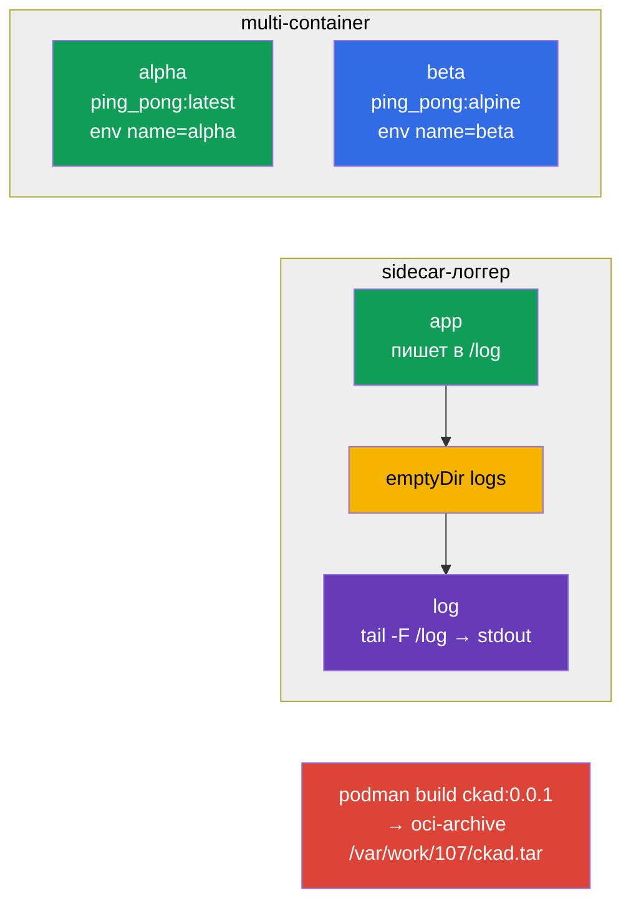

# Lab 107 — Дизайн приложений: multi-container поды, образы, тома

## Описание

Практическая работа по дизайну приложений (домен CKAD Application Design and Build). Вы
отработаете multi-container Pods (несколько контейнеров с общими сетью и томом),
классический паттерн sidecar-сборщика логов, эфемерные тома `emptyDir` и сборку
контейнерного образа через podman с экспортом в OCI-архив.

Все задания оформлены в экзаменационном стиле (как реальные вопросы CKA/CKAD) с
автоматической проверкой командой `check_result`. Manifest-объекты удобнее готовить
заготовкой через `--dry-run=client -o yaml`, а сборку образа выполнять императивно через
`podman`.

## Цель

Закрепить материал глав курса:

- [Глава 22. Multi-container поды](../../course/22/ru.md) — несколько контейнеров в одном Pod, общий том, паттерн sidecar
- [Глава 23. Образы контейнеров](../../course/23/ru.md) — сборка образа из Dockerfile, экспорт в OCI-архив
- [Глава 24. Тома для приложений](../../course/24/ru.md) — эфемерный `emptyDir`, `sizeLimit`, монтирование

## Что мы создаём и зачем

В этой лабе мы собираем приложения из нескольких контейнеров и разбираем, как они делят
данные и как готовятся образы. Каждый объект решает свою задачу:

| Объект | Что это | Зачем в этой лабе |
|--------|---------|-------------------|
| **Pod `multi-pod`** | Pod с двумя контейнерами | учимся описывать несколько контейнеров с разными образами и env (глава 22) |
| **Pod `logger`** | приложение + sidecar-логгер | отрабатываем паттерн sidecar: обмен через общий `emptyDir` (глава 22) |
| **Pod `redis-storage`** | Pod с эфемерным томом | монтируем `emptyDir` с `sizeLimit` (глава 24) |
| **Образ `ckad:0.0.1`** | собранный podman образ | собираем образ из Dockerfile и экспортируем в OCI-архив (глава 23) |

Итоговая картина того, что будет развёрнуто:



## Инфраструктура

Окружение разворачивается в AWS (`eu-central-1`) через Terragrunt и состоит из:

| Компонент  | Описание                                                    |
|------------|-------------------------------------------------------------|
| `vpc`      | VPC `10.10.0.0/16` с публичными подсетями                    |
| `ssh-keys` | SSH-ключи для доступа к нодам                                |
| `k8s-1`    | Kubernetes `1.35.2` (kubeadm), CNI Calico, metrics-server, одноузловой |
| `worker`   | Рабочая машина с `kubectl` и `check_result`; при старте ставит `podman` и создаёт `/var/work/107/Dockerfile` для задания 4 |

Инстансы: `t3.medium` (master) Ubuntu `22.04`. Кластер одноузловой — master
«разтейнчен» (снят taint `control-plane`), поэтому поды планируются прямо на него.

## Развёртывание

```bash
TASK=107 make run_cka_task
```

После создания подключитесь к рабочей машине (worker) по SSH и выполняйте задания
оттуда. `kubectl` уже настроен на контекст `cluster1-admin@cluster1`.

Полезные команды на рабочей машине:

```bash
time_left       # сколько осталось времени
check_result    # проверить решение
```

## Задания

---
|        **1**        | **Создать Pod с двумя контейнерами**                         |
| :-----------------: | :----------------------------------------------------------- |
| Что делаем          | Создайте Pod `multi-pod` из двух контейнеров: `alpha` (образ `viktoruj/ping_pong:latest`, переменная окружения `name=alpha`) и `beta` (образ `viktoruj/ping_pong:alpine`, переменная окружения `name=beta`). Оба контейнера делят сеть и IP Pod. |
| Критерии приёмки    | - Pod `multi-pod`;<br/>- контейнер `alpha`: образ `viktoruj/ping_pong:latest`, env `name=alpha`;<br/>- контейнер `beta`: образ `viktoruj/ping_pong:alpine`, env `name=beta`. |
---
|        **2**        | **Собрать логи sidecar-контейнером**                         |
| :-----------------: | :----------------------------------------------------------- |
| Что делаем          | Создайте Pod `logger` из двух контейнеров с общим томом `logs` типа `emptyDir`, смонтированным в оба контейнера. Первый контейнер пишет логи в файл на этом томе, второй (sidecar) читает тот же файл и выводит его в stdout (`tail -F`) — классический паттерн сбора логов. |
| Критерии приёмки    | - Pod `logger` (≥ 2 контейнеров);<br/>- общий том `logs` типа `emptyDir`, смонтирован в оба контейнера. |
---
|        **3**        | **Смонтировать эфемерный том**                               |
| :-----------------: | :----------------------------------------------------------- |
| Что делаем          | Создайте Pod `redis-storage` (образ `redis:alpine`) с томом `data` типа `emptyDir` и ограничением `sizeLimit: 500Mi`, смонтированным в контейнер по пути `/data/redis`. Такой том живёт ровно столько же, сколько Pod. |
| Критерии приёмки    | - Pod `redis-storage`, образ `redis:alpine`;<br/>- том `data` типа `emptyDir`, `sizeLimit: 500Mi`, mountPath `/data/redis`. |
---
|        **4**        | **Собрать образ и экспортировать в OCI-архив**               |
| :-----------------: | :----------------------------------------------------------- |
| Что делаем          | На рабочей машине через `podman` соберите образ `ckad:0.0.1` из готового Dockerfile `/var/work/107/Dockerfile` и экспортируйте его в формат oci-archive в файл `/var/work/107/ckad.tar` (`podman save --format oci-archive`). |
| Критерии приёмки    | - образ `ckad:0.0.1` собран из `/var/work/107/Dockerfile`;<br/>- экспортирован в oci-archive `/var/work/107/ckad.tar`. |
---

## Проверка результата

На рабочей машине запустите автоматическую проверку:

```bash
check_result
```

Скрипт прогонит тесты и покажет, сколько заданий выполнено.

## Решение

Эталонное решение: [worker/files/solutions/1.MD](worker/files/solutions/1.MD)

## Покрытие мок-экзаменов

Лаба закрывает задания моков по дизайну приложений: CKA mock 01 (№10 — multi-container,
№14 — `emptyDir`), CKA mock 02 (№15 — sidecar-логгер), CKAD mock 01 (№14 — multi-container),
CKAD mock 02 (№5 — `podman build`, №16 — sidecar-логгер, №20 — init/эфемерный том).

## Удаление кластера и ресурсов

```bash
TASK=107 make delete_cka_task
```
