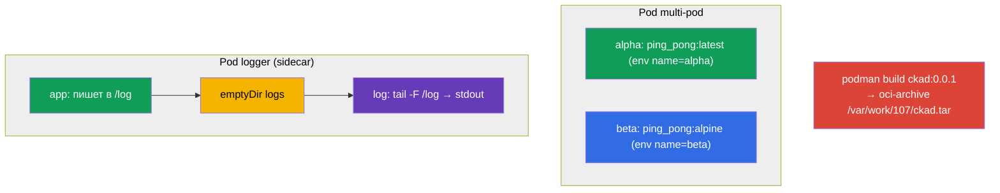

# Lab 107 — Дизайн приложений: multi-container поды, образы, тома

## Описание

Практическая работа по дизайну приложений (домен CKAD Application Design and Build). Вы
отработаете multi-container поды (несколько контейнеров с общими сетью и томом),
классический паттерн sidecar-сборщика логов, эфемерные тома `emptyDir` и сборку
контейнерного образа через podman с экспортом в OCI-архив.

Все задания в экзаменационном стиле с автопроверкой `check_result`.

## Цель

Закрепить главы курса:

- [Глава 22. Multi-container поды](../../course/22/ru.md)
- [Глава 23. Образы контейнеров](../../course/23/ru.md)
- [Глава 24. Тома для приложений](../../course/24/ru.md)

## Что мы создаём и зачем

| Объект | Что это | Зачем в этой лабе |
|--------|---------|-------------------|
| **Под `multi-pod`** | под с двумя контейнерами | учимся описывать несколько контейнеров с разными образами и env |
| **Под `logger`** | приложение + sidecar-логгер | отрабатываем паттерн sidecar: обмен через общий `emptyDir` |
| **Под `redis-storage`** | под с эфемерным томом | монтируем `emptyDir` с `sizeLimit` |
| **Образ `ckad:0.0.1`** | собранный podman'ом образ | собираем образ из Dockerfile и экспортируем в OCI-архив |



## Инфраструктура

| Компонент  | Описание                                                    |
|------------|-------------------------------------------------------------|
| `k8s-1`    | Kubernetes `1.35.2` (kubeadm), Calico, metrics-server, одноузловой |
| `worker`   | Рабочая машина; при старте ставит `podman` и создаёт `/var/work/107/Dockerfile` |

## Развёртывание

```bash
TASK=107 make run_cka_task
```

## Задания

---
|        **1**        | **Создать под с двумя контейнерами**                         |
| :-----------------: | :----------------------------------------------------------- |
| Что делаем          | Описываем multi-container под с разными образами и env        |
| Критерии приёмки    | - Pod: `multi-pod`<br/>- Контейнер `alpha`: image `viktoruj/ping_pong:latest`, env `name=alpha`<br/>- Контейнер `beta`: image `viktoruj/ping_pong:alpine`, env `name=beta` |
---
|        **2**        | **Собрать логи sidecar-контейнером**                         |
| :-----------------: | :----------------------------------------------------------- |
| Что делаем          | Приложение пишет в общий том, sidecar выводит логи в stdout    |
| Критерии приёмки    | - Pod: `logger` (≥ 2 контейнеров)<br/>- Общий том `logs` типа `emptyDir`, смонтирован в оба контейнера |
---
|        **3**        | **Смонтировать эфемерный том**                               |
| :-----------------: | :----------------------------------------------------------- |
| Что делаем          | Даём поду временное хранилище на время жизни пода             |
| Критерии приёмки    | - Pod: `redis-storage`, image `redis:alpine`<br/>- Том `data` типа `emptyDir`, `sizeLimit: 500Mi`, mountPath `/data/redis` |
---
|        **4**        | **Собрать образ и экспортировать в OCI-архив**               |
| :-----------------: | :----------------------------------------------------------- |
| Что делаем          | Собираем образ из готового Dockerfile через podman            |
| Критерии приёмки    | - Образ `ckad:0.0.1` собран из `/var/work/107/Dockerfile`<br/>- Экспортирован в oci-archive `/var/work/107/ckad.tar` |
---

## Проверка результата

```bash
check_result
```

## Решение

[worker/files/solutions/1.MD](worker/files/solutions/1.MD)

## Покрытие мок-экзаменов

CKA mock 01 (№10 — multi-container, №14 — emptyDir), CKA mock 02 (№15 — sidecar-логгер),
CKAD mock 01 (№14 — multi-container), CKAD mock 02 (№5 — podman build, №16 — sidecar-логгер,
№20 — init/эфемерный том).

## Удаление

```bash
TASK=107 make delete_cka_task
```
