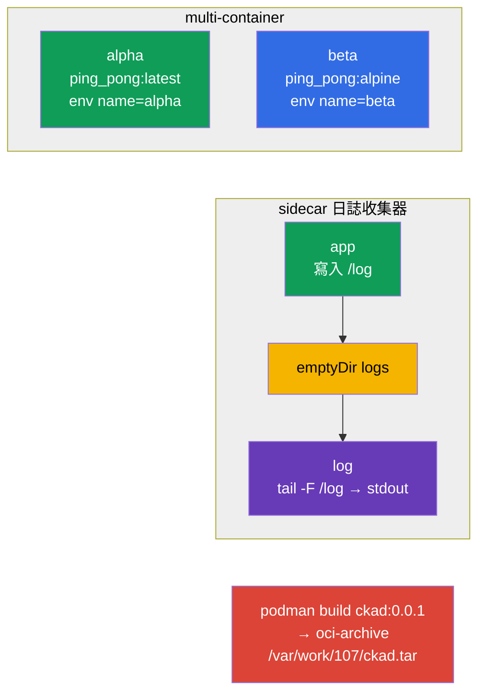

[Русская версия](README_RU.MD) · [Eng version](README.MD) · [Versión en español](README_ES.MD) · [Version française](README_FR.MD) · [Deutsche Version](README_DE.MD) · [ქართული ვერსია](README_GE.MD) · [日本語版](README_JP.MD)

# Lab 107 - 應用程式設計:multi-container Pods、映像、卷

## 說明

關於應用程式設計的實作練習(CKAD Application Design and Build 領域)。你會
練習 multi-container Pods(多個容器共用網路與同一個卷)、
經典的 sidecar 日誌收集模式、臨時卷 `emptyDir`,以及透過 podman 建置
容器映像並匯出成 OCI 封存檔。

所有任務都以考試風格撰寫(就像真正的 CKA/CKAD 題目),並透過
`check_result` 指令自動驗證。Manifest 物件比較方便的做法是用
`--dry-run=client -o yaml` 產生骨架,而映像建置則以命令式方式透過
`podman` 完成。

## 目標

鞏固以下課程章節的內容:

- [第 22 章。Multi-container Pods](../../course/22/README.md) - 同一個 Pod 中的多個容器、共用卷、sidecar 模式
- [第 23 章。容器映像](../../course/23/README.md) - 從 Dockerfile 建置映像、匯出成 OCI 封存檔
- [第 24 章。應用程式使用的卷](../../course/24/README.md) - 臨時的 `emptyDir`、`sizeLimit`、掛載

## 我們要建立什麼,以及為什麼

在這個實驗中,我們用多個容器組裝應用程式,並瞭解它們如何共享
資料,以及映像是怎麼準備出來的。每個物件都有自己的用途:

| 物件 | 這是什麼 | 為什麼出現在這個實驗中 |
|--------|---------|-------------------|
| **Pod `multi-pod`** | 含兩個容器的 Pod | 學會描述多個使用不同映像與 env 的容器(第 22 章) |
| **Pod `logger`** | 應用程式 + sidecar 日誌收集器 | 練習 sidecar 模式:透過共用的 `emptyDir` 交換資料(第 22 章) |
| **Pod `redis-storage`** | 含臨時卷的 Pod | 掛載帶有 `sizeLimit` 的 `emptyDir`(第 24 章) |
| **映像 `ckad:0.0.1`** | 用 podman 建置出來的映像 | 從 Dockerfile 建置映像並匯出成 OCI 封存檔(第 23 章) |

最終部署出來的整體樣貌:



## 基礎架構

環境透過 Terragrunt 部署在 AWS(`eu-central-1`),由以下部分組成:

| 元件       | 說明                                                        |
|------------|-------------------------------------------------------------|
| `vpc`      | VPC `10.10.0.0/16`,含公有子網路                              |
| `ssh-keys` | 用於存取節點的 SSH 金鑰                                       |
| `k8s-1`    | Kubernetes `1.35.2`(kubeadm),CNI Calico,metrics-server,單節點 |
| `worker`   | 工作機,具備 `kubectl` 與 `check_result`;啟動時會安裝 `podman`,並為任務 4 建立 `/var/work/107/Dockerfile` |

執行個體:`t4g.medium`(master),Ubuntu `22.04`。叢集為單節點 - master
已解除污點(移除了 `control-plane` taint),因此 Pod 會直接排程到它上面。

## 部署

```bash
TASK=107 make run_cka_task
```

建立完成後,請透過 SSH 連線到工作機(worker),並在那裡完成任務。
`kubectl` 已經指向 `cluster1-admin@cluster1` context。

工作機上的實用指令:

```bash
time_left       # 還剩多少時間
check_result    # 檢查解答
```

## 任務

---
|        **1**        | **建立含兩個容器的 Pod**                                      |
| :-----------------: | :----------------------------------------------------------- |
| 要做什麼            | 建立由兩個容器組成的 Pod `multi-pod`:`alpha`(映像 `viktoruj/ping_pong:latest`,環境變數 `name=alpha`)與 `beta`(映像 `viktoruj/ping_pong:alpine`,環境變數 `name=beta`)。兩個容器共用網路與 Pod IP。 |
| 驗收標準            | - Pod `multi-pod`;<br/>- 容器 `alpha`:映像 `viktoruj/ping_pong:latest`,env `name=alpha`;<br/>- 容器 `beta`:映像 `viktoruj/ping_pong:alpine`,env `name=beta`。 |
---
|        **2**        | **用 sidecar 容器收集日誌**                                   |
| :-----------------: | :----------------------------------------------------------- |
| 要做什麼            | 建立由兩個容器組成的 Pod `logger`,並帶有 `emptyDir` 類型的共用卷 `logs`,同時掛載到兩個容器。第一個容器把日誌寫進該卷上的檔案,第二個(sidecar)讀取同一個檔案並輸出到 stdout(`tail -F`)- 這就是經典的日誌收集模式。 |
| 驗收標準            | - Pod `logger`(≥ 2 個容器);<br/>- `emptyDir` 類型的共用卷 `logs`,已掛載到兩個容器。 |
---
|        **3**        | **掛載臨時卷**                                                |
| :-----------------: | :----------------------------------------------------------- |
| 要做什麼            | 建立 Pod `redis-storage`(映像 `redis:alpine`),帶有 `emptyDir` 類型的卷 `data`,並設定限制 `sizeLimit: 500Mi`,掛載到容器的路徑 `/data/redis`。這種卷的生命週期與 Pod 完全相同。 |
| 驗收標準            | - Pod `redis-storage`,映像 `redis:alpine`;<br/>- 卷 `data` 為 `emptyDir` 類型,`sizeLimit: 500Mi`,mountPath `/data/redis`。 |
---
|        **4**        | **建置映像並匯出成 OCI 封存檔**                                |
| :-----------------: | :----------------------------------------------------------- |
| 要做什麼            | 在工作機上透過 `podman`,從現成的 Dockerfile `/var/work/107/Dockerfile` 建置映像 `ckad:0.0.1`,並以 oci-archive 格式匯出到檔案 `/var/work/107/ckad.tar`(`podman save --format oci-archive`)。 |
| 驗收標準            | - 映像 `ckad:0.0.1` 由 `/var/work/107/Dockerfile` 建置而成;<br/>- 已匯出成 oci-archive `/var/work/107/ckad.tar`。 |
---

## 檢查結果

在工作機上執行自動檢查:

```bash
check_result
```

腳本會跑完測試,並顯示已完成多少任務。

## 解答

參考解答:[worker/files/solutions/1_TW.MD](worker/files/solutions/1_TW.MD)

## 模擬考涵蓋範圍

本實驗涵蓋模擬考中關於應用程式設計的題目:CKA mock 01(第 10 題 - multi-container,
第 14 題 - `emptyDir`)、CKA mock 02(第 15 題 - sidecar 日誌收集器)、CKAD mock 01(第 14 題 - multi-container)、
CKAD mock 02(第 5 題 - `podman build`,第 16 題 - sidecar 日誌收集器,第 20 題 - init/臨時卷)。

## 刪除叢集與資源

```bash
TASK=107 make delete_cka_task
```
