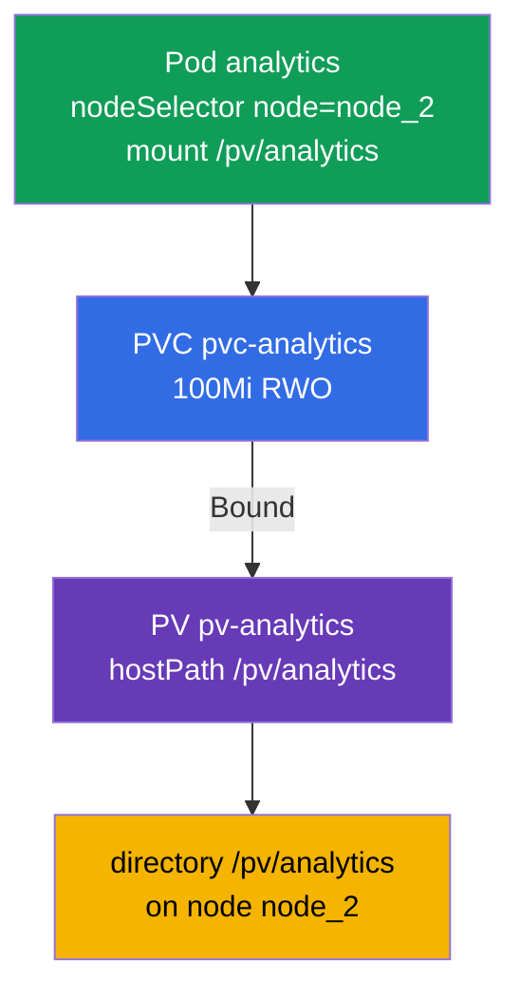

[Русская версия](README_RU.MD) · [Versión en español](README_ES.MD) · [Version française](README_FR.MD) · [Deutsche Version](README_DE.MD) · [ქართული ვერსია](README_GE.MD) · [繁體中文版](README_TW.MD) · [日本語版](README_JP.MD)

# Lab 108 — Storage: PersistentVolume, PersistentVolumeClaim and mounting a volume into a Pod

## Description

A hands-on lab about persistent storage — the Storage domain. You will assemble the classic
chain **PersistentVolume → PersistentVolumeClaim → Pod**: create a PersistentVolume
(hostPath), a PersistentVolumeClaim, wait until they are bound (Bound), and attach the
volume to a Pod that runs on a specific node via `nodeSelector`. The cluster has **two
nodes**: the worker carries the label `node=node_2` and the directory `/pv/analytics`.

All tasks are written in exam style (like real CKA/CKAD questions) with automatic validation
via the `check_result` command. Storage objects are easier to describe with manifests
(`kubectl apply -f`); a starting point can be generated with `--dry-run=client -o yaml`.

## Goal

Reinforce the material from the course chapters:

- [Chapter 25. Volumes, PersistentVolume and PersistentVolumeClaim](../../course/25/README.md) — volumes, PV and PVC, access modes, binding a claim to a volume (Bound)
- [Chapter 26. StorageClass, dynamic provisioning](../../course/26/README.md) — StorageClass and dynamic volume provisioning for a claim

## What We Build and Why

In this lab we manually prepare a piece of storage, a claim for it and a consumer Pod, and
then place that Pod on the required node. Every object serves its own purpose:

| Object | What it is | Why it is in this lab |
|--------|------------|-----------------------|
| **PV `pv-analytics`** | PersistentVolume (hostPath) — a piece of storage | learn to describe a PersistentVolume manually: `capacity`, `accessModes`, `hostPath` (chapter 25) |
| **PVC `pvc-analytics`** | PersistentVolumeClaim — a claim for storage | bind the claim to the PV (Bound) by size and accessMode (chapter 25) |
| **Pod `analytics`** | the volume consumer | mount the PVC into the Pod and place it on the required node via `nodeSelector` (chapter 26) |

The final picture of what will be deployed:



## Infrastructure

The environment is deployed in AWS (`eu-central-1`) via Terragrunt and consists of:

| Component  | Description                                                  |
|------------|--------------------------------------------------------------|
| `vpc`      | VPC `10.10.0.0/16` with public subnets                        |
| `ssh-keys` | SSH keys for node access                                      |
| `k8s-1`    | Kubernetes `1.35.2` (kubeadm), Calico CNI, metrics-server, master + worker |
| `worker`   | Work machine with `kubectl` and `check_result`                |

Instances: `t3.medium`, Ubuntu `22.04`. The cluster has two nodes — the master
(control-plane) and one worker. The worker carries the label `node=node_2` and the directory
`/pv/analytics` for hostPath, so the Pod with the volume must be scheduled exactly there.

## Deployment

```bash
TASK=108 make run_cka_task
```

Once it is created, connect to the work machine (worker) over SSH and do the tasks from there.
`kubectl` is already pointed at the `cluster1-admin@cluster1` context.

Handy commands on the work machine:

```bash
time_left       # how much time is left
check_result    # check your solution
```

## Tasks

---
|        **1**        | **Create a PersistentVolume**                                |
| :-----------------: | :----------------------------------------------------------- |
| What to do          | Describe a PersistentVolume named `pv-analytics` of type `hostPath` at the path `/pv/analytics`, with capacity `100Mi` and access mode `ReadWriteOnce`. This is a piece of storage defined manually by the administrator, to which a PVC will later be bound. |
| Acceptance criteria | - PV `pv-analytics`;<br/>- storage `100Mi`;<br/>- accessMode `ReadWriteOnce`;<br/>- hostPath `/pv/analytics`. |
---
|        **2**        | **Create a claim and bind it to the PV**                     |
| :-----------------: | :----------------------------------------------------------- |
| What to do          | Create a PersistentVolumeClaim named `pvc-analytics` for `100Mi` with mode `ReadWriteOnce`. The claim is automatically bound to a suitable PV when the size and the accessMode match — wait for the `Bound` status. |
| Acceptance criteria | - PVC `pvc-analytics`, `100Mi`, `ReadWriteOnce`;<br/>- status `Bound`. |
---
|        **3**        | **Mount the volume into a Pod on the required node**         |
| :-----------------: | :----------------------------------------------------------- |
| What to do          | Create a Pod `analytics` (image `viktoruj/ping_pong:alpine`) that uses the PVC `pvc-analytics` and mounts it at the path `/pv/analytics`. With `nodeSelector: node=node_2` place the Pod on the worker node — the hostPath directory lives there. |
| Acceptance criteria | - Pod `analytics`, image `viktoruj/ping_pong:alpine`;<br/>- uses PVC `pvc-analytics`, mountPath `/pv/analytics`;<br/>- runs on the node with the label `node=node_2`. |
---

## Checking the Result

On the work machine run the automatic validation:

```bash
check_result
```

The script runs the tests and shows how many tasks are complete.

## Solution

Reference solution: [worker/files/solutions/1.MD](worker/files/solutions/1.MD)

## Mock Exam Coverage

The lab covers the PV/PVC/Pod task that appears in all four mocks: CKA mock 01 (#12),
CKA mock 02 (#10), CKAD mock 01 (#15), CKAD mock 02 (#10).

## Deleting the Cluster and Resources

```bash
TASK=108 make delete_cka_task
```
