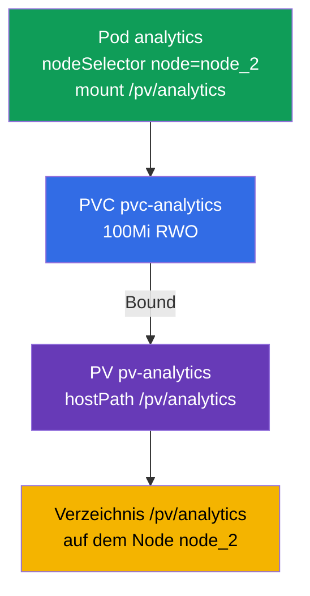

[Русская версия](README_RU.MD) · [Eng version](README.MD) · [Versión en español](README_ES.MD) · [Version française](README_FR.MD) · [ქართული ვერსია](README_GE.MD) · [繁體中文版](README_TW.MD) · [日本語版](README_JP.MD)

# Lab 108 — Storage: PersistentVolume, PersistentVolumeClaim und das Einbinden eines Volumes in einen Pod

## Beschreibung

Praxisübung zum persistenten Speicher — die Domäne Storage. Du baust die klassische Kette
**PersistentVolume → PersistentVolumeClaim → Pod** zusammen: Du erstellst ein
PersistentVolume (hostPath) und einen PersistentVolumeClaim, wartest auf deren Verbindung
(Bound) und bindest das Volume in einen Pod ein, der über `nodeSelector` auf einem bestimmten
Node startet. Der Cluster hat **zwei Nodes**: der Worker trägt das Label `node=node_2` und das
Verzeichnis `/pv/analytics`.

Alle Aufgaben sind im Prüfungsstil formuliert (wie echte CKA/CKAD-Fragen) mit automatischer
Prüfung über den Befehl `check_result`. Storage-Objekte lassen sich bequemer über Manifeste
beschreiben (`kubectl apply -f`), eine Vorlage bekommst du mit `--dry-run=client -o yaml`.

## Ziel

Den Stoff der Kurskapitel festigen:

- [Kapitel 25. Volumes, PersistentVolume und PersistentVolumeClaim](../../course/25/de.md) — Volumes, PV und PVC, Access Modes, Bindung des Claims an das Volume (Bound)
- [Kapitel 26. StorageClass, dynamisches Provisioning](../../course/26/de.md) — StorageClass und dynamische Bereitstellung von Volumes für einen Claim

## Was wir erstellen und warum

In diesem Lab bereiten wir von Hand ein Stück Speicher, einen Claim darauf und einen
konsumierenden Pod vor und platzieren diesen Pod anschließend auf dem gewünschten Node. Jedes
Objekt erfüllt seine eigene Aufgabe:

| Objekt | Was das ist | Warum in diesem Lab |
|--------|-------------|---------------------|
| **PV `pv-analytics`** | PersistentVolume (hostPath) — ein Stück Speicher | lernen, ein PersistentVolume von Hand zu beschreiben: `capacity`, `accessModes`, `hostPath` (Kapitel 25) |
| **PVC `pvc-analytics`** | PersistentVolumeClaim — Anforderung von Speicher | den Claim mit dem PV verbinden (Bound) über Größe und accessMode (Kapitel 25) |
| **Pod `analytics`** | Verbraucher des Volumes | den PVC in den Pod einbinden und ihn über `nodeSelector` auf dem gewünschten Node platzieren (Kapitel 26) |

Das Gesamtbild dessen, was ausgerollt wird:



## Infrastruktur

Die Umgebung wird in AWS (`eu-central-1`) über Terragrunt ausgerollt und besteht aus:

| Komponente | Beschreibung                                                 |
|------------|--------------------------------------------------------------|
| `vpc`      | VPC `10.10.0.0/16` mit öffentlichen Subnetzen                 |
| `ssh-keys` | SSH-Schlüssel für den Zugriff auf die Nodes                    |
| `k8s-1`    | Kubernetes `1.35.2` (kubeadm), CNI Calico, metrics-server, Master + Worker |
| `worker`   | Arbeitsmaschine mit `kubectl` und `check_result`               |

Instanzen: `t4g.medium`, Ubuntu `22.04`. Der Cluster hat zwei Nodes — den Master
(control-plane) und einen Worker. Der Worker trägt das Label `node=node_2` und das Verzeichnis
`/pv/analytics` für hostPath, daher muss der Pod mit dem Volume genau dort geplant werden.

## Bereitstellung

```bash
TASK=108 make run_cka_task
```

Verbinde dich nach dem Erstellen per SSH mit der Arbeitsmaschine (Worker) und erledige die
Aufgaben von dort. `kubectl` ist bereits auf den Kontext `cluster1-admin@cluster1` eingestellt.

Nützliche Befehle auf der Arbeitsmaschine:

```bash
time_left       # wie viel Zeit noch bleibt
check_result    # Lösung prüfen
```

## Aufgaben

---
|        **1**        | **Ein PersistentVolume erstellen**                           |
| :-----------------: | :----------------------------------------------------------- |
| Was wir tun         | Beschreibe ein PersistentVolume mit dem Namen `pv-analytics` vom Typ `hostPath` unter dem Pfad `/pv/analytics`, mit der Kapazität `100Mi` und dem Access Mode `ReadWriteOnce`. Das ist ein von Hand durch den Administrator festgelegtes Stück Speicher, an das sich später ein PVC bindet. |
| Abnahmekriterien    | - PV `pv-analytics`;<br/>- storage `100Mi`;<br/>- accessMode `ReadWriteOnce`;<br/>- hostPath `/pv/analytics`. |
---
|        **2**        | **Den Claim erstellen und mit dem PV verbinden**             |
| :-----------------: | :----------------------------------------------------------- |
| Was wir tun         | Erstelle einen PersistentVolumeClaim mit dem Namen `pvc-analytics` über `100Mi` mit dem Modus `ReadWriteOnce`. Der Claim wird automatisch an ein passendes PV gebunden, wenn Größe und accessMode übereinstimmen — warte auf den Status `Bound`. |
| Abnahmekriterien    | - PVC `pvc-analytics`, `100Mi`, `ReadWriteOnce`;<br/>- Status `Bound`. |
---
|        **3**        | **Das Volume in einen Pod auf dem gewünschten Node einbinden** |
| :-----------------: | :----------------------------------------------------------- |
| Was wir tun         | Erstelle einen Pod `analytics` (Image `viktoruj/ping_pong:alpine`), der den PVC `pvc-analytics` nutzt und ihn unter dem Pfad `/pv/analytics` einbindet. Platziere den Pod über `nodeSelector: node=node_2` auf dem Worker-Node — dort liegt auch das hostPath-Verzeichnis. |
| Abnahmekriterien    | - Pod `analytics`, Image `viktoruj/ping_pong:alpine`;<br/>- nutzt den PVC `pvc-analytics`, mountPath `/pv/analytics`;<br/>- läuft auf dem Node mit dem Label `node=node_2`. |
---

## Ergebnisprüfung

Starte auf der Arbeitsmaschine die automatische Prüfung:

```bash
check_result
```

Das Skript führt die Tests aus und zeigt, wie viele Aufgaben erledigt sind.

## Lösung

Referenzlösung: [worker/files/solutions/1_DE.MD](worker/files/solutions/1_DE.MD)

## Abdeckung der Mock-Prüfungen

Das Lab deckt die PV/PVC/Pod-Aufgabe ab, die in allen vier Mocks vorkommt: CKA mock 01
(Nr. 12), CKA mock 02 (Nr. 10), CKAD mock 01 (Nr. 15), CKAD mock 02 (Nr. 10).

## Löschen von Cluster und Ressourcen

```bash
TASK=108 make delete_cka_task
```
